## 

# 배열 1(Array 1)

### 1. 알고리즘

* 유한한 단계를 통해 문제를 해결하기 위한 절차나 방법임. 주로 컴퓨터 용어로 쓰이며, 컴퓨터가 어떤 일을 수행하기 위한 단계적 방법을 말함.
* 간단히 어떠한 문제를 해결하기 위한 절차라고 볼 수있음.
* 컴퓨터 분야에서 알고리즘을 표현하는 방법은 크게 두 가지(슈도코드는 본인이 편한대로 / 형식 X / 주석)
* 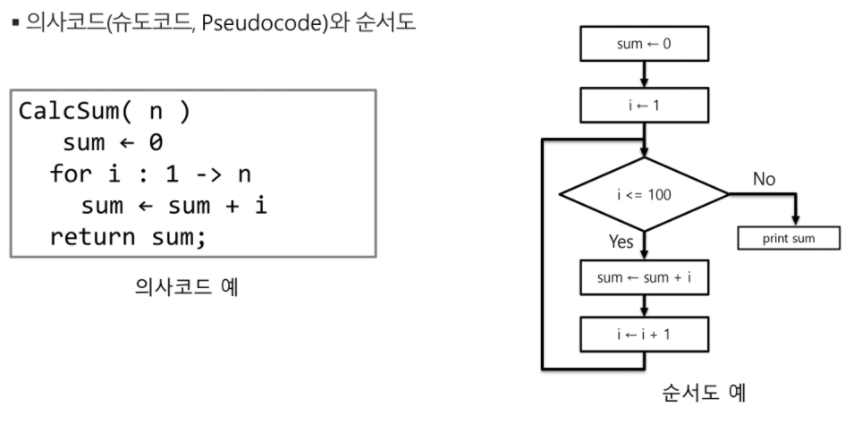

* **알고리즘의 성능은 무엇으로 측정하는가**

  * APS(Advanced Planning & Scheduling) 과정의 목표 중의 하나는 보다 좋은 알고리즘을 이해하고 활용하는 것임.

  * 무엇이 좋은 알고리즘인가?

    1. 정확성 : 얼마나 정확하게 동작하는가

    2. 작업량 : 얼마나 적은 연산으로 원하는 결과를 얻어내는가

    3. 메모리 사용량 : 얼마나 적은 메모리를 사용하는가

    4. 단순성 : 얼마나 단순한가

    5. 최적성 : 더 이상 개선할 여지없이 최적화되었는가

  * 주어진 문제를 해결하기 위해 여러개의 다양한 알고리즘이 가능 ⇒ 어떤 알고리즘을 사용해야 하는가?

  * 알고리즘의 성능 분석 필요

  * 많은 문제에서 성능 분석의 기준으로 알고리즘의 작업량을 비교함.

  * Ex. 1부터 100까지 합을 구하는 문제

  * 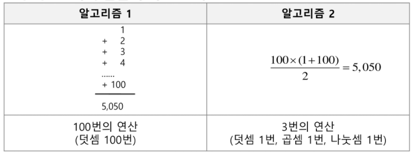

  

  * 알고리즘의 작업량을 표현할때 시간복잡도로 표현함.
  * 시간 복잡도(Time complexity)
    * 실제 걸리는 시간을 측정
    * 실행되는 명령문의 개수를 계산
    * 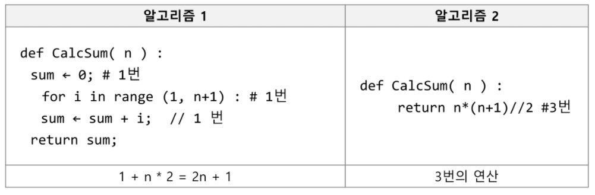
  * 시간 복잡도 ≒ 빅-오(O) 표기법
    * 빅-오 표기법(Big-Oh Notation)
    * 시간 복잡도 함수 중에서 가장 큰 영향력을 주는 n에 대한 항만을 표시
    * 계수(Coefficient)는 생략하여 표시
    * 예를 들어
      * 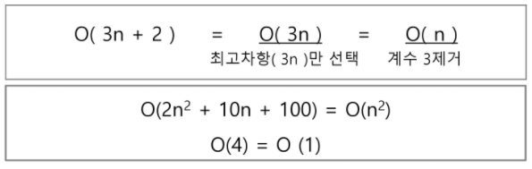
    * n개의 데이터를 입력 받아 저장한 후 각 데이터에 1씩 증가시킨 후 각 데이터를 화면에 출력하는 알고리즘의 시간복잡도는 어떻게 되나?
      * O(n)

* **다양한 시간 복잡도의 비교**

  * 요소 수가 증가함에 따라 각기 다른 시간복잡도의 알고리즘은 아래와 같은 연산 수를 보임.
  * 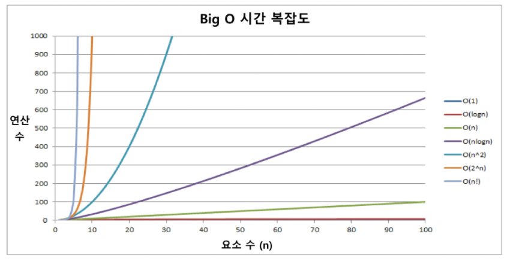
  * 시간 복잡도별 실제 실행 시간 비교
  * 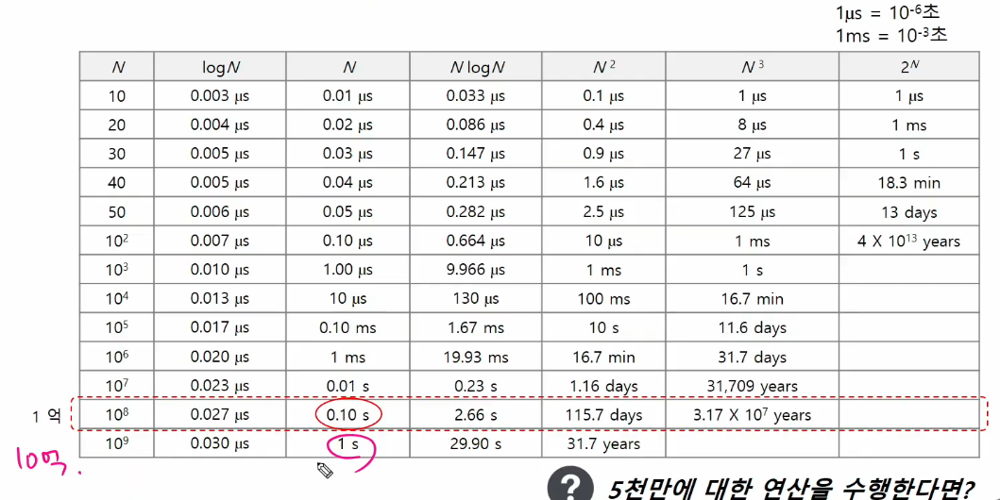

---

 

### 2. 배열

 

* **배열**

  * 배열이란 무엇인가
    * 일정한 자료형의 변수들을 하나의 이름으로 열거하여 사용하는 자료구조
    * 아례의 예는 6개의 변수를 사용해야 하는 경우, 이를 배열로 바꾸어 사용하는 것임.
    * 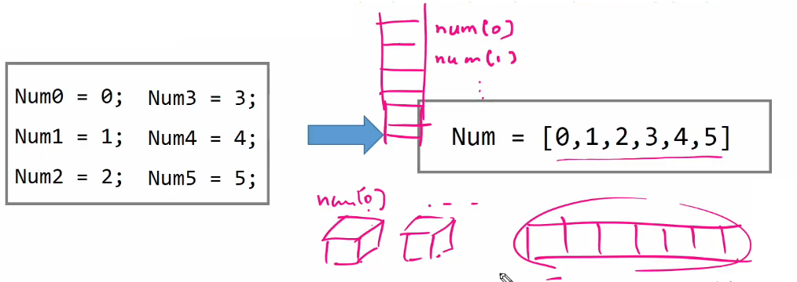
  * 배열의 필요성
    * 프로그램 내에서 여러 개의 변수가 필요할 때, 일일이 다른 변수명을 이용하여 자료에 접근하는 것은 매우 비효율적일 수 있음.
    * 배열을 사용하면 하나의 선언을 통해서 둘 이상의 변수를 선언할 수 있음.
    * ✨단순히 다수의 변수 선언을 의미하는 것이 아니라, 다수의 변수로는 하기 힘든 작업을 배열을 활용해 쉽게 할 수 있음.

 

* **1차원 배열**

  * 1차원 배열의 선언

    * 별도의 선언 방법이 없으면 변수에 처음 값을 할당할 때 생성
    * 이름 : 프로그램에서 사용할 배열의 이름
    * 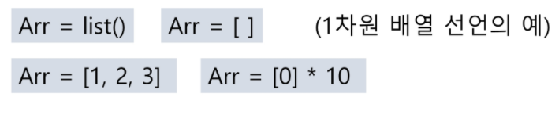
    * 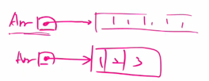

  * 1차원 배열의 접근

    * Arr[0] = 10; // '배열 Arr의 0번 원소에 10을 저장하라'

    * Arr[idx] = 20; // '배열 Arr의 idx번 원소에 20을 저장하라'

 

---

 

### 3. 버블 정렬(Bubble Sort)

 

* **정렬**

  * 2개 이상의 자료를 특정 기준에 의해 작은 값부터 큰 값(오름차순 : ascending), 그 반대의 순서대로(내림차순 : descending) 재배열하는 것
  * 키
    * 자료를 정렬하는 기준이 되는 특정 값
    * 

 

* **정렬의 종류**
  * 대표적인 정렬 방식의 종류
    * 버블 정렬(Bubble Sort)
    * 카운팅 정렬(Counting Sort)
    * 선택 정렬(Selection Sort)
    * 퀵 정렬(Quick Sort)
    * 삽입 정렬(Insertion Sort)
    * 병합 정렬(Merge Sort)

 

* **버블 정렬(Bubble Sort)** : 2중 for문으로 단순 비교후 자리 교체

  * 인접한 두 개의 원소를 비교하며 자리를 계속 교환하는 방식
  * 정렬과정(오름차순)
    * 첫 번재 원소부터 인접한 원소끼리 계속 자리를 교환하면서 맨 마지막 자리까지 이동한다.
    * 한 단계가 끝나면 가장 큰 원소가 마지막 자리로 정렬된다.
    * 교환하며 자리를 이동하는 모습이 물 위에 올라오는 거품 모양과 같다고 하여 버블 정렬이라고 한다.
  * 시간 복잡도
    * O(n^2)

 

* **버즐 정렬 과정**

  * [55, 7, 78, 12, 42]를 버블 정렬하는 과정(오름차순)
    * 첫 번째 패스(✨구간의 끝이 변함/구간 자체가 변함/정렬할 대상이 남아있는 상태까지 안쪽으로 들어옴)
    * 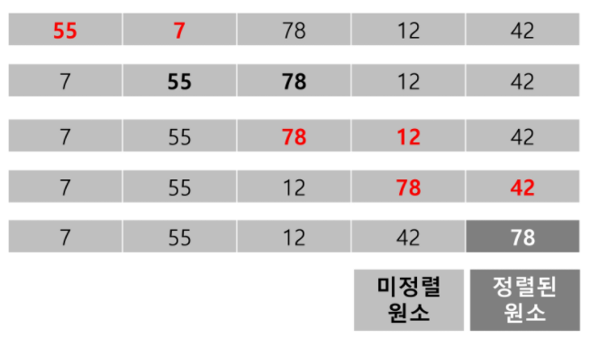
    * ...
    * 네 번째 패스
    * 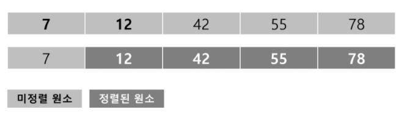
    * 정렬 끝
    * 

 

* **버블 정렬 알고리즘**
  * 배열을 활용한 버블 정렬

    * 앞서 살펴 본 정렬 과정을 코드로 구현하면 아래와 같음(오름차순).

    * 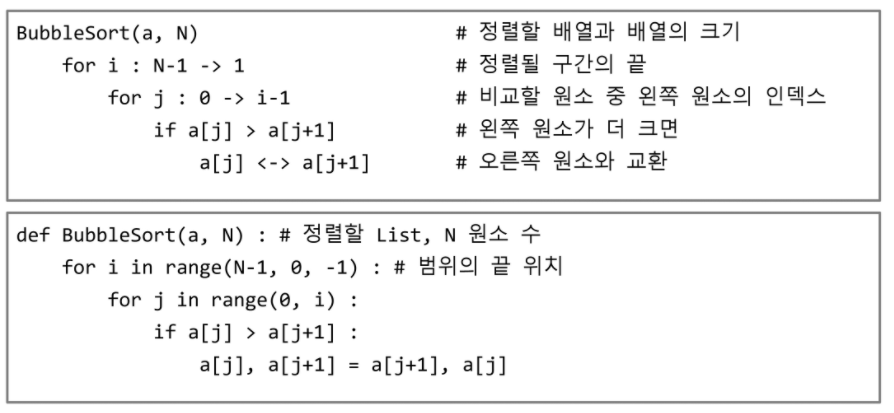

 

---

 

### 4.  카운팅 정렬(Counting Sort)

 

* **카운팅 정렬(Counting Sort)**
  * 항목들의 순서를 결정하기 위해 집합에 각 항목이 몇 개씩 있는지 세는 작업을 하여, 선형 시간에 정렬하는 효율적인 알고리즘
  * 제한사항
    * 정수나 정수로 표현할 수 있는 자료에 대해서만 적용가능 : 각 항목의 발생 횟수를 기록하기 위해, 정수 항목으로 인덱스 되는 카운트들의 배열을 사용하기 때문임(음수나 소수도 index를 shift해서 사용이 가능은 하나 선호되지 않음).
    * 카운트들을 위한 충분한 공간을 할당하려면 집합 내의 가장 큰 정수를 알아야 함.
  * 시간 복잡도
    * O(n+k) : n은 리스트 길이, k는 정수의 최대값

 

* **카운팅 정렬 과정** : ✨갯수를 저장하기 위해 원소를 조정(누적합이 자리를 확인 / 카운트 배열 필요)
  * [0, 4, 1, 3, 1, 2, 4, 1]을 카운팅 정렬하는 과정
  * 1단계(💥카운팅 정렬이 아니라도 많이 쓰이는 방식)
    * Data에서 각 항목들의 발생 횟수를 세고, 정수 항목들로 직접 인덱스 되는 카운트 배열 counts에 저장함.
    * 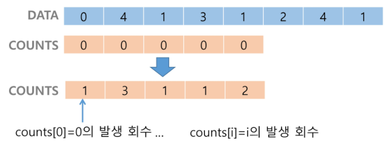
    * 정렬된 집합에서 각 항목의 앞에 위치할 항목의 개수를 반영하기 위해 counts의 원소를 조정함.(갯수 누적)
    * 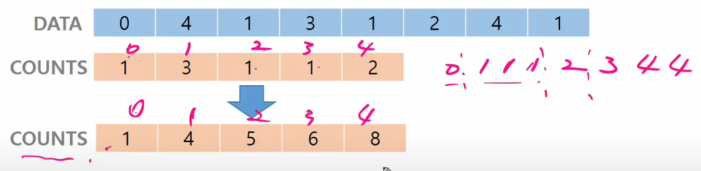
    * 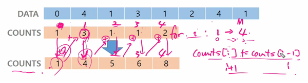
    * counts[1]을 감소시키고 Temp에 1을 삽입함.
    * 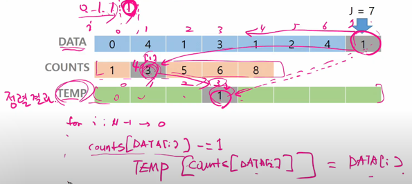
    * counts[4]를 감소시키고 Temp에 4를 삽입함. ....(갯수 정렬 / 상황에 따라서는 의외로 빠름)
    * 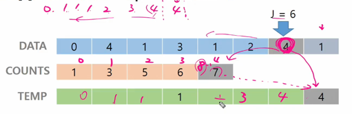
    * counts[0]를 감소시키고 Temp에 0를 삽입함.
    * 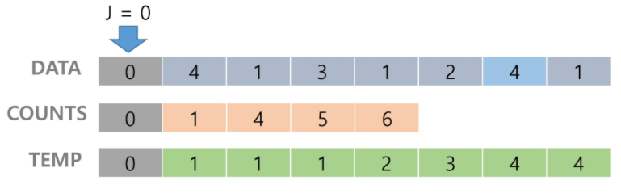
    * Temp 업데이트 완료하고 정렬 작업을 종료함.

 

* **카운팅 정렬 알고리즘**
  * 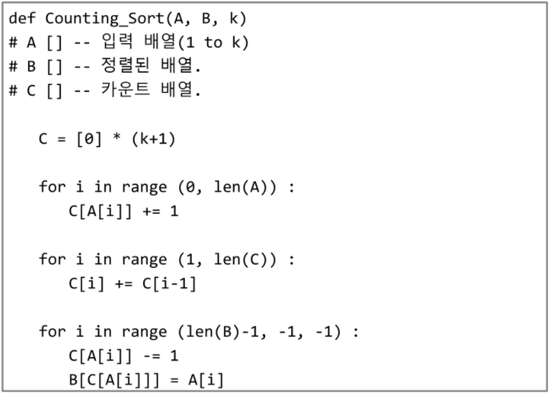

 

* **정렬 알고리즘 비교**
  * 학습한 정렬 알고리즘의 특성을 다른 정렬들과 비교함.
  * 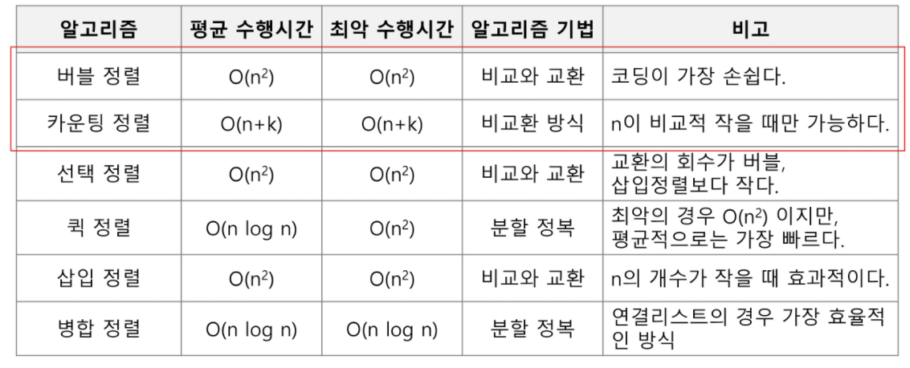

 

---

 

### 5. 완전검색(Exaustive Search)

 

* **완전 검색(Exaustive Search)**

  * 완전 검색 방법은 문제의 해법으로 생각할 수 있는 모든 경우의 수를 나열해보고 확인하는 기법임.
  * Brute-force 혹은 generatae-and-test 기법이라고도 불리움.
  * 모든 경우의 수를 테스트한 후, 최종 해법을 도출함.
  * 일반적으로 경우의 수가 상대적으로 작을 때 유용함.

 

* **완전 검색으로 시작하라**

  * 모든 경우의 수를 생성하고 테스트하기 때문에 수행 속도는 느리지만, 해답을 찾아내지 못할 확률이 작음.

  * 자격검정평가 등에서 주어진 문제를 풀 대, 우선 완전 검색으로 접근하여 해답을 도출한 후, 성능 개선을 위해 다른 알고리즘을 사용하고 해답을 확인 하는 것이 바람직함.(?)

 

---

 

### 6. 그리디(Greedy Algorithm)

 

* **탐욕(Greedy) 알고리즘**

  * 탐욕 알고리즘은 최적해를 구하는 데 사용되는 근시안적인 방법
  * 여러 경우 중 하나를 결정해야 할 때마다 그 순간에 최적이라고 생각되는 것을 선택해 나가는 방식으로 진행하여 최종적인 해답에 도달함.
  * 각 선택의 시점에서 이루어지는 결정은 지역적으로는 최적이지만, 그 선택들을 계속 수집하여 최종적인 해답을 만들었다고 하여, 그것이 최적이라는 보장은 없음.
  * 일반적으로, 머릿속에 떠오르는 생각을 검증 없이 바로 구현하면 Greedy 접근이 됨.

  

  1. 해 선택 : 현재 상태에서 부분 문제의 최적 해를 구한 뒤, 이를 부분해집합(Solution Set)에 추가함.

  2. 실행 가능성 검사 : 새로운 부분해 집합이 실행 가능한지를 확인함. 곧, 문제의 제약 조건을 위반하지 않는지를 검사함.

  3. 해 검사 : 새로운 부분해 집합이 문제의 해가 되는지를 확인함. 아직 전체 문제의 해가 완성되지 않았다면 1의 해 선택부터 다시 시작함.

     

