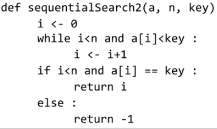

## 

# 배열2(Array2)

### 1. 배열 : 2차원 배열

* **2차원 배열**

  * 2차원 배열의 선언

    * 1차원 List를 묶어놓은 List
    * 2차원 이상의 다차원 List는 차원에 따라 Index를 선언
    * 2차원 List의 선언 : 세로길이 (행의 개수), 가로길이 (열의 개수)를 필요로 함
    * Python 에서는 데이터 초기화를 통해 변수선언과 초기화가 가능함
    * 
    * 
    * 3차원 이상으로는 자료가 복잡해지기 때문에 잘 가지 않음

  * 참고

    * 
    * 1차원 배열을 받고 for문

  * 얕은 복사에 주의해야함

    * `arr = [[0]*3]*4`

    * 

      

* **2차원 배열의 접근**

  * 배열 순회(2중 for문의 의미를 잘 생각하자)

    * n X m 배열의 n*m개의 모든 원소를 빠짐없이 조사하는 방법

    * 

    * 

      * 열에 해당하는 index를 먼저 고정 -> 열 우선 순회  

    * 

      * i가 짝수이면 j(오름차순) / i가 홀수이면 m-1-j(내림차순)
      * 위아래 지그재그 일때는? / 지그재그가 역방향일때는?

    * 지그재그 순회는 if else로 따로 지정하던것을 한 줄로 정리한것

      * m-1 : 열 요소의 최대 index
      * -2*j : 앞의 j를 빼고 j만큼 빠지도록
      * i%2 : 짝(0/정방향) , 홀(1/역방향) 판별

    * ✨행렬 인덱스(0부터 시작)와 문제에서의 순서(1부터 시작)이 헷갈리지 않게 주의!

      

  * 💥**델타를 이용한 2차 배열 탐색**(알고리즘에서 많이 사용하니 꾸준히 연습)

    * 2차 배열의 한 좌표에서 4방향의 인접 배열 요소를 탐색하는 방법(주변값을 확인해야 할 때)
    * dr, dc를 사용하여 좀 더 명시적으로 표시 할 수도 있음
    * 
    * 그림을 그려놓고 본인이 원하는 방향으로 순서를 정함
    * for문으로 반복하면서 방향 탐색을 하므로 중복 코드를 최소화 함
    * 
    * 
      * 튜플로 넣어서 할 수도 있음(2차원 배열에서 지정하기 힘들 수도 있음)
    * 대각선이동, 징검다리 이동 등도 할 수 있는가?
      * 
      * 

* **2차원 배열의 활용**
  * 전치 행렬(행과 열을 바꾸기)
  * 
    * 1행 2열을 바꾸면 2행 1열은 자동으로 바뀜 / 2번 진행하면 제자리로 돌아오므로 i < j로 방지(열의 값이 행의 값보다 클때만)
    * Zip 함수 이용
      * 
      * 
        * 언패킹으로 리스트 벗겨줌
        * ✨`list(zip(*arr))`

---

### 2. 부분집합 생성

* **부분집합의 수**

  * 집합의 원소가 n개일 때, 공집합을 포함한 부분집합의 수는 2^n개임
  * 이는 각 원소를 부분집합에 포함시키거나 포함시키지 않는 2가지 경우를 모든 원소에 적용한 경우의 수와 같음
  * 
  * 각 원소가 부분집합에 포함되었는지를 loop를 이용하여 확인하고 부분집합을 생성하는 방법
    * 

* **비트 연산자**(비트 : 메모리 안에서 상태를 구분할 수 있는 최소 단위 / 0,1 / MSB, LSB)

  * 비트 연산자(✨비트 연산은 같은 비트끼리만)

    * 

  * << 연산자

    * 1 << n : 2^n 즉 원소가 n개일 경우의 모든 부분집합의 수를 의미함(1<<n == 2**n / 서로 같은 말이지만 비트의 사용 유무를 바로 확인 가능) 

  * & 연산자(0인지 1인지 검사)

    * i & (1<<j) : i의 j번째 비트가 1인지 아닌지를 검사함(✨j번 비트와 같은 자리에 있는 i의 값이 1인지 0인지 확인)
    * 
  
    
  
  * 보다 간결하게 부분집합을 생성하는 방법
  
    * 

      * 2진수로 바꿔서 해당 자릿수를 확인
      * 어떤 값이 들어와도 유연하게 대처 가능
  
      

---

### 3. 바이너리 서치 (Binary Search)

* **검색 (Search)**
  * 저장되어 있는 자료 중에서 원하는 항목을 찾는 작업
  * 목적하는 탐색 키를 가진 항목을 찾는 것
    * 탐색 키(search key) : 자료를 구별하여 인식할 수 있는 키
  * 검색의 종류
    * 순차 검색 (sequential search)
    * 이진 검색(binary search)
    * 해쉬 (hash)
* **순차 검색 (Sequential Search)**
  * 일렬로 되어 있는 자료를 순서대로 검색하는 방법
    * 가장 간단하고 직관적인 검색 방법
    * 배열이나 연결 리스트 등 순차구조로 구현된 자료구조에서 원하는 항목을 찾을 때 유용함
    * 알고리즘이 단순하여 구현이 쉽지만, 검색 대상의 수가 많은 경우에는 수행시간이 급격히 증가하여 비효율적임
  * 2가지 경우
    * 정렬로되어 있지 않은 경우
    * 정렬되어 있는 경우
* **정렬되어 있지 않은 경우**
  * 검색 과정
    * 첫 번째 원소부터 순서대로 검색 대상과 키 값이 같은 원소가 있는지 비교하며 찾음
    * 키 값이 동일한 원소를 찾으면 그 원소의 인덱스를 반환함
    * 자료구조의 마지막에 이를 때까지 검색 대상을 찾지 못하면 검색 실패
    * 
    * 
  * 찾고자 하는 원소의 순서에 따라 비교회수가 결정됨
    * 첫 번째 원소를 찾을 때는 1번 비교, 두 번재 원소를 찾을 때는 2번 비교
    * 정렬되지 않은 자료에서의 순차 검색의 평균 비교 회수
      * =(1/n)*(1+2+3+... +n) = (n+1)/2
    * 시간 복잡도 : O(n)
    * 
      * i<n (인덱스 검색)을 먼저함 / 반대로 하면 인덱스 에러 발생
* **정렬되어 있는 경우**
  * 검색 과정
    * 자료가 오름차순으로 정렬된 상태에서 검색을 실시한다고 가정함
    * 자료를 순차적으로 검색하면서 키 값을 비교하여, 원소의 키 값이 검색 대상의 키 값보다 크면 찾는 원소가 없다는 것이므로 더 이상 검색하지 않고 검색을 종료함
    * 
    * 
    * 찾고자 하는 원소의 순서에 따라 비교회수가 결정됨
      * 정렬이 되어있으므로, 검색 실패를 반환하는 경우 평균 비교 회수가 반으로 줄어듬
      * 시간 복잡도 : O(n)
    * 
* **이진 검색 (Binary Search)**
  * 자료의 가운데에 있는 항목의 키 값과 비교하여 다음 검색의 위치를 결정하고 검색을 계속 진행하는 방법
    * 목적 키를 찾을 때까지 이진 검색을 순환적으로 반복 수행함으로써 검색 범위를 반으로 줄여가면서 보다 바르게 검색을 수행함
  * 이진 검색을 하기 위해서는 자료가 ✨정렬된 상태여야 함(정렬 우선)
  * 검색 과정
    * 자료의 중앙에 있는 원소를 고름
    * 중앙 원소의 값과 찾고자 하는 목표 값을 비교함
    * 목표 값이 중앙 원소의 값보다 작으면 자료의 왼쪽 반에 대해서 새로 검색을 수행하고, 크다면 자료의 오른쪽 반에 대해서 새로 검색을 수행함
    * 찾고자 하는 값을 찾을 때 까지 위의  과정을 반복함
    * 
    * 
  * 구현
    * 검색 범위의 시작점과 종료점을 이용하여 검색을 반복 수행함
    * 이진 검색의 경우, 자료에 삽입이나 삭제가 발생했을 때 배열의 상태를 항상 정렬 상태로 유지하는 추가 작업이 필요함
* **이진 검색 알고리즘**
  * 
  * 재귀 함수 이용
    * 아래와 같이 재귀 함수를 이용하여 이진 검색을 구현할 수도 있음
    * 
    * 

​	

---

### 4. 셀렉션 알고리즘 (Selection Algorithm)

* **셀렉션 알고리즘(Selection Algorithm)**
  * 저장되어 있는 자료로부터 k번째로 큰 혹은 작은 원소를 찾는 방법을 셀렉션 알고리즘이라 한다.
    * 최소값, 최댓값 혹은 중간값을 찾는 알고리즘을 의미하기도 함
  * 선택 과정
    * 셀렉션은 다음과 같은 과정을 통해 이루어짐
      * 정렬 알고리즘을 이용하여 자료 정렬하기
      * 원하는 순서에 있는 원소 가져오기
* **일반적인 셀렉션 알고리즘**
  * k번째로 작은 원소를 찾는 알고리즘
    * 1번부터 k번째까지(k-1번 인덱스까지) 작은 원소들을 찾아 배열의 앞쪽으로 이동시키고, 배열의 k번째를 반환함
    * k가 비교적 작을 때 유용하며 O(kn)의 수행시간을 필요로 함
      * 

---

 

### 5. 선택 정렬(Selection Sort)

 

* **인덱스**
  * 인덱스라는 용어는 Database에서 유래했으며, 테이블에 대한 동작 속도를 높여주는 자료 구조를 일컫음. Database 분야가 아닌 곳에서는 Look up table 등의 용어를 사용하기도 함
  * 인덱스를 저장하는데 필요한 디스크 공간은 보통 테이블을 저장하는데 필요한 디스크 공간보다 작음. 왜냐하면 보통 인덱스는 키-필드만 갖고 있고, 테이블의 다른 세부 항목들은 갖고 있지 않기 때문임
  * 배열을 사용한 인덱스
    * 대량의 데이터를 매번 정렬하면, 프로그램의 반응은 느려질 수 밖에 없음. 이러한 대량 데이터의 성능 저하 문제를 해결하기 위해 배열 인덱스를 사용할 수 있음
  * 원본 데이터에 데이터가 삽입될 경우 상대적으로 크기가 작은 인덱스 배열을 정렬하기 때문에 속도가 빠름
    * 

 

* **선택 정렬 (Selection Sort)** 
  * 주어진 자료들 중 가장 작은 값의 원소로부터 차례대로 선택하여 위치를 교환하는 방식
    * 앞서 살펴본 셀렉션 알고리즘을 전체 자료에  적용한 것임
  * 정렬 과정
    * 주어진 리스트 중에서 최소값을 찾음
    * 그 값을 리스트의 맨 앞에 위치한 값과 교환함
    * 맨 처음 위치를 제외한 나머지 리스트를 대상으로 위의 과정을 반복함
  * 시간 복잡도 
    * O(n^2)
* **선택 정렬 과정**
  * 
  * ...
  * 
  * 미정렬 원소가 하나 남은 상황에서는 마지막 원소가 가장 큰 값을 갖게 되므로, 실행을 종료하고 선택 정렬이 완료됨
  * 알고리즘
    * 
    * 

 

* **정렬 알고리즘 비교**
  * 

