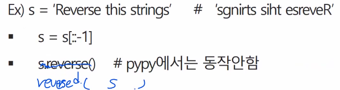
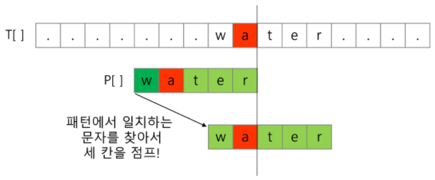

## 

# 컴퓨터 사고력(computational thinking)

사고력사고력

### 1.  문자열

* **문자의 표현**

  * 메모리는 숫자만을 저장 할 수 있기 때문에 A라는 글자의 모양 그대로 비트맵으로 저장하는 방법을 사용하지 않는 한(이 경우 메모리 낭비가 심함) 각 문자에 대해서 대응되는 숫자를 정해 놓고 이것을 메모리에 저장하는 방법이 사용될 것임
  * 영어가 대소문자 합쳐서 52개 이므로 6(64가지)비트면 모두 표현할 수 있음. 이을 코드 체계라고 함
    * 000000 -> 'a' , 000001 -> 'b'
  * 네트워크가 발전되기 전 미국의 각 지역 별로 코드체계를 정해놓고 사용했는데, 네트워크가 발전하면서 서로간의 정보를 주고 받을 때 정보를 달리 해석한다는 문제가 생김
    * 
  * 혼동을 피하기 위해 표준안을 만들었고, 1967년 미국에서 ASCII(American Standard Code for Information Interchange)라는 문자 인코딩 표준이 제정됨
  * ASCII는 7bit 인코딩으로 128문자를 표현하며 33개의 출력 불가능한 제어 문자들과 공백을 비롯한 95개의 출력 가능한 문자들로 이루어져 있음
  * 출력 가능 아스키 문자 (32~126)
    * 
  * 확장 아스키는 표준 문자 이외의 악센트 문자,  도형 문자, 특수 문자, 특수 기호 등 부가적인 문자를 128개 추가할 수 있게 하는 부호임
    * 표준 아스키는 7bit를 사용하여 문자를 표현하는데 비해 확장 아스키는 1B 내의 8bit를 모두 사용함으로써 추가적인 문자를 표현 할 수 있음
    * 컴퓨터 생산자와 소프트웨어 개발자가 여러 가지 다양한 문자에 할당할 수 있도록 하고 있음. 이렇게 할당된 확장 부호는 표준 아스키와 같이 서로 다른 프로그램이나 컴퓨터 사이에 교환되지 못함
    * 그러므로 표준 아스키는 마으크로 컴퓨터 하드웨어 및 소프트웨어 사이에서 세계적으로 통용되는데 비해, 확장 아스키는 프로그램이나 컴퓨터 또는 프린터가 그것을 해독할 수 있도록 설계되어 있어야만 올바로 해독될 수 있음
  * 확장 아스키 예
    * 
  * 오늘날 대부분의 컴퓨터는 문자를 읽고 쓰는데 ASCII 형식을 사용함
  * 컴퓨터가 발전하면서 미국뿐만 아니라 각 나라에서도 자국의 문자를 표현하기 위해 코드체계를 만들어 사용하게 되었음
    * 우리나라도 한글 코드체계를 만들어 사용했고 조합형, 완성형 두 종류가 있었음
  * 다국어 처리를 위해 표준을 마련하게 되었고, 이를 유니코드라고함
  * 유니코드의 일부
    * 
  * 유니코드도 다시 Charcter Set으로 분류됨
    * UCS-2 (Universal Character Set 2)
    * UCS-4 (Universal Character Set 4)
    * 유니코드를 저장하는 변수의 크기를 정의
    * 그러나, 바이트 순서에 대해서 표준화하지 못했음
    * 다시 말해 파일을 인식 시 이 파일이 UCS-2, UCS-4인지 인식하고 각 경우를 구분해서 모두 다르게 구현해야 하는 문제 발생
    * 그래서 유니코드의 적당한 외부 인코딩이 필요하게 되었음
  * 
  * 유니코드 인코딩 (UTF : Unicode Transformation Format)
    * UTF-8 (in web)
      * MIN : 8bit, MAX : 32bit (1 Byte * 4)
    * UTF-16 (in windows, java)
      * MIN : 16bit, MAX : 32bit (2 Byte * 2)
    * UTF-32 (in unix)
      * MIN : 32bit, MAX : 32bit (4 Byte * 1)

* **문자열**

  * Python 인코딩
    * 2.x 버전 - ASCII → `#-*- coding: utf -*-` (첫 줄에 명시)
    * 3.x 버전 - 유니코드 UTF-8 → 생략 가능
    * 다른 인코딩 방식으로 처리 시 첫 줄에 작성하는 위 항목에 원하는 인코딩 방식을 지정해주면 됨
  * 문자열의 분류
    * 
  * java에서 String 클래스에 대한 메모리 배치 예
    * 그림에서 보이듯, java.lang.String 클래스에는 기본적인 객체 메타 데이터 외에도 네 가지 필드들이 포함되어 있는데, hash값(hash), 문자열의 길이(count), 문자열 데이터의 시작점(offset), 그리고 실제 문자열 배열에 대한 참조(value)임
    * 
    * 앞쪽에 정보들이 붙음
  * C언어에서 문자열 처리
    * 문자열은 문자들의 배열 형태로 구현된 응용 자료형
    * 문자배열에 문자열을 저장할 때는 항상 마지막에 끝을 표시하는 널문자('\0')를 넣어줘야 함(널문자가 붙음으로서 메모리를 적게씀 / 문자열을 다루는 기능은 불편함)
      * 
    * 문자열 처리에 필요한 연산을 함수 형태로 제공
      * 
  * Java (객체지향 언어)에서의 문자열 처리
    * 문자열 데이터를 저장, 처리해주는 클래스를 제공함
    * String 클래스를 사용함
      * 
    * 문자열 처리에 필요한 연산을 연산자, 메소드 형태로 제공함
      * +, length(), replace(), split(), substing(), ...
      * 보다 풍부한 연산을 제공함
  * Python에서의 문자열 처리
    * char 타입 없음
    * 텍스트 데이터의 취급방법이 통일되어 있음
    * 문자열 기호
      * '(홑따옴표), "(쌍따옴표), '''(홑다옴표 3개), """(쌍따옴표 3개)
      * `+` 연결 (Concatenation)
        * 문자열 `+` 문자열 : 이어 붙여주는 역할
      * `*` 반복
        * 문자열 `*` 수 : 수만큼 문자열이 반복
    * 문자열은 시퀀스 자료형으로 분류되고, 시퀀스 자료형에서 사용할 수 있는 인덱싱, 슬라이싱 연산들을 사용할 수 있음
    * 문자열 클래스에서 제공되는 메서드 (이외에도 여러개 있음 / 외우자)
      * 
      * 문자열은 immutable 하기 때문에 sort(), reverse()와 같은 메서드는 사용 불가
    * 문자열은 튜플과 같이 요소값을 변경 할 수 없음 (immutable)
  * C와 Java의 String 처리의 기본적인 차이점
    * c는 아스키 코드로 저장함
    * java는 유니코드 (UTF16, 2bye)로 저장함
    * 파이썬은 유니코드 (UTF8)로 저장함
    * 

* **문자열 뒤집기**

  * 자기 문자열에서 뒤집는 방법이 있고 새로운 빈 문자열을 만들어 소스의 뒤에서부터 읽어서 타겟에 쓰는 방법이 있음
  * 자기 문자열을 이용할 경우 swap을 위한 임시 변수가 필요하며 반복 수행을 문자열 길이의 반만을 수행해야함
    * 
  * Python은 reverse 함수 혹은 slice notation을 이용하여 구현하면 됨
    * 
  * c strcmp() 함수를 제공함
  * Java에서는 equals() 메서드를 제공함
    * 문자열 비교에서 == 연산은 메모리 참조가 같은지를 묻는 것
  * 파이썬에서는 == 연산자와 is 연산자를 제공함
    * == 연산자는 내부적으로 특수 메서드 `_eq_()`를 호출
    * == (값이 같으면 True) / is (값과 참조를 비교)
    * 
    * 

* **문자열 숫자를 정수로 변환하기**

  * c 언어에서는 atoi() 함수를 제공함. 역 함수로는 itoa()가 있음

  * java에서는 숫자 클래스의 parse 메소드를 제공함

    * ex. Inetger.parselnt(String)
    * 역함수로는 toString() 메서드를 제공함

  * 파이썬에서는 숫자와 문자변환 함수를 제공함

    * ex. int("123"), float("3.14"), str(123), repr(123)

  * int()와 같은 atoi() 함수 만들기

    * 

      

---

### 2. 패턴매칭

* **패턴 매칭**
  * 패턴 매칭에 사용되는 알고리즘들
    * 고지식한 패턴 검색 알고리즘
    * 카프-라빈 알고리즘
    * KMP 알고리즘
    * 보이어-무어 알고리즘
  * 고지식한 알고리즘 (Brute Force)
    * 본문 문자열을 처음부터 끝까지 차례대로 순회하면서 패턴 내의 문자들을 일일이 비교하는 방식으로 동작
    * 
    * 고지식한 패턴 검색 알고리즘
      * 
      * j<M, i<N의 의미: 패턴 인덱스와 패턴의 길기가 같으면 → 찾았다
  * 고지식한 패턴 검색 알고리즘의 시간 복잡도
    * 최악의 경우 시간 복잡도는 텍스트의 모든 위치에서 패턴을 비교해야 하므로 O(MN)이 됨
    * 위의 예에서 최악의 경우 약 10000*80 = 800,000 번의 비교가 일어남
    * 비교횟수를 줄일 수 있는 방법은 없는가?
* **KMP 알고리즘**
  * 불일치가 발생한 텍스트 스트링의 앞 부분에 어떤 문자가 있는지를 미리 알고 있으므로, 불일치가 발생한 앞 부분에 대하여 다시 비교하지 않고 매칭을 수행
  * 패턴을 전처리하여 배열 next[M]을 구해서 잘못된 시작을 최소화함
    * next[M] : 불일치가 발생했을 경우 이동할 다음 위치
  * 시간 복잡도 : O(M+N)
  * 아이디어 설명(r같은 패턴을 미리 조사해서 매칭시키고 shift해서 틀린 자리부터  비교 / 시간절약)
    * 텍스트에서 abcdabc까지는 매치되고, e에서 실패한 상황 패턴의 맨 앞의 abc와 실패 직전의 abc는 동일함을 이용할 수 있음
    * 실패한 텍스트 문자와 P[4]를 비교함
    * 
  * 매칭이 실패했을 때 돌아갈 곳을 계산함
    * 
    * 연속으로 일치한 갯수를 적어줌(연속되는 값) / 일치하지 않으면 초기화
  * 
    * 패턴이 없을 때는 맨앞과 나 자신을 비교
    * 패턴이 있으면 패턴 외의 다음값과 나 자신이 같은지 비교
    * s = P[s-1] : 패턴이 무너지는지 확인(ABCD → ABC → AB → A)
    * 
      * make_lps : 패턴 받기
      * 1~ p-1까지
      * 직전 s의 정보가 lps에 저장됨
      * s>0 : 반복패턴이 존재
* **보이어-무어 알고리즘**(✨뒤에서 부터 비교, skip table 존재)
  * 오른쪽에서 왼쪽으로 비교
  * 대부분의 상용 소프트웨어에서 채택하고 있는 알고리즘
  * 보이어-무어 알고리즘은 패턴에 오른쪽 끝에 잇는 문자가 불일치하고 이 문자가 패턴 내에 존재하지 않는 경우, 이동 거리는 무려 패턴의 길이만큼이 됨
    * 
  * 오른쪽 끝에 있는 문자가 불일치하고 이 문자가 패턴 내에 존재할 경우
    * 
  * 보이어-무어 알고리즘을 이용한 예
    * 
    * rithm 문자열의 skip 배열
      * 
  * 문자열 매칭 알고리즘 비교
    * 찾고자 하는 문자열 패턴의 길이 m, 총 문자열 길이 n
    * 고지식한 패턴 검색 알고리즘 : 수행시간 O(mn)
    * 카프-라빈 알고리즘 : 수행시간 ⊖(n)
    * KMP 알고리즘 : 수행시간 ⊖(n)
  * 보이어 -무어 알고리즘
    * 앞의 두 매칭 알고리즘들의 공통점 텍스트 문자열의 문자를 적어도 한번씩 훑는다는 것임. 따라서 최선의 경우에도 Ω(n)
    * 보이어-무어 알고리즘은 텍스트 문자를 다 보지 않아도 됨
    * 발상의 전환 : 패턴의 오른쪽부터 비교함
    * 최악의 경우 수행시간 : ⊖(mn)
    * 입력에 따라 다르지만 일반적으로 ⊖(n)보다 시간이 덜 듬

---

### 3. 문자열 암호화

* **시저 암호(Caesar cipher)**

  * 줄리어스 시저가 사용했다고 하는 암호임
  * 시저 암호에서는 평문에서 사용되고 있는 알파벳을 일정한 문자수 만큼 [평행이동] 시킴으로써 암호화를 행함
  * 1만큼 평행이동 했다는 카이사르 암호화의 예
    * 
  * 1만큼 평행했을 때 1을 키값이라 함
  * 수신자 이외의 사람(키가 1이라는 사실을 모르는 사람)이 암호문을 보고 다른 정보없이도 메시지를 맞출 수 는 없는가? 시저 암호를 해독할 수 없을까?
  * 시저 암호문에 대한 전사공격
    * 

* **문자 변환표를 이용한 암호화(단일 치환 암호)**

  * 단순한 카이사르 암호화보다 훨씬 강력한 암호화 기법
  * 문자 변환표의 예
    * 
  * 위 변환표를 사용한 암호화의 예
    * 
  * 단일 치환 암호의 복호화
    * 복호화 하기 위해서는 모든 키의 조합 (key space)가 필요함
  * 단일 치환 암호의 키의 총수는
    * 
  * 1초에 10억개의 키를 적용하는 속도로 조사해도 모든 키를 조사하는데 120억년 이상의 시간이 걸림. 방법이 없을까?

* **bit열의 암호화**

  * 배타적 논리합(exclusive-or) 연산 사용

    * 

    

---

### 4. 문자열 압축

* 다음과 같은 문자열이 있을 때, 저장소의 크기를 줄이면 정확한 정보를 저장하는 방법은?
  * Run-length encoding 알고리즘
  * 같은 값이 몇 번 반복되는가를 나타냄으로써 압축
    * 
  * 이 방법은 이미지 파일 포맷 중 BMP 파일 포맷의 압축 방법임
  * 좀 더 효율적이고 일반적인 압축방법은 없는가?
    * 많이 사용하는 알고리즘으로 허프만 코딩 알고리즘이 있음

