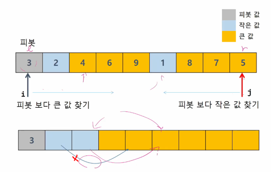
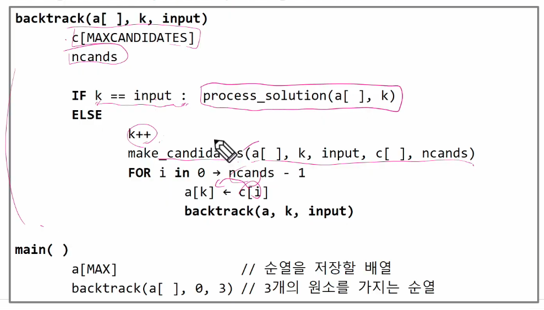

## 

 

# 분할 정복과 백트래킹(Divide conquer and Backtracking)

 

## 학습 목표

 

* 문제를 분할해서 해결하는 분할 정복(Divide and Conquer) 기법을 이해하고 대표적인 알고리즘인 퀵 정렬과 병합 정렬에 대해 학습함
* 상태 공간 트리의 모든 노드를 검색하는 백트래킹에 대해 학습함
* 이진 트리(Binary Tree)의 특성을 이해하고 이진 트리의 중요한 연산인 탐색, 삽입, 삭제 알고리즘을 학습함

 

### 1. 분할정복

 

* 문제 제시 : 가짜 동전 찾기
  * n개의 동전들 중에 가짜 동전이 하나 포함되어 있음. 가짜 동전은 진짜 동전에 비해 아주 조금 가벼움. 진짜 동전들의 무게가 동일하다고 할 때 양팔 저울을 이용해서 가짜 동전을 찾아보자
  * 양팔 저울을 최소로 사용해서 가짜 동전을 찾는 방법은 무엇인가?
  * 예를 들어 동전 24(진짜 23, 가짜 1)개 있다면?

 

* **분할 정복 기법**

  * 유래
    * 1805년 12월 2일 아우스터리츠 전투에서 나폴레옹이 사용한 전략
    * 전력이 우세한 연합군을 공격하기 위해 나폴레옹은 연합군의 중앙부로 쳐들어가 연합군을 둘로 나눔
    * 둘로 나뉜 연합군을 한 부분식 격파함

  * 설계 전략
    * 분할(Divide) : 해결할 문제를 여러 개의 작은 부분으로 나눔
    * 정복(Conquer) : 나눈 작은 문제를 각각 해결함
    * 통합(Combine) : (필요하다면) 해결된 해답을 모음

 

* **Top-down approach**
  * 

 

* **거듭 제곱**
  * 반복(Iterative) 알고리즘 : O(n)
    * 
  * ✨<< n 이나 2^n^은 한 싸이클의 연산 / X^n^은 한 싸이클이 아님, 여러 싸이클일 가능성이 큼

 

* **분할 정복 기반의 알고리즘**
  * 

 

* **병합 정렬(Merge Sort)**
  * 여러 개의 정렬된 자료의 집합을 병합하여 한 개의 정렬된 집합으로 만드는 방식
  * 분할 정복 알고리즘 활용
    * 자료를 최소 단위의 문제까지 나눈 후에 차례대로 정렬하여 최종 결과를 얻어냄
    * top-down 방식
  * 시간 복잡도
    * O(n log n)

 

* **병합 정렬 과정**
  * {69, 10, 30, 2, 16, 8, 31, 22}를 병합 정렬하는 과정
  * 분할 단계 : 전체 자료 집합에 대하여, 최소 크기의 부분집합이 될 때까지 분할 작업을 계속함
    * 
  * 병합 단계 : 2개의 부분집합을 정렬하면서 하나의 집합으로 병합
  * 8개의 부분집합이 1개로 병합될 때까지 반복함
    * 
    * ✨어느 한쪽이 더 이상 남아있는게 없으면 남은쪽 것을 남은 칸에 복사해줌
    * ✨번갈아 가면서 사용하는게 아니라 비교해서 작은쪽을 택함
    * 단점 : 분할할 때마다 메모리 추가 사용

 

* **알고리즘 : 병합 과정**
  * 
    * 💥실제 구현에서는 임시로 저장할 영역만 만듬(인덱스만 내려 보냄)

 

* **퀵 정렬**
  * 주어진 배열을 두 개로 분할하고, 각각의 정렬함
    * 병합 정렬과 동일?
  * 다른 점 1 : 병합 정렬은 그냥 두 부분으로 나누는 반면에, 퀵 정렬은 분할할 때, 기준 아이템(pivot item) 중심으로, 이보다 작은 것은 왼편, 큰 것은 오른편에 위치시킴
  * 다른 점 2 : 각 부분 정렬이 끝난 후, 병합정렬은 "병합"이란 후처리 작업이 필요하나, 퀵 정렬은 필요로 하지 않음 

 

* **알고리즘 : 퀵정렬**
  * 

 

* **Hoare-Partiton 알고리즘**
  * 
    * return j : pivot의 인덱스를 알려줌

 

* **아이디어**
  * P(피봇) 값들 보다 큰 값은 오른쪽, 작은 값들은 왼쪽 집합에 위치하도록 함
    * 
  * 피봇을 두 집합의 가운데에 위치 시킴
    * 
  * ✨파티셔닝 방법은 여러가지 / Hoare가 비교적 빠르다고 알려져 있음

 

* **피봇 선택**
  * 왼쪽 끝 / 오른쪽 끝 / 임의의 세개 값 중에 중간 값
    * 

 

* **원리**
  * 
  * 
  * 
  * 
  * 

 

* **Lomuto partition 알고리즘**
  * 
  * 구조는 단순하나 Hoare보다는 느림
  * 
  * 
    * 중복값이 있으면 안 돌아가는 코드도 있음

 

* 문제 제시 : 병뚜껑 속의 숫자 게임
  * 술래가 병뚜껑 속 숫자를 확인한 후 , 다음 사람부터 숫자를 맞히기 시작함. 술래는 Up 또는 Down을 통해 게임에 참여한 사람들이 병뚜껑 속 숫자에 점점 가까워질 수 있도록 힌트를 제시함
  * ex. 병뚜껑 속 숫자가 3일 경우
    * 첫 번째 사람이 14를 외쳤다면! > 술래는 'DOWN'! > 두 번째 사람이 2를 외쳤다면! > 술래는 'UP'! >  세 번째 사람이 4를 외쳤다면! > 술래는 'DOWN'! > 결국 네 번째 사람이 병뚜껑 속 숫자인 3을 부를 수 밖에 없으므로 벌주 당첨!
    * 이 게임은 숫자를 맞히는 게 아니라 피하는 게 핵심!
    * 최대로 빨리 당첨 되려면 어떻게 하면 될까?

 

* **이진 검색(Binary Search)**
  * 자료의 가운데에 있는 항목의 키 값과 비교하여 다음 검색의 위치를 결정하고 검색을 계속 진행하는 방법
    * 목적 키를 찾을 때까지 이진 검색을 순환적으로 반복 수행함으로써 검색 범위를 반으로 줄여가면서 보다 빠르게 검색을 수행함
  * 이진 검색을 하기 위해서는 **💥자료가 정렬된 상태**여야 함
  * 검색 과정
    1. 자료의 중앙에 있는 원소를 고름
    2. 중앙 원소의 값과 찾고자 하는 목표 값을 비교함
    3. 목표 값이 중앙 원소의 값보다 작으면 자료의 왼쪽 반에 대해서 새로 검색을 수행하고, 크다면 자료의 오른쪽 반에 대해서 새로 검색을 수행함
    4. 찾고자 하는 값을 찾을 때까지 1~3의 과정을 반복함
  * ex. 이진 검색으로 7을 찾는 경우
    * 
  * ex. 이진 검색으로 20을 찾는 경우
    * 

 

* **알고리즘 : 반복 구조**
  * 

 

* **알고리즘 : 재귀구조**
  * 

 

* **분할 정복의 활용**
  * 병합 정렬은 외부 정렬의 기본이 되는 정렬 알고리즘임. 또한, 멀티코어(Multi-Core) CPU 나 다수의 프로세서에서 정렬 알고리즘을 병렬화하기 위해 병합 정렬 알고리즘이 활용됨
  * 퀵 정렬은 매우 큰 입력 데이터에 대해서 좋은 성능을 보이는 알고리즘임
    * 최악의 경우는 O(n^2^)

 

---

 

### 2. 백트래킹

 

* **문제 제시 : N-Queen 문제**
  * n x n 서양 장기판에서 배치한 Queen들이 서로 위협하지 않도록 n개의 Queen을 배치하는 문제
    * 어떤 두 Queen도 서로를 위협하지 않아야 함
    * Queen을 배치한 n개의 위치는?
    * 

 

* **백트래킹(Backtracking) 개념**
  * 여러 가지 선택지(옵션)들이 존재하는 상황에서 한가지를 선택함
  * 선택이 이루어지면 새로운 선택지들의 집합이 생성됨
  * 이런 선택을 반복하면서 최종 상태에 도달함
    * 올바른 선택을 계속하면 목표 상태(goal state)에 도달함

 

* **당첨 리프 노드 찾기**
  * 루트에서 갈 수 있는 노드를 선택함
  * 꽝 노드까지 도달하면 최근의 선택으로 되돌아와서 다시 시작함
  * 더 이상의 선택지가 없다면 이전의 선택지로 돌아가서 다른 선택을 함
  * 루트까지 돌아갔을 경우 더 이상 선택지가 없다면 찾는 답이 없음
  * 

 

* **백트래킹과 깊이 우선 탐색과의 차이**
  * 어떤 노드에서 출발하는 경로가 해결책으로 이어질 것 같지 않으면 더 이상 그 경로를 따라가지 않음으로써 시도의 횟수를 줄임(**✨Prunning** 가지치기)
  * 깊이 우선 탐색이 모든 경로를 추적하는데 비해 백트래킹은 불필요한 경로를 조기에 차단
  * 깊이 우선 탐색을 가하기에는 경우의 수가 너무나 많음. 즉, N! 가지의 경우의 수를 가진 문제에 대해 깊이 우선 탐색을 가하면 당연히 처리 불가능한 문제
  * 백트래킹 알고리즘을 적용하면 일반적으로 경우의 수가 줄어들지만 이 역시 최악의 경우에는 여전히 지수함수 시간(Exponential Time)을 요하므로 처리 불가능

 

* **8-Queens 문제**
  * 퀸 8개를 크기의 체스판 안에 서로를 공격할 수 없도록 배치하는 모든 경우를 구하는 문제
  * 후보 해의 수 :
    * 
  * 실제 해의 수 : 이 중에서 실제 해는 92개뿐
  * 즉, 44억 개가 넘는 후보 해의 수 속에서 92개를 최대한 효율적으로 찾아내는 것이 관건

 

* **4-Queens 문제로 축소해서 생각**
  * 같은 행에 위치할 수 없음
  * 모든 경우의 수 : 4 x 4 x 4 x 4 = 256
    * 

 

* **백트래킹**
  * 루트 노드에서 리프(leaf) 노드까지의 경로는 해답후보(candidate solution)가 되는데, 깊이 우선 검색을 하여 그 해답후보 중에서 해답을 찾을 수 있음
  * 그러나 이 방법을 사용하면 해답이 될 가능성이 전혀 없는 노드의 후손 노드(descendant)들도 모두 검색해야 하므로 비효율적임
  * 모든 후보를 검사?
    * No!
  * 백트래킹 기법
    * 어떤 노드의 유망성을 점검한 후에 유망(promising) 하지 않다고 결정되면 그 노드의 부모로 되돌아가(backtracking) 다음 자식 노드로 감
    * 어떤 노드를 방문하였을 때 그 노드를 포함한 경로가 해답이 될 수 없으면 그 노드는 유망하지 않다고 하며, 반대로 해답의 가능성이 있으면 유망하다고 함
    * 가지치기(prunning) : 유망하지 않는 노드가 포함되는 경로는 더 이상 고려하지 않음
  * 백트래킹을 이용한 알고리즘은 다음과 같은 절차로 진행됨
    1. 상태 공간 트리의 깊이 우선 검색을 실시함
    2. 각 노드가 유망한지를 점검함
    3. 만일 그 노드가 유망하지 않으면, 그 노드의 부모 노드로 돌아가서 검색을 계속함

 

* **일반 백트래킹 알고리즘**
  * 
  * 
    * 델타를 써서 보는 방법(promising)
    * 3개의 1차원 배열(열 / 같은 대각선 / 반대편 대각선) - 이 방법이 제일 좋긴함

 

* **상태 공간 트리**
  * 

 

* **깊이 우선 검색 vs 백트래킹**
  * 순수한 깊이 우선 검색 = 155 노드
  * 백트래킹 = 27 노드

 

* 교수님 코드
  * cart1 : 경유지 순서 정해놓고 비용결정 : if에서 한번에 처리되므로 좀 더 느림
  * cart2 : 경유지가 결정될 때 마다 순간 순간 비용 결정 + 가지치기
  * ✨N 작거나, 최악의 경우에는 변화없이 비슷할 수 있으나 평균적으로는 줄어듬

 

* **상태 공간 트리를 구축하여 문제를 해결**
  * 

 

* **{1, 2, 3}의 powerset을 구하는 백트래킹 알고리즘**
  * 
  * 
  * 

 

* **백트래킹을 이용한 순열 구하기**
  * 
  * 
  * 

 

---

 

### 3. 트리

 

* **문제 제시 : 계산기**
  * 수식 2 + 3 * 4를 다음과 같은 그래프로 표현하고 그래프를 순회하여 수식을 계산하시오
    * 

 

* **트리(Tree)**
  * 트리는 싸이클이 없는 무향 연결 그래프임
    * 두 노드(or 정점) 사이에는 유일한 경로가 존재함 (다른 경로가 존재하면 그래프)
    * 각 노드는 최대 하나의 부모 노드가 존재할 수 있음
    * 각 노드는 자식 노드가 없거나 하나 이상이 존재할 수 있음
  * 비선형 구조
    * 원소들 간에 1:n 관계를 가지는 자료구조
    * 원소들 간에 계층관계를 가지는 계층형 자료구조
  * 

 

* **트리 정의**
  * 한 개 이상의 노드로 이루어진 유한 집합이며 다음 조건을 만족함
    1. 노드 중 부모가 없는 노드를 루트(root)라 함
    2. 나머지 노드들은 n(>=0)개의 분리 집합 T1, ..., TN으로 분리될 수 있음
  * 이들 T1, ... , TN은 각각 하나의 트리가 되며(재귀적 정의) 루트의 서브 트리(subtree)라 함
  * 

 

* **트리 용어**
  * 노드(node) : 트리의 원소이고 정점(vertex)이라고도 함
    * 트리 T의 노드 - A, B, C, D, E, F, G, H, I, J, K
  * 간선(edge) : 노드를 연결하는 선
    * 부모 노드와 자식 노드를 연결
  * 루트 노드(root node) : 트리의 시작 노드
    * 트리 T의 루트 노드 - A
  * 
  * 형제 노드(sibling node) : 같은 부모 노드의 자식 노드들
    * B, C, D는 형제 노드
  * 조상 노드 : 간선을 따라 루트 노드까지 이르는 경로에 있는 모든 노드들
    * K의 조상 노드 : F, B, A
  * 서브 트리(subtree) : 부모 노드와 연결된 간선을 끊었을 때 생성되는 트리
  * 자손 노드 : 서브 트리에 있는 하위 레벨의 노드들
    * B의 자손 노드 - E, F, K
  * 차수 (degree)
    * 노드의 차수 : 노드에 연결된 자식 노드의 수
      * B의 차수 = 2, C의 차수 = 1
    * 트리의 차수 : 트리에 있는 노드의 차수 중에서 가장 큰 값
      * 트리 T의 차수 = 3
    * 단말 노드(리프 노드) : 차수가 0인 노드, 자식 노드가 없는 노드
  * 
  * 높이
    * 노드의 높이 : 루트에서 노드에 이르는 간선의 수, 노드의 레벨
      * B의 높이 = 1, F의 높이 = 2
    * 트리의 높이 : 트리에 있는 노드의 높이 중에서 가장 큰 값, 최대 레벨
      * 트리 T의 높이 = 3

 

* **이진 트리(Binary Tree)**
  * 모든 노드들이 최대 2개의 서브 트리를 갖는 특별한 형태의 트리
  * 각 노드의 자식 노드를 최대한 2개까지만 가질 수 있는 트리
    * 왼쪽 자식 노드(left child node)
    * 오른쪽 자식 노드(right child node)
  * 이진 트리의 예
    * 

 

* **이진 트리 - 특성**
  * 레벨 i에서의 노드의 최대 개수는 2^i^개
  * 높이가 h인 이진 트리가 가질 수 있는 노드의 최소 개수는 (h+1)개가 되며, 최대 개수는 (2^h+1^+1)개가 됨
  * 

 

* **이진 트리 - 종류**
  * 포화 이진 트리(Full Binary Tree)
    * 모든 레벨에 노드가 포화상태로 채워져 있는 이진 트리
    * 높이가 h일 때, 최대의 노드 개수인 (2^h+1^-1)의 노드를 가진 이진 트리
      * 높이 3일때 2^3+1^-1 = 15개의 노드
    * 루트를 1번으로 하여 2^h+1^-1까지 정해진 위치에 대한 노드 번호를 가짐
    * 
    * 포화 이진트리에 한해서만 root가 무조건 1임
  * 완전 이진 트리(Complete Binary Tree)
    * 높이가 h이고 노드 수가 n개일 때 (단, 2^h^ <= n < 2^h+1^-1), 포화 이진 트리의 노드 번호 **✨1번부터 n번까지 빈 자리가 없는 이진 트리**
    * ex. 노드가 10개인 완전 이진 트리
    * 
  * 편향 이진 트리(Skewed Binary Tree)
    * 높이 h에 대한 최소 개수의 노드를 가지면서 한쪽 방향의 자식 노드만을 가진 이진 트리
      * 왼쪽 편향 이진 트리
      * 오른쪽 편향 이진 트리
    * 

 

* **이진트리 - 순회(traversal)**
  * 순회(traversal)란 트리의 각 노드를 중복되지 않게 전부 방문(visit)하는 것을 말하는데 트리는 비 선형 구조이기 때문에 선형구조에서와 같이 선후 연결 관계를 알 수 없음
  * 따라서 특별한 방법이 필요함
    * 

 

* **순회(traversal)** : 트리의 노드들을 체계적으로 방문하는 것

      
