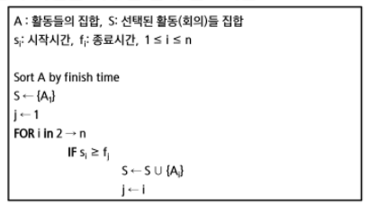

## 

 

# 완전검색 & 그리디

 

## 학습목표

* 재귀적 알고리즘의 특성을 이해하고 이를 구현하기 위한 재귀 호출에 대해 학습함
* 완전 검색의 개념을 이해하고 완전 검색을 통한 문제 해결 방법에 대해 학습함
* 조합적 문제(Combinatorial Problems)에 대한 완전 검색 방법에 대해 이해함
  * 순열, 조합, 부분집합을 생성하는 알고리즘을 학습함
* 탐욕 알고리즘 기법의 개념과 주요 특성을 이해함

 

---

 

### 1. 반복(Iteration)과 재귀(Recursion)

 

* 반복과 재귀는 유사한 작업을 수행할 수 있음
* 반복은 수행하는 작업이 완료될 때 까지 계속 반복
  * 루프 (for, while 구조)
* 재귀는 주어진 문제의 해를 구하기 위해 동일하면서 더 작은 문제의 해를 이용하는 방법
  * 하나의 큰 문제를 해결할 수 있는(해결하기 쉬운) 더 작은 문제로 쪼개고 결과들을 결합함
  * 재귀 함수로 구현
  * **💥디버깅이 힘듬 / 트리 구조로 그려서 구조 파악**

 

* **반복구조**
  * 초기화
    * 반복되는 명령문을 실행하기 전에 (한번만) 조건 검사에 사용할 변수의 초기값 설정
  * 조건검사(check control expression)
  * 반복할 명령문 실행(action)
  * 업데이트(loop update)
    * 무한 루프(infinite loop)가 되지 않게 조건이 거짓(false)이 되게 함
  * 

 

* **반복을 이용한 선택 정렬**
  * 

 

* **재귀적 알고리즘**
  * 재귀적 정의는 두 부분으로 나뉨
  * 하나 또는 그 이상의 기본 경우(basis case or rule)
    * 집합에 포함되어 있는 원소로 induction을 생성하기 위한 시드(seed) 역할
  * 하나 또는 그 이상의 유도된 경우(inductive case or rule)
    * 새로운 집합의 원소를 생성하기 위해 결합되어지는 방법

 

* **재귀 함수(recursive function)**
  * 함수 내부에서 직접 혹은 간접적으로 자기 자신을 호출하는 함수
  * 일반적으로 재귀적 정의를 이용해서 재귀 함수를 구현함
  * 따라서, 기본 부분(basic part)와 유도 부분(inductive part)로 구성됨
  * 재귀적 프로그램을 작성하는 것은 반복 구조에 비해 간결하고 이해하기 쉬움
    * 그러나, 재귀에 대해 익숙하지 않는 개발자들은 재귀적 프로그램이 어렵다고 느낌
  * 함수 호출은 프로그램 메모리 구조에서 스택을 사용함. 따라서 재귀 호출은 반복적인 스택의 사용을 의미하며 메모리 및 속도에서 성능저하가 발생함

 

* **팩토리얼 재귀 함수**
  * 

 

* **팩토리얼 재귀 함수의 호출**
  * 

 

* 해결할 문제를 고려해서 반복이나 재귀의 방법을 선택
* 재귀는 문제 해결을 위한 알고리즘 설계가 간단하고 자연스러움
  * 추상 자료형(list, tree 등)의 알고리즘은 재귀적 구현이 간단하고 자연스러운 경우가 많음
* 일반적으로, 재귀적 알고리즘은 반복(Iterative) 알고리즘보다 더 많은 메모리와 연산을 필요로 함
* ✨입력 값 n이 커질수록 재귀 알고리즘은 반복에 비해 비효율적일 수 있음

 

* **반복과 재귀의 비교**
  * 

 

* 2^k^ 연산에 대한 재귀와 반복
  *  

 

---

 

### 2. 완전 검색 기법

 

* **문제 제시 : Baby-gin Game**
  * 설명
    * 0~9 사이의 숫자 카드에서 임의의 카드 6장을 뽑았을 때, 3장의 카드가 연속적인 번호를 갖는 경우를 run이라 하고, 3장의 카드가 동일한 번호를 갖는 경우를 triplet이라고 함
    * 그리고, 6장의 카드가 run과 triplet로만 구성된 경우를 baby-gin으로 부름
    * 6자리의 숫자를 입력 받아 baby-gin 여부를 판단하는 프로그램을 작성하라
  * 입력 예
    * 667767은 두개의 triplet이므로 baby-gin임(666, 777)
    * 054060은 한 개의 run과 한 개의 triplet이므로 역시 baby-gin임(456, 000)
    * 101123은 한 개의 triplet가 존재하나, 023이 run이 아니므로 baby-gin이 아님
    * (123을 run으로 사용하더라도 011이 run이나 triplet가 아님)
  * 6자리의 숫자를 입력 받아 어떻게 Baby-gin 여부를 찾을 것인가?

 

* **고지식한 방법(brute-force)**
  * brute-force는 문제를 해결하기 위한 간단하고 쉬운 접근법임
    * "Just-do-it"
    * force의 의미는 사람(지능)보다는 컴퓨터의 force를 의미함
  * brute-force 방법은 대부분의 문제에 적용 가능함
  * 상대적으로 빠른 시간에 문제 해결(알고리즘 설계)을 할 수 있음
  * 문제에 포함된 자료(요소, 인스턴스)의 크기가 작다면 유용함
  * 학술적 또는 교육적 목적을 위해 알고리즘의 효율성을 판단하기 위한 척도로 사용됨

 

* **Brute-force 탐색(sequential search)**
  * 자료들의 리스트에서 키 값을 찾기 위해 첫 번째 자료부터 비교하면서 진행함
  * 

 

* **완전 검색으로 시작하라**
  * 모든 경우의 수를 생성하고 테스트하기 때문에 수행 속도는 느리지만, 해답을 찾아내지 못할 확률이 작음
    * 완전검색은 입력의 크기를 작게 해서 간편하고 빠르게 답을 구하는 프로그램을 작성함
    * **💥n이 작을 때뿐만 아니라 답의 범위가 작을때(n이 크다고 해도)도 적용 가능 - 역으로 답 찾기**
  * 이를 기반으로 그리디 기법이나 동적 계획법을 이용해서 효율적인 알고리즘을 찾을 수 있음
  * 검정 등에서 주어진 문제를 풀 때, "💥**우선 완전 검색으로 접근하여 해답을 도출한 후, 성능 개선을 위해 다른 알고리즘을 사용하고 해답을 확인하는 것이 바람직**"함
  * 💥완전 검색이라고 짰지만 완전 검색을 여러번 하고 있을 수도 있음 (시간 초과 발생 / 주의 !!!)

 

* **완전 검색을 통한 Baby-gin 접근**
  * 고려할 수 있는 모든 경우의 수 생성하기
    * 6개의 숫자로 만들 수 있는 모든 숫자 나열(중복 포함)
    * ex. 입력으로 {2, 3, 5, 7, 7, 7}을 받았을 경우, 아래와 같이 순열을 생성할 수 있음
    * 
  * 해답 테스트
    * 앞의 3자리와 뒤의 3자리를 잘라, run와 triplet 여부를 테스트하고 최종적으로 baby-gin을 판단함
    * 

 

* **완전 검색**
  * 많은 종류의 문제들이 특정 조건을 만족하는 경우나 요소를 찾는 것임
  * 또한, 이들은 전형적으로 순열(permutation), 조합(combination), 그리고 부분 집합(subsets)과 같은 조합적 문제들(Combinatiorial Problems)과 연관됨
  * 완전 검색은 조합적 문제에 대한 brute-force 방법임
  * 💥**입력 → 순열/조합/부분집합 ↔  탐색 → 결과**

 

---

 

### 3. 조합적 문제

 

* **문제 제시 : 여행사 BIG sale**
  * 

 

* **순열(Permutation)**
  * 서로 다른 것들 중 몇 개를 뽑아서 한 줄로 나열하는 것
  * 서로 다른 n개 중 r개를 택하는 순열은 아래와 같이 표현함
    * ~n~P~r~
  * 그리고 ~n~P~r~ 은 다음과 같은 식이 성립함
    * 
  * ~n~P~n~ = n!이라고 표기하며 Factorial이라 부름
    * 
  * 다수의 알고리즘 문제들은 순서화된 요소들의 집합에서 최선의 방법을 찾는 것과 관련 있음
    * ex. TSP(Traveling Salesman Problem)
  * N개의 요소들에 대해서 n!개의 순열들이 존재함
    * 12! = 479,001,600 > 4억
    * n > 12인 경우, 시간 복잡도 폭발적으로 증가
    * **💥그러므로 순열로 푸는 경우는 n이 10개 내외로 주어짐 / 12개쯤이면 백트래킹 생각 / 14개 이상이면 다른 방법 고려**
  * 
  * 단순하게 순열을 생성하는 방법
    * ex. {1, 2, 3}을 포함하는 모든 순열을 생성하는 함수
    * 동일한 숫자가 포함되지 않았을 때, 각 자리 수 별로 loop을 이용해 아래와 같이 구현할 수 있음
    * 

 

* **순열 생성 방법**
  * 사전적 순서(Lexicographic-Order)
    * {1, 2, 3}, n = 3인 경우 다음과 같이 생성됨
    * [1 2 3] [1 3 2] [2 1 3] [2 3 1] [3 1 2] [3 2 1]
  * 최소 변경을 통한 방법(Minimum-exchange requirement)
    * 각각의 순열들은 이전의 상태에서 단지 두 개의 요소들 교환을 통해 생성
    * 
  * 최소한의 변경(Minimum-change requirement)을 통해 다음 순열을 생성하는 방법
    * 1950년대의 교회의 종소리 패턴하고 유사
    * Johnson-Trotter 알고리즘
    * 
  * ✨재귀 호출을 통한 순열 생성(자리교환/원상복구/자리교환)
    * 

 

* **[참고]**
  * 1, 2, 3으로 구성된 순열
    * ​	
    * 

 

* **순열을 만드는 다른 방법(used 배열 사용)**
  * 

 

* **부분 집합**
  * 집합에 포함된 원소들을 선택하는 것임
  * 다수의 중요 알고리즘들이 원소들의 그룹에서 최적의 부분 집합을 찾는 것임
    * ex. 배낭 짐싸기(knapsack)
  * N개의 원소를 포함한 집합
    * 자기 자신과 공집합 포함한 모든 부분집합(power set)의 개수는 2^n^ 개
    * 원소의 수가 증가하면 부분집합의 개수는 지수적으로 증가
  * 단순하게 모든 부분 집합 생성하는 방법
    * 4개 원소를 포함한 집합에 대한 power set 구하기
    * 

 

* **부분집합 생성 방법**
  * 바이너리 카운팅을 통한 사전적 순서(Lexicographic Order)
    * 부분집합을 생성하기 위한 가장 자연스러운 방법임
    * 바이너리 카운팅(Binary Counting)은 사전적 순서로 생성하기 위한 가장 간단한 방법임
    * ✨원소의 갯수가 변해도 쉽게 적용 가능
  * 바이너리 카운팅(Binary Counting)
    * 원소 수에 해당하는 N개의 비트열을 이용함
    * n번째 비트값이 1이면 n번째 원소가 포함되었음을 의미함
    * 
    * 2진수는 리틀 엔디안이라 뒤에서 부터 시작함
    * **✨2진수는 뒤에서 부터 / 리스트는 앞에서 부터**
  * 바이너리 카운팅을 통한 부분집합 생성 코드 예
    * 

 

* **조합**
  * 서로 다른 n개의 원소 중 r개를 순서 없이 골라낸 것을 조합(combination)이라고 부름
  * 조합의 수식
    * 
    * 
  * 재귀 호출을 이용한 조합 생성 알고리즘
    * 
    * 

 

* **[참고]**
  * 10개의 원소 중 3개를 고르는 조합
    * i < j < k 라고 하면,
    * 
    * 
    * 
  * n개에서 r개를 고르는 조합(재귀)
    * 

 

---

 

### 4. 탐욕 알고리즘

 

* **문제 제시 : 거스름돈 줄이기**
  * 손님이 지불한 금액에서 물건값을 제한 차액(거스름돈)을 지불하는 문제를 생각해보자
  * "어떻게 하면 손님에게 거스름돈으로 주는 지폐와 동전의 개수를 최소한으로 줄일 수 있을까?"

 

* **탐욕(Greedy) 알고리즘**
  * 탐욕 알고리즘은 최적해를 구하는 데 사용되는 근시안적인 방법
  * 일반적으로, 머리속에 떠오르는 생각을 검증 없이 바로 구현하면 Greedy 접근이 됨
  * 여러 경우 중 하나를 선택 할 때마다 그 순간에 최적이라고 생각되는 것을 선택해 나가는 방식으로 진행하여 최종적인 해답에 도달함
  * 각 선택 시점에서 이루어지는 결정은 지역적으로는 최적이지만, 그 선택들을 계속 수집하여 최종적인 해답을 만들었다고 하여, ✨**그것이 최적이라는 보장은 없음**
  * 일단, 한번 선택된 것은 번복하지 않음. 이런 특성 때문에 대부분의 탐욕 알고리즘들은 단순하며, 또한 제한적인 문제들에 적용됨
  * 최적화 문제(optimization)란 가능한 해들 중에서 가장 좋은(최대 또는 최소) 해를 찾는 문제임

 

* **탐욕 알고리즘의 동작 과정**
  1) 해 선택 : 현재 상태에서 부분 문제의 최적 해를 구한 뒤, 이를 부분해 집합(Solution Set)에 추가함
  2) 실행 가능성 검사 : 새로운 부분 해 집합이 실행가능한지를 확인함. 곧, 문제의 제약 조건을 위반하지 않는 지를 검사함
  3) 해 검사 : 새로운 부분 해 집합이 문제의 해가 되는지를 확인함. 아직 전체 문제의 해가 완성되지 않았다면 1의 해 선택부터 다시 시작함

 

* **탐욕 기법을 적용한 거스름돈 줄이기**

  1. 해 선택 : 여기에서는 멀리 내다볼 것 없이 가장 좋은 해를 선택함. 단위가 큰 동전으로만 거스름돈을 만들면 동전의 개수가 줄어드므로 현재 고를 수 있는 가장 단위가 큰 동전을 하나 골라 거스름돈에 추가함
  2. 실행 가능성 검사 : 거스름돈이 손님에게 내드려야 할 액수를 초과하는지 확인함. 초과한다면 마지막에 추가한 동전을 거스름돈에서 빼고, 1로 돌아가서 현재보다 한 단계 작은 단위의 동전을 추가함
  3. 해 검사 : 거스름돈 문제의 해는 당연히 거스름돈이 손님에게 내드려야 하는 액수와 일치하는 셈임. 더 드려도, 덜 드려도 안되기 때문에 거스름돈을 확인해서 액수에 모자르면 다시 1로 돌아가서 거스름돈에 추가할 동전을 고름

  * 최적해를 반드시 구한다는 보장이 없음
    * 
    * 400원 2개가 최적

 

* **배낭 짐싸기(Knapsack)**
  * 도둑은 부자들의 값진 물건들을 훔치기 위해 보관 창고에 침입하였음
  * 도둑은 훔친 물건을 배낭에 담아 올 계획임. 배낭은 담을 수 있는 물건의 총 무게(W)가 정해져 있음
  * 창고에는 여러 개(n개)의 물건들이 있고 각각의 물건에는 무게와 값이 정해져 있음
  * 경비원들에 발각되기 전에 배낭이 수용할 수 있는 무게를 초과하지 않으면서, 값이 최대가 되는 물건들을 담아야 함
  * 
  * Knapsack 문제의 정형적 정의
    * 
    * 문제 정의
    * 
  * Knapsack 문제 유형
    * 0-1 Knapsack (✨탐욕 접근 X)
      * 배낭에 물건을 통째로 담아야 하는 문제
      * 물건을 쪼갤 수 없는 경우
    * Fractional Knapsack (✨탐욕 접근 가능)
      * 물건을 부분적으로 담는 것이 허용되는 문제
      * 물건을 쪼갤 수 있는 경우

 

* **0-1 Knapsack에 대한 완전 검색 방법**
  * 완전 검색으로 물건들의 집합 S에 대한 모든 부분집합을 구함
  * 부분집합의 총무게가 W를 초과하는 집합들은 버리고, 나머지 집합에서 총 값이 가장 큰 집합을 선택할 수 있음
  * 물건의 개수가 증가하면 시간 복잡도가 지수적으로 증가함
    * 크기 n인 부분합의 수 2^n^

 

* **회의실 배정하기**
  * 김대리는 소프트웨어 개발팀들의 회의실 사용 신청을 처리하는 업무를 함. 이번 주 금요일에 사용 가능한 회의실은 하나만 존재하고 다수의 회의가 신청된 상태임
  * 회의는 시작 시간과 종료 시간이 있으며, 회의 시간이 겹치는 회의들은 동시에 열릴 수 없음
  * 가능한 많은 회의가 열리기 위해서는 회의들을 어떻게 배정해야 할까?
  * 

 

* **활동 선택(Acivity-selection problem) 문제** (✨활동 선택은 탐욕적 접근 가능)
  * 시작시간과 종료지간(s~i~ , f~i~ )이 있는 n개의 활동들의 집합 A = {A~1~, A~2~,..., A~n~}, 1<= i <= n에서 서로 겹치지 않는(non-overlapping) 최대 갯수의 활동들의 집합 S를 구하는 문제
  * 양립 가능한 활동들의 크기가 최대가 되는 S~0,n+1~의 부분집합을 선택하는 문제
    * 
  * 탐욕 기법의 적용
    * 공집합이 아닌 하위 문제(subproblem) S~i,j~가 있고, S~i,j~에 속한 활동 a~m~은 종료시간이 가장 빠른 활동임
    * 그렇다면,
      1. 하위문제(subproblem) S~i,j~에서 종료 시간이 가장 빠른 활동 a~m~을 선택함
      2. S~i,m~은 공집합이므로, a~m~을 선택하면 공집합이 아닌 하위 문제 S~m,j~가 남음
      3. 1,2 과정을 반복
    * 
  * 탐욕 기법을 적용한 반복 알고리즘
    * 
    * 종료 시간이 빠른 순서로 활동들을 정렬함
    * 첫번째 활동(A~1~)을 선택함
    * 선택한 활동(A~1~)의 종료시간보다 빠른 시작 시간을 가지는 활동을 모두 제거함
    * 남은 활동들에 대해 앞의 과정을 반복함
  * 
  * 재귀 알고리즘
    * 

 

* **탐욕 알고리즘의 필수 요소**
  * 탐욕적 선택 속성(greedy choic property)
    * 탐욕적 선택은 최적해로 갈 수 있음을 보여라
      * 즉, 탐욕적 선택은 항상 안전함
  * 최적 부분 구조(optimal substructure property)
    * 최적화 문제를 정형화하라
      * 하나의 선택을 하면 풀어야 할 하나의 하위 문제가 남음
  * 💥**[원문제의 최적해 = 탐욕적 선택 + 하위 문제의 최적해]** 임을 증명하라.

 

* **탐욕 기법과 동적 계획법의 비교**
  * 

 

* **대표적인 탐욕 기법의 알고리즘들**
  * 

 

* **탐욕 기법을 통한 Baby-gin 문제 해결**
  * 완전검색이 아닌 방법으로 풀어보자
    * 6개의 숫자는 6자리의 정수 값으로 입력됨
    * counts 배열의 각 원소를 체크하여 run과 triplet 및 baby-gin 여부를 판단함
    * 풀이
      * 
    * 알고리즘 예시
      * 
      * 
      * 

 
