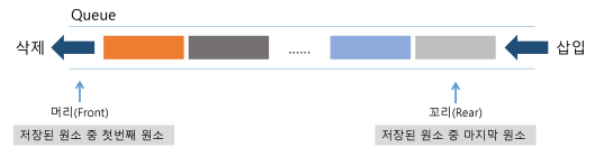
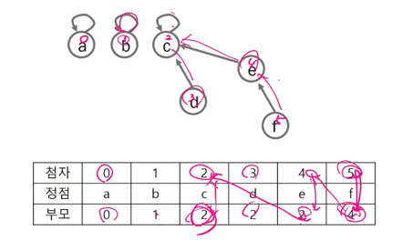

## 

 

* **학습 목표**
  * 실 세계 문제를 그래프로 추상화해서 해결하는 방법을 학습함
    * 그래프 탐색 기법인 BFS와 DFS에 대해 학습함
    * 그래프 알고리즘에 활용되는 상호배타 집합(Disjoint-Sets)의 자료구조에 대해 학습함
    * 최소 신장 트리(Minimum Spanning Tree)를 이해하고 탐욕 기법을 이용해서 그래프에서 최소 신장 트리를 찾는 알고리즘을 학습함
    * 그래프의 두 정점 사이의 최단 경로(Shortest Path)를 찾는 방법을 학습함

 

# 그래프 & 백트래킹(Graph & Backtracking)

 

### 1. 그래프 기본

 

* **문제 제시 : 친구 관계**
  * A의 친구는 B
  * C의 친구는 E, F
  * (D - E), (F - G), (N - B, I, L), (G - A, C, D, H), (I - J, H), (B - D, K, L), (M - I, J), (E - A, H), (C - B, I , L), (B - I), (J - A, G)
  * A의 친구 중에 친구가 가장 많은 친구는 누구인가?

 

* 2차원 배열에서 순열 만들기
  * 칸에 좌표를 집어넣고 i, j, k로 꺼내기
  * 고유번호 붙이기(i * N + j)	

 

* **그래프**
  * 그래프는 아이템(사물 또는 추상적 개념)들과 이들 사이의 연결 관계를 표현함
  * 그래프는 정점(Vertex)들의 집합과 이들을 연결하는 간선(Edge)들의 집합으로 구서오딘 자료 구조
    * `|V|` : 정점의 개수, `|E|` : 그래프에 포함된 간선의 개수
    * ✨`|V|` 개의 정점을 가지는 그래프는 최대 `|V|`(`|V|` - 1) / 2 간선이 가능 (Tree는 V = E +1)
      * ex 5개 정점이 있는 그래프의 최대 간선 수는 10(=5*4/2)개 임.
      * ✨정점개수(정점-1) / 2
      * 트리는 그래프에 종속
  * 선형 자료구조나 트리 자료구조로 표현하기 어려운 N : N 관계를 가지는 원소들을 표현하기에 용이함

 

* **그래프 유형**
  * 무향 그래프(Undirected Graph)
  * 유향 그래프(Directed Graph)
  * 가중치 그래프(Weighted Graph)
  * 사이클 없는 방향 그래프(DAG, Directed Acyclic Graph)
  * 
    * 어떤 정점에서 출발해서 간선을 따라 이동했는데 자기 자신으로 돌아오는 경우 : 사이클
  * 완전 그래프
    * 정점들에 대해 가능한 모든 간선들을 가진 그래프
      * 
  * 부분 그래프 
    * 원래 그래프에서 일부의 정점이나 간선을 제외한 그래프

 

* **인접 정점**
  * 인접(Adjacency)
    * 두 개의 정점에 간선이 존재(연결됨)하면 서로 인접해 있다고 함
    * 완전 그래프에 속한 임의의 두 정점들은 모두 인접해 있음
    * 

 

* **그래프 경로**
  * 경로란 간선들을 순서대로 나열한 것
    * 간선들 : (0, 2), (2, 4), (4, 6)
    * 정점들 : 0 - 2 - 4 - 6
  * 경로 중 한 정점을 최대한 한번만 지나는 경로를 **✨단순경로**라 함
    * 0 - 2 - 4 - 6, 0 - 1 - 6
  * 시작한 정점에서 끝나는 경로를 **✨사이클(Cycle)**이라고 함
    * 1 - 3 - 5 - 1
    * 
  * DAG : 자기 자신으로 돌아오는 경로가 없는 그래프

 

* **그래프 표현**
  * 간선의 정보를 저장하는 방식, 메모리나 성능을 고려해서 결정
  * 인접 행렬 (Adjacent matrix)
    * `|V|`x `|V|` 크기의 2차원 배열을 이용해서 간선 정보를 저장
    * 배열의 배열(포인터 배열)
  * 인접 리스트 (Adjacent List)
    * 각 정점마다 해당 정점으로 나가는 간선의 정보를 저장
  * 간선의 배열
    * 간선(시작 정점, 끝 정점)을 배열에 연속적으로 저장

 

* **인접 행렬**
  * 두 정점을 연결하는 간선의 유무를 행렬로 표현
    * `|V|`x `|V|`  정방 행렬
    * 행 번호와 열 번호는 그래프의 정점에 대응
    * 두 정점이 인접되어 있으면 1, 그렇지 않으면 0으로 표현
    * 무향 그래프
      * i번째 행의 합 = i번째 열의 합 = V~i~의 차수
    * 유향 그래프
      * 행 i의 합 = V~i~의 진출 차수
      * 열 i의 합 = V~i~의 진입 차수
  * 
    * 행 -> 열로 방향 표시
    * 진출 차수 : 나가는게 몇 개지?
    * 진입 차수 : 들어오는게 몇 개지?
    * 알고리즘 문제를 풀때 방향성은 💥**저장 될 때만 신경** 쓰면 됨 / 저장만 잘하면 안 틀림
    * ex. 친구 관계(방향성 X), 비상 연락망(방향성 O)
    * 유향일때는 return하면서 찍힘(32-12)
  * 인접 행렬의 단점은?
    * 
    * 용도에 따른 저장 방법 설정
    * ✨100만 이상이면 인접리스트, 인접행렬은 힘듬
    * 장점 : 바로바로 접근 가능
    * 단점 : 인간의 입장에서는 한 눈에 안들어옴 + 메모리

 

* **인접 리스트**
  * 각 정점에 대한 인접 정점들을 순차적으로 표현
  * 하나의 정점에 대한 인접 정점들을 각각 노드로 하는 연결 리스트로 저장
    * 
    * 

 

---

 

### 2. 그래프 탐색

 

* **문제 제시 : 친구 관계**
  * 다음과 같이 친구 관계를 그래프로 표현하였음
  * A로 부터 시작해서 한 명의 친구에게만 소식을 전달, 전달 할 수 있다면 몇명의 친구가 소식을 전달 받을 수 있을까?(단, 소식을 전달 받은 친구한테는 소식을 재 전달 할 수 없음)
  * A로 부터 시작해서 친구들에게 동시에 소식을 전달할 수 있다고 할 때, 가장 늦게 전달 받는 사람은 누구일까? (단, 친구에게 소식을 전달하는 속도는 동일함)
  * 

 

* **그래프 순회(탐색)**
  * 그래프 순회는 비선형 구조인 그래프로 표현된 모든 자료(정점)를 빠짐없이 탐색하는 것을 의미함
  * 두 가지 방법
    * 깊이 우선 탐색(Depth First Search, DFS)
    * 너비 우선 탐색(Breadth First Search, BFS)
  * 문제 => 그래프 => DFS or BFS => 목표 

 

* **DFS(깊이 우선 탐색)**
  * 시작 정점의 한 방향으로 갈 수 있는 경로가 있는 곳까지 깊이 탐색해 가다가 더 이상 갈 곳이 없게 되면, 가장 마지막에 만났던 갈림길 간선이 있는 정점으로 되돌아가서 다른 방향의 정점으로 탐색을 계속 반복하여 결국 모든 정점을 방문하는 순회방법
  * 가장 마지막에 만났던 갈림길의 정점으로 되돌아가서 다시 깊이 우선 탐색을 반복해야 하므로 후입선출 구조의 스택 사용 or 재귀 사용

 

* **스택**
  * 스택(stack)의 특성
    * 물건을 쌓아 올리듯 자료를 쌓아 올린 형태의 자료구조임
    * 선형구조 : 자료 간의 관계가 1대1의 관계를 갖음
      * 비선형 구조 : 자료 간의 관계가 1대N의 관계를 갖음(ex. 트리)
    * 마지막에 삽입한 자료를 가장 먼저 꺼냄
      * 후입선출(LIFO, Last-In-First-Out) 이라고 부름
    * 

 

* **스택의 구현**
  * 스택을 구현하기 위해서 필요한 저장소와 연산
    * 자료를 선형으로 저장할 저장소
      * C언어에서는 배열을 사용할 수 있음
      * 저장소 자체를 스택이라 부르기도 함
      * 스택에서 마지막 삽입된 원소의 위치를 top이라 부름
    * 연산
      * 
  * 스택의 삽입/삭제 과정
    * 빈 스택에 원소 A, B, C를 차례로 삽입 후 한번 삭제 하는 연산 과정
    * 
  * 스택의 push 알고리즘
    * top은 스택에서 마지막 자료의 위치를 가리킴
    * 
  * 스택의 pop 알고리즘
    * 

 

* **DFS(Depth First Search)**
  * DFS 알고리즘 - 재귀
    * 
    * 경로의 개수 : 중복을 허용 / visited를 빼지 않음 / 다른 경로로 나에게 오는것은 허용
  * DFS 알고리즘 - 반복
    * 
    * 
      * 얼마나 중복해서 들어갈지 모르므로 스택의 크기를 정하기 어려움

 

* **[참고] DFS(Depth First Search)**
  * 
    * 경로를 push해서 DFS(내가 간 경로를 순서대로 stack에 넣음) / 값을 찾는게 아니고, 갈 수 있는 곳의 목록(갈림길 목록)을 만들고 꺼냄 / 가지않고 남겨둔 번호로 jump 

 

* **BFS(Breadth First Search)**
  * 너비우선탐색은 탐색 시작점의 인접한 정점들을 먼저 모두 차례로 방문한 후에, 방문했던 정점을 시작점으로 하여 다시 인접한 정점들을 차례로 방문하는 방식
  * 인접한 정점들에 대해 탐색을 한 후, 차례로 다시 너비우선탐색을 진행해야 하므로, 선입 선출 형태의 자료구조인 큐를 활용함

 

* **큐**
  * 큐(Queue)의 특성
    * 스택과 마찬가지로 삽입과 삭제의 위치가 제한적인 자료구조
      * 큐의 뒤에서는 삽입만 하고, 큐의 앞에서는 삭제만 이루어지는 구조
    * 큐에 삽입한 순서대로 원소가 저장되어, 가장 먼저 삽입된 원소는 가장 먼저 삭제됨
      * 선입선출구조(FIFO : First In First Out)
      * 

 

* **큐의 구조 및 기본연산**
  * 큐의 선입선출 구조
    * 
  * 큐의 기본 연산
    * 삽입 : enQueue
    * 삭제 : deQueue

 

* **큐의 연산 과정**

  1. 공백 큐 생성 : createQueue();
  2. 원소 A 삽입 : enQueue(A);
  3. 원소 B 삽입 : enQueue(B);

  * 

  4. 원소 반환 / 삭제 : deQueue();
  5. 원소 C 삽입 : enQueue(C);
  6. 원소 반환 / 삭제 : deQueue();
  7. 원소 반환 / 삭제 : deQueue();

  * 
  * apped / pop(0) => deque = > fron/rear 구현 순으로 속도가 빨라짐

 

* **큐의 구현**
  * 삽입 : enQueue(item)
    * 마지막 원소 뒤에 새로운 원소를 삽입하기 위해
      1. rear 값을 하나 증가시켜 새로운 원소를 삽입할 자리를 마련
      2. 그 인덱스에 해당하는 배열원소 Q[rear]에 item을 저장
    * 
  * 삭제 : deQueue()
    * 가장 앞에 있는 원소를 삭제하기 위해
      1. front 값을 하나 증가시켜 큐에 남아있게 될 첫번째 원소 이동
      2. 새로운 첫번째 원소를 리턴함으로써 삭제와 동일한 기능을 함
    * 
  * 공백상태 및 포화상태 검사 : isEmpty(), isFull()
    * 공백상태 : front = rear
    * 포화상태 : rear = n - 1(n : 배열의 크기, n - 1 : 배열의 마지막 인덱스)
    *  

 

* **BFS(Breadth First Search)**
  * BFS는 예제 그래프를 붙여진 번호 순서로 탐색함
  * 

 

* **BFS 알고리즘**
  * 입력 파라미터 : 그래프 G와 탐색 시작점 v
  * 

 

---

 

### 3. 서로소 집합들

 

* **서로소 집합(Disjoint-sets)**
  * 서로소 또는 상호배타 집합들은 서로 중복 포함된 원소가 없는 집합들임. 다시 말해 교집합이 없음
  * 집합에 속한 하나의 특정 멤버를 통해 각 집합들을 구분함. 이를 대표자(representative)라 함
  * 상호배타 집합을 표현하는 방법
    * 연결 리스트
    * 트리
  * 상호배타 집합 연산
    * Make-Set(x)
    * ✨Find-Set(x) : x가 속한 집합의 대표 원소를 알려줘
    * ✨Union(x, y) : 합치고 x를 대표 원소로
  * 상호배타 집합 예
    * 

 

* **상호 배타 집합 표현 - 연결리스트**
  * 같은 집합의 원소들은 하나의 연결리스트로 관리함
  * 연결리스트의 맨 앞의 원소를 집합의 대표 원소로 삼음
  * 각 원소는 집합의 대표원소를 가리키는 링크를 갖음
  * 
  * 연결리스트 연산 예
    * 
      * 자기 자신을 가리킴 : root
      * 대표 원소의 갯수만큼 트리가 있음

 

* **상호 배타 집합 표현 - 트리**
  * 하나의 집합(a disjoing set)을 하나의 트리로 표현함
  * 자식 노드가 부모 노드를 가리키며 루트 노드가 대표자가 됨
  * 
  * 
  * 연산 예
    * Make-Set(a) ~ Make-Set(f)
      * 
    * Union(c, d), Union(e, f)
      * 
      * 💥d의 대표원소가 c로 바뀐다 (X) / d의 대표원소가 c의 대표원소로 바뀐다 
      * 최종적으로 가리키는 대표원소로 변경
    * Union(d, f)
      * 
    * Find-Set(d)
      * return c
    * Find-Set(e)
      * return c
  * 상호배타 집합을 표현한 트리의 배열을 이용한 저장된 모습
    * 
    * 인덱스와 저장된 원소가 같을때까지 가야 대표원소임

 

* **상호배타 집합에 대한 연산**
  * Make-Set(x) : 유일한 멤버 x를 포함하는 새로운 집합을 생성하는 연산
    * 
  * Find-Set(x) : x를 포함하는 집합을 찾는 연산
    * 
    * 
  * Union(x, y) : x와 y를 포함하는 두 집합을 통합하는 연산
    * 
    * x, y의 대표 원소를 찾고, y의 대표원소를 x의 대표원소로 바꿔줌
  * 
  * 문제점
    * 
    * Find-Set() + path compression까지 하면 최적화
  * 연산의 효율을 높이는 방법
    * ✨Rank(연산 효율을 높임)를 이용한 Union
      * 각 노드는 자신을 루트로 하는 subtree의 높이를 랭크 Rank라는 이름으로 저장함
      * 두 집합을 합칠 때 rank가 낮은 집합을 rank가 높은 집합에 붙임
    * path compression
      * Find-Set을 행하는 과정에서 만나는 모든 노드들이 직접 root를 가리키도록 포인터를 바꾸어 줌
  * 랭크를 이용한 Union의 예
    * 
    * 랭크가 더 큰쪽을 가리키도록 => 대표 원소끼리 연결을 시켰을 때 높이가 늘어나는 것을 방지
  * 랭크를 이용한 Union에서 랭크가 증가하는 예
    * 
  * Path Compression의 예
    * 
  * Make_Set() 연산
    * Make_Set(x) : 유일한 멤버 x를 포함하는 새로운 집합을 생성하는 연산
      * 
  * Find_Set 연산
    * Find_Set(x) : x를 포함하는 집합을 찾는 오퍼레이션
      * 
    * Find_Set 연산은 특정 노드에서 루트까지의 경로를 찾아 가면서 노드의 부모 정보를 갱신함
  * Union 연산
    * Union(x, y) : x와 y를 포함하는 두 집합을 통합하는 오퍼레이션
      * 

 

---

 

### 4. 최소 비용 신장 트리(MST)

      

----

 

### 5. 최단 경로

      
