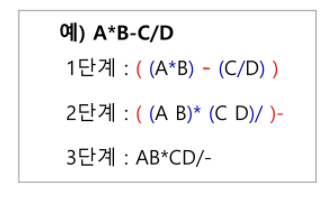

## 

# 스택2 (Stack2)

### 1. 계산기

* 계산기
  * 문자열로 된 계산식이 주어질 때, 스택을 이용하여 이 계산식의 값을 계산할 수 있음
  * 문자열 수식 계산의 일반적 방법
    * step1. 중위 표기법의 수식을 후위 표기법으로 변경함(스택 이용)
    * step2. 후위 표기법의 수식을 스택을 이용하여 계산함
  * 중위 표기법 (infix notation)
    * 연산자를 피연산자의 가운데 표기하는 방법
      * ex. A + B
  * 후위 표기법 (postfix notation)
    * 연산자를 피연산자 뒤에 표기하는 방법
      * ex. AB+
* **Step1. 중위 표기식의 후위표기식 변환 방법1**
  * 수식의 각 연산자에 대해서 우선순위에 따라 괄호를 사용하여 다시 표현함
  * 각 연산자를 그에 대응하는 오른쪽 괄호의 뒤도 이동시킴
  * 괄호를 제거
  * 
* **Step1. 중위 표기법에서 후위 표기법으로의 변환 알고리즘(스택이용)2**
  * 입력 받은 중위 표기식에서 토큰을 읽음
  * 토큰이 피연산자이면 토큰을 출력함
  * 토큰이 연산자(괄호포함)일 때, 이 토큰이 스택의 top에 저장되어 있는 연산자보다 우선순위가 높으면 스택에 push하고, 그렇지 않다면 스택 top의 연산자의 우선 순위가 토큰의 우선 순위보다 작을 때까지 스택에서 pop 한 후 토큰의 연산자를 push함. 만약 top에  연산자가 없으면 push함

---

### 2. 백트래킹

### 3. [참고] 부분집합, 순열

### 4. 분할 정복

que que que que

quququququ
