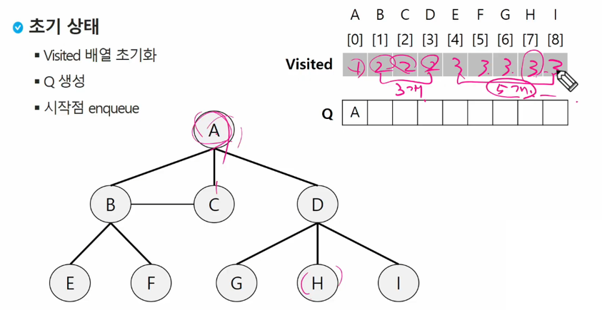

## 

# 큐 (Queue)

### 1. 선형큐

* **큐**
  * 큐 (Queue)의 특성
    * 스택과 마찬가지로 삽입과 삭제의 위치가 제한적인 자료구조
      * 큐의 뒤에서는 삽입만 하고, 큐의 앞에서는 삭제만 이루어지는 구조
    * 선입선출구조 (FIFO : First In First Out)
      * 큐에 삽입한 순서대로 원소가 저장되어, 가정 먼저 삽입 (First In)된 원소는 가장 먼저 삭제 (First Out) 됨.
      * 
* **큐의 구조 및 기본연산**
  * 큐의 선입선출 구조
    * 
  * 큐의 기본 연산 
    * 삽입 : enQueue
    * 삭제 : deQueue
  * ✨enQueue, deQueue를 보고 큐를 썼음을 알 수 있음.
  * append / pop(0)로도 가능은 하나 속도가 느림.

* **큐의 주요 연산**

  * 큐의 사용을 위해 필요한 주요 연산은 다음과 같음
    * 

* **큐의 연산 과정**

  * 
    * front : 삭제된 위치 / rear : 저장된 위치
    * front = rear = -1 : 한번도 삭제 / 저장된적 없음.
  * 
    * ✨front와 rear가 같은 곳을 가리킴 : 큐가 비어있음.

* **큐의 구현**

  * 선형큐
    * 1차원 배열을 이용한 큐
      * 큐의 크기 = 배열의 크기
      * front : 저장된 첫번째 원소의 인덱스
      * rear : 저장된 마지막 원소의 인덱스
  * 상태 표현
    * 초기 상태 : front = rear = -1
    * 공백 상태 : front == rear
    * 포화 상태 : rear == n-1 (n : 배열의 크기, n-1 : 배열의 마지막 인덱스)
  * 초기 공백 큐 생성
    * 크기 n인 1차원 배열 생성
    * front와 rear를 -1로 초기화
  * 삽입 : enQueue(item)
    * 마지막 원소 뒤에 새로운 원소를 삽입하기 위해
      1. rear 값을 하나 증가시켜 새로운 원소를 삽입할 자리를 마련
      2. 그 인덱스에 해당하는 배열원소 Q[rear]에 item을 저장
    * 
  * 삭제 : deQueue() 
    * 가장 앞에 있는 원소를 삭제하기 위해
      1. front 값을 하나 증가시켜 큐에 남아있게 될 첫번째 원소 이동.
      2. 새로운 첫번째 원소를 리턴함으로써 삭제와 동일한 기능을 함.
    * 

  * 공백상태 및 포화상태 검사 : isEmpty(), isFull()
    * 공백상태 : front == rear
    * 포화상태 : rear == n-1 (n : 배열의 크기, n-1 : 배열의 마지막 인덱스)
    * 
  * 검색 : Qpeek()
    * 가장 앞에 있는 원소를 검색하여 반환하는 연산
    * 현재 front의 한자리 뒤 (front+1)에 있는 원소, 즉 큐의 첫번째에 있는 원소를 반환
    * 

* **선형 큐 이용시의 문제점**

  * 잘못된 포화상태 인식

    * 선형 큐를 이용하여 원소의 삽입과 삭제를 계속하는 경우, 배열의 앞부분에 활용할 수 있는 공간이 있음에도 불구하고, rear = n-1 인 상태 즉, 포화상태로 인식하여 더 이상의 삽입을 수행하지 않게 됨.
    * 

  * 해결방법 1

    * 매 연산이 이루어질 때마다 저장된 원소들을 배열의 앞부분으로 모두 이동시킴.
    * 원소 이동에 많은 시간이 소요되어 큐의 효율성이 급격히 떨어짐.
    * 

  * 해결방법 2

    * 1차원 배열을 사용하되, 논리적으로는 배열의 처음과 끝이 연결되어 원형 형태의 큐를 이룬다고 가정하고 사용

    * 원형 큐의 논리적 구조

    * 

      

---

### 2. 원형큐

* **원형 큐의 구조**

  * 초기 공백 상태
    * front = rear = 0
  * Index의 순환
    * front와 rear의 위치가 배열의 마지막 인덱스인 n-1를 가리킨 후, 그 다음에는 논리적 순환을 이루어 배열의 처음 인덱스인 0으로 이동해야 함.
    * 이를 위해 나머지 연산자 mod를 사용함. (✨rear <- (rear+1)%Q size)
  * front 변수
    * 공백 상태와 포화 상태 구분을 쉽게 하기 위해 front가 있는 자리는 사용하지 않고 항상 빈자리로 둠.
  * 삽입 위치 및 삭제 위치
    * 

* **원형 큐의 연산 과정**

  * 

  * 

  * 

    *  front는 비워두고 나머지가 채워지면 가득찬 상태로 봄.

      

* **원형 큐의 구현**

  * 초기 공백 큐 생성
    * 크기 n인 1차원 배열 생성
    * front와 rear를 0으로 초기화
  * 공백상태 및 포화상태 검사 : isEmpty(), isFull()
    * 공백상태 : front = rear
    * 포화상태 : 삽입할 rear의 다음 위치 == 현재 front
      * (rear+1) mod n == front
    * 
  * 삽입 : enQueue(item)
    * 마지막 원소 뒤에 새로운 원소를 삽입하기 위해
      1. rear 값을 조정하여 새로운 원소를 삽입할 자리를 마련함 :  rear <- (rear+1) mod n
      2. 그 인덱스에 해당하는 배열원소 cQ[rear]에 item을 저장
         * 
  * 삭제 : deQueue(), delete()  : 덮어 쓸건지 / 앞에 것을 밀것인지
    * 가장 앞에 있는 원소를 삭제하기 위해
      1. front 값을 조정하여 삭제할 자리를 준비함.
      2. 새로운 front 원소를 리턴함으로써 삭제와 동일한 기능을 함.
    * 
    * 

* **원형 큐의 구현 예**

  * 
  * 
  * 

---

### 3. 우선순위 큐

* **우선순위 큐 (Priority Queue)**
  * 우선순위 큐의 특성
    * 우선순위를 가진 항목들을 저장하는 큐
    * FIFP 순서가 아니라 우선순위가 높은 순서대로 먼저 나가게 됨.
  * 우선순위 큐의 적용 분야
    * 시뮬레이션 시스템
    * 네트워크 트래픽 제어
    * 운영체제의 테스크 스케줄링
  * 우선순위 큐의 구현
    * 배열을 이용한 우선순위 큐
    * 리스트를 이용한 우선순위 큐
  * 우선순위 큐의 기본 연산
    * 삽입 : enQueue
    * 삭제 : deQueue
    * 
* **배열을 이용한 우선순위 큐**
  * 배열을 이용하여 우선순위 큐 구현
    * 배열을 이용하여 자료 저장.
    * 원소를 삽입하는 과정에서 우선순위를 비교하여 적절한 위치에 삽입하는 구조.
    * 가장 앞에 최고 우선순위의 원소가 위치하게 됨.
  * 문제점
    * 배열을 사용하므로, 삽입이나 삭제 연산이 일어날 때 원소의 재배치가 발생함.
    * 이에 소요되는 시간이나 메모리 낭비가 큼.

---

### 4. 큐의 활용 : 버퍼

* **큐의 활용 : 버퍼 (Buffer)**

  * 버퍼
    * 데이터를 한 곳에서 다른 한 곳으로 전송하는 동안 일시적으로 그 데이터를 보관하는 메모리의 영역
    * 버퍼링 : 버퍼를 활용하는 방식 또는 버퍼를 채우는 동작을 의미함.
  * 버퍼의 자료 구조
    * 버퍼는 일반적으로 입출력 및 네트워크와 관련된 기능에서 이용됨.
    * 순서대로 입력 / 출력 / 전달되어야 하므로 FIFO 방식의 자료구조인 큐가 활용됨.

* **키보드 버퍼**

  * 

    

---

### 5. BFS

 

* **BFS (Breadth First Search)**
  * 그래프를 탐색하는 방법에는 크게 두 가지가 있음.
    * 깊이 우선 탐색 (Depth First Search, DFS)
    * 너비 우선 탐색 (Breadth First Search, BFS)
  * 너비우선탐색은 탐색 시작점의 인접한 정점들을 먼저 모두 차례로 방문한 후에, 방문했던 정점을 시작점으로 하여 다시 인접한 정점들을 차례로 방문하는 방식
  * 인접한 정점들에 대해 탐색을 한 후, 차례로 다시 너비우선탐색을 진행해야 하므로, 선입 선출 형태의 자료구조인 ✨큐를 활용함.
  * 아래와 같은 순서로 탐색함.
    * 

 

* **BFS 알고리즘**
  * 입력 파라미터 : 그래프 G와 탐색 시작점 v
  * 

 

* **BFS 예제**
  
  * 
  
  * 
  
  * 
  
  * 
  
  * 
  
  * 
  
  * 
  
  * 
  
  * 
  
  * 
  
  * 
  
  * 
  
  * 중복이 얼마나 있는지 모르고, 중복이 발생하여 큐의 크기를 벗어날 때는?
  
    * 
  
      
  
    * append, pop(0)는 효율이 안 좋음(중복이 너무 많으면 악순환)
  
    *  BFS는 한 번만
  
    * 줄서는 순서로 들어오게 한다면?
  
    * 
  
    * 
  
    * 
  
    * 
  
    * 

 

---

 

### 6. 미로탐색

* DFS & BFS (방법선택 -> 탐색 -> 활용)
  * DFS일때도 최단거리 탐색은 가능하나 중복탐색이 될 수도 있음
  * BFS / DFS 목적에 맞는 탐색 필요
  * 상황만 주어질 때 필요한 탐색을 할 수 있는가?
  * 가공된 정보를 활용
  * 주변칸이고 벽이 아니면 인접
    * DFS는 모든 과정 다 가봄
    * BFS는 최단거리 하나로 가볼 수 있음

