## 

# 스택1 (Stack1)

### 1. 스택

* **스택**
  * 스택(stack)의 특성
    * 물건을 쌓아 올리듯 자료를 쌓아 올린 형태의 자료구조임
    * 스택에 저장된 자료는 선형 구조를 갖음
      * 선형 구조 : 자료 간의 관계가 1대1의 관계를 갖음.
      * 비선형 구조 : 자료 간의 관계가 1대N의 관계를 갖음(ex. 트리).
    * 스택에 자료를 삽입하거나 스택에서 자료를 꺼낼 수 있음
    * 마지막에 삽입한 자료를 가장 먼저 꺼냄. 후입선출(LIFO, Last-In-First-Out)이라고 부름(선입 후출 - FILO)
      * ex. 스택에 1, 2, 3 순으로 자료를 삽입한 후 꺼내면 역순으로 즉 3, 2, 1 순으로 꺼낼수 있음

* **스택의 구현**

  * 스택을 프로그램에서 구현하기 위해서 필요한 자료구조와 연산
    * 자료구조 : 자료를 선형으로 저장할 저장소
      * 배열을 사용할 수 있음
      * 저장소 자체를 스택이라 부르기도 함
      * 스택에서 마지막 삽입된 원소의 위치를 top이라 부름

  * 연산(✨push, pop을 보고 stack을 알아 차릴 수 있음)
    * 삽입 : 저장소에 자료를 저장함. 보통 push라고 부름
    * 삭제 : 저장소에서 자료를 꺼냄. 꺼낸 자료는 삽입한 자료의 역순으로 꺼냄. 보통 pop이라고 부름
    * 스택이 공백인지 아닌지를 확인하는 연산 : isEmpty
    * 스택의 top에 있는 item(원소)을 반환하는 연산 : peek
    * ✨top은 변수이고, pop과 push는 메서드임

  * 스택의 삽입/삭제 과정
    * 빈 스택에 원소 A, B, C를 차례로 삽입 후 한번 삭제하는 연산과정
    * ✨pop-push 했을때 top을 삭제할 필요는 없음. 어차피 push를 하면 덮어 씌워짐
    * 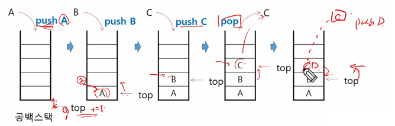
    * append, pop과 동일하지만 append, pop은 파이썬에서 느린 동작임

  * 스택의 push 알고리즘 (over flow - 스택의 크기를 너무 작게 했거나 과도한 push)
    * append 메소드를 통해 리스트의 마지막에 데이터를 삽입
    * 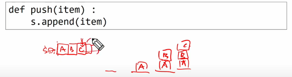
    * 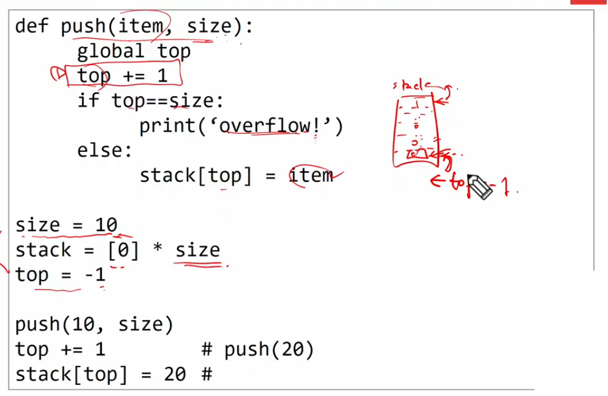

  * 스택의 pop 알고리즘
    * 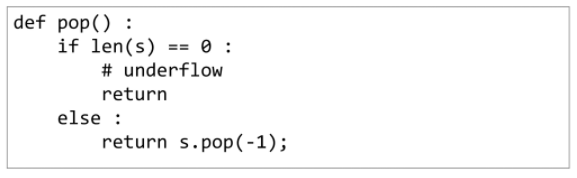
    * 

* **스택 구현 고려 사항**

  * 1차원 배열을 사용하여 구현할 경우 구현이 용이하다는 장점이 있지만 스택의 크기를 변경하기가 어렵다는 단점이 있음.
  * 이를 해결하기 위한 방법으로 저장소를 동적으로 할당하여 스택을 구현하는 방법이 있음. 동적 연결리스트를 이용하여 구현하는 방법을 의미함. 구현이 복잡하다는 단점이 있지만 메모리를 효율적으로 사용한다는 장점을 가짐. 

* **스택의 응용**

  * 괄호검사

  * Funtion call

    

---

### 2. 재귀호출(✨점화식을 작성하고 코드 작성하면 더 수월함)

* **재귀호출**(✨메모리 상에서 받는 값이 어떻게 변하는가?)
  * 자기 자신을 호출하여 순환 수행되는 것
  * 함수에서 실행해야 하는 작업의 특성에 따라 일반적인 호출방식보다 재귀호출방식을 사용하여 함수를 만들면 프로그램의 크기를 줄이고 간단하게 작성
    * 재귀 호출의 ex. factorial
      * n에 대한 factorial : 1부터 n까지의 모든 자연수를 곱하여 구하는 연산
      * 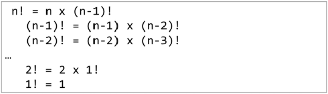
      * 마지막에 구한 하위 값을 이용하여 상위 값을 구하는 작업을 반복
  * factorial 함수에서 n=4인 경우의 실행
    * 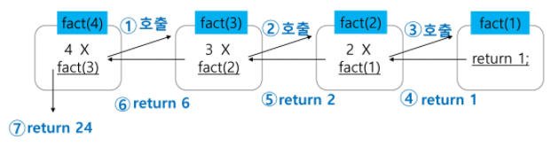
  * 0과 1로 시작하고 이전의 두 수 합을 다음 항으로 하는 수열을 피보나치라고 함.
    * 0, 1, 1, 2, 3, 5, 8, 13, ...
  * 피보나치 수열의 i번째 값을 계산하는 함수 F를 정의하면 다음과 같음.
    * 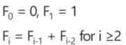
  * 위의 정의로부터 피보나치 수열의 i번째 항을 반환하는 함수를 재귀함수로 구현할 수 있음.

* **피보나치 수를 구하는 재귀함수**
  * 

---

### 3. Memoization & DP

* **Memoization**
  * 피보나치 수를 구하는 함수를 재귀함수로 구현하는 알고리즘은 문제점이 있음.
  * '엄청난 중복 호출이 존재한다'는 것임.
  * **피보나치 수열의 Call Tree**
    * 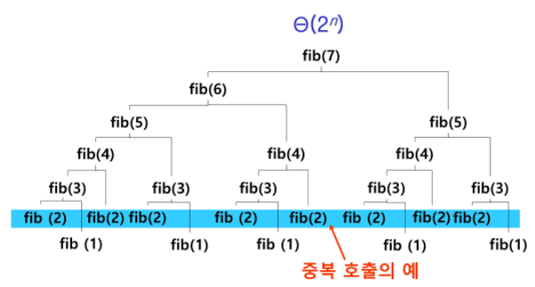
  * 메모이제이션(memoization)은 컴퓨터 프로그램을 실행할 때 이전에 계산한 값을 메모리에 저장해서 매번 다시 계산하지 않도록 하여 전체적인 실행속도를 빠르게 하는 기술임. 동적 계획법의 핵심이 되는 기술임.
  * 'memoization'은 글자 그대로 해석하면 '메모리에 넣기(to put in memory)'라는 의미이며 '기억되어야 할 것'이라는 뜻의 라틴어 memorandum에서 파생되었음. 흔히 ' 기억하기', ' 암기하기'라는 뜻의 memorization과 혼동하지만, 정확한 단어는 memoization임. 동사형은 memoize임.
  * 피보나치 수를 구하는 알고리즘에서 fibo(n)의 값을 계산하자마자 저장하면(memoize), 실행시간을 ⊖(n)으로 줄일 수 있음.
  * Memoization 방법을 적용한 알고리즘
    * 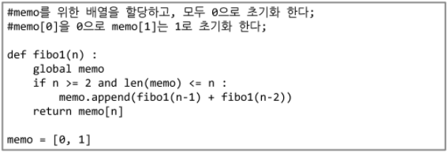
    * memo : 실행된 결과를 저장할 list
    * global : global 변수를 사용해야 될 때
    * fibo(3)부터 fibo(2) + fibo(1)을 호출하지 않고, 메모에 저장된 값을 불러옴.

* **DP (Dynamic Programming)**

  * 동적 계획 (Dynamic Programming) 알고리즘은 그리디 알고리즘과 같이 **💥최적화 문제**를 해결하는 알고리즘임.
  * 동적 계획 알고리즘은 먼저 입력 크기가 작은 부분 문제들을 모두 해결한 후에 그 해들을 이용하여 보다 큰 크기의 부분 문제들을 해결하여, 최종적으로 원래 주어진 입력의 문제를 해결하는 알고리즘임.
  * 피보나치 수 DP 적용
    * 피보나치 수는 부분 문제의 답으로부터 본 문제의 답을 얻을 수 있으므로 최적 부분 구조로 이루어져 있음.

  1. 문제를 부분 문제로 분할함.
     *  Fibonacci(n) 함수는 Fibonacci(n-1)과 Fibonacci(n-2)의 합
     * Fibonacci(n-1)은 Fibonacci(n-2)와 Fibonacci(n-3)의 합
     * Fibonacci(2)는 Fibonacci(1)과 Fibonacci(0)의 합
     * Fibonacci(n)은 Fibonacci(n-1), Fibonacci(n-2), ... Fibonacci(2), Fibonacci(1), Fibonacci(0)의 부분집합으로 나뉨.
  2.  부분 문제로 나누는 일을 끝내면 가장 작은 부분 문제부터 해를 구함.
  3. 그 결과는 테이블에 저장하고, 테이블에 저장된 부분 문제의 해를 이용하여 상위 문제의 해를 구함.
     * 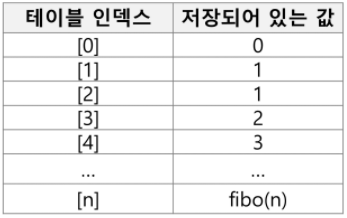

  * 피보나치 수 DP 적용 알고리즘
    * 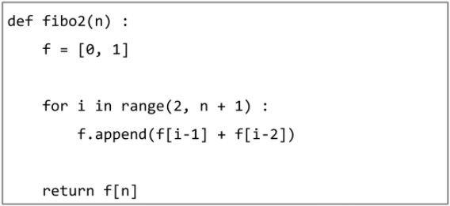
  * DP의 구현 방식
    * recursive 방식 : fib1()
    * iterative 방식 : fib2()
    * memoization을 재귀적 구조에 사용하는 것보다 반복적 구조로 DP를 구현한 것이 성능 면에서 보다 효율적임.
    * 재귀적 구조는 내부에 시스템 호출 스택을 사용하는 오버헤드가 발생하기 때문임.

* **💥Memoization vs DP**
  * memoization : 함수의 실행 결과를 저장해서 저장된 결과를 사용하는 것
  * DP : 이전값을 이용하여 다음 값을 계산

---

### 4. DFS

* **DFS (깊이 우선 탐색)**
  * 비선형 구조인 그래프 구조는 그래프로 표현된 모든 자료를 빠짐없이 검색하는 것이 중요함.
  * 두 가지 방법
    * 깊이 우선 탐색 (Depth First Search, DFS)
    * 너비 우선 탐색 (Breadth First Search, BFS)
  * 
