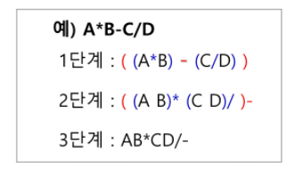
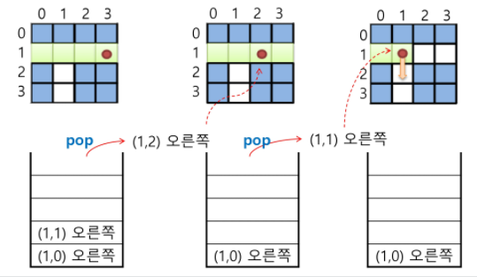
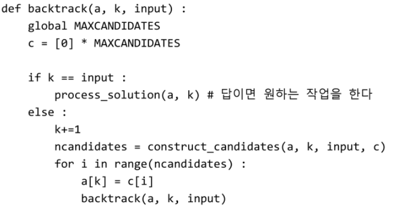
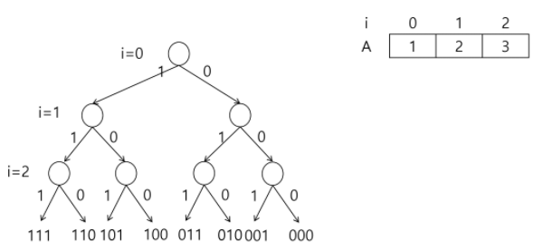

## 

# 스택2 (Stack2)

### 1. 계산기

* 계산기
  * 문자열로 된 계산식이 주어질 때, 스택을 이용하여 이 계산식의 값을 계산할 수 있음
  * 문자열 수식 계산의 일반적 방법
    * step1. 중위 표기법의 수식을 후위 표기법으로 변경함(스택 이용)
    * step2. 후위 표기법의 수식을 스택을 이용하여 계산함
  * 중위 표기법 (infix notation)
    * 연산자를 피연산자의 가운데 표기하는 방법
      * ex. A + B
  * 후위 표기법 (postfix notation)
    * 연산자를 피연산자 뒤에 표기하는 방법
      * ex. AB+

* **Step1. 중위 표기식의 후위표기식 변환 방법1**
  * 수식의 각 연산자에 대해서 우선순위에 따라 괄호를 사용하여 다시 표현함.
  * 각 연산자를 그에 대응하는 오른쪽 괄호의 뒤도 이동시킴.
  * 괄호를 제거.
  * 

* **Step1. 중위 표기법에서 후위 표기법으로의 변환 알고리즘(스택이용)2**

  1. 입력 받은 중위 표기식에서 토큰을 읽음.
  2. 토큰이 피연산자이면 토큰을 출력함.
  3. 토큰이 연산자(괄호포함)일 때, 이 토큰이 스택의 top에 저장되어 있는 연산자보다 우선순위가 높으면 스택에 push하고, 그렇지 않다면 스택 top의 연산자의 우선 순위가 토큰의 우선 순위보다 작을 때까지 스택에서 pop 한 후 토큰의 연산자를 push함. 만약 top에  연산자가 없으면 push함.
  4. 토큰이 오른쪽 괄호 ')'이면 스택 top에 왼쪽 괄호 '('가 올 때 까지 스택에 pop 연산을 수행하고  pop 한 연산자를 출력함. 왼쪽 괄호를 만나면 pop만 하고 출력하지는 않음.
  5. 중위 표기식에 더 읽을 것이 없다면 중지하고, 더 읽을 것이 있다면 1부터 다시 반복함.
  6. 스택에 남아 있는 연산자를 모두 pop하여 출력함.
     * 스택 밖의 왼쪽 괄호는 우선 순위가 가장 높으며, 스택 안의 왼쪽 괄호는 우선 순위가 가장 낮음.

* **중위 표기법에서 후위 표기법으로의 변환**

  * 
  * 
    * icp : 밖에서의 우선 순위 / isp : stack에서의 우선 순위

  * 
  * 
  * 
  * 
  * 
  * 
  * 
  * 
  * 
  * 
  * 
  * 
  * 

* **step2. 후위 표기법의 수식을 스택을 이용하여 계산**

  1. 피연산자를 만나면 스택에 push 함.
  2. 연산자를 만나면 필요한 만큼의 피연산자를 스택에서 pop하여 연산하고, 연산결과를 다시 스택에 push 함.
  3. 수식이 끝나면, 마지막으로 스택을 pop하여 출력함.

  - 

  - 

  - 

  - 

  - 

  - 

  - 

  - 

    

---

### 2. 백트래킹

* **백트래킹** (💥종료조건 if문 추가해서 검색의 횟수를 줄여주기)

  * 백트래킹 (Backtracking) 기법은 해를 찾는 도중에 '막히면' (즉, 해가 아니면) 되돌아가서 다시 해를 찾아 가는 기법임.
  * ✨백트래킹 기법은 최적화 (optimization) 문제와 결정 (decision) 문제를 해결할 수 있음.
    * 주어진 조건에서 일부를 골라내는 작업
    * 특정 조건을 이용해 예측해서 중단
  * 결정 문제 : 문제의 조건을 만족하는 해가 존재하는지의 여부를 'yes' 또는 'no'가 답하는 문제
    * 미로 찾기
    * n-Queen 문제
    * Map coloring
    * 부분 집합의 합 (Subset Sum) 문제 등

* **백트래킹 : 미로 찾기**

  * 미로 찾기
    * 아래 그림과 같이 입구와 출구가 주어진 미로에서 입구부터 출구까지의 경로를 찾는 문제임.
    * 이동할 수 있는 방향은 4방향으로 제한함.
    * 
  * 미로 찾기 알고리즘
    * 
    * 스택을 이용하여 지나온 경로를 역으로 되돌아 감.
    * 
    * 스택을 이용하여 다시 경로를 찾음.
    * 

* **백트래킹**

  * 백트래킹과 깊이우선탐색과의 차이 (✨깊이우선 -- (적당한 가지치기)--> 백트래킹)
    * 어떤 노드에서 출발하는 경로가 해결책으로 이어질 것 같지 않으면 더 이상 그 경로를 따라가지 않음으로써 시도의 횟수를 줄임 (Prunning 가지치기).
    * 깊이우선탐색이 모든 경로를 추적하는데 비해 백트래킹은 불필요한 경로를 조기에 차단.
    * 깊이우선탐색을 가하기에는 경우의 수가 너무나 많음. 즉, N! 가지의 경우의 수를 가진 문제에 대해 깊이우선탐색을 가하면 당연히 처리 불가능한 문제.
    * 백트래킹 알고리즘을 적용하면 일반적으로 경우의 수가 줄어들지만 이 역시 최악의 경우에는 여전히 지수함수 시간 (Exponential Time)을 요하므로 처리 불가능.
  * 모든 후보를 검사?
    * No!
  * 백트래킹 기법
    * 어떤 노드의 유망성을 점검한 후에 유망 (promising)하지 않다고 결정되면 그 노드의 부모로 되돌아가 (backtracking) 다음 자식 노드로 감.
    * 어떤 노드를 방문하였을 때  그 노드를 포함한 경로가 해답이 될 수 없으면 그 노드는 유망하지 않다고 하며, 반대로 해답의 가능성이 있으면 유망하다고 함.
    * 가지치기 (pruning) : 유망하지 않는 노드가 포함되는 경로는 더 이상 고려하지 않음.
  * 백트래킹을 이용한 알고리즘은 다음과 같은 절차로 진행됨.
    1.  상태 공간 트리의 깊이 우선 검색을 실시함.
    2. 각 노드가 유망한지를 점검함.
    3. 만일 그 노드가 유망하지 않으면, 그 노드의 부모 노드로 돌아가서 검색을 계속함.
  * 일반 백트래킹 알고리즘
    * 
    * 

  * 상대 공간 트리

    * 

  * 깊이 우선 검색 vs 백트래킹

    * 순수한 깊이 우선 검색 = 155 노드

    * 백트래킹 = 27 노드

      

---

### 3. [참고] 부분집합, 순열

* **부분집합 구하기**
  * 어떤 집합의 공집합과 자기자신을 포함한 모든 부분집합을 powerset이라고 하며 구하고자 하는 어떤 집합의 원소 개수가 n일 경우 부분집합의 개수는 2^n개 임.
  * 백트래킹 기법으로 powerset을 구해봄
    * 앞에서 설명한 일반적인 백트래킹 접근 방법을 이용함.
    * n개의 원소가 들어있는 집합의 2^n개의 부분집합을 만들 때는, true 또는 false값을 가지는 항목들로 구성된 n개의 배열을 만드는 방법을 이용.
    * 여기서 배열의 i번째 항목은 i번째의 원소가 부분집합의 값인지 아닌지를 나타내는 값 임.
  * 각 원소가 부분집합에 포하모디었는지를 loop 이용하여 확인하고 부분집합을 생성하는 방법 (✨비트의 갯수만큼 for문 - 유연하지 않음)
    * 
  * {1, 2, 3}의 부분집합 표현
    * 
    * 
  * powerset을 구하는 백트래킹 알고리즘
    * 
    * 
* **순열 구하기**
  * {1, 2, 3}을 포함하는 모든 순열을 생성하는 함수
    * 동일한 숫자가 포함되지 않았을 때, 각 자리 수 별로 loop을 이용해 아래와 같이 구현할 수 있음.
    * 
  * 백트래킹을 이용하여 순열 구하기
    * 접근 방법은 앞의 부분집합을 구하는 방법과 유사함.
    * 
    * 
    * 
* **부분 집합의 합** (💥손으로 그려보기, 유라에서 코드 다시보기)
  * 집합 {1, 2, 3}의 원소에 대해 각 부분집합에서의 포함 여부를 트리로 표현
    * 
  * i원소의 포함 여부를 결정 하면 i까지의 부분 집합의 합 Si를 결정할 수 있음.
  * Si-1이 찾고자 하는 부분집합의 합보다 크면 남은 원소를 고려할 필요가 없음.
    * 
  * A[i] 원소를 부분 집합의 원소로 고려하는 재귀 함수 (A는 서로 다른 자연수의 집합) / subset1 : 모든 것, subset2 : 비트 열었다 닫았다, 분기 만들기
    * 
  * 추가 고려 사항
    * 
* **순열**(💥손으로 그려보기, 유라에서 코드 다시보기)
  * A[1, 2, 3]의 모든 원소를 사용한 순열
    * 123, 132, 213, 231, 312, 321
    * 총 6가지 경우
      * 
  * 
  * 
  * 순열 생성 과정 그려보기

---

### 4. 분할 정복

* **분할 정복 알고리즘**
  * 유래
    * 1805년 12월 2일 아우스터리츠 전투에서 나폴레옹이 사용한 전략.
    * 전력이 우세한 연합군을 공격하기 위해 나폴레옹은 연합군의 중앙부로 쳐들어가 연합군을 둘로 나눔.
    * 둘로 나누니 연합군을 한 부분씩 격파함.
  * 설계 전략
    * 분할 (Divide) :  해결할 문제를 여러 개의 작은 부분으로 나눔.
    * 정복 (Conquer) : 나눈 작은 문제를 각각 해결함.
    * 통합 (Combine) : (필요하다면) 해결된 해답을 모음.
  * 거듭 제곱 (Exponentiation)
    * O(n)
      * 
  * 분할 정복 기반의 알고리즘 : O(log2n)
    * 
    * 
  
* **퀵 정렬** 
  
  * 주어진 배열을 두 개로 분할하고, 각각을 정렬함.
    * 합병정렬과 동일?
  
  * 다른점 1 : 합병정렬은 그냥 두 부분으로 나누는 반면에, 퀵 정렬은 분할할 때, 기준 아이템 (pivot item) 중심으로, 이보다 작은 것은 왼편, 큰 것은 오른편에 위치시킴.
  
  * 다른점 2 : 각 부분 정렬이 끝난 후, 합병 정렬은 "합병"이란 후처리 작업이 필요하나, 퀵 정렬은 필요로 하지 않음.
  
  * 알고리즘 (partition부분이 핵심!!!)
    * 
    * 
  
  * 퀵 정렬 수행 과정
    * ex. {69, 10, 30, 2, 16, 8, 31, 22}
  
    * 원소의 개수가 8개이므로 네 번째 자리에 있는 원소 2를 첫번째 피봇으로 선택하고 퀵 정렬 시작
      * 
  
      1.  원소 2를 피봇으로 선택하고 퀵정렬 시작
         * 
         * L이 오른쪽으로 이동하면서 피봇보다 크거나 같은 원소를 찾고, R은 왼쪽으로 이동하면서 피봇보다 작은 원소를 찾음.
         * L은 원소 69를 찾았지만, R은 피봇보다 작은 원소를 찾지 못한 채로 원소 69에서 L과 만나게 됨.
         * ✨L과 R이 만났으므로, 원소 69를 피봇과 교환하여 피봇 원소 2의 위치를 확정함.
         * 
      2. 피봇 2의 왼쪽 부분 집합은 공집합이므로 퀵 정렬을 수행하지 않고, 오른쪽 부분집합에 대해서 퀵 정렬 수행.
         * 오른쪽 부분 집합의 원소가 7개 이므로 가운데 있는 원소 16을 피봇으로 선택.
         * 
         * L이 찾은 30과 R이 찾은 8을 서로 교환함.
         * 
         * 현재 위치에서 L과 R의 작업을 반복함.
         * L은 원소 69를 찾았지만, R은 피봇보다 작은 원소를 찾지 못한 채로 원소 69에서 L과 만나게 됨.
         * ✨L과 R이 만났으므로, 원소 69를 피봇과 교환하여 피봇 원소 16의 위치를 확정함.
         * 
      3. 피봇 16의 왼쪽 부분집합 에서 원소 10을 피봇으로 선택하여 퀵 정렬 수행.
         * 
         * L의 원소 10과 R의 원소 8을 교환하는데, L의 원소가 피봇이므로 피봇원소에 대한 자리교환이 발생한 것이므로 교환한 자리를 피봇 원소 10의 위치로 확정함.
         * 
      4. 피봇 10의 확정된 위치에서의 왼쪽 부분집합은 원소가 한 개이므로 퀵 정렬을 수행하지 않고, 오른쪽 부분 집합은 공집합이므로 역시 퀵 정렬을 수행하지 않음.
         * 이제 1단계의 피봇이었던 원소 16에 대한 오른쪽 부분집합에 대해 퀵 정렬을 수행함.
         * 오른쪽 부분집합의 원소가 4개이므로 두번째 원소 30을 피봇으로 선택함.
         * 
         * L이 찾은 69와 R이 찾은 22를 서로 교환함.
         * 
         * 현재 위치에서 L과 R의 작업을 반복함. L은 오른쪽으로 이동하면서 피봇 보다 크거나 같은 원소인 30을 찾고, R은 왼쪽으로 이동하면서 피봇보다 작은 원소를 찾다가 못 찾고 원소 30에서 L과 만남.
         * ✨L과 R이 만났으므로 피봇과 교환함. 이 경우는 R의 원소가 피봇이므로 피봇에 대한 자리교환이 발생한 것이므로 교환한 자리를 피봇의 자리로 확정함.
         * 
      5. 피봇 30의 확정된 위치에서의 왼쪽 부분집합의 원소가 한 개이므로 퀵 정렬을 수행하지 않고, 오른쪽 부분집합에 대해서 퀵 정렬 수행.
         * 오른쪽 부분 집합의 원소 2개 중에서 원소 31을 피봇으로 선택함.
         * 
         * L은 오른쪽으로 이동하면서 원소 31을 찾고, R은 왼쪽으로 이동하면서 피봇보다 작은 원소를 찾다가 못 찾은 채로 원소 31에서 L과 만남. L과 R이 만났으므로 피봇과 교환하는데 R의 원소가 피봇이므로 결국 제자리가 확정됨.
         * 
      6. 피봇 31의 오른쪽 부분집합의 원소가 한 개이므로 퀵 정렬을 수행하지 않음. 이것으로써 전체 퀵 정렬이 모두 완성됨.
         * 
  
  * 퀵 정렬의 최악의 시간 복잡도는 O(n^2)로 합병 정렬에 비해 좋지 못함.
  
  * 그런데 왜 "빠른" 정렬인가?
  
  * 이는 퀵 정렬의 평균 복잡도는 nlogn 이기 때문임.

* **정렬 알고리즘 비교**

  * 

    
