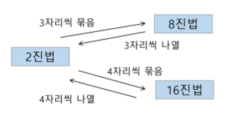
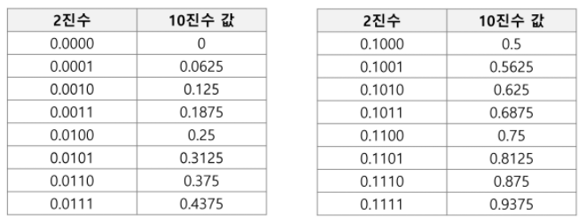

## 

 

# Start

 

* **학습 목표**
  * SW 문제 해결 역량이란 무엇인가를 이해하고 역량을 강화하는 방법을 이해함
  * 효율적인 알고리즘의 필요성을 이해하고 알고리즘의 성능 측정 방법 중 하나인 시간 복잡도에 대해 이해함
  * 프로그램을 작성하기 위한 기본 중 표준 입출력 방법에 대해 이해함
  * 비트 수준의 연산과 알고리즘에 대해 이해함
  * 컴퓨터에서의 실수 표현 방법에 대해 이해함

 

---

 

### 1.  SW 문제 해결

 

* **코딩 교육 이슈**
* **프로그래밍 ... "잘하는 사람과 못하는 사람의 생산성 차이가 스무 배"...[Thinking in java]의 저자 브루스 에켈**

 

* **프로그래밍을 하기 위한 제약 조건과 요구사항**
  * 프로그래밍 언어의 특성
  * 프로그램이 동작할 HW와 OS에 관한 지식
  * 라이브러리들의 유의 사항들
  * 프로그램이 사용할 수 있는 최대 메모리
  * 사용자 대응 시간 제한
  * 재사용성이 높은 간결한 코드

 

* **SW 문제 해결 역량이란 무엇인가?**
  * 프로그램을 하기 위한 많은 제약 조건과 요구사항을 이해하고 최선의 방법을 찾아내는 능력
  * 프로그래머가 사용하는 언어나 라이브러리, 자료구조, 알고리즘에 대한 지식을 적재적소에 퍼즐을 배치하듯 이들을 연결하여 큰 그림을 만드는 능력이라 할 수 있음
  * 문제 해결 역량은 추상적인 기술임
    * 프로그래밍 언어, 알고리즘처럼 명확히 정의된 실체가 없음
    * 무작정 알고리즘을 암기하고 문제를 풀어본다고 향상되지 않음
  * 문제 해결 역량을 향상시키기 위해서 훈련이 필요함

 

* **문제 해결 능력을 훈련하기 위해서는**
  * 일부 새로운 언어, 프레임워크 개발 방법론만을 배워나가는 것만으로 충분하지 않음. 이들을 조합해 나가는 방법을 배워야 하지만 쉽지 않음
  * 경험을 통해서 나아지리라 막연히 짐작만 함. 그러나 경험에서는 문제 해결 능력을 개발 할 수 있는 상황이 항상 주어지는 것이 아니며 또한 그런 상황에서 자기 개발을 하기는 쉽지 않음
  * 상황을 인위적으로 만들어 훈련해야 함. 즉 잘 정제된 추상적인 문제를 제시하고 이를 해결해 가면서 문제 해결 능력을 향상 시킬 수 잇는 훈련이 필요함

 

* **문제 해결 과정**
  1. 문제를 읽고 이해함
  2. 문제를 익숙한 용어로 재정의함
  3. 어떻게 해결할지 계획을 세움
  4. 계획을 검증함
  5. 프로그램으로 구현함
  6. 어떻게 풀었는지 돌아보고, 개선할 방법이 있는지 찾아봄

 

* **문제 해결 전략**
  * 직관과 체계적인 접근
* **체계적인 접근을 위한 질문들**
  * 비슷한 문제를 풀어본 적이 있던가?
  * 단순한 방법에서 시작할 수 있을까?
  * 문제를 단순화 할 수 있을까?
  * 그림으로 그려 볼  수 있을까?
  * 수식으로 표현 할 수 있을까?
  * 문제를 분해 할 수 있을까?
  * 뒤에서부터 생각해서 문제를 풀 수 있을까?
  * 특정 형태의 답만을 고려할 수 있을까?

 

---

 

### 2. 복잡도 분석

 

* **알고리즘?**
  * (명) 알고리즘 : 유한한 단계를 통해 문제를 해결하기 위한 절차나 방법임. 주로 컴퓨터용어로 쓰이며, 컴퓨터가 어떤 일을 수행하기 위한 단계적 방법을 말함
  * 간단하게 다시 말하면, 어떠한 문제를 해결하기 위한 절차라고 볼 수 있음
  * 예를 들어 1부터 100까지의 합을 구하는 문제를 보자
    * 

 

* **알고리즘의 효율**
  * 공간적 효율성과 시간적 효율성
    * 공간적 효율성은 연산량 대비 얼마나 적은 메모리 공간을 요하는 가를 말함
    * 시간적 효율성은 연산량 대비 얼마나 적은 시간을 요하는 가를 말함
    * 효율성을 뒤집어 표현하면 복잡도(Complexity)가 됨. 복잡도가 높을수록 효율성은 저하됨
  * ex. ARM, 386EX : 부동소수점 프로세스(FPU)가 빠져있음
  * 시간적 복잡도 분석
    * 하드웨어 환경에 따라 처리시간이 달라짐
      * 부동소수 처리 프로세서 존재유무, 나눗셈 가족시능 유무
      * 입출력 장비의 성능, 공유여부
    * 소프트웨어 환경에 따라 처리시간이 달라짐
      * 프로그램 언어의 종류
      * 운영체제, 컴파일러의 종류
    * 이러한 환경적 차이로 인해 분석이 어려움

 

* **복잡도의 점근적 표기**
  * 시간 (또는 공간)복잡도는 입력 크기에 대한 함수로 표기하는데, 이 함수는 주로 여러 개의 항을 가지는 다항식임
  * 이를 단순한 함수로 표현하기 위해 점근적 표기 (Asymptotic Notation)를 사용함
  * 입력 크기 n이 무한대로 커질 때의 복잡도를 간단히 표현하기 위해 사용하는 표기법임
    * O(Big-Oh)-표기
    * Ω(Big-Omega)-표기
    * Θ(Big-Theta)-표기

 

* **O(Big-Oh)-표기**
  * O-표기는 복잡도의 **✨점근적 상한**을 나타냄
  * 복잡도가 f(n) = 2n^2-7n+4 이라면, f(n)의 O-표기는 O(n^2)임
  * 먼저 f(n)의 단순화도니 표현은 n^2임
  * 단순화된 함수 n^2에 임의의 상수 c를 곱한 cn^2이 n이 증가함에 따라 f(n)의 상한이 됨 (단, c>0)
  * 
  * n이 증가함에따라 O(g(n))이 점근적 상한이라는 것(즉, g(n)이 n0보다 큰 모든 n에 대해서 항상 f(n)보다 크다는 것)을 보여줌 - 최악의 경우
  * 

 

* **Ω(Big-Omega)-표기**
  * 복잡도의 **✨점근적 하한**한을 의미함
  * f(n) = 2n^2-7n+4의 Ω(n^2)임
  * f(n) = Ω(n^2)은 "n이 증가함에 따라 2n^2-7n+4이 cn^2보다 작을 수 없음"라는 의미임. 이때 상수 c=1로 놓으면 됨
  * O-표기 때와 마찬가지로, Ω-표기도 복잡도 다항식의 최고차항의 계수 없이 취하면 됨
  * **💥"최소한 이만한 시간은 걸린다"** (그래봤자 이만큼은 걸린다)
  * n이 증가함에따라 Ω(g(n))이 점근적 하한이라는 것(즉, g(n)이 n0보다 큰 모든 n에 대해서 항상 f(n)보다 작다는 것)을 보여줌
  * 

 

* **Θ(Big-Theta)-표기**
  * O-표기와 Ω-표기가 같은 경우에 사용함
  * f(n) = 2n^2+8n+3 = O(n^2) = Ω(n^2)이므로, f(n) = Θ(n^2)임
  * "f(n)은 n이 증가함에 따라 **💥n^2과 동일한 증가율을 가진다**"라는 의미임 (항상 이만큼의 증가을을 가진다)
  * 

 

* **자주 사용하는 O-표기**
  * O(1)			 상수 시간(Constang time)
  * O(logn)       로그(대수) 시간(Logarithmic time)    : 반 씩 나누는 경우
  * O(n)             선형 시간(Linear time)                        : 입력이 늘어나는 만큼 연산이 늘어남
  * O(nlogn)     로그 선형 시간(Log-linear time)        
  * O(n^2)        제곱 시간(Quadratic time)
  * O(n^3)        세제곱 시간(Cubic time)
  * O(2^n)        지수 시간(Exponential time)               : 잘못짜면 연산이 오래걸림 / 입력이 작은 경우가 많음(복잡한 문제)

 

* **왜 효율적인 알고리즘이 필요한가**
  * 10억 개의 숫자를 정렬하는데 PC에서 O(n^2) 알고리즘은 300여 년이 걸리는 반면에 O(nlogn) 알고리즘은 5분 만에 정렬함
    * 
  * 효율적인 알고리즘은 슈퍼컴퓨터보다 더 큰 가치가 있음
  * 값 비싼 H/W의 기술 개발보다 효율적인 알고리즘 개발이 훨씬 더 경제적임

 

---

 

### 3. 표준 입출력 방법

 

* **Python3 표준입출력**
  * 입력
    * Raw 값의 입력 : input()
      * 받은 입력값을 문자열로 취급
    * Evaluated된 값 입력 : eval(input()) - 외부에서도 입력 가능 / 공격에 취약 / 쓰지 말자
      * 받은 입력값을 평가된 데이터 형으로 취급
    * 출력
      * print()
        * 표준 출력 함수, 출력값의 마지막에 개행 문자 포함
      * print('text', end='')
        * 출력시 마지막에 개행문자 제외할 시
      * print('%d' % number)
        * Formatting 된 출력

 

* **문제 제시 : 다음 내용을 표준 입력으로 읽어 들려 변수에 저장 후 출력하시오**
  * 
  * 어떤 작업을 할지에 다른 저장방식의 변화

 

* **파일의 내용을 표준 입력으로 읽어오는 방법**
  * import sys
  * sys.stdin = open("a.txt", "r")
    * 
    * ✨cyclic buffer : 용량이 넘치면 덮어 씌움

 

* **Python3 소스 코드**
  * 

 

---

 

### 4. 비트연산

 

* **비트 연산자**
  * 
  * 비트 검사 / 비트 클리어 / 비트 셋 / 특정 비트가 같은지 검사 / 비트 토글
  * bit : 정보를 저장하는 최소 단위
  * bite : 메모리에서 위치를 구분하는 단위
  * 
  * 클리어 : 특정 비트를 0으로 만드는 작업

 

* **1 << n**
  * 2^n의 값을 가짐
  * 원소가 n개일 경우의 모든 부분집합의 수를 의미함
  * Power set(모든 부분 집합)
    * 공집합과 자기 자신을 포함한 모든 부분집합
    * 각 원소가 포함되거나 포함되지 않는 2가지 경우의 수를 계산하면 모든 부분집합의 수가 계산됨
  * ✨다른 언어에서는 2**n 식의 표기가 안되서 1<<n 비트로 표현함
* **i & (1 << j)**
  * 계산 결과는 i의 j번재 비트가 1인지 아닌지를 의미함

 

* **비트 연산 예제 1**
  * 

 

* **비트 연산 예제  2**
  * 

 

* **엔디안(Endianness)**
  * 컴퓨터의 메모리와 같은 1차원의 공간에 여러 개의 연속된 대상을 배열하는 방법을 의미하며 HW 아키텍처마다 다름
  * 주의 : 속도 향상을 위해 바이트 단위와 워드 단위를 변환하여 연산 할 때 올바로 이해하지 않으면 오류를 발생 시킬 수 있음
  * 엔디안은 크게 두 가지로 나뉨
    * 빅 엔디안(Big-endian)
      * 보통 큰 단위가 앞에 나옴. 네트워크
    * 리틀 엔디안(Little-endian)
      *  작은 단위가 앞에 나옴. 대다수 데스크탑 컴퓨터
      * 
* **엔디안 확인 코드**
  * 

 

* **비트 연산 예제 3**
  * 

 

* **비트 연산 예제 4**
  * 

 

* **비트 연산 예제 5**
  * 비트 연산자 ^를 두 번 연산하면 처음 값을 반환함
  * 
  * 간단한 암호화

 

---

 

### 5. 진수

 

* **2진수, 8진수, 10진수, 16진수**
* **10진수 → 타 진수로 변환**
  * 원하는 타진수의 수를 나눈 뒤 나머지를 거꾸로 읽음
  * 
  * 
* **타 진수 → 10진수로 변환**
  * 
* **2진수, 8진수, 16진수간 변환**
  * 

 

* **컴퓨터에서의 음의 정수 표현 방법**
  * 1의 보수 : 부호와 절대값으로 표현된 값을 부호 비트를 제외한 나머지 비트들을 0은 1로, 1은 0로 변환함
    * 6 : 1 0 0 0 0 0 0 0 0 0 0 0 0 1 1 0 : 부호와 절대값 표현
    * 6 : 1 1 1 1 1 1 1 1 1 1 1 1 1 0 0 1 : 1의 보수 표현
  * 2의 보수 : 1의 보수방법으로 표현된 값의 최하위 비트에 1을 더함
    * 6 : 1 1 1 1 1 1 1 1 1 1 1 1 1 0 1 0 : 2의 보수 표현
  * 보수(complement) : 컴퓨터에는 2의 보수 형태로 저장됨

 

---

 

### 6. 실수

 

* **실수의 표현**
  * 소수점 이하 4자리를 10진수로 나타내보면
  * 

 

* **2진 실수를 10진수로 변환하는 방법**
  * 

 

* **실수의 표현**
  * 컴퓨터는 실수를 표현하기 위해 부동 소수점(floating-point) 표기법을 사용함
  * 부동 소수점 표기 방법은 소수점의 위치를 고정시켜 표현하는 방식임
    * 소수점의 위치를 왼쪽의 가장 유효한 숫자 다음으로 고정시키고 밑수의 지수승으로 표현
    * 
  * IEEE754 : 저장 규격

 

* **실수를 저장하기 위한 형식**
  * 단정도 실수(32비트)
  * 배정도 실수(64비트)
    * 
    * 가수부(mantissa) : 실수의 유효 자릿수들을 부호화된 고정 소수점으로 표현한 것
    * 지수부(exponent) : 실제 소수점의 위치를 지수 승으로 표현한 것

 

* **단정도 실수의 가수 부분을 만드는 방법**
  * ex : 1001.0011
    * 정수부의 첫 번째 자리가 1이 되도록 오른쪽으로 시프트
    * 소수점 이하를 23비트로 만듬
    * 소수점 이하만을 가수 부분에 저장
    * 지수 부분은 시프트 한 자릿수 만큼 증가 또는 감소
      * 

 

* **단정도 실수의 지수 부분을 만드는 방법**
  * 지수부에는 8비트가 배정(256개의 상태를 나타낼 수 있음)
  * 숫자로는 0~255까지 나타낼 수 있지만, 음수 값을 나타낼 수 있어야 하므로 익세스(excess) 표현법을 사용
    * 익세스 표현법 : 지수부의 값을 반으로 나누어 그 값을 0으로 간주하여 음수지수와 양수지수를 표현하는 방법

 

* **단정도 표현에서의 지수부 익세스 표현**
  * 
  * struck, pack, unpack

 

* **컴퓨터는 실수를 근사적으로 표현함**
  * 이진법으로 표현 할 수 없는 형태의 실수는 정확한 값이 아니라 근사 값으로 저장되는데 이때 생기는 작은 오차가 계산 과정에서 다른 결과를 가져옴
  * ✨실수형일때는 오차 범위 이내로 비교해줘야함 / == (X)
* **실수 자료형의 유효 자릿수를 알아 두자**
  * 32 비트 실수형 유효자릿수(십진수) → 6
  * 64 비트 실수형 유효자릿수(십진수) → 15

 

* **파이썬에서의 실수 표현 범위를 알아보자**
  * 파이썬에서는 내부적으로 더 많은 비트를 사용해서 훨씬 넓은 범위의 실수를 표현할 수 있음
  * 최대로 표현할 수 있는 값은 약 1.8 X 10^308이고 이 이상은 inf로 표현
  * 최소로 표현할 수 있는 값은 약 5.0 X 10^-324이며, 이 이하는 0으로 표현

 
