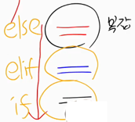

## 

# 문제 풀이(problem solving)

### 1.  문제 풀이

* **문제풀이 과정의 목표**

  * 입력 TC를 처리하여 정확한 출력을 내보내는 것
  * 시퀀스를 사용한 루프 / flag나 변수를 초기화, 범위, 예외처리
  * 알고리즘 : 아이디어를 체계화
  * 💥시각적으로 쓰면서 풀이 : 2차원 array, 다중루프, 조건
  * 

  * 유형별 연습은 가능하지만, 처음 보는 문제를 이햐하고, 모든 TC를 제한조건 내에서 정확히 처리해야 함

  * 문제풀이 단계(문제 읽기 → 설계 → 구현 → 디버깅)

    * 문제 읽기 (속독 + 손으로 TC 풀기 → 문제 이해를 도움)

    * 💥접근방법 구상 : arr, 반복, 조건, 여러가지 방법(브레인 스토밍 처럼)

    * 핵심코드 손코딩 : 시각적(arr, 범위, 반복), 명칭

    * 코드구현

    * 디버깅 및 개선

      

* **접근방법 구상**(단계별 처리)

  * 완전히 새로운 문제는 없음
    * 이전에 풀었던 문제와 ✨**유사한지**, ✨**특정 자료구조** 적용, ✨**전형적인 알고리즘** 적용 가능한지 체크
  * 문제가 시키는 대로 시도 (💥시뮬레이션)
    * 문제 설명대로 예시를 처리하는 것이 접근 가능한지 체크 (제한 조건 내)
    * 여러 입력에 대한 출력을 계산하면서 [✨**규칙성**/조건/수식] 적용 가능한지 체크
  * 유형/규칙성을 발견하기 힘들다면
    * ✨**가능한 모든 경우**를 처리하면서 풀이가능한지 체크
    * 전체문제가 아닌 일부분으로 나누거나, 단계를 나누어 접근
    * ✨**반대로 접근**하는 경우를 체크 (문제설명, 조건, arr 순회 등)
      * 
  * 이 모든 접근을 ✨**시각적**으로(손으로 그리면서)

* **문제풀이 연습**
  * 기본기는 철저히 연습
    * 기본기가 탄탄해야 구상한 아이디어를 실수 없이 구현 가능
    * 정확한 **✨입출력**, 실수 없는 **✨2차원 array** 사용 및 **✨다중 루프제어**
    * 가장 효율적인/짧은/멋있는 코드보다 기본적인 [반복/조건]을 빈틈없이 구현
    * **💥손코딩** : 사용하는 주요 array, **✨범위**, 핵심 코드를 실명/시각적으로 설계하고 접근 (💥구현하다 막히면 코드를 보는게 아니라 손코딩한 것을 보자)
    * 필요한 위치에서 필요한 디버깅 가능하도록 💥**디버거 사용법** 숙지
  * 나만의 환경/✨루틴에서 안정적으로 구현
    * 파이참 환경, 폰트, 폰트 크기, 창 배치, TC 입력파일, A4용지, 풀이 순서
    * 익숙한 이름: 입력 받는 변수, 선언한 변수, 특정용도 사용 변수 등
    * 함수호출, 조건, 반복, break, continue 등 익숙한 방법으로 구현
