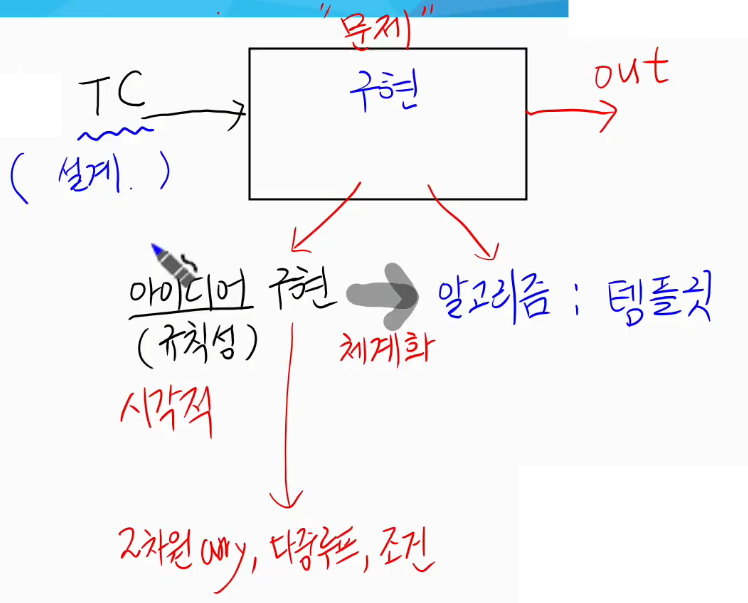

## 

# 문제 풀이(problem solving)

### 1.  문제 풀이

* **문제풀이 과정의 목표**

  * 입력 TC를 처리하여 정확한 출력을 내보내는 것
  * 시퀀스를 사용한 루프 / flag나 변수를 초기화, 범위, 예외처리
  * 알고리즘 : 아이디어를 체계화
  * 💥시각적으로 쓰면서 풀이 : 2차원 array, 다중루프, 조건
  * 

  * 유형별 연습은 가능하지만, 처음 보는 문제를 이햐하고, 모든 TC를 제한조건 내에서 정확히 처리해야 함

  * 문제풀이 단계

    * 문제 읽기 (속독 + 손으로 TC 풀기 → 문제 이해를 도움)

    * 💥접근방법 구상 : arr, 반복, 조건, 여러가지 방법(브레인 스토밍 처럼)

    * 핵심코드 손코딩 : 시각적(arr, 범위, 반복), 명칭

    * 코드구현

    * 디버깅 및 개선

      

* **접근방법 구상**

  * 완전히 새로운 문제는 없음
    * 이전에 풀었던 문제와 ✨유사한지, ✨특정 자료구조 적용, ✨전형적인 알고리즘 적용 가능한지 체크
  * 문제가 시키는 대로 시도
    * 문제 설명대로 예시를 처리하는 것이 접근
