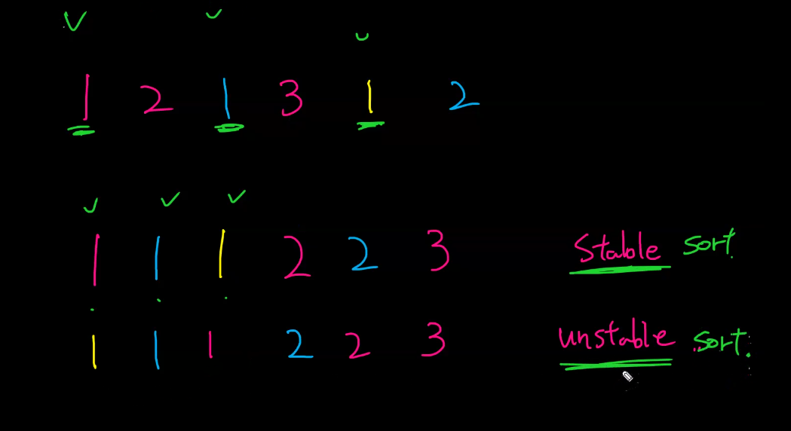
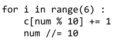
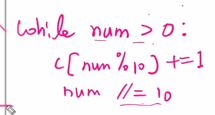

## 

* **알고리즘**

  * 알고리즘 문제를 풀때는 필기를 해라(숙달되기까지 A4용지 1 묶음은 써야한다)

  * 공부 순서 : 언어자체 → 컴퓨터 구조→ 자료 구조 → 알고리즘

  * 이산수학

    

* **정렬**

  * 💥정렬들의 차이를 숙지! (그림→ 수도코드 → 코드 구현) / hungarian bubble sort

  * 정렬을 할 때는 주어진 index 범위 파악과 2개씩 비교할 기준 설정이 중요

  * 정렬에 대한 개념을 서로에게 설명해보기

  * 💥stable sort 하기 위해서 뒤에서부터 정렬 시킴(뒤에서부터 인덱스를 줄임)

  * 

* **문제 풀이**

  * 자주 사용되는 코드

  * 갯수를 모를 때 하나씩 없애는 방법

  * img 49 설명 : index 값을 9까 공유하려고, 12까지 리스트를 만듬. 그렇지 않으면 if문 한개 더 필요.

* **파이참**
  * Ctrl + d : 복사(파이참)
  * 💥2중리스트 만들기
  * 디버깅
    * show execution point : 현재 코드로 감
    * step over : 다음 함수로 감(내장함수로 들어가지않고 내장함수 보고싶을때)
    * 💥step into(F7) : 다음줄로 감, 하이라이트된 줄의 인덱스 위에 마우스 가져다 대면 값 보여줌
    * 💥step into my code
    * step out : 현재 메서드 바로 다음 순서로 감
    * run to cursor : 해당 커서까지 이동
