## 

# 트리 (Tree)

 

### 1. 트리

 

* **트리**
  * 트리의 개념
    * 비선형 구조
    * 원소들 간의 1:n 관계를 가지는 자료구조
    * 원소들 간의 계층관계를 가지는 계층형 자료구조
    * 상위 원소에서 하위 원소로 내려가면서 확장되는 트리(나무) 모양의 구조

 

* **트리 - 정의**
  * 한 개 이상의 노드로 이루어진 유한 집합이며 다음 조건을 만족함(하나만 있어도 트리)
    * 노드 중 최상위 노드를 루트(root)라 함
    * 나머지 노드들은 n(>=0)개의 분리 집합 T1,...,TN으로 분리될 수 있음
  * 이들 T1,...,TN은 각각 하나의 트리가 되며(재귀적 정의) 루트의 부 트리(subtree)라 함
  * 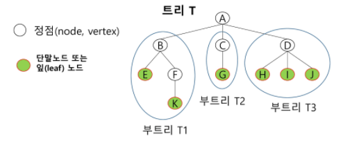
    * 단말노드 : terminal node

 

* **트리 - 용어정리**
  * 노드(node) - 트리의 원소
    * 트리 T의 노드 - A, B, C, D, E, F, G, H, I, J, K
  * 간선(edge) - 노드를 연결하는 선, 부모 노드와 자식 노드를 연결
  * 루트 노트(root node) - 트리의 시작 노드
    * 트리 T의 루트노드 - A
    * 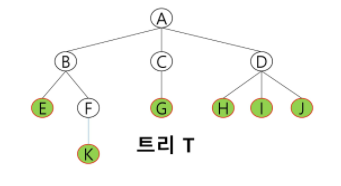
    * 트리는 그래프에 포함됨(그래프가 더 큰 범위)
  * 형제 노드(sibling node) - 같은 부모 노드의 자식 노드들
    * B, C, D는 형제 노드
  * 조상 노드 - 간선을 따라 루트 노드까지 이르는 경로에 있는 모든 노드들
    * K의 조상 노드 : F, B, A
  * 서브 트리(subtree) - 부모 노드와 연결된 간선을 끊었을 때 생성되는 트리
  * 자손 노드 - 서브 트리에 있는 하위 레벨의 노드들
    * B의 자손 노드 - E, F, K
  * 차수(degree) - ✨자식의 수를 의미함(깊이 X, levle X, 높이 X)
    * 노드의 차수 : 노드에 연결된 자식 노드의 수
      * B의 차수 = 2, C의 차수 = 1
    * 트리의 차수 : 트리에 있는 노드의 차수 중에서 가장 큰 값
      * 트리 T의 차수 = 3
    * 단말 노드(리프 노드) : 차수가 0인 노드, 자식 노드가 없는 노드
  * ✨부모가 없으면 root / 자식이 없으면 leaf
  * 높이
    * 노드의 높이 : 루트에서 노드에 이르는 간선의 수, 노드의 레벨
      * B의 높이 = 1, F의 높이 = 2
    * 트리의 높이 : 트리에 있는 노드의 높이 중에서 ✨가장 큰 값, 최대 레벨
      * 트리 T의 높이 = 3
    * 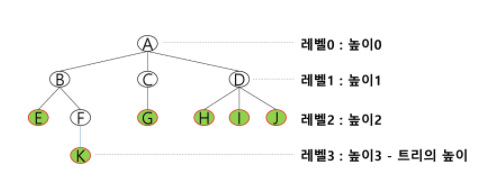
    * ✨높이는 상대적인 값이어서 0 or 1로 시작

 

---

 

### 2. 이진 트리

 

* **이진트리**
  * 모든 노드들이 2개의 서브트리를 갖는 특별한 형태의 트리
  * 각 노드가 자식 노드를 최대한 2개 까지만 가질 수 있는 트리
    * 왼쪽 자식 노드(left child node)
    * 오른쪽 자식 노드(right child node)
  * 이진 트리의 예
    * 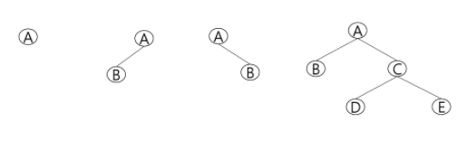

 

* **이진트리 - 특성**

  * 레벨 i에서의 노드의 최대 개수는 2^i개

  * 높이가 h인 이진 트리가 가질 수 있는 노드의 최소 개수는 (h+1)개가 되며, 최대 개수는(2^(h+1)-1)개가 됨

  * 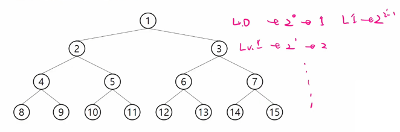

    

 

* **이진트리 - 종류**
  * 💥포화 이진 트리(Full Binary Tree)
    * 모든 레벨에 노드가 포화상태로 차 있는 이진 트리(✨leaf를 제외하고 2개씩의 자식을 가지는 트리)
    * 높이가 h일 때, 최대의 노드 개수인 (2^(h+1)-1)의 노드를 가진 이진 트리
      * 높이 3일때 2^(3+1)-1 = 15개의 노드
      * 루트를 1번으로 하여 2^(h+1)-1까지 정해진 위치에 대한 노드 번호를 가짐
    * 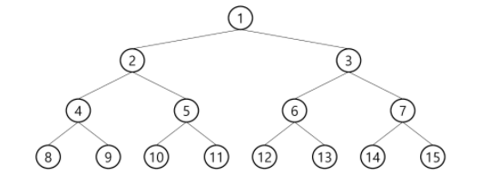
  * 완전 이진 트리(Complete Binary Tree)
    * 높이가 h이고 노드 수가 n개 일때 (단, 2^h <= n < 2^(h+1)-1), 포화 이진 트리의 노드 번호 1번부터 n번까지 빈 자리가 없는 이진 트리
    * 트리에 빈자리가 생김 / 포화 이진 트리보다는 적지만, 특정레벨까지는 완전히 채워져 있음
    * ex. 노드가 10개인 완전 이진 트리
    * 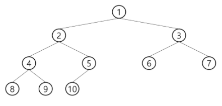
  * 편향 이진 트리(Skewed Binary Tree)
    * 높이 h에 대한 최소 개수의 노드를 가지면서 한쪽 방향의 자식 노드만을 가진 이진 트리
      * 왼쪽 편향 이진 트리
      * 오른쪽 편향 이진 트리
      * 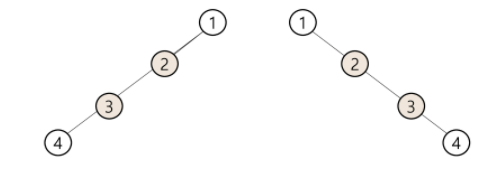
      * 이상적인 트리 / 트리의 장점은 사라짐
      * ✨트리의 최악의 시간 복잡도 → 엣지 케이스

 

* **이진트리 - 순회(traversal)**
  * 순회(trabersal)란 트리의 각 노드를 중복되지 않게 전부 방문(visit) 하는 것을 말하는데 트리는 비 선형 구조이기 때문에 선형구조에서와 같이 선후 연결 관계를 알 수 없음
  * 따라서 특별한 방법이 필요
    * 
    * 트리에 특화된 탐색 방법 필요(**💥중복없이 / 빠짐없이**)
  * 순회(traversal) : 트리의 노드들을 체계적으로 방문하는 것
    * 
  * 3가지의 기본적인 순회방법
    * 전위순회(preorder traversal) : VLR
      * 부모노드 방문 후, 자식 노드를 좌,우 순서로 방문함
    * 중위순회(inorder traversal) : LVR
      * 왼쪽 자식노드, 부모노드, 오른쪽 자식노드 순으로 방문함
    * 후위순회(postorder traversal) : LRV
      * 자식노드를 좌우 순서로 방문한 후, 부모노드로 방문함

 

* **전위 순회(preorder traversal)**
  * 수행 방법
    1. 현재 노드 n을 방문하여 처리함 → V
    2. 현재 노드 n의 왼쪽 서브트리로 이동함 → L
    3. 현재 노드 n의 오른쪽 서브트리로 이동함 → R
    
  * 전위 순회 알고리즘
    * 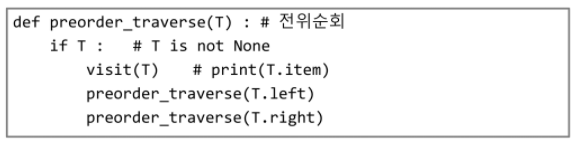
    
  * ex.
    * 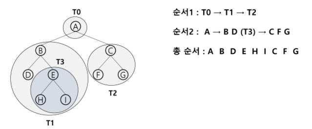
    
      

 

* **중위 순회(inorder traversal)**
  * 수행 방법
    1. 현재 노드 n의 왼쪽 서브트리로 이동한다 : L
    2. 현재 노드 n을 방문하여 처리한다 : V
    3. 현재 노드 n의 오른쪽 서브트리로 이동한다 : R
  * 중위 순회 알고리즘
    * 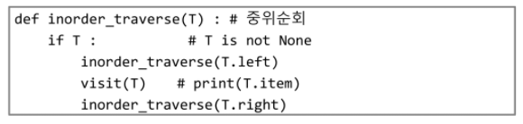
  * ex.
    * 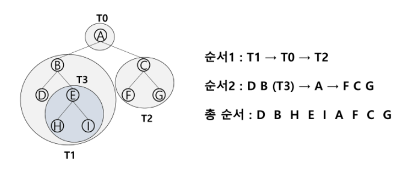

 

* **후위 순회(postorder traversal)**
  * 수행 방법
    1. 현재 노드 n의 왼쪽 서브트리로 이동한다 : L
    2. 현재 노드 n의 오른쪽 서브트리로 이동한다 : R
    3. 현재 노드 n을 방문하여 처리한다 : V
  * 후위 순회 알고리즘
    * 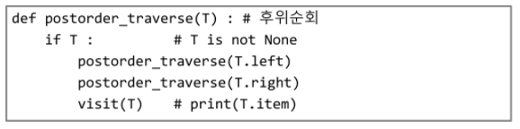
  * 후위 순회의 예
    * 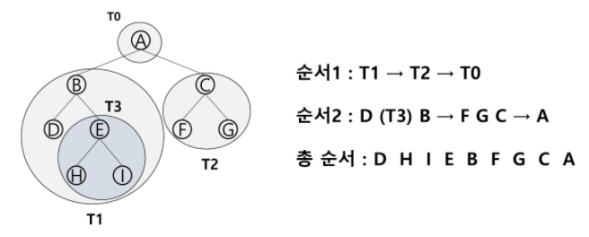
    * root가 맨 마지막에 처리됨
    * 양쪽 서브트리의 결과를 이용해서 무엇인가를 해야할 때는 후위순위

 

* **이진트리(✨자식이 2개)의 표현**
  * 배열을 이용한 이진 트리의 표현
    * 이진 트리에 각 노드 번호를 다음과 같이 부여
    * 루트의 번호를 1로 함
    * 레벨 n에 있는 노드에 대하여 왼쪽부터 오른쪽으로 2^n부터 2^(n+1)-1까지 번호를 차례로 부여
    * 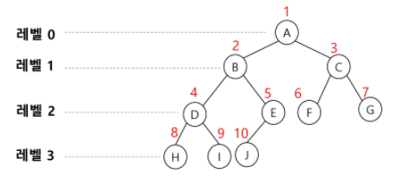
    * 트리의 저장방법 : array, liked list
  * 노드 번호의 성질
    * 노드 번호가 i인 노드의 부모 노드 번호?  i//2
    * 노드 번호가 i인 노드의 왼쪽 자식 노드 번호?  2*i
    * 노드 번호가 i인 노드의 오른쪽 자식 노드 번호?  2*i+1
    * 레벨 n의 노드 번호 시작 번호는? 2^n
    * 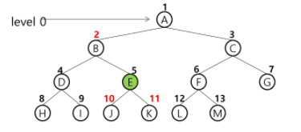
    * 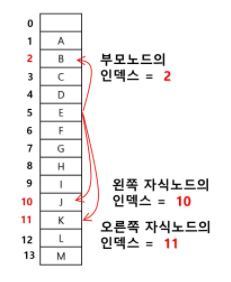
    * 노드 번호를 배열의 인덱스로 사용
    * 높이가 h인 이진 트리를 위한 배열의 크기는?
      * 레벨 i의 최대 노드 수는?  2^i
      * 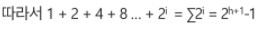
      * 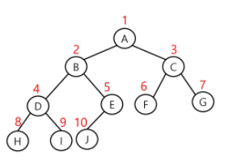
      * 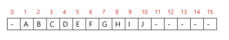
    * 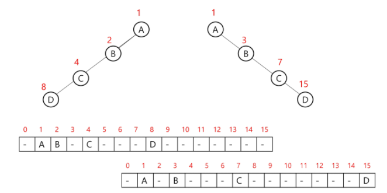
    * 

 

* **[참고] 이진 트리의 저장**
  * 부모 번호를 인덱스로 자식 번호를 저장
    * 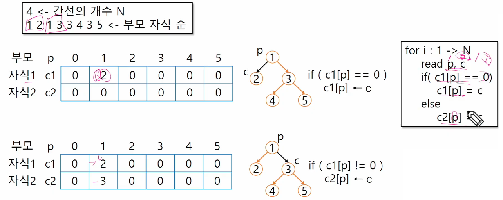
    * 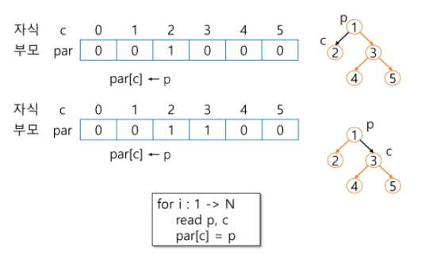
  * 루트 찾기, 조상 찾기
    * 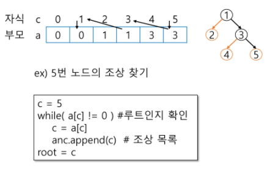

 

* **배열을 이용한 이진 트리의 표현의 단점**
  * 편향 이진 트리의 경우에 사용하지 않는 배열 원소에 대한 메모리 공간 낭비 발생
  * 트리의 중간에 새로운 노드를 삽입하거나 기존의 노드를 삭제할 경우 배열의 크기 변경이 어려워 비효율적

 

* **트리의 표현 - 연결리스트**

  * 배열을 이용한 이진 트리의 표현의 단점을 보완하기 위해 연결리스트를 이용하여 트리를 표현 할 수 있음

  * 연결 자료구조를 이용한 이진트리의 표현

    * 이진 트리의 모든 노드는 최대 2개의 자식 노드를 가지므로 일정한 구조의 단순 연결 리스트 노드를 사용하여 구현
    * 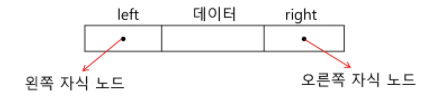

  * 완전 이진 트리의 연결 리스트 표현

    * 

      

 

* **수식 트리**

  * 수식을 표현하는 이진 트리

  * 수식 이진 트리(Expression Binary Tree)라고 부르기도 함

  * 연산자는 루트 노드이거나 가지 노드

  * 피연산자는 모두 잎 노드

    * 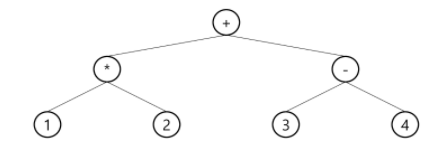

      

 

* **수식 트리의 순회**
  * 중위 순회 : `A / B * C * D + E` (식의 중위 표기법)
  * 후위 순회 : `A B / C * D * E +` (식의 후위 표기법)
  * 전위 순회 : `+ * * / A B C D E  ` (식의 전위 표기법)
    * 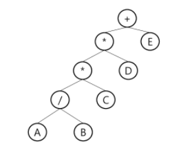

 

---

 

### 3. 이진탐색 트리

 

* **이진 탐색 트리**
  * 탐색 작업을 효율적으로 하기 위한 자료구조
  * 모든 원소는 서로 다른 유일한 키를 갖음
  * key(왼쪽 서브트리) < key(루트 노드) < key(오른쪽 서브트리)
  * 왼쪽 서브트리와 오른쪽 서브트리도 이진 탐색 트리임
  * 중위 순회하면 오름차순으로 정렬된 값을 얻을 수 있음
  * 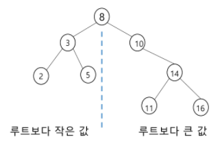
  * 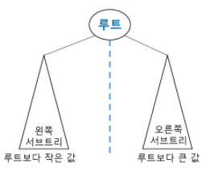

 

* **이진 탐색 트리 - 연산**
  * 탐색연산
    * 루트에서 시작함
    * 탐색할 키 값 x를 루트 노드의 키 값과 비교함
      * (키 값x = 루트노드의 키 값)인 경우 : 원하는 원소를 찾았으므로 탐색연산 성공
      * (키 값x < 루트노드의 키 값)인 경우 : 루트노드의 왼쪽 서브트리에 대해서 탐색 연산 수행
      * (키 값x > 루트노드의 키 값)인 경우 : 루트노드의 오른쪽 서브트리에 대해서 탐색 연산 수행
    * 서브트리에 대해서 순환적으로 탐색 연산을 반복함
    * ✨가지고 있는 정보의 저장도 필요하면 저장 공간 따로 만들어 주기
    * ex. 13 탐색
      * 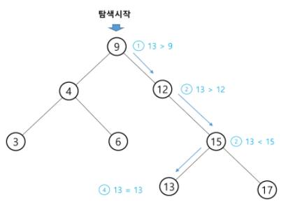
  * 삽입 연산
    1. 먼저 탐색 연산을 수행
       * 삽입할 원소와 같은 원소가 트리에 있으면 삽입할 수 없으므로(✨고유의 값을 가지므로), 같은 원소가 트리에 있는지 탐색하여 확인함
       * 탐색에서 탐색 실패가 결정되는 위치가 삽입 위기가 됨
    2. 탐색 실패한 위치에 원소를 삽입함
       * 아래의 예시는 5를 삽입하는 예임
       * 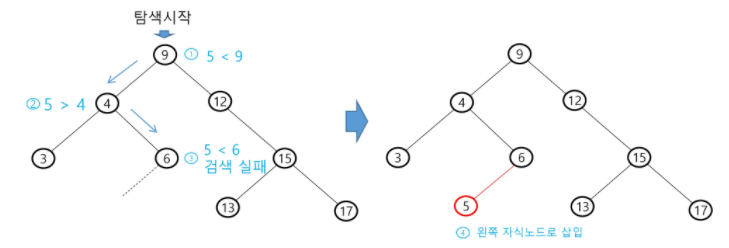

 

* **이진 탐색 트리 -  성능**
  * 탐색(searching), 삽입(insertion), 삭제(delection) 시간은 트리의 높이 만큼 시간이 걸림
    * O(h), h : BST의 깊이(height)
  * 평균의 경우
    * 이진 트리가 균형적으로 생성되어 있는 경우
    * O(log n)
  * 최악의 경우
    * 한쪽으로 치우친 경사 이진트리의 경우
    * O(n)
    * 순차탐색과 시간복잡도가 같음
  * 검색 알고리즘의 비교
    * 배열에서의 순차 검색 : O(N)
    * 정렬된 배열에서의 순차 검색 : O(N)
    * 정렬된 배열에서의 이진탐색 : O(logN)
      * 고정 배열 크기와 삽입, 삭제 시 추가 연산 필요
    * 이진 탐색트리에서의 평균 : O(logN)
      * 최악의 경우 : O(N)
      * 완전 이진 트리 또는 균형트리로 바꿀 수 있다면 최악의 경우를 없앨 수 있음
        * 새로운 원소를 삽입할 때 삽입 시간을 줄임
        * 평균과 최악의 시간이 같음 O(logN)
      * 해쉬 검색 : O(1)
        * 추가 저장 공간이 필요
  * 상용에서 검색을 위해 어떤 알고리즘을 사용할까?

 

---

 

### 4. 힙

 

* **힙(heap)**
  * 💥**완전 이진 트리**에 있는 노드 중에서 💥**키값이 가장 큰** 노드나 💥**키값이 가장 작은** 노드를 찾기 위해서 만든 자료구조
  * 최대 힙(max heap)
    * 키값이 가장 큰 노드를 찾기 위한 완전 이진 트리
    * {부모노드의 키값 > 자식노드의 키값}
    * 루트 노드 : 키값이 가장 큰 노드
  * 최소 힙(min heap)
    * 키값이 가장 작은 노드를 찾기 위한 완전 이진 트리
    * {부모노드의 키값 < 자식노드의 키값}
    * 루트 노드 : 키값이 가장 작은 노드
  * 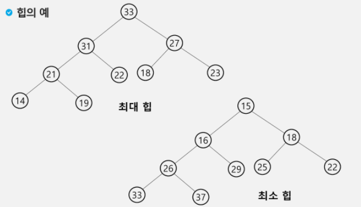
  * 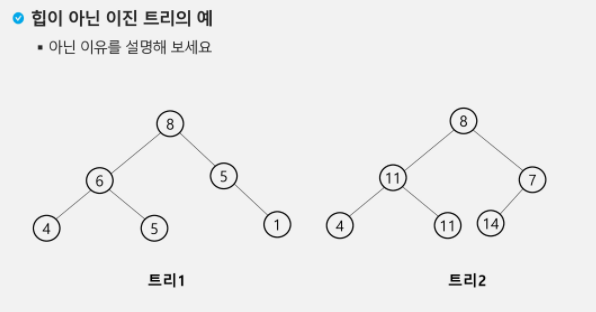

 

* **힙 연산 - 삽입**
  * 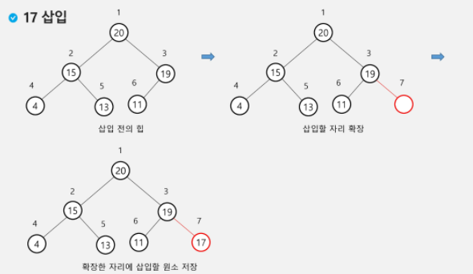
  * 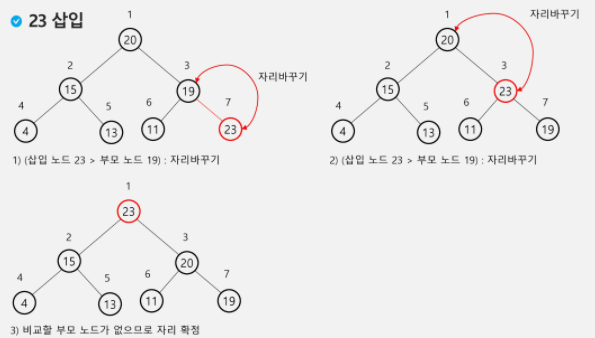
    * 큰 값을 만날때까지

 

* **힙 연산 - 삭제**
  * ✨힙에서는 루트 노드의 원소만을 삭제 할 수 있음
  * 루트 노드의 원소를 삭제하여 반환함
  * 힙의 종류에 따라 최대값 또는 최소값을 구할 수 있음(✨내림차순, 오름차순) → heap sort
  * 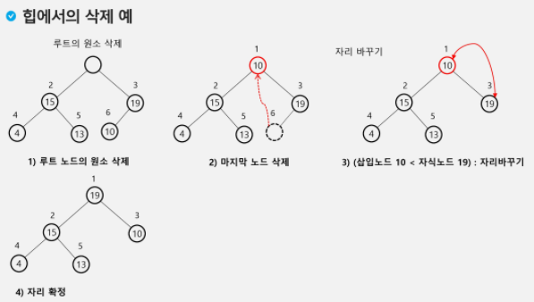
    * 더 큰 자식이 없거나 / 자식이 없을때까지

​		

 

* **힙을 이용한 우선순위 큐**
  * 힙(Heap)
    * 완전 이진 트리로 구현된 자료구조로서, 키값이 가장 큰 노드나 가장 작은 노드를 찾기에 용이한 자료구조
    * 아래의 예는 최소 힙(min heap)으로서, 가장 작은 키값을 가진 노드가 항상 루트에 위치함
      * 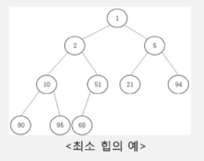
    * 힙의 키를 우선순위로 활용하여 우선순위 큐를 구현할 수 있음
    * 

 

---

 

### 마무리

 

* **완전 이진 트리에서의 순회**
  * 마지막 정점번호 이내이면 존재
  * 어떻게 저장 했느냐에 따라 자식 노드를 가져오는 방법의 차이가 있음
    * 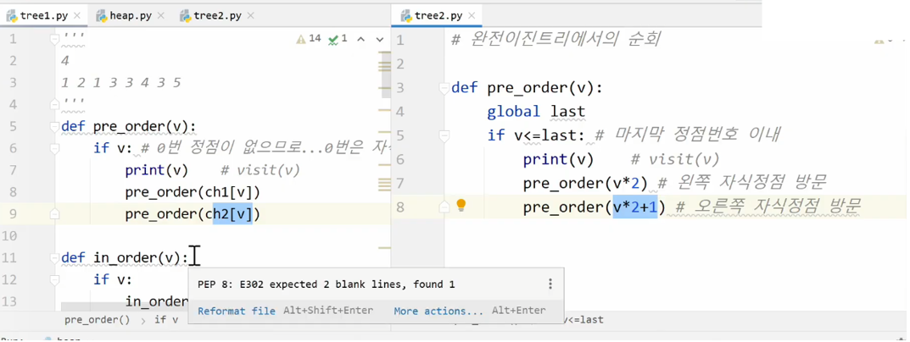

 

* **힙 연산**
  * 가장 큰 값 or 가장 작은 값만 꺼내는 것을 할 때
  * 전부 변하지 않고 일부분에서만 변동이 일어남

