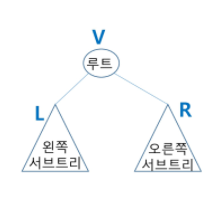

## 

# 트리 (Tree)

 

### 1. 트리

 

* **트리**
  * 트리의 개념
    * 비선형 구조
    * 원소들 간의 1:n 관계를 가지는 자료구조
    * 원소들 간의 계층관계를 가지는 계층형 자료구조
    * 상위 원소에서 하위 원소로 내려가면서 확장되는 트리(나무) 모양의 구조

 

* **트리 - 정의**
  * 한 개 이상의 노드로 이루어진 유한 집합이며 다음 조건을 만족함(하나만 있어도 트리)
    * 노드 중 최상위 노드를 루트(root)라 함
    * 나머지 노드들은 n(>=0)개의 분리 집합 T1,...,TN으로 분리될 수 있음
  * 이들 T1,...,TN은 각각 하나의 트리가 되며(재귀적 정의) 루트의 부 트리(subtree)라 함
  * 
    * 단말노드 : terminal node

 

* **트리 - 용어정리**
  * 노드(node) - 트리의 원소
    * 트리 T의 노드 - A, B, C, D, E, F, G, H, I, J, K
  * 간선(edge) - 노드를 연결하는 선, 부모 노드와 자식 노드를 연결
  * 루트 노트(root node) - 트리의 시작 노드
    * 트리 T의 루트노드 - A
    * 
    * 트리는 그래프에 포함됨(그래프가 더 큰 범위)
  * 형제 노드(sibling node) - 같은 부모 노드의 자식 노드들
    * B, C, D는 형제 노드
  * 조상 노드 - 간선을 따라 루트 노드까지 이르는 경로에 있는 모든 노드들
    * K의 조상 노드 : F, B, A
  * 서브 트리(subtree) - 부모 노드와 연결된 간선을 끊었을 때 생성되는 트리
  * 자손 노드 - 서브 트리에 있는 하위 레벨의 노드들
    * B의 자손 노드 - E, F, K
  * 차수(degree)
    * 노드의 차수 : 노드에 연결된 자식 노드의 수
      * B의 차수 = 2, C의 차수 = 1
    * 트리의 차수 : 트리에 있는 노드의 차수 중에서 가장 큰 값
      * 트리 T의 차수 = 3
    * 단말 노드(리프 노드) : 차수가 0인 노드, 자식 노드가 없는 노드
  * ✨부모가 없으면 root / 자식이 없으면 leaf
  * 높이
    * 노드의 높이 : 루트에서 노드에 이르는 간선의 수, 노드의 레벨
      * B의 높이 = 1, F의 높이 = 2
    * 트리의 높이 : 트리에 있는 노드의 높이 중에서 가장 큰 값, 최대 레벨
      * 트리 T의 높이 = 3
    * 
    * ✨높이는 상대적인 값이어서 0 or 1로 시작

 

---

 

### 2. 이진 트리

 

* **이진트리**
  * 모든 노드들이 2개의 서브트리를 갖는 특별한 형태의 트리
  * 각 노드가 자식 노드를 최대한 2개 까지만 가질 수 있는 트리
    * 왼쪽 자식 노드(left child node)
    * 오른쪽 자식 노드(right child node)
  * 이진 트리의 예
    * 

 

* **이진트리 - 특성**

  * 레벨 i에서의 노드의 최대 개수는 2^i개

  * 높이가 h인 이진 트리가 가질 수 있는 노드의 최소 개수는 (h+1)개가 되며, 최대 개수는(2^(h+1)-1)개가 됨

  * 

    

 

* **이진트리 - 종류**
  * 💥포화 이진 트리(Full Binary Tree)
    * 모든 레벨에 노드가 포화상태로 차 있는 이진 트리(✨leaf를 제외하고 2개씩의 자식을 가지는 트리)
    * 높이가 h일 때, 최대의 노드 개수인 (2^(h+1)-1)의 노드를 가진 이진 트리
      * 높이 3일때 2^(3+1)-1 = 15개의 노드
      * 루트를 1번으로 하여 2^(h+1)-1까지 정해진 위치에 대한 노드 번호를 가짐
    * 
  * 완전 이진 트리(Complete Binary Tree)
    * 높이가 h이고 노드 수가 n개 일때 (단, 2^h <= n < 2^(h+1)-1), 포화 이진 트리의 노드 번호 1번부터 n번까지 빈 자리가 없는 이진 트리
    * 트리에 빈자리가 생김 / 포화 이진 트리보다는 적지만, 특정레벨까지는 완전히 채워져 있음
    * ex. 노드가 10개인 완전 이진 트리
    * 
  * 편향 이진 트리(Skewed Binary Tree)
    * 높이 h에 대한 최소 개수의 노드를 가지면서 한쪽 방향의 자식 노드만을 가진 이진 트리
      * 왼쪽 편향 이진 트리
      * 오른쪽 편향 이진 트리
      * 
      * 이상적인 트리 / 트리의 장점은 사라짐

 

* **이진트리 - 순회(traversal)**
  * 순회(trabersal)란 트리의 각 노드를 중복되지 않게 전부 방문(visit) 하는 것을 말하는데 트리는 비 선형 구조이기 때문에 선형구조에서와 같이 선후 연결 관계를 알 수 없음
  * 따라서 특별한 방법이 필요
    * 
    * 트리에 특화된 탐색 방법 필요(**💥중복없이 / 빠짐없이**)
  * 순회(traversal) : 트리의 노드들을 체계적으로 방문하는 것
    * 
  * 3가지의 기본적인 순회방법
    * 전위순회(preorder traversal) : VLR
      * 부모노드 방문 후, 자식 노드를 좌,우 순서로 방문함
    * 중위순회(inorder traversal) : LVR
      * 왼쪽 자식노드, 부모노드, 오른쪽 자식노드 순으로 방문함
    * 후위순회(postorder traversal) : LRV
      * 자식노드를 좌우 순서로 방문한 후, 부모노드로 방문함

 

* **전위 순회(preorder traversal)**
  * 수행 방법
    1. 현재 노드 n을 방문하여 처리함 → V
    2. 현재 노드 n의 왼쪽 서브트리로 이동함 → L
    3. 현재 노드 n의 오른쪽 서브트리로 이동함 → R
  * 전위 순회 알고리즘
    * 
  * ex.
    * 
    * 

        

---

### 3. 이진탐색 트리

---

### 4. 힙

