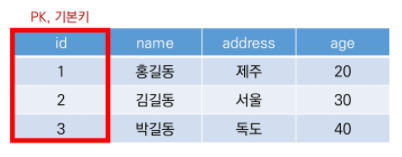
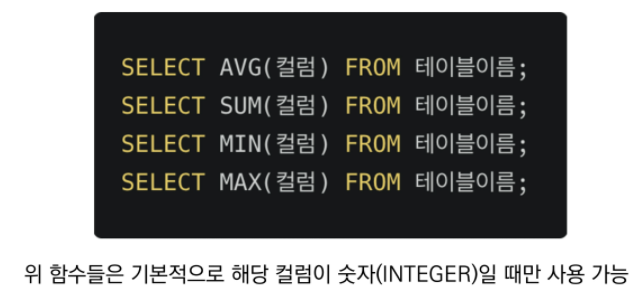

## 

 

# DB 01

 

### 1. Database

 

* **데이터베이스 (DB)**
  * 데이터베이스는 **✨체계화된 데이터**의 모임
  * 여러 사람이 공유하고 사용할 목적으로 통합 관리되는 정보의 집합
  * 논리적으로 연관된 (하나 이상의) 자료의 모음으로 그 내용을 고도로 구조화 함으로써 검색과 갱신의 효율화를 꾀한 것
  * 즉, **✨몇개의 자료 파일을 조직적으로 통합**하여 ✨**자료 항목의 중복을 없애**고 ✨**자료를 구조화하여 기억**시켜 놓은 ✨**자료의 집합체**

 

* **데이터베이스로 얻는 장점들**
  * 데이터 중복 최소화 / 데이터 무결성(정확한 정보를 보장) / 데이터 일관성 / 데이터 독립성(물리적/논리적) / 데이터 표준화 / 데이터 보안 유지
  * 

 

---

 

### 1-1. RDB

 

* **관계형 데이터베이스(RDB)**
  * Relational Database
  * 키(key)와 값(value)들의 간단한 관계(relation)를 표(table) 형태로 정리한 데이터베이스
  * 관계형 모델에 기반
    * 

 

* **관계형 데이터베이스 용어 정리**
  * 스키마(schema) : 데이터베이스에서 자료의 구조, 표현방법, 관계 등 전반적인 명세를 기술한 것
    * 
  * 테이블(table) : 열(컬럼/필드)과 행(레코드/값)의 모델을 사용해 조직된 데이터 요소들의 집합
    * 
  * 열(column) : 각 열에는 고유한 데이터 형식이 지정됨
  * 아래의 예시에서는 name이란 필드에 고객의 이름(TEXT) 정보가 저장됨
    * 
  * 행(row) : 실제 데이터가 저장되는 형태
  * 아래의 예시에서는 총 3명의 고객정보가 저장되어 있음(레코드가 3개)
    * 
  * 기본키(Primary Key) : 각 행(레코드)의 고유 값
  * 반드시 설정해야 하며, 데이터베이스 관리 및 **✨관계 설정** 시 주요하게 활용됨
    * 

 

---

 

### 1-2. RDBMS

 

* **관계형 데이터베이스 관리 시스템(RDBMS)**
  * Relational Database Management System
  * 관계형 모델을 기반으로 하는 데이터베이스 관리시스템을 의미
  * ex.
    * MySQL / SQLite / PostgreSQL / ORACLE / MS SQL
    * 

 

* **SQLite**
  * 
  * 서버 형태가 아닌 파일 형식으로 응용 프로그램에 넣어서 사용하는 **✨비교적 가벼운 데이터 베이스** 
  * 구글 안드로이드 운영체제에 기본적으로 탑재된 데이터 베이스이며, 임베디드 소프트웨어에도 많이 활용됨
  * 로컬에서 간단한 DB 구성을 할 수 있으며, 오픈소스 프로젝트이기 때문에 자유롭게 사용가능

 

* **Sqlite Data Type** (정적 / 동적)
  1. NULL
  2. INTEGER
     * 크기에 따라 0, 1, 2, 3, 4, 6 또는 8바이트에 저장된 부호 있는 정수
  3. REAL
     * 8바이트 부동 소수점 숫자로 저장된 부동 소수점 값
  4. TEXT
  5. BLOB (Binary Data)
     * 입력된 그대로 정확히 저장된 데이터 (별다른 타입 없이 그대로 저장)

 

* **Sqlite Type Affinity**

  * Type Affinity

    * 특정 컬럼에 저장하도록 권장하는 데이터 타입
    * ✨선호도가 있음 : 일반적으로는 정적 데이터를 선호하나, sqlite는 동적 데이터 타입 선호

    1. INTEGER
    2. TEXT
    3. BLOB
    4. REAL
    5. NUMERIC

  * 

 

---

 

### 2. SQL

 

* **SQL (Structured Query Language)**
  * 관계형 데이터베이스 관리시스템의 ✨**데이터 관리**를 위해 설계된 ✨**특수 목적 프로그래밍 언어**
  * 데이터베이스 스키마 생성 및 수정
  * 자료의 검색 및 관리
  * 데이터베이스 객체 접근 조정 관리	

 

* **SQL 분류**
  * 
    * 💥DML : CRUD
    * **💥DDL : 테이블을 관리할 때 / DML : data를 관리할 때 / DCL(TCL) : 사용자 권한**

 

* **SQL Keywords - Data Manipulation Language**
  * INSERT : 새로운 데이터 삽입(추가)
  * SELECT : 저장되어 있는 데이터 조회
  * UPDATE : 저장되어 있는 데이터 갱신
  * DELETE : 저장되어 있는 데이터 삭제

 

---

 

### 2-1. 테이블 생성 및 삭제(DDL)

 

* **csv 파일 다운로드**
* **테이터베이스 생성하기**
  * **✨'.' 은 sqlite 프로그램의 기능을 실행하는 것** (dot command / sqlite에서 사용하는 명령어)
* **csv 파일을 table로 만들기**
* **💥SELECT**(DML에 속함)
  * **✨SELECT 문은 특정 테이블의 레코드(행) 정보를 반환**
  * trailing comma X
* Run Query (전체) vs ✨Run Selected Query(구문만)
* **테이블 생성 및 삭제 statement**
  * CREATE TABLE
    * 데이터베이스에서 테이블 생성
  * DROP TABLE
    * 데이터베이스에서 테이블 제거
* **CREATE**
  * **✨CREATE는 테이블을 생성**
* **특정 테이블의 schema 조회**
* **DROP**
  * **✨DROP은 테이블을 삭제**

 

---

 

### 2-2. CRUD

 

* **💥CREATE**
  * INSERT
    * "insert a single row into a table"
    * 테이블에 단일 행 삽입
    * **✨INSERT는 특정 테이블에 레코드(행)를 삽입(생성)!**
    * **✨모든 열에 데이터가 있는 경우 column을 명시하지 않아도 됨**
  * 
    * ✨field이 명시된다면 섞여도 상관 없음

 

* **2가지 의문점**
  1. id는 어디로 갔을까?
     * SQLite가 관리해주고 있음
     * SQLite는 따로 **✨PRIMARY KEY 속성의 컬럼을 작성하지 않으면** 값이 자동으로 증가하는 PK 옵션을 가진 **✨rowid 컬럼을 정의**(출력에서 배제되었을뿐)
  2. 비어있는 데이터
     * 필요한 데이터라면 공백으로 비워두면 안됨 (NOT NULL 설정 필요)
* ✨PRIMARY KEY는 무조건 INTEGER로 해야됨(INT도 불가)

 

* **💥READ**
  * SELECT statement
    * SELECT	
      * "query data from a table"
      * 테이블에서 데이터를 조회
      * SELECT 문은 SQLite에서 가장 복잡한 문이며 다양한 절(clause)와 함께 사용
        * ORDER BY, DISTINCT, WHERE, LIMIT, GROUP BY ...
      * ✨전체 조회 시 `*` 사용

 

* **SELECT와 함께 사용하는 clause**
  * LIMIT
    * "constrain the number of rows returned by a query"
    * 쿼리에서 반환되는 행 수를 제한
    * 특정 행부터 시작해서 조회하기 위해 OFFSET 키워드와 함께 사용하기도 함
  * WHERE
    * "specify the search condition for rows returned by the query"
    * 쿼리에서 반환된 행에 대한 특정 검색 조건을 지정
  * SELECT DISTINCT
    * "remove duplicate rows in the result set"
    * 조회 결과에서 중복 행을 제거
    * DISTINCT 절은 SELECT 키워드 바로 뒤에 작성해야 함

* **SELECT statement**
  * 
  * 
  * 
  * 
  * 

 

* **[참고] OFFSET**
  * 동일 오브젝트 안에서 오브젝트 처음부터 주어진 요소나 지점까지의 변위차(위치 변화량)을 나타내는 정수형
  * ex.
    1. 문자열 'abcedf'에서 문자 'c'는 시작점 'a'에서 2의 OFFSET을 지님
    2. SELECT * FROM MY_TABLE LIMIT 10 OFFSET 5
       * "6번째 행 부터 10개 행을 조회(6번째 행부터 10개를 출력)"
       * 0부터 시작함

 

* 💥**DELETE**
  * DELETE statement
    * DELETE
      * "remove rows from a table"
      * 테이블에서 행을 제거
  * 

 

* **AUTOINCREMENT**
  * Column attribute
  * SQLite가 사용되지 않은 값이나 이전에 삭제된 행의 값을 재사용하는 것을 방지
  * 테이블을 생성하는 단계에서 ✨**AUTOINCREMENT**를 통해 설정 가능
  * ✨장고에서는 pk에 자동으로 이 속성이 붙음 / 기본값으로 사용
    * 기본적으로는 재사용하나 장고에서는 재사용 X
    * 장고 ORM이 해주는 일이 많음
      * 
    * 새로운 테이블을 추가 :  전체 테이블 삭제 → 전체+추가 테이블 생성 후 기존의 이름을 넣음
      * DB는 컬럼 추가는 불가능

 

* **💥UPDATE**
  * UPDATE statement
    * UPDATE
      * "update data of existing rows in the table"
      * 기존 행의 데이터를 수정
      * SET clause에서 테이블의 각 열에 대해 새로운 값을 설정
  * 
  * ✨중복 불가능한(UNIQUE) 값인 rowid를 기준으로 수정!

 

* 정리
  * 
  * 데이터 삽입(insert) / 데이터 생성(create) / 데이터 삭제(drop) / 조회(select)
  * 소문자가 에러나지는 않지만, 명시적으로 SQL문의 구조 확인을 위해 대문자씀
  * sqlite3 rowid max value
    * pk는 64비트 : 최댓값 922경 정도
    * 꽉차면 삭제된 부분을 채우다가 전부 다 채워지면 안 들어감 

 

---

 

### 2-3. WHERE

 

* 

 

---

 

### 2-4. Aggregate Functions

 

* **Aggregate function**
  * "집계 함수"
  * 값 집합에 대한 계산을 수행하고 단일 값을 반환
    * **✨여러 행으로부터 하나의 결과값**을 반환하는 함수
  * ✨**SELECT 구문에서만 사용됨**
  * ex.
    * 테이블 전체 행 수를 구하는 COUNT(*)
    * age 컬럼 전체 평균 값을 구하는 AVG(age)

 

* **Overview of SQLite aggregate functions**
  * COUNT
    * 그룹의 항목 수를 가져옴
  * AVG
    * 모든 값의 평균을 계산
  * MAX
    * 그룹에 있는 모든 값의 최대값을 가져옴
  * MIN
    * 그룹에 있는 모든 값의 최소값을 가져옴
  * SUM
    * 모든 값의 합을 계산
  * 
  * 

 

---

 

### 2-5. LIKE

 

* **LIKE operator**
  * "query data based on pattern matching"
  * 패턴 일치를 기반으로 데이터를 조회하는 방법
  * SQLite는 패턴 구성을 위한 2개의 wildcards를 제공
    * %(precent sign)
      * 0개의 이상의 문자
    * _(underscore)
      * 임의의 단일 문자

 

* **[참고] wildcard character**
  * 파일을 지정할 때, 구체적인 이름 대신에 여러 파일을 동시에 지정할 목적으로 사용하는 특수 기호
    * *, ? 등
  * 주로 특정한 패턴이 있는 문자열 혹은 파일을 찾거나, 긴 이름을 생략할 때 쓰임
  * 텍스트 값에서 알 수 없는 문자를 사용할 수 있는 특수 문자로, 유사하지만 동일한 데이터가 아닌 여러 항목을 찾기에 매우 편리한 문자
  * 지정된 패턴 일치를 기반으로 데이터를 수집하는 데도 도움이 될 수 있음

 

* **LIKE statement**
  * 

 

* **wildcards**
  * 와일드 카드 2가지 패턴
    * %(percent sign)
      * 이 자리에 문자열이 있을 수도, 없을 수도 있음
    * _(underscore)
      * 반드시 이 자리에 한 개의 문자가 존재해야 함

 

* **wildcards 사용 예시**
  * 

 

---

 

### 2-6. ORDER BY 

 

* **ORDER BY clause**
  * ORDER BY
    * "sort a result set of a query"
    * 조회 결과 집합을 정렬
    * SELECT 문에 추가하여 활용
    * 정렬 순서를 위한 2개의 keyword 제공
      * ASC - 오름차순 (default) - ✨기본값이므로 생략 가능
      * DESC - 내림차순
  * 
    * ✨컬럼1 DESC, 컬럼2 DESC 해줘야 둘 다 내림차순됨 (위의 예시는 컬럼1은 오름차순, 컬럼2는 내림차순)

 

---

 

### 2-7. GROUP BY

 

* **GROUP BY clause**
  * GROUP BY	
    * "make a set of summary rows from a set of rows"
    * 행 집합에서 요약 행 집합을 만듦
    * SELECT 문의 optional 절
    * 선택된 행 그룹을 하나 이상의 열 값으로 요약 행으로 만듦
    * 문장에 WHERE 절이 포함된 경우 반드시 WHERE 절 뒤에 작성해야 함
  * 
  * 
    * 💥last_name(지정된 조건)으로 GROUP BY(그룹으로 묶고), COUNT(*) (결과값의 갯수를 세겠음) : 데이터를 요약하는 상황에서 사용 새로운 컬럼을 만드는것은 아니고 조회만 함

 

---

 

### 2-8. ALTER TABLE

 

* **ALTER TABLE statement**

  * ALTER TABLE의 4가지 기능
    1. table 이름 변경
    2. 테이블에 새로운 column 추가
    3. [참고] column 이름 수정(sqlite 3.25.0)
       * 
    4. Drop column (sqlite 3.35 )

  * 

