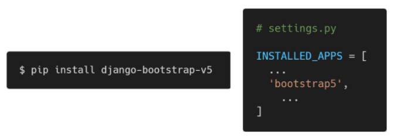
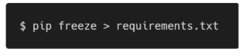
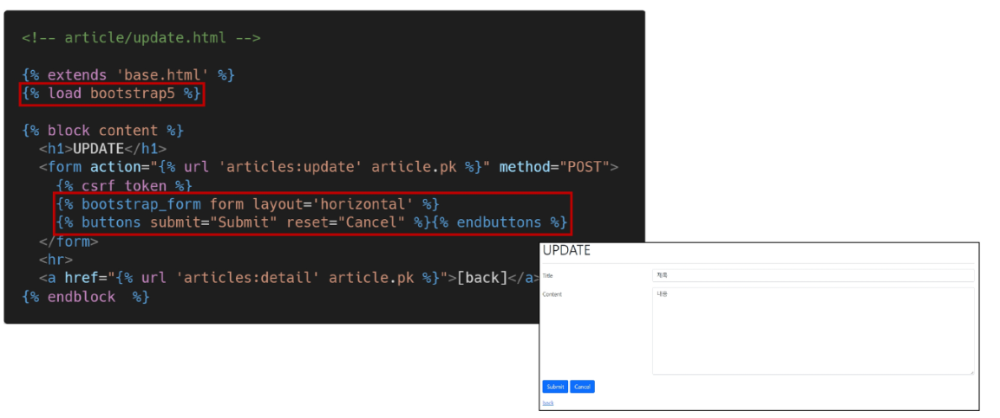

## 

 

## Django Form

 

왜래키 외래키

### 1.  Form Class

 

* **Intro**
  * 우리는 지금까지 HTML, form, input을 통해서 사용자로부터 데이터를 받음
  * 이렇게 직접 사용자의 데이터를 받으면 입력된 데이터의 유효성을 검증하고, 필요시에 입력된 데이터를 검증 결과와 함께 다시 표시해야 함
    * 사용자가 입력한 데이터는 개발자가 요구한 형식이 아닐 수 있음을 항상 생각해야 함
  * 이렇게 사용자가 입력한 데이터를 검증하는 것을 '유효성 검증'이라고 하는데, 이 과정을 코드로 모두 구현하는 것은 많은 노력이 필요한 작업임
  * Django는 이러한 과중한 작업과 반복 코드를 줄여줌으로써 이 작업을 훨씬 쉽게 만들어 줌
    * "Django Form"

 

* **Django's forms**
  * Form은 Django의 유효성 검사 도구 중 하나로 외부의 악의적 공격 및 데이터 손상에 대한 중요한 방어 수단
  * Django는 Form과 관련한 유효성 검사를 단순화 하고 자동화 할 수 있는 기능을 제공하여 개발자로 하여금 직접 작성하는 코드보다 더 안전하고 빠르게 수행 하는 코드를 작성할 수 있게 함
  * Django는 form에 관련된 작업의 아래 세 부분을 처리해 줌
    	1. 렌더링을 위한 데이터 준비 및 재구성
    	1. 데이터에 대한 HTML forms 생성
    	1. 클라이언트로부터 받은 데이터 수신 및 처리

 

* **The Django 'Form Class'**
  * Django Form 관리 시스템의 핵심
  * Form 내 field, field 배치, 디스플레이 widget, label, 초기값, 유효하지 않는 field에 관련된 에러 메세지를 결정
  * Django는 사용자의 데이터를 받을 때 해야 할 과중한 작업(데이터 유효성 검증, 필요 시 입력된 데이터 검증 결과 재출력, 유효한 데이터에 대해 요구되는 동작 수행 등)과 반복 코드를 줄여 줌

 

* **Form 선언하기**
  * Model을 선언하는 것과 유사하며 같은 필드타입을 사용 (또한, 일부 매개변수도 유사함)
  * forms 라이브러리에서 파생된 Form 클래스를 상속받음

 

* **Form 사용하기**
  * context로 넣음 => template로 보내겠다
  * ✨context로 값을 전달하지 않으면 html에서 볼 수 없음

 

* **Form rendering options**

  * `<label>` & `<input> `  쌍에 대한 3가지 출력 옵션

  1.  as_p()
     * 각 필드가 단락(`
` 태그)으로 감싸져서 렌더링 됨
  2. as_ul()
     * 각 필드가 목록 항목(`<li>` 태그)으로 감싸져서 렌더링 됨
     * `<ul>` 태그는 직접 작성해야 함
  3. as_table()
     * 각 플디가 테이블(`<tr>` 태그) 행으로 감싸져서 렌더링 됨
     * `<table>` 태그는 직접 작성해야 함

 

* **Django의 HTML input 요소 표현 방법 2가지**
  1. Form fields 
     * input에 대한 유효성 검사 로직을 처리하며 템플릿에서 직접 사용 됨
  2. Widgets
     * 웹 페이지의 HTML input 요소 렌더링
     * GET/POST 딕셔너리에서 데이터 추출
     * widgets은 반드시 Form fields에 할당됨
  
  * attrs :  HTML에 들어가는 속성값을 설정 - 부트스트랩 적용
  * 추후에 결국은 MTV 중 T는 vue.js로 넘김 / django는 MV 역할만 / API 서버

 

* **Widgets**
  * Django의 HTML input element 표현
  * HTML 렌더링 처리
  * 주의 사항
    * Form Fields와 혼동되어서는 안됨
    * Form Fields는 input 유효성 검사를 처리
    * Widgets은 웹페이지에서 input element의 단순 raw한 렌더링 처리
  * label과 input 태그를 직접 작성하고 있지 않으므로 class의 속성값(Form Field 나 widget)으로 컨트롤

 

* **Form field 및 widget 응용**
  * itearble => 튜플로 넣어줌
  * 튜플의 왼쪽 : value 값
  * 튜플의 오른쪽 : 사용자에게 출력되는 값
  * 15-9 : select가 기본값이라 없어도 됨
  * 15- 11 : 장고가 권장하는 스타링 가이드

 

---

 

### 2. Model Form

 

* **Intro**
  * Django Form을 사용하다 보면 Model에 정의한 필드를 유저로 부터 입력 받기 위해 Form에서 Model 필드를 재정의하는 행위가 중복 될 수 있음
    * text, content 2개를 받는 것은 model에서 그 2개를 받기 때문
    * model filed가 여러개면 form field와 매칭되어 여러번 작업 => 그래서 model form 사용
  * 그래서 Django는 Model을 통해 Form Class를 만들 수 있는 Model Form이라는 Helper 제공

 

* **Model Form Class**
  * Model을 통해 Form Class를 만들 수 있는 Helper
  * 일반 Form Class와 완전히 같은 방식(객체 생성)으로 view에서 사용 가능

 

* **Model Form 선언하기**
  * 기존의 Form을 Model Form으로 변경해보기
  * forms 라이브러리에서 파생된 Model Form 클래스를 상속 받음
  * 정의한 클래스 안에 Meta 클래스를 선언하고, 어떤 모델을 기반으로 Form을 작성할 것인지에 대한 정보를 Meta 클래스에 지정
    * [주의] 클래스 변수 fields와 exclude는 동시에 사용할 수 없음
  * ✨model = Article => 인스턴스 생성 (`Article()`)이 아니고, 모델 정보를 넘기는 것!

 

* **Meta class**
  * Model의 정보를 작성하는 곳
  * Model Form을 사용할 경우 사용할 모델이 있어야 하는데 Meta Class가 이를 구성함
    * 해당 Model에 정의한 field 정보를 Form에 적용하기 위함
  * [참고] inner Class(Nested Class)
    * 클래스 내에 선언된 다른 클래스
    * 관련 클래스를 함께 그룹화 하여 가독성 및 프로그램 유지 관리를 지원 (논리적으로 묶어서 표현)
    * 외부에서 내부 클래스에 접근할 수 없으므로 코드의 복잡성을 줄일 수 있음
  * [참고] Meta 데이터
    * "데이터에 대한 데이터"
    * ex. 사진 촬영 - 사진 데이터 - 사진의 메타 데이터 (촬영 시각, 렌즈, 조리개 값 등)
  * model에 정의한 field 정보를 formp에서 적용하기 위함
  * 💥두 가지 방식(Model Form / Form)은 역할이 다른것!
  * 회원가입 => DB에 저장 => Model Form
  * 로그인 => DB에 저장 X / 인증만 하면 됨 => Form
  * 일부만 제외할 때 exclude / fields와 exclude를 같이 사용 할 수는 없음
  * Model Form과 DB는 밀접한 연관 / Form : 저장은 안 하지만 사용자의 정보는 받아야 할 때 

 

* **💥Model Form이 쉽게 해주는 것**
  * 모델 필드 속성에 맞는 HTML element를 만들어 줌
  * 이를 통해 받은 데이터를 view 함수에서 유효성 검사를 할 수 있도록 함

 

* **create view 수정** 
  * 여러 데이터가 들어와도 한꺼번에 받기

 

* **is_valid() method**
  * 유효성 검사를 실행하고, 데이터가 유효한지 여부를 boolean으로 반환
  * 데이터 유효성 검사를 보장하기 위한 많은 테스트에 대해 Django는 is_valid()를 제공
  * [참고] 유효성 검사
    * 요청한 데이터가 특정 조건에 충족하는지 확인하는 작업
    * 데이터 베이스 각 필드 조건에 올바르지 않은 데이터가 서버로 전송되거나 저장되지 않도록 하는 것

 

* **The save() method**
  * Form에 바인딩 된 데이터에서 데이터 베이스 객체를 만들고 저장
  * Model Form의 하위(sub) 클래스는 기존 모델 인스턴스를 키워드 인자 **✨instance**로 받아 들일 수 있음
    * ✨제공되지 않은 경우 save()는 지정된 모델의 새 인스턴스를 만듦 (CREATE) - instance X
    * ✨이것이 제공되면 save()는 해당 인스턴스를 수정 (UPDATE) - instance 존재
  * Form의 유효성이 확인되지 않은 경우(hasn't been validated) save()를 호출하면 form.errors를 확인하여 에러 확인 가능

 

* **create view 함수 구조 변경**
  * new view 함수, url path 삭제
  * new.html => create.html 이름 변경 / 이제는 action 값이 없어도 동작
    * HTML form 태그의 특징 : action에 값이 없으면 현재의 url로 요청을 보냄 / 가능은 하나 권장하지는 않음 / 명시적을 작성
  * create 페이지 링크 작성
  * input 태그에 공백 데이터를 넣어보고 글 작성 => 에러 메시지 출력 확인
  * ✨new는 GET / Create는 POST => 메서드만 다름 => 하나의 url로 합치고, view함수로 합쳐서 메서드만으로 코드를 분리
  * 28-21 : 유효성 검사 통과 못한 form => 에러 메시지 / else에서의 form => 빈 값
  * 28-22 : NoRevers Match 에러 => url만 보면 됨
  * 28-23 : 에러 메시지 렌더링
  * 💥UPDATE에서 instance 안쓰면 CREATE가 됨. 주의!!!
  * 💥context는 유효성 검사를 통과하지 못해서 생성되는 에러 메시지도 처리하기 위해 else문 밖으로 나와있음!
  * ✨`__all__`: 사용자로 부터 입력을 받지않는 데이터는 제외 됨(ex. auto_now나 auto_now_add 속성이 들어간 field의 데이터(updated, created)는 제외)

 

* **DELETE**
  * DELETE 로직 작성

 

* **UPDATE**
  * update view 함수 작성(edit path & edit view 함수 삭제)
  * edit.html => update.html 파일명 변경
  * update 로직 완성

 

* **forms.py 파일 위치**
  * Form class는 forms.py 뿐만 아니라 다른 어느 위치에 두어도 상관 없음
  * 하지만 되도록 **💥app폴더/forms.py**에 작성하는 것이 일반적인 구조(관행적)

 

* **Form & Model Form 비교**(구조가 약간 다름)
  * Form 
    * 어떤 Model에 저장해야 하는지 알 수 없으므로 유효성 검사 이후 cleaned_data 딕셔너리를 생성
    * cleaned_data 딕셔너리에서 데이터를 가져온 후 .save() 호출해야 함
    * Model에 연관되지 않은 데이터를 받을 때 사용
  * Model Form
    * Django가 해당 model에서 양식에 필요한 대부분의 정보를 이미 정의
    * 어떤 레코드를 만들어야 할 지 알고 있으므로 바로 .save() 호출 가능

 

* **cleaned_data 구조 예시**
  * Model Form 알아서 매칭 => 장고가 위치를 알고 있음(model을 기반을 만들어서)
  * Form은 일일히 매칭 시켜야됨

 

* **create 함수**
  * 왜 POST를 기준으로 나눴을까?
    * else에서의 의미는 'GET일때'가 아니라 ✨'POST가 아닐때'임 / 다른 메서드(PUT, DELETE 등등)도 처리가 가능
    * POST에서만 DB조작이 가능하기 때문에

 

* **Widgets 활용하기**
  * Django의 HTML input element 표현
  * HTML 렌더링을 처리
  * 2가지 작성 방식을 가짐
    * 두번째 방식 권장
  * Textinput : 위젯의 기본값
  * 💥field는 widget과 같은 레벨이므로 widget 안에서 작성하면 안됨!

 

----

 

### 3. Rendering fields manually

 

* **수동으로 Form 작성하기**
  1. Rendering fields manually
  2. Looping over the form's fields ()

 

* **1. Rendering fields manually **

 

* **2. Looping over the form's fields**

 

* **Bootstrap과 함께 사용하기**
  1. Bootstrap class with widgets
  2. Django Bootstrap 5 Library

 

* **1. Bootstrap Form class**
  * Bootstrap Forms 사용하기
    * https://getbootstrap.com/docs/5.1/forms/overview/
  * 핵심 클래스
    * form-control
  * Bootstrap Form의 핵심 class를 widget에 작성
  * 에러 메시지 with bootstrap alert 컴포넌트

 

* **2. Django Bootstrap Library**
  * django-bootstrap v5
    * form class에 bootstrap을 적용시켜주는 라이브러리
    * 
    * 패키지 목록 업데이트
    * 
    * 설치한 라이브러리 적용해보기
    * 
  * 라이브러리를 사용하면 편하지만 자율성은 제한됨

 

---

 

### 기타

* rediect : 경로를 요청 / article:index / 각각 APP name과 name
* render : 사람들에게 보여줌 / articles/form.html / 각각 파일 이름
* 삭제는 POST 처리이므로 a태그는 불가능 / form태그만 가능 / 여기서는 action을 비우면 안됨 - 비울 경우 detail 페이지만 불러옴

