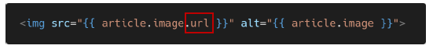
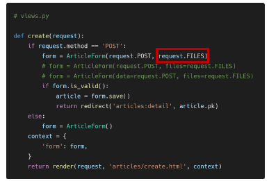

## 

 

## Handling HTTP requests & Media files

 

### 1.  Handling HTTP requests

 

* **Handling HTTP request**
  * Django에서 HTTP 요청을 처리하는 방법
    1. Django shortcut functions
    2. View decorators

 

* **1. Django shortcuts functions**
  * django.shortcust 패키지는 개발에 도움 될 수 잇는 여러 함수와 클래스를 제공
  * shortcuts function 종류
    * render()
    * redirect()
    * get_object_or_404()
      * ✨단일 객체를 조회하는것은 get과 똑같지만 예외가 발생했을대 다르게 return 해줌(500 -> 404)
    * get_list_or_404()

 

* **get_object_or_404()**
  * 모델 manager인 objects에서 get()을 호출하지만, 해당 객체가 없을 경우 DoesNotExist 예외 대신 Http 404를 raise
  * get()에 경우 조건에 맞는 데이터가 없을 경우에 예외를 발생 시킴
    * 코드 실행 단계에서 발생한 예외 및 에러에 대해서 브라우저는 http status code 500으로 인식함
  * ✨**상황에 따라 적절한 예외 처리**를 하고, 클라이언트에게 **✨올바른 에러 상황을 전달하는 것** 또한 개발의 중요한 요소 중 하나
  * index 페이지에서는 사용하면 안됨
    * 게시판이 비어 있으면 404를 줘서 적절하지 않은 사용 / 첫번째 글이 없으면 메인 페이지가 안 뜸
  * API로 서버를 쓸 때 사용 
    * ex. TMDB : 영화목록 조회 - JSON - 목록 없으면 404

 

* **2. Django View decorators**
  * Django는 다양한 HTTP 기능을 지원하기 위해 view 함수에 적용할 수 있는 여러 데코레이터를 제공
  * [참고] Decorator(데코레이터)
    * 어떤 함수에 기능을 추가하고 싶을 대, 해당 함수를 수정하지 않고 기능을 연장 해주는 함수
    * 즉, 원본 함수를 수정하지 않으면서 추가 기능만을 구현할 때 사용
  * Allowed HTTP methods
    * 요청 메서드에 따라 view 함수에 대한 엑세스를 제한
    * 요청이 조건을 충족시키지 못하면 HttpResponseNotAllowed을 return (405 Method Not Allowed)
    * require_http_method(), require_POST(), require_safe(), require_GET()
      1. require_http_method()
         * view 함수가 특정한 method 요청에 대해서만 허용하도록 하는 데코레이터
      2. require_POST() => delete
         * view 함수가 POST method 요청만 승인하도록 하는 데코레이터
      3. require_safe() => GET => index, detail
         * view 함수가 GET 및 HEAD method만 허용하도록 요구하는 데코레이터
         * django는 require_GET 대신 require_safe를 사용하는 것을 권장	
  * View decorator 작성
  * delete view 함수 코드 변경
    * 불필요해진 코드 삭제
  * URL로 delete 요청 후 405 http status code 확인

 

* **결론**
  * HTTP 요청에 따라 적절한 예외처리 혹은 데코레이터를 사용해 서버를 보호하고 클라이언트에게 정확한 상황을 제공하는 것의 중요성

 

---

 

### 2. Media files(이미지 업로드)

 

* **Media files**
  * 미디어 파일
  * 사용자가 웹에서 업로드하는 정적 파일 (user-uploaded)
  * 유저가 업로드 한 모든 정적 파일

 

* **Model field**
  * ImageField()
    * 이미지 업로드에 사용하는 모델 필드
    * FileField를 상속받는 서브 클래스이기 때문에 FileField의 모든 속성 및 메서드를 사용 가능하며, 더해서 사용자에 의해 업로드 된 객체가 유효한 이미지인지 검사함
    * ImageField 인스턴스는 **✨최대 길이가 100자인 문자열로 DB에 생성(사진으로 저장되는게 아니라 이미지의 경로가 저장됨)**되며, max_length 인자를 사용하여 최대 길이를 변경 할 수 있음
    * ✨[주의] 사용하려면 반드시 Pillow 라이브러리가 필요
  * FileField()
    * 파일 업로드에 사용하는 모델 필드
    * 2개의 선택 인자를 가지고 있음
      1. upload_to
      2. storage

 

* **ImageField 작성**
  * upload_to = 'image/'
    * 실제 이미지가 저장되는 경로를 지정
  * blank=True
    * 이미지 필드에 빈 값(빈 문자열)이 허용되도록 설정(이미지를 선택적으로 업로드 할 수 있도록) / 필수 선택 안해도 되게 해줌
    * 

 

* **'upload_to' argument**
  * 업로드 디렉토리와 파일 이름을 설정하는 2가지 방법을 제공
    1. 문자열 값이나 경로 지정
    2. 함수 호출

 

* **'upload_to' argument - 1. 문자열 경로 지정 방식**
  * 파이썬의 strftime() 형식이 포함될 수 있으며, 이는 파일 업로드 날짜/시간으로 대체 됨

 

* **[참고] time 모듈의 strftime()**
  * time.strftime(format[, t])
  * 날짜 및 시간 객체를 문자열 표현으로 변환하는 데 사용됨
  * 하나 이상의 형식화된 코드 입력을 받아 문자열 표현을 반환

 

* **'upload_to' argument - 2. 함수 호출 방식**
  * 반드시 2개의 인자(instance, filename)를 사용 함
    1. instance
       * FileField가 정의된 모델의 인스턴스
       * 대부분 이 객체는 아직 데이터베이스에 저장되지 않았으므로 PK 값이 아직 없을 수 있음
    2. filename
       * 기존 파일에 제공된 파일 이름
    3. 

 

* **Model field option - "blank"**
  * 기본 값 : False
  * True인 경우 필드를 비워 둘 수 있음
    * DB에는 ''(빈 문자열)이 저장됨
  * 유효성 검사에서 사용 됨(is_valid)
    * 모델 필드에 blank = True를 작성하면 form 유효성 검사에서 빈 값을 입력할 수 있음

 

* **Model field option - "null"**
  * 기본 값 : False
  * True인 경우 django는 빈 값에 대해 DB에 NULL로 저장
  * 주의 사항
    * CharField, TextField와 같은 **✨문자열 기반 필드에는 사용하는 것을 피해야 함**
    * 문자열 기반 필드에 True로 설정 시 '데이터 없음(no data)'에 "빈 문자열(1)"과 "NULL(2)"의 2가지 가능한 값이 있음을 의미하게 됨
    * 대부분의 경우 "데이터 없음"에 대해 두 개의 가능한 값을 갖는 것은 중복되는 것이며, Django는 NULL이 아닌 빈 문자열을 사용하는 것이 규칙
  * 빈 값과 None/Null은 다름

 

* **blank & null 비교**
  * blank
    * Validation - related
  * null
    * Database - related
  * 문자열 기반 및 비문자열 기반 필드 모두에 대해 null option은 DB에만 영향을 미치므로, form에서 빈 값을 허용하려면 **✨blank = True**를 설정해야 함
  * 

 

* **ImageField(or FileFiled)를 사용하기 위한 몇 가지 단계**
  1. settings.py에 MEDIA_ROOT, MEDIA_URL 설정 = > STATIC_ROOT
  2. upload_to 속성을 정의하여 업로드 된 파일에 사용할 MEDIA_ROOT의 하위 경로를 지정
  3. 업로드 된 파일의 경로는 django가 제공하는 'url' 속성을 통해 얻을 수 있음
     * 

 

* **MEDIA_ROOT**
  * 사용자가 업로드 한 파일(미디어 파일)들을 보관할 디렉토리의 절대 경로
  * django는 성능을 위해 업로드 파일은 데이터베이스에 저장하지 않음
    * 실제 데이터베이스에 저장되는 것은 **✨파일의 경로** - 문자열
  * [주의] MEDIA_ROOT는 STATIC_ROOT와 반드시 다른 경로로 지정해야 함
    * 

 

* **MEDIA_URL**
  * MEDIA_ROOT에서 제공되는 미디어를 처리하는 URL
  * 업로드 된 파일의 주소(URL)를 만들어 주는 역할
    * 웹 서버 사용자가 사용하는 public URL
  * 비어 있지 않은 값으로 설정 한다면 반드시 slash(/)로 끝나야 함
  * [주의] MEDIA_URL은 STATIC_URL과 반드시 다른 경로로 지정해야 함
    * 

 

* **개발 단계에서 사용자가 업로드 한 파일 제공하기**
  * settings.MEDIA_URL
    * 업로드 된 파일의 URL
  * settings.MEDIA_ROOT
    * MEDIA_URL을 통해 참조하는 파일의 실제 위치
    * 
    * +로 연결하는 이유 : 리스트 라서

 

---

 

### 3. 이미지 업로드(CREATE)

 

* 게시글 작성 form에 enctype 속성 지정
  * 

* **form 태그 - enctype(인코딩) 속성**
  1. multipart / form-data
     * 파일 / 이미지 업로드 시에 반드시 사용해야 함 (전송되는 데이터의 형식을 지정)
       * Input이 파일일때는 인코딩 속성이 필요함
     * `<input tpye = "file"`을 사용할 경우에 사용
  2. application / x-www-form-urlencoded
     * (기본값) 모든 문자 인코딩
  3. text / plain
     * 인코딩을 하지 않은 문자 상태로 전송
     * 공백은 '+' 기호로 변환하지만, 특수 문자는 인코딩 하지 않음

 

* input 요소의 accept 속성 확인
  * 
* **input 요소 - accept 속성**
  * 입력 허용할 파일 유형을 나타내는 문자열
  * 쉼표로 구분된 "고유 파일 유형 지정자" (unique file type specifiers)
  * **✨파일을 검증 하는 것은 아님** (accept 속성 값을 image라고 하더라도 비디오나 오디오 및 다른 형식 파일을 제출할 수 있음)
  * 고유 파일 유형 지정자
    * `<input type = "file">`에서 선택할 수  있는 파일의 종류를 설명하는 문자열
  * 파일 업로드 시 허용할 파일 형식에 대해 자동으로 필터링
    * 

 

* **views.py 수정**
  * 업로드 한 파일은 request.FILES 객체로 전달됨
    * 
    * Title과 Content = > request.POST
    * 파일 => request.FILES
    * 서버에서 다른 값으로 넘어감

 

* **DB 및 파일 트리 확인**
  * 실제 파일 위치
    * MEDIA_ROOT/images/
    * 
  * DB에 저장되는 것은 이미지 파일 자체가 아닌 **✨파일의 경로**
    * 

 

---

 

### 4. 

  
