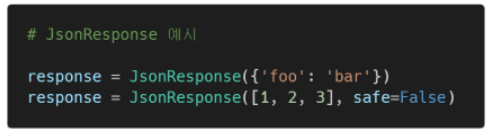
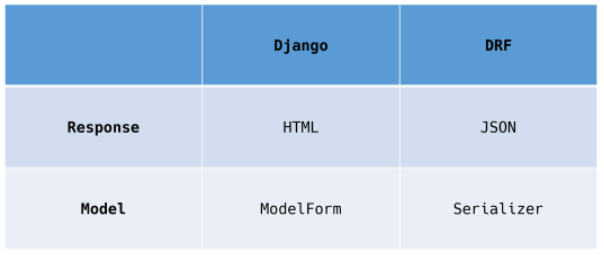
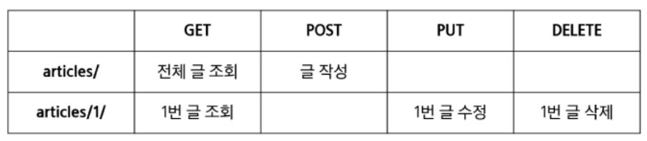

## 

 

## REST_API

 

### 1.  HTTP

 

* **HTTP**
  * HyperText Transfer Protocol
  * 웹 상에서 컨텐츠를 전송하기 위한 약속
  * HTML 문서와 같은 리소스들을 가져올 수 있도록 하는 프로토콜(규칙, 약속)
  * 웹에서 이루어지는 모든 데이터 교환의 기초 (✨웹에서 이루어지는 데이터 교환은 요청/응답 둘 중 하나임)
    * 요청(request)
      * 클라이언트에 의해 전송되는 메시지
    * 응답(response)
      * 서버에서 응답으로 전송되는 메시지
  * 기본 특성
    * Stateless(무상태)
    * Connectionless(비연결 지향)
  * 쿠키와 세션을 통해 서버 상태를 요청과 연결하도록 함

 

* **HTTP 메시지**
  * 

 

* **HTTP request methods**
  * 자원에 대한 행위(수행하고자 하는 동작)을 정의
  * 주어진 리소스(자원)에 수행하길 원하는 행동을 나타냄
  * HTTP Method 예시
    * GET, POST, PUT, DELETE
    * 조회, 작성, 수정 ,삭제

 

* **HTTP response status codes**
  * 특정 HTTP 요청이 성공적으로 완료되었는지 여부를 나타냄
  * 응답은 5개의 그룹으로 나뉘어짐
    1. Informational responses (1xx)
    2. Successful responses (2xx)
    3. Redirection messages (3xx)
    4. Client error responses (4xx)
    5. Server error responses (5xx)

 

* **웹에서의 리소스 식별**
  * HTTP 요청의 대상을 리소스(resource, 자원)라고 함
  * 리소스는 문서, 사진 도는 기타 어떤 것이든 될 수 있음
  * 각 리소스는 리소스 식별을 위해 HTTP 전체에서 사용되는 URI(Uniform Resource Identifier)로 식별됨

 

* **URL, URN**
  * URL(Uniform Resource Locator)
    * 통합 자원 위치
    * 네트워크 상에 자원이 어디 있는지 알려주기 위한 약속
    * 과거에는 실제 자원의 위치를 나타냈지만 현재는 추상화된 의미론적인 구성
    * '웹 주소', '링크'라고도 불림
  * URN(Uniform Resource Name)
    * 통합 자원 이름
    * URL과 달리 자원의 위치에 영향을 받지않는 유일한 이름 역할을 함
    * 예시
      * ISBN(국제표준도서번호)

 

* **URI**
  * Uniform Resource Identifier
    * 통합 자원 식별자
    * 인터넷의 자원을 식별하는 유일한 주소 (정보의 자원을 표현)
    * 인터넷에서 자원을 식별하거나 이름을 지정하는데 사용되는 간단한 문자열
    * 하위 개념
      * URL, URN
  * URI는 크게 URL과 URN으로 나눌 수 있지만, URN을 사용하는 비중이 매우 적기 때문에 일반적으로 URL은 URI와 같은 의미처럼 사용하기도 함
  * ✨정보를 어떻게 표현 할 것인가?
    * naver.com : 네이버 메인 페이지를 식별하기 위한 유일한 주소

​	

 

* **URI 의 구조**
  * Scheme (protocol)
    * 브라우저가 사용해야 하는 프로토콜
    * http(s), data, file, ftp, mailto
    * 
  * Host (Domain name)
    * 요청을 받는 웹 서버의 이름
    * IP address를 직접 사용할 수도 있지만, 실 사용시 불편하므로 웹에서 그리 자주 사용되지는 않음 (google의 IP address - 142.251.42.142) - 구글 홈페이지 리다이렉트
    * 
  * Port
    * 웹 서버 상의 리소스에 접근하는데 사용되는 기술적인 '문(gate)'
    * HTTP 프로토콜의 표준 포트
      * HTTP 80
      * HTTPS 443
    * 
  * Path
    * 웹 서버 상의 리소스 경로
    * 초기에는 실제 파일이 위치한 물리적 위치를 나타냈지만, 오늘날은 물리적인 실제 위치가 아닌 추상화 형태의 구조로 표현
    * 
  * Query (Identifier)
    * Query String Parameters
    * 웹 서버에 제공되는 추가적인 매개 변수
    * & 로 구분되는 key-value 목록
    * 
    * 검색을 할 때 나타남
  * Fragment
    * Anchor
    * 자원 안에서의 북마크의 한 종류를 나타냄
    * 브라우저에게 해당 문서(HTML)의 특정 부분을 보여주기 위한 방법
    * 브라우저에게 알려주는 요소이기 때문에 fragment identifier(부분 식별자)라고 부르며 '#' 뒤의 부븐은 요청이 서버에 보내지지 않음
    * 
    * 특점 지점에 대한 공유 가능 / # 전까지만 서버에 요청 / # 뒤의 fragment는 브라우저가 이동을 시켜주는 것

 

---

 

### 2. RESTful API

 

* **API**
  * Application Programming Interface
  * 프로그래밍 언어가 제공하는 기능을 수행할 수 있게 만든 인터페이스
    * 애플리케이션과 프로그래밍으로 소통하는 방법
    * CLI는 명령줄, GUI는 그래픽(아이콘), API는 프로그래밍을 통해 특정한 기능 수행
  * Web API
    * 웹 애플리케이션 개발에서 다른 서비스에 요청을 보내고 응답을 받기 위해 정의된 명세
    * 현재 웹 개발은 모든 것을 직접 개발하기 보다 여러 Open API를 활용하는 추세
  * 응답 데이터 타입
    * HTML, XML, JSON 등
  * 대표적인 API 서비스 목록
    * Youtube API, Naver Papago API, Kakao Map API ...

 

* **REST**
  * REpresentational State Transfer
  * API Server를 개발하기 위한 일종의 소프트웨어 설계 방법론(✨URI를 어떤 구조로 정의할 것인가에 대한 방법론)
    * 2000년 로이 필딩의 박사학위 논문에서 처음으로 소개 된 후 네트워킹 문화에 널리 퍼짐
  * 네트워크 구조(Network Architecture) 원리의 모음
    * 자원을 정의하고 자원에 대한 주소를 지정하는 전반적인 방법
  * REST 원리를 따르는 시스템을 RESTful 이란 용어로 지칭함
  * 자원을 정의하는 방법에 대한 고민
    * ex. 정의된 자원을 어디에 위치 시킬 것인가
  * REST의 자원과 주소의 지정 방법
    1. 자원
       * URI
    2. 행위
       * HTTP Method
    3. 표현
       * 자원과 행위를 통해 궁극적으로 표현되는 (추상화된) 결과물
       * JSON으로 표현된 데이터를 제공

 

* **JSON**
  * JSON(JavaScript Object Notation)
    * JSON is a lightweight data-interchange format
    * JavaScript의 표기법을 따른 단순 문자열
  * 특징
    * 사람이 읽거나 쓰기 쉽고 기계가 파싱(해석, 분석)하고 만들어내기 쉬움
    * 파이썬의 dictionary, 자바스크립트의 object처럼 C 계열의 언어가 갖고 있는 자료구조로 쉽게 변화할 수 있는 key-value 형태의 구조를 갖고 있음

 

* **REST**
  * REST의 핵심 규칙
    1. '정보'는 URI로 표현
    2. 자원에 대한 '행위'는 HTTP Method로 표현 (GET, POST, PUT, DELETE)
  * 설계 방법론은 지키지 않았을 때 잃는 것보다 지켰을 때 얻는 것이 훨씬 많음
    * 단, 설계 방법론을 지키지 않더라도 동작 여부에 큰 영향을 미치지는 않음

 

- **RESTful API**
  - REST 원리를 따라 설계한 API
  - RESTful servieces, 혹은 simply REST services라고도 부름
  - 프로그래밍을 통해 클라이언트의 요청에 JSON을 응답하는 서버를 구성
    - 지금까지 사용자의 입장에서 썼던 API를 제공자의 입장이 되어 개발해보기

 

---

 

### 3. Response

 

* **Init Project**
  * 제공된 프로젝트 실행 / 가상환경 설정 및 패키지 설치 / 설치된 app 확인 / 작성된 url 확인

 

* **Create Dummy Data**
  * 작성된 model 확인 / django-seed 라이브러리를 사용해 모델 구조에 맞는 데이터 생성

 

* **1. Response - HTML**
  * HTML을 응답하는 서버

 

* **2. Response - JsonResponse**
  * JsonResponse 객체를 활용한 JSON 데이터 응답 / 확인
    * 딕셔너리 형태로 append 되고 있음
  * Content-Type entity header
    * 데이터의 media type(MIME type, content type)을 나타내기 위해 사용됨
    * 응답 내에 있는 컨텐츠의 유형이 실제로 무엇인지 클라이언트에게 알려줌
  * JsonResponse objects
    * JSON-encoded response를 만드는 HttpResponse의 서브 클래스
    * "safe" parameter
      * True (기본값)
      * dict 이외의 객체를 직렬화(Serialization)하려면 False로 설정해야 함
      * 

 

* **Serialization**
  * "직렬화"
  * 데이터 구조나 객체 상태를 동일하거나 다른 컴퓨터 환경에 저장하고, 나중에 재구성할 수 있는 포맷으로 변환하는 과정
  * Serializers in Django
    * Queryset 및 Model Instance와 같은 복잡한 데이터를 JSON, XML 등의 유형으로 쉽게 변환 할 수 있는 **✨Python 데이터 타입**으로 만들어 줌

 

* **3. Response - Django Serializer**
  * Django의 내장 HttpResponse를 활용한 JSON 응답 / 객체 / 확인
  * 주어진 모델 정보를 활용하기 때문에 이전과 달리 필드를 개별적으로 직접 만들어 줄 필요 없음
    * articles - 쿼리셋
    * data - 직렬화된 객체
    * model / pk / fields 가 생김

 

* **4. Response - Django REST Framework**
  * Django REST framework(DRF) 라이브러리를 사용한 JSON 응답
    * 사용법은 ModleForm과 동일하게 맞춰져 있음
    * many=True : 단일 객체가 아닐때 쓰는 옵션
  * 설치 과정 확인
  * DRF 라이브러리를 사용한 JSON 응답 url 확인
  * Article 모델에 맞춰 자동으로 필드를 생성해 serialize 해주는 ModelSerializer 확인
  * DRF의 Response()를 활용해 Serialize된 JSON 객체 응답
    * 실제 API를 사용해서 응답 받을 때는 JSON 데이터를 받을 수 있음
    * 브라우저에서 출력할때는 문서를 출력
  * DRF 라이브러리를 사용한 JSON 응답 확인
  * python 파일을 통해 직접 요청 보낸 후 응답 확인해보기(requests 라이브러리를 활용)
    * .json으로 안 받으면 그냥 객체
    * ✨템플릿이 1개 제외하고 없음 / Model과 View를 통해서 json을 응답하는 RESTful한 장고 서버 만들기!

 

* **Django REST Framework(DRF)**
  * Web API 구축을 위한 강력한 Toolkit을 제공하는 라이브러리
  * DRF의 Serializer는 Django의 Form 및 ✨ModelForm 클래스와 매우 유사하게 구성되고 작동함
  * Web API
    * 웹 애플리케이션 개발에서 다른 서비스에 요청을 보내고 응답을 받기 위해 정의된 명세

 

* **Django ModelForm vs. DRF Serializer**
  * 

 

---

 

### 4. Single Model

 

* 데이터를 한번에 많이 받기 때문에 json 사용
* 계속 json 응답을 받아서 부분적으로 갱신 / 페이지로 받으면 계속 새로 고침됨

 

* **DRF with Single Model**
  * 단일 모델의 data를 직렬화(serialization)하여 JSON으로 변환하는 방법에 대한 학습
  * 단일 모델을 두고 CRUD 로직을 수행 가능하도록 설계
  * API 개발을 위한 핵심 기능을 제공하는 도구 활용
    * DRF built-in form
    * Postman

 

* **[참고] Postman**
  * API를 구축하고 사용하기 위해 여러 도구를 제공하는 API 플랫폼
  * 설계, 테스트, 문서화 등의 도구를 제공함으로써 API를 더 빠르게 개발 및 생성 할 수 있도록 도움

 

* **Init Project**
  * 제공된 프로젝트 진행 / 가상환경 설정 및 패키지 설치 / 설치된 app 확인 / 작성된 url 확인 / 작성된 model 확인 / django-seed 라이브러리를 사용해 모델 구조에 맞는 데이터 생성

 

* **ModelSerializer**
  * 모델 필드에 해당하는 필드가 있는 Serializer 클래스를 자동으로 만들 수 있는 shortcut
  * 아래 핵심 기능을 제공
    1. 모델 정보에 맟춰 자동으로 필드 생성
    2. serializer에 대한 유효성 검사기를 자동으로 생성
    3. .create() & .update()의 간단한 기본 구현이 포함됨
  * Model의 필드를 어떻게 '직렬화'할 지 설정하는 것이 핵심
  * 이 과정은 Django에서 Model의 필드를 설정하는 것과 동일함

 

* **Serializer in Shell**
  * shell_plus에서 serializer 사용해보기
    * quertset에서 serializer를 만들면 .data에서 오류 발생
    * 단일 객체가 아니기 때문임 => many=True를 줘야함

 

* **'many' argument**
  * many=True
    * "Serializing multiple objects"
    * 단일 인스턴스 대신 QuerySet 등을 직렬화하기 위해서는 serializer를 인스턴스화 할 때 many=True를 키워드 인자로 전달해야함

 

* **Build RESTful API**
  * 
    * 2개의 view 함수

 

* **1. GET - Article List**
  * url 및 view 함수 작성
    * app.name은 필요가 없음 => 템플릿이 없으므로
    * 전체 게시글에 대한 형태를 json으로 만들어주는 view 함수
  * **✨api_view** decorator
    * 기본적으로 GET 메서드만 허용되며 다른 메서드 요청에 대해서는 405 Method Not Allowed로 응답
    * View 함수가 응답해야 하는 HTTP 메서드의 목록을 리스트의 인자로 받음
    * DRF에서는 선택이 아닌 **✨필수적으로 작성**해야 해당 view 함수가 정상적으로 동작함
  * GET 요청 후 응답 확인
    * 응답의 내용을 조정
    * 데이터 없을때는 404 줘도 되므로 get_list_or_404 사용 (게시판에서는 X)

 

* **2. GET - Article Detail**
  * Article List와 Article Detail을 구분하기 위해 추가 Serializer 정의
  * 모든 필드를 직렬화하기 위해 fields 옵션을 `'__all__'`로 설정
    * 상황에 따른 구분
      * 전체 조회에서는 일부분을 보고 싶을때
      * 특정 데이터에서는 전체를 보고 싶을때
  * url 및 view 함수 작성 
  * GET 요청 후 응답 확인

 

* **3. POST - Create Article**
  * 201 Created 상태 코드 및 메시지 응답
  * RESTful 구조에 맞게 작성
    1. URI는 자원을 표현
    2. 자원을 조작하는 행위는 HTTP Method
  * article_list 함수로 게시글을 조회하거나 생성하는 행위를 모두 처리 가능
  * view 함수 수정
    * view 함수의 직관성을 중요시함
  * HTTP body에 form-data로 title과 content 데이터 작성
  * POST 요청 후 응답 확인
  * raise_exception 작성

 

* **Status Codes in DRF**
  * DRF에는 status code를 보다 명확하고 읽기 쉽게 만드는 데 사용할 수 잇는 정의된 상수 집합을 제공
  * **status** 모듈에 HTTP status code 집합이 모두 포함되어 있음
  * 단순히 status=201 같은 표현으로도 사용할 수 있지만 DRF는 권장하지 않음

 

* **'raise_exception' argument**
  * "Raising an exception on invalid data"
  * is_valid()는 유효성 검사 오류가 있는 경우 serializers.ValideationError 예외를 발생시키는 선택적 raise_exception 인자를 사용 할 수 있음
  * ✨DRF에서 제공하는 기본 예외 처리기에 의해 자동으로 처리되며, 기본적으로 HTTP status code 400을 응답으로 반환함

 

* **4. DELETE - Delete Article**
  * 204 No Content 상태 코드 및 메시지 응답
  * article_detail 함수로 상세 게시글을 조회하거나 삭제하는 행위 모두 처리 가능
  * DELETE 요청 후 응답 확인

 

* **5. PUT - Update Article**
  * article_detail 함수로 상세 게시글을 조회하거나, 삭제, 수정하는 행위 모두 처리 가능
  * HTTP body에 form-data로 title과 content 수정 데이터 작성
  * PUT 요청 후 응답 확인

 

---

 

### 5. 1:N Relation

 

* **DRF with 1:N Relation**
  * 1:N 관계에서의 모델 data를 직렬화(serialization)하여 JSON으로 변환하는 방법에 대한 학습
  * 2개 이상의 1:N 관계를 맺는 모델을 두고 CRUD 로직을 수행 가능하도록 설계하기
  * 데이터 베이스 초기화 후 Comment 모델 작성
  * 마이그레이션 작업 후 data seed 진행

 

* **1. GET - Comment List**
  * CommentSerializer 작성
  * url 작성 및 comment_list 함수 정의
  * GET 요청 후 응답 확인

 

* **2. GET - Comment Detial**
  * url 작성 및 comment_detail 함수 정의
  * GET 요청 후 응답 확인

 

* **3. POST - Create Comment**
  * url 및 comment_create 함수 작성
  * POST 요청 시도
  * Article 생성과 달리 Comment 생성은 생성 시에 참조하는 모델의 객체 정보가 필요
    * 1:N 관계에서 N은 어떤 1을 참조하는지에 대한 정보가 필요하기 때문 (외래 키)

 

* **Passing Additional attributes to .save()**
  * .save() 메서드는 특정 Serializer 인스턴스를 저장하는 과정에서 추가적인 데이터를 받을 수 있음
    * 인스턴스를 저장하는 시점에 추가 데이터 삽입이 필요한 경우

 

* **3. POST - Create Comment**
  * POST 요청 재시도
  * article 필드에 대해 "이 필드는 필수 항목입니다."라는 응답을 수신

 

* **Read Only Field(읽기 전용 필드)**
  * 어떤 게시글에 작성하는 댓글인지에 대한 정보를 form-data로 넘겨주지 않았기 때문에 직렬화하는 과정에서 article 필드가 유효성 검사(is_valid)를 통과하지 못함
    * CommentSerializer에서 article field에 해당하는 데이터 도한 요청으로 다시 받아서 직렬화하는 것으로 설정되었기 때문
  * 이때는 읽기 전용 필드(read_only_fields) 설정을 통해 직렬화하지 않고 반환 값에만 해당 필드가 포함되도록 설정 할 수 있음
  * 설정을 넣고 POST 요청 재시도

 

* **4. DELETE & PUT - delete, update Comment**
  * Article 생성 로직에서와 마찬가지로 comment_detail 함수가 모두 처리할 수 있도록 작성
  * DELETE 요청 후 응답 확인
  * PUT 요청 후 응답 확인

 

* **1:N Serializer**
  1. 특정 게시글에 작성된 댓글 목록 출력하기
     * 기존 필드 override
  2. 특정 게시글에 작성된 댓글의 개수 구하기
     * 새로운 필드 추가

 

* **1. 특정 게시글에 작성된 댓글 목록 출력하기**
  * Serializer는 기존 필드를 override하거나 추가 필드를 구성할 수 있음
  * 우리가 작성한 로직에서는 크게 2가지 형태로 구성할 수 있음
    1. PrimaryKeyRelatedField
    2. Nested relationships
  * case 1) PrimaryKeyRelatedField
    * pk를 사용하여 관계된 대상을 나타내는 데 사용할 수 있음
    * 필드가 to many relationships(N)를 나타내는데 사용되는 경우 many=True 속성 필요
    * comment_set 필드 값을 form-data로 받지 않으므로 read_only=True 설정 필요
    * [참고] 역참조 시 생성되는 comment_set을 다른 매니저 이름으로 override 할 수 있음
      * 단, 다음과 같이 수정할 경우 이전 serializers.py에서의 클래스 변수명도 일치하도록 수정해야함
    * GET 요청 후 응답 확인
  * case 2) Nested relationships
    * 모델 관계상으로 참조된 대상은 참조하는 대상의 표현(응답)에 포함되거나 중첩(nested) 될 수 있음
    * 이러한 중첩된 관계는 serializers를 필드로 사용하여 표현할 수 있음
    * 두 클래스의 상하위치 변경
    * GET 요청 후 응답 확인

 

* **2. 특정 게시글에 작성된 댓글의 개수 구하기**
  * comment_set 매니저는 모델 관계로 인해 자동으로 구성되기 때문에 커스텀 필드를 구성하지 않아도 comment_set이라는 필드명을 fields 옵션에 작성만 해도 사용 할 수 있었음
  * 하지만 지금처럼 별도의 값을 위한 필드를 사용하려는 경우 자동으로 구성되는 매니저가 아니기 때문에 직접 필드를 작성해야 함
  * 'source' arguments
    * 필드를 채우는 데 사용 할 속성의 이름
    * 점 표기법(dot notation)을 사용하여 속성을 탐색 할 수 있음
    * comment_set이라는 필드에 .(dot)을 통해 전체 댓글의 개수 확인 가능
    * .count()는 built0in Queryset API 중 하나
    * GET 요청 후 응답 확인

 

* **[주의 사항] 'read_only_fields' shortcut issue**
  * 특정 필드를 override 혹은 추가한 경우 read_only_fields shortcut으로 사용할 수 없음

 

* **추가 사항**
  * AuthenticationForm => Form
  * UserCreationForm => ModelForm
  * UserChangeForm => ModelForm
  * PasswordChangeForm => Form
  * SSR(server side rendering) / CSR(client side rendering)
  * PATCH or PUT : 멱등성
  * 정규표현식
  * swagger

