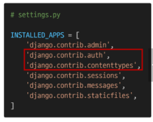
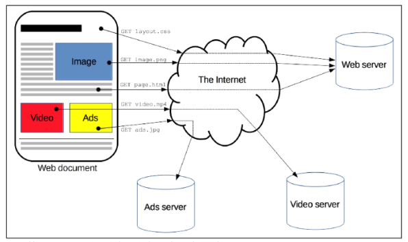
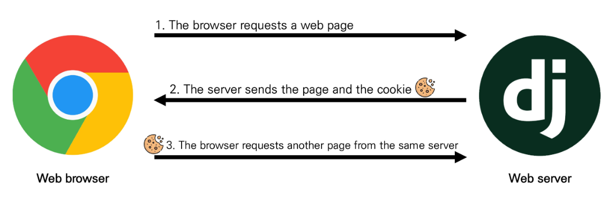
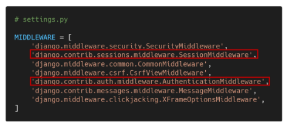
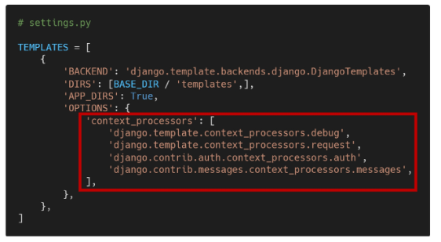
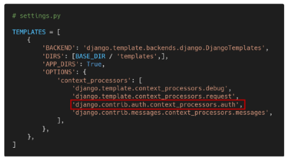
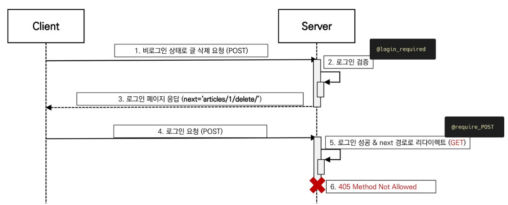
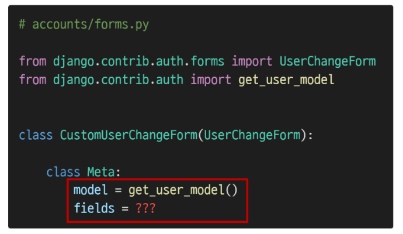
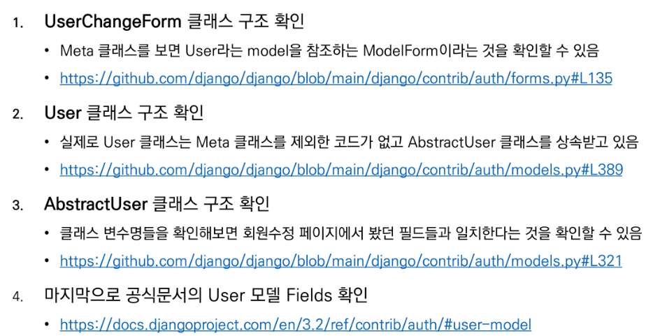
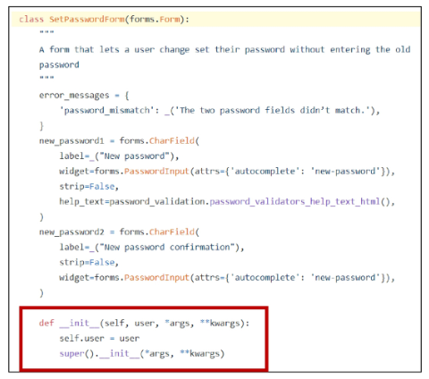

## 

 

## Authentication System 1

 

### 1.  The Django Authentication System

 

* **The Django Authentication System**
  * Django 인증 시스템은 django.contrib.auth에 Django contrib module로 제공
  * 필수 구성은 settings.py에 이미 포함되어 있으며 INSTALLED_APPS 설정에 나열된 아래 두 항목으로 구성됨
    1.  django.cotrib.auth
       * 인증 프레임워크의 핵심과 기본 모델을 포함
    2. django.contrib.contenttypes
       * 사용자가 생성한 모델과 권한을 연결할 수 있음
  * 
  * Django 인증 시스템은 ✨**인증(Authentication)**과 ✨**권한(Authorization)** 부여를 함께 제공(처리)하며, 이러한 기능이 어느 정도 결합되어 일반적으로 인증 시스템이라고 함

 

* **Authentication & Authorization**
  * Authentication (인증)
    * 신원 확인
    * 사용자가 자신이 누구인지 확인하는 것
  * Authorization (권한, 허가)
    * 권한 부여
    * 인증된 사용자가 수행할 수 있는 작업을 결정

 

- **두번째 앱 (accounts) 생성하기**
  - app 이름이 반드시 accounts 일 필요는 없음
  - 단, auth와 관련해 Django 내부적으로 accounts라는 이름으로 사용되고 있기 때문에 되도록 **✨accounts로 지정하는 것을 권장**
  - app 등록 및 url 설정

 

---

 

### 2. 쿠키와 세션

 

* **HTTP**
  * Hyper Text Transfer Protocol
    * HTML 문서와 같은 리소스(자원, 데이터)들을 가져올 수 있도록 해주는 프로토콜(규칙, 규약)
    * 웹에서 이루어지는 모든 데이터 교환의 기초
    * 클라이언트 - 서버 프로토콜이기도 함
    * 
    * HTTPS - S는 secure / 보안성 증대

 

* **HTTP 특징**
  * 비연결지향 (connectionless)
    * 서버는 요청에 대한 응답을 보낸 후 연결을 끊음(✨요청에 대한 응답만 주고 연결을 끊음)
  * 무상태 (stateless)
    * 연결을 끊는 순간 클라이언트와 서버 간의 통신이 끝나며 상태 정보가 유지되지 않음
    * 클라이언트와 서버가 주고 받는 메시지들은 서로 완전히 독립적임
  * **💥클라이언트와 서버의 지속적인 관계를 유지하기 위해 쿠키와 세션이 존재**(✨로그인 상태 등은 유지되어야 하므로)

 

* **쿠키(Cookie) 개념**
  * 서버가 사용자의 웹 브라우저에 전송하는 작은 데이터 조각
  * 사용자가 웹사이트를 방문할 경우 해당 웹사이트의 서버를 통해 사용자의 컴퓨터에 설치(배치, placed-on)되는 작은 기록 정보 파일
    * 브라우저(클라이언트)는 쿠키를 로컬에 KEY-VALUE의 데이터 형식으로 저장
    * 이렇게 쿠키를 저장해 놓았다가, 동일한 서버에 재 요청시 저장된 쿠키를 함께 전송(✨모든 요청마다 쿠키도 계속 같이 보냄 / HTTP는 상태가 유지되지 않기 때문에)
  * [참고] 소프트웨어가 아니기 때문에 프로그램처럼 실행 될 수 없으며 악성코드를 설치 할 수 없지만, 사용자의 행동을 추적하거나 쿠키를 훔쳐서 해당 사용자의 계정 접근 권한을 획득 할 수도 있음
  * HTTP 쿠키는 상태가 있는 세션을 만들어 줌
  * 쿠키는 두 요청이 동일한 브라우저에서 들어왔는지 아닌지를 판단할 때 주로 사용
    * 이를 이용해 사용자의 로그인 상태를 유지할 수 있음
    * 상태가 없는(stateless) HTTP 프로토콜에서 상태 정보를 기억 시켜주기 때문
  * **💥웹 페이지에 접속하면 요청한 웹 페이지를 받으며 쿠키를 저장하고, 클라이언트가 같은 서버에 재 요청시 요청과 함께 쿠키도 함께 전송**

 

* **요청과 응답**
  * 

 

* **쿠키의 사용 목적**
  1. 세션 관리(Session management)
     * 로그인, 아이디 자동 완성, 공지 하루 안보기, 팝업 체크, 장바구니 등의 정보 관리
  2. 개인화(Personalization)
     * 사용자 선호, 테마 등의 설정
  3. 트래킹(Tracking)
     * 사용자 행동을 기록 및 분석

 

* **쿠키를 이용한 장바구니 예시**
  * 장바구니에 상품 담기
  * 개발자 도구 - Network 탭 - cartView.pang 확인 / 서버는 응답과 함께 **Set-Cookie** 응답 헤더를 브라우저에게 전송 / 이 헤더는 클라이언트에게 쿠키를 저장하라고 전달
  * Cookie 데이터 자세히 확인
  * 메인 페이지 이동 - 장바구니 유지 상태 확인 / 이제 서버로 전송되는 모든 요청과 함께, 브라우저는 Cookie HTTP 헤더를 사용해 서버로 이전에 저장했던 모든 쿠키들을 함께 전송
  * 개발자 도구 - Application 탭 - Cookies 마우스 우측 버튼 - Clear 후 새로고침
  * 빈 장바구니로 변경 확인

 

* **세션(Session)**
  * 사이트와 특정 브라우저 사이의 "상태(state)"를 유지시키는 것
  * 클라이언트가 서버에 접속하면 서버가 특정 **✨session id**를 발급하고, 클라이언트는 발급 받은 session id를 쿠키에 저장
    * 클라이언트가 다시 서버에 접속하면 요청과 함께 쿠키(session id가 저장된)를 서버에 전달
    * 쿠키는 요청 때마다 서버에 함께 전송되므로 서버에서 session id를 확인해 알맞은 로직을 처리
  * ID는 세션을 구별하기 위해 필요하며, 쿠키에는 ID만 저장함

 

* **세션을 이용한 Gitlab 예시**
  * Gitlab 로그인 - 개발자 도구 - Application 탭 / Gitlab 서버로부터 받아 저장된 session 쿠키 확인
  * session 삭제 후 페이지 새로고침 / 로그아웃 상태 변경 확인
  * 

 

* **쿠키 lifetime(수명)**

  * 쿠키의 수명은 두 가지 방법으로 정의할 수 있음

  1. Session cookies
     * 현재 세션이 종료되면 삭제됨
     * 브라우저가 "현재 세션(current session)"이 종료되는 시기를 정의
       * [참고] 일부 브라우저는 다시 시작할 때 세션 복원(session restoring)을 사용해 세션 쿠키가 오래 지속 될 수 있도록 함
  2. Persistent cookies(or Permanent cookies)
     * Expires 속성에 지정된 날짜 혹은 Max-Age 속성에 지정된 기간이 지나면 삭제

 

* **Session in Django**
  * Django의 세션은 미들웨어를 통해 구현됨
  * Django는 database-backed sessions 저장 방식을 기본 값으로 사용
    * (참고) 설정을 통해 cached, file-based, cookie-based 방식으로 변경 가능
  * Django는 특정 session id를 포함하는 쿠키를 사용해서 각각의 브라우저와 사이트가 연결된 세션을 알아냄
    * 세션 정보는 Django DB의 django_session 테이블에 저장됨
  * 모든 것을 세션으로 사용하려고 하면 사용자가 많을 때 서버에 부하가 걸릴 수 있음

 

* **Authentication System in MIDDLEWARE**
  * SessionMiddleware
    * 요청 전반에 걸쳐 세션을 관리
  * AuthenticationMiddleware
    * 세션을 사용하여 사용자를 요청과 연결
  * 

 

* **[참고] MIDDLEWARE(미들웨어)**
  * HTTP 요청과 응답 처리 중간에서 작동하는 시스템(hooks)
  * Django는 HTTP 요청이 들어오면 미들웨어를 거쳐 해당 URL에 등록되어 있는 view로 연결해주고, HTTP 응답 역시 미들웨어를 거쳐서 내보냄
  * 주로 데이터 관리, 애플리케이션 서비스, 메시징, 인증 및 API 관리를 담당

 

---

 

### 3. 로그인

 

* **로그인**
  * 로그인은 session을 Create하는 로직과 같음
  * Django는 우리가 session의 메커니즘에 생각하지 않게끔 도움을 줌
  * 이를 위해 인증에 관한 built-in forms를 제공

 

* **AutheticationForm**
  * 사용자 로그인을 위한 form
  * request를 첫번째 인자로 취함

 

* **login 함수** (✨save 대신 사용)
  * login(request, user, backend=None)
    * 현재 세션에 연결하려는 인증된 사용자가 있는 경우 login() 함수가 필요
    * 사용자를 로그인하며 view 함수에서 사용됨
    * HttpRequest 객체와 User 객체가 필요
    * Django의 session framework를 사용하여 세션에 user의 ID를 저장(== 로그인)
  * 💥ModelForm을 상속 받을 경우, 첫번째 인자는 데이터가 들어감 / Form을 상속 받을 경우, 첫번째 인자로 request, 두번째 인자로 데이터가 들어감
  * ✨로그인은 세션을 create / DB에 저장 X
  * 인증된 사용자이면 AuthenticationForm을 통과하게 됨
  * ✨login 함수 이름을 auth_login으로 변경 => login view 함수와의 혼동을 방지하기 위함
  * 로그인 후 브라우저와 Django DB에서 Django로부터 발급 받은 **✨sessionid** 확인
  * 세션에 대한 내용은 장고가 가지고 있음 / Django는 session에서 key만 브라우저에 전달

 

* **get_user()**
  * AuthenticationForm의 인스턴스 메서드
  * user_cache는 인스턴스 생성 시에 None으로 할당되며, 유효성 검사를 통과했을 경우 로그인 한 사용자 객체로 할당 됨
  * 인스턴스의 유효성을 먼저 확인하고, 인스턴스가 유효할 때만 user를 제공하려는 구조
  * 로그인 링크 작성

 

* **Authentication data in templates**
  * 현재 로그인 되어있는 유저 정보 출력
  * admin 로그인 전 / 후
  * context processors(이미 렌더링 되어 있어 사용 가능)
    * 템플릿이 렌더링 될 때 자동으로 호출 가능한 컨텍스트 데이터 목록
    * 작성된 프로세서는 RequestContext에서 사용 가능한 변수로 포함됨
    * 
  * Users
    * 템플릿 RequestContext를 렌더링할 때, 현재 로그인한 사용자를 나타내는 auth.User 인스턴스(또는 클라이언트가 로그인하지 않은 경우 AnonymousUser 인스턴스)는 템플릿 변수 **✨{{ user }}**에 저장됨
    * 
  * Built-in template context processors
    * django.contrib.auth.context_processors.auth
    * django.template.context_processors.debug
    * django.template.context_processors.i18n
    * ...

 

----

 

### 4. 로그아웃(세션을 삭제)

 

* **로그아웃**
  * 로그아웃은 session을 Delete하는 로직과 같음

 

* **logout 함수**(✨session key 삭제)
  * logout(request)
    * HttpRequest 객체를 인자로 받고 반환 값이 없음
    * 사용자가 로그인하지 않은 경우 오류를 발생시키지 않음
    * 현재 요청에 대한 session data를 DB에서 완전히 삭제하고, 클라이언트의 쿠키에서도 sessionid가 삭제됨
    * 이는 다른 사람이 동일한 웹 브라우저를 사용하여 로그인하고, **✨이전 사용자의 세션 데이터에 엑세스하는 것을 방지하기 위함**

 

---

 

### 5. 로그인 사용자에 대한 접근 제한

 

* **Limiting access to logged-in users**
  * 로그인 사용자에 대한 엑세스 제한 2가지 방법
    1. The raw way
       * is_authenticated attribute => 메서드가 아닌 속성값, T/F (✨로그인한 사람인지)
    2. The login_required decorator => @~~(✨로그인한 시점인지)

 

* **1. is_authenticated 속성** 
  * User model의 속성(attributes) 중 하나
  * 모든 User 인스턴스에 대해 항상 True인 읽기 전용 속성(AnonymousUser에 대해서는 항상 False)
  * 사용자가 인증 되었는지 여부를 알 수 있는 방법
  * 일반적으로 request.user에서 이 속성을 사용하여, 미들웨어의 'django.contrib.auth.middleware.AuthenticationMiddleware'를 통과 했는지 확인
  * 단, 권한(premission)과는 관련이 없으며, 사용자가 활성화 상태(active)이거나 유효한 세션(valid session)을 가지고 있는지도 확인하지 않음
  * => 단순히 User와 AnonymousUser만 구분해줌 / 권한, 보안 등등은 확인 X

 

* **is_authenticated 적용**
  * 로그인과 비로그인 상태에서 출력되는 링크를 다르게 설정
  * 인증된 사용자(로그인 상태)라면 로그인 로직을 수행할 수 없도록 처리
  * 인증된 사용자(로그인 상태)만 로그아웃 로직을 수행할 수 있도록 처리
  * 인증된 사용자(로그인 상태)만 게시글 작성 링크를 볼 수 있도록 처리
  * 💥@property가 붙어 함수를 변수처럼 사용 가능

 

* **2. login_required decorator**
  * 사용자가 로그인되어 있지 않으면, **✨settings.LOGIN_URL**에 설정된 문자열 기반 절대 경로로 redirect 함
    * LOGIN_URL의 기본 값은 '/accounts/login/'
    * 두번재 app 이름을 accounts로 했던 이유 중 하나
  * 사용자가 로그인되어 있으면 정상적으로 view 함수를 실행
  * 인증 성공 시 사용자가 redirect 되어야하는 경로는 'next'라는 쿼리 문자열 매개 변수에 저장됨
    * ex. /accounts/login/?next=/atricles/create
  * view 함수에서 login_required 데코레이터 작성 / 비로그인 상태에서 /accounts/create/ 경로로 요청 보내기 / URL에 next 문자열 매개변수 확인
  * 데코레이터가 2개 달리면 위에서부터 읽음
  * ✨로그인하라고 redirect시키고, next 파라미터도 붙임

 

* **"next" query string parameter**
  * 로그인이 정상적으로 진행되면 기존에 요청했던 주소로 redirect 하기 위해 마치 주소를 keep 해주는 것
  * 단, 별도로 처리 해주지 않으면 우리가 view에 설정한 redirect 경로로 이동하게 됨
  * 현재 URL로(next parameter가 있는) 요청을 보내기 위해 action 값 비우기

 

* **두 데코레이터로 인해 발생하는 구조적 문제와 해결**
  * 비로그인 상태에서 게시글 삭제 시도
  * redirect로 이동한 로그인 페이지에서 로그인 시도 / 405(Method Not Allowed) status cod 확인
  * @require_POST가 작성된 함수에 @login_required를 함께 사용하는 경우 **✨에러 발생**
  * 로그인 이후 "next" 매개변수를 따라 해당 함수로 다시 redirect 되는데, 이 때 @require_POST 때문에 405 에러가 발생하게 됨
  * 두가지 문제 발생
    1. redirect 과정에서 POST 데이터의 손실
    2. redirect 요청은 POST 방식이 불가능하기 때문에 GET 방식으로 요청됨
  * 로그인 성공 후 next에 담긴 경로로 리다이렉트 될 때 에러 발생
    * 
  * login_required는 GET method request를 처리할 수 있는 view 함수에서만 사용해야 함

 

---

 

# Authentication System 2

 

### 1. 회원가입

 

* **UserCreationForm**
  * 주어진 username과 password로 권한이 없는 새 user를 생성하는 ModelForm
  * 3개의 필드를 가짐
    1. username(from the user model)
    2. password1 => 비밀번호
    3. password2 => 비밀번호 확인
  * built-in form을 사용하고 있으므로 forms.py를 만들지 않음
  * signup과 create는 유사한 코드를 가짐
  * 회원가입 진행 후 admin 페이지에서 새로운 계정이 생겼는지 확인

 

* 회원가입 페이지 / 회원가입 후 자동으로 로그인 진행하기(UserCrationForm의 save 메서드 / auth_login) / 회원가입 링크 작성
  * **💥save()는 반환값이 있었음!**

 

---

 

### 2. 회원탈퇴

 

* **회원탈퇴**
  * 회원탈퇴는 DB에서 사용자를 삭제하는 것과 같음
  * 회원탈퇴 진행 후 SQLite 확장프로그램이나 admin 페이지에서 유저가 삭제 되었는지 확인
  * 탈퇴 하면서 해당 유저의 세션 데이터도 함께 지울 경우(✨단, 반드시 탈퇴 후 로그아웃 순으로 처리해야함)
    * 브라우저에 남아 있는 sessionid가 있기 때문에 자동 로그아웃도 진행해야 함
  * 💥로그인한 사용자의 정보는 request.user에 들어있음 / AnonymousUser이면 로그인을 안한 상태

 

---

 

### 3. 회원정보 수정(update와 유사)

 

* **UserChangeForm**
  * 사용자의 정보 및 권한을 변경하기 위해 admin 인터페이스에서 사용되는 ModelForm
  * 회원정보 수정 페이지 확인
  * 회원정보 수정 페이지 링크 작성
  * 회원정보 수정 페이지

 

* **UserChangeForm 사용 시 문제점**
  * 일반 사용자가 접근해서는 안될 정보들(fields)까지 모두 수정이 가능해짐
  * 따라서 UserChangeForm을 상속받아 CustomUserChangeForm이라는 서브클래스를 작성해 접근 가능한 필드를 조정해야 함

 

* **CustomUserChangeForm 작성**
  1. get_user_model()
  2. User 모델의 fields
     * 

 

* **get_user_model()** : ✨현재 사용중인 User 모델 정보를 가져옴
  * 현재 프로젝트에서 활성화된 사용자 모델(active user model)을 반환
  * Django는 User 클래스를 직접 참조하는 대신 django.contrib.auth.get_user_model()을 사용하여 참조해야 한다고 강조
  * User model 참조에 대한 자세한 내용은 추후 모델 고나계 수업에서 다룸

 

* **User 클래스 상속 구조 살펴보기**
  * 

 

* 수정이 필요한 필드만 선택해서 작성 / CustomUserChangeForm으로 변경 / 회원정보 수정 페이지 확인

 

---

 

### 4. 비밀번호 변경

 

* **PasswordChangeForm**
  * 사용자가 비밀번호를 변경할 수 있도록 하는 Form
  * 이전 비밀번호를 입력하여 비밀번호를 변경할 수 있도록 함
  * 이전 비밀번호를 입력하지 않고 비밀번호를 설정할 수 있는 SetPasswordForm을 상속받는 서브 클래스
  * 회원정보 수정 페이지에 작성된 비밀번호 변경 form 주소 확인
  * 비밀번호 변경 페이지
  * ✨비밀번호가 변경되면 세션값이 달라지기 때문에 로그아웃이 되어 버림 => update_session_auth_hash로 해결

 

* **SetPasswordForm**
  * PasswordChangeForm의 첫번째 인자가 user인 이유
    * 

 

* **암호 변경 시 세션 무효화 방비**
  * update_session_auth_hash(request, user)
    * 현재 요청(current request)과 새 session hash가 파생 될 업데이트 된 사용자 객체를 가져오고, session hash를 적절하게 업데이트
    * 비밀번호가 변경되면 기존 세션과의 회원 인증 정보가 일치하지 않게 되어 로그인 상태를 유지할 수 없기 때문
    * 암호가 변경되어도 로그아웃되지 않도록 새로운 password hash로 session을 업데이트 함

 

---

 

* **기타**
  * CRUD가 근간(+ 쿠키세션 / built in Form / decorators ) / 비슷한 방식으로 반복
  * CustomForm이 생김
  * Form들의 필수 인자 챙기기 / 받는 인자가 다름

