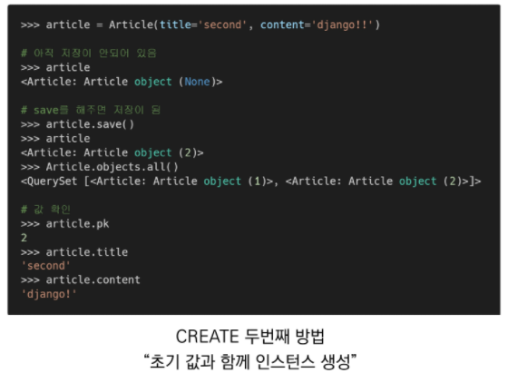
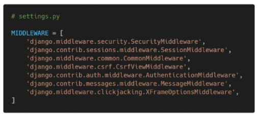

## 

## Django Model

 

### 1. Model

 

* **Model** (oop / class)
  * 단일한 데이터에 대한 정보를 가짐
    * 사용자가 저장하는 데이터들의 필수적인 필드들과 동작들을 포함
  * 저장된 데이터베이스의 구조(layout)
  * Django는 model을 통해 데이터에 접속하고 관리
  * 일반적으로 각각의 model은 하나의 데이터베이스 테이블에 매핑 됨

 

* **Databse**
  * 데이터베이스(DB)
    * 체계화된 데이터의 모임(ex.  노션 테이블, 엑셀 등등)
  * 쿼리(Query)
    * 데이터를 조회하기 위한 명령어
    * 조건에 맞는 데이터를 추출하거나 조작하는 명령어
    * "Query를 날림" → DB를 조작함

 

* Database의 기본 구조

  * 스키마(Schema)

    * 데이터베이스에서 자료의 구조, 표현방법, 관계 등을 정의한 구조(structure)

  * 테이블(table)

    * 열(column): 필드(field) or 속성
    * 행(row): 레코드(record) or 튜플

  * 

    * 제약조건도 기술 가능

  * 

  * 

  * 

    * django에서 id가 곧 PK
    * 반드시 있어야 함

  * 

    

 

* **Model 정리**
  * "웹 애플리케이션의 데이터를 **💥구조화**하고 **💥조작**하기 위한 도구"
  * sqlite (가벼움, 파일단위)
  * mySQL, Maria DB, Oracle DB, postgreSQL (각각의 차이는 구글링)

 

---

 

### 2. ORM

* **ORM**
  * Object- Relational-Mapping
  * 객체 지향 프로그래밍 언어를 사용하여 호환되지 않는 유형의 시스템 간에(Django - SQL) 데이터를 변환하는 프로그래밍 기술
  * OOP 프로그래밍에서 RDBMS(관계형 데이터베이스 관리 시스템)을 연동할 때, 데이터베이스와 객체 지향 프로그래밍 언어 간의 호환되지 않는 데이터를 변환하는 프로그래밍 기법
  * Django는 내장 Django ORM을 사용함 

 

* **ORM 예시**
  * 
  * 
    * ORM이 translate 해줌 (SQL ← python class  / raw data → python object)

 

* **ORM의 장점과 단점**
  * 장점
    * SQL을 잘 알지 못해도 DB 조작이 가능
    * SQL의 절차적 접근이 아닌 객체 지향적 접근으로 인한 높은 생산성
  * 단점
    * ORM 만으로 완전한 서비스를 구현하기 어려운 경우가 있음(결국 DB를 심도있게 활용하기 위해서는 SQL을 배워야 함)
  * 현대 웹 프레임워크의 요점은 웹 개발의 속도를 높이는 것. (✨생산성)

 

* **왜 ORM을 사용할까?**
  * "우리는 DB를 객체(object)로 조작하기 위해 ORM을 사용함"

 

* **models.py 작성**
  * 
    * 각 모델은 django.models.Model 클래스의 서브 클래스로 표현됨
      * django.db.models 모듈의 Model 클래스를 상속받음
    * models 모듈을 통해 어떠한 타입의 DB 컬럼을 정의할 것인지 정의
      * title과 content은 모델의 필드를 나타냄
      * 각 필드는 클래스 속성으로 지정되어 있으며, 각 속성은 각 데이터 베이스의 열에 매핑

 

* **사용 모델 필드 (1/2)**
  * CharField(max_length=None, **options) 
    * 길이의 제한이 있는 문자열을 넣을 때 사용
    * CharField의 max_length는 필수 인자
    * ✨**필드의 최대 길이(문자)**, 데이터베이스 레벨과 Django의 유효성 검사(값을 검증하는 것)에서 활용
* **사용 모델 필드 (2/2)**
  * TextField(**options)
    * 글자의 수가 많을 때 사용
    * max_length 옵션 작성시 자동 양식 필드인 textarea 위젯에 반영은 되지만 모델과 데이터베이스 수준에는 적용되지 않음
      * max_length 사용은 CharField에서 사용해야 함
* 💥**django docs model filed 검색!!!**

 

---

 

### 3. Migrations

 

* **Migrations (class → Table로 만드는 과정)**
  * "Django가 modle에 생긴 변화를 반영하는 방법"
  * Migration(이하 마이그레이션) 실행 및 DB 스키마를 다루기 위한 몇가지 명령어
    * makemigrations, migrate (✨table로 만들어가는 명령어, 핵심)
    * sqlmigrate, showmigrations (확인 용도)

 

* **Migrations Commands (1/2)**
  1. makemigrations (✨**설계도를 만듬**)
     * model을 변경한 것에 기반한 새로운 마이그레이션(like 설계도)을 만들 때 사용
  2. migrate
     * 마이그레이션을 DB에 반영하기 위해 사용
     * 설계도를 ✨**실제 DB에 반영**하는 과정
     * 모델에서의 변경 사항들과 DB의 스키마가 동기화를 이룸
* **0001_initial.py**
  * 'id' : 자동 생성됨(PK), 그러므로 필드명을 id로 쓰지 않음
  * models가 수정되면, makemigrations를 다시 해줘야함(설계도가  변경되었으므로)

 

* **Migrations Commands (2/2)**
  3. sqlmigrate
     * 마이그레이션에 대한 SQL 구문을 보기 위해 사용
     * 마이그레이션이 SQL 문으로 어떻게 해석되어서 동작할지 미리 확인 할 수 있음
  4. showmigrations
     * 프로젝트 전체의 마이그레이션 상태를 확인하기 위해 사용
     * 마이그레이션 파일들이 migrate 됐는지 안됐는지 여부를 확인 할 수 있음

 

* **makemigrations**
  * 
* **migrate**
  * 
* **실제 DB table 확인**
  * 
* **sqlmigrate**
  * 
* **showmigrations**
  * 
  * 
    * `[x] `가 되었다는 의미 /  적용이 안되면`[]`로 나타남 

 

* **model 수정**
  * 
    * auto_now_add : 데이터가 생성될 때의 시간을 자동으로 저장
    * auto_now : 현재 시간을 자동으로 저장
  * 
    * 1)은 migration을 할 때 기본값으로 넣기를 설정
    * 2)는 models.py에 설정한대로 넣기를 설정
  * 

 

* **DateField's options**
  * auto_now_add
    * 최초 생성 일자
    * Django ORM이 최초 insert(테이블에 데이터 입력)시에만 현재 날짜와 시간으로 갱신 (테이블에 어떤 값을 최초로 넣을 때)
  * auto_now
    * 최종 수정 일자
    * Django ORM이 save를 할 때 마다 현재 날짜와 시간으로 갱신

 

* **DateTimeField가 아닌 DateField의 options를 확인한 이유**
  * DateTimeField는 Datefield와 동일한 추가 인자(extra argument)를 사용함
  * DateTimeField는 Datefield의 서브 클래스
  * 

 

* **반드시 기억해야 할 migration 3단계**
  1. models.py (수정)
     * model 변경사항 발생 시
  2. $ python manage.py makemigrations (설계도)
     * migrations 파일 생성 
  3. $ python manage.py migrate (생성)
     * DB 반영 (모델과 DB의 동기화)

 

---

 

### 4. Database API

 

* **DB API**
  * "DB를 조작하기 위한 도구"
  * Django가 기본적으로 ORM을 제공함에 따른 것으로 DB를 편하게 조작할 수 있도록 도움
  * Model을 만들면 Django는 객체들을 만들고 읽고 수정하고 지울 수 있는 database-abstract API를 자동으로 만듦
  * database-abstract API 혹은 database-access API 라고도 함
  * 💥**django docs query set 검색&즐찾**

 

* **DB API 구문 - Making Queries**
  * 
    * 클래스명.objets.메서드
    * views.py의 class --all --> DB -- 응답 --> class

 

* **DB API**
  * Manager
    * Django 모델에 데이터베이스 query 작업이 제공되는 인터페이스
    * 기본적으로 모든 Django 모델 클래스에 objects라는 Manager를 추가
  * QuerySet or instance
    * 데이터베이스로부터 전달받은 객체 목록
    * queryset 안의 객체는 0개, 1개 혹은 여러 개일 수 있음
    * 데이터베이스로부터 조회, 필터, 정렬 등을 수행 할 수 있음

 

* **Django shell**
  * 일반 Python shell(터미널 환경)을 통해서는 장고 프로젝트 환경에 접근할 수 없음
  * 그래서 장고 프로젝트 설정이 load 된 Python shell을 활용해 DB API 구문 테스트 진행
  * 기본 Django shell 보다 더 많은 기능을 제공하는 **✨shell_plus**를 사용해서 진행
    * Django-extensions 라이브러리의 기능 중 하나

 

* **라이브러리 설치**
  * 
* **라이브러리 등록 및 실행**
  * 
  * 

 

---

 

### 5. CRUD

 

* **CRUD**
  * 대부분의 컴퓨터 소프트웨어가 가지는 기본적인 데이터 처리 기능인 Create(생성), Read(읽기), Update(갱신), Delete(삭제)를 묶어서 일컫는 말

 

* **Read**
  * 

 

* **CREATE**
  * 
  * 
  * 

 

* **테이블 확인**
  * 

 

* **CREATE 관련 메서드**
  * save() method
    * Saving objects
    * 객체를 데이터베이스에 저장함
    * 데이터 생성 시 save()를 호출하기 전에는 객체의 ID 값이 무엇인지 알 수 없음
      * ID 값은 Django가 아니라 DB에서 계산되기 때문
    * 단순히 모델을 인스턴스화 하는 것은 DB에 영향을 미치지 않기 때문에 반드시 save()가 필요

 

* **str method**
  * 
    * method는 필드와는 상관없으므로 makemigrations는 할 필요 없음

 

* **READ**
  * QuerySet API method를 사용해 다양한 조회를 하는 것이 중요
  * QuerySet API method는 크게 2가지로 분류
    1. Methods that ✨**return new querysets**
    2. Methods that ✨**do not return querysets**
  * all()
    * 현재 QuerySet의 복사본을 반환
    * 
  * get()
    * 주어진 lookup 매개변수와 일치하는 객체를 반환
    * 객체를 찾을 수 없으면 DoesNotExist 예외를 발생시키고, 둘 이상의 객체를 찾으면 MultipleObjectsReturned 예외를 발생 시킴
    * 위와 같은 특징을 가지고 있기 때문에 primary key와 같이 **✨고유(unique)성을 보장하는 조회에서 사용**해야 함
    * 
  * filter()
    * 주어진 lookup 매개변수와 일치하는 객체를 포함하는 새 QuerySet을 반환
    * 
    * 조건을 만족하는 모든 data를 보고 싶을 때 (get과 차이)

 

* **UPDATE** (기존값을 수정)
  * 
  * delete()
    * QuerySet의 모든 행에 대해 SQL 삭제 쿼리를 수행하고, 삭제된 객체 수와 객체 유형당 삭제 수가 포함된 딕셔너리를 반환
      * 
  * 순서
    1. DB에서 수정할 data를 가져옴
    2. 가져온 data의 값을 변경
    3. save

 

* **Field lookups**
  * 조회 시 특정 검색 조건을 지정
  * QuerySet 메서드 filter(), exclude() 및 get()에 대한 키워드 인수로 지정됨
  * 사용 예시)
    * Article.objects.filter(pk__gt=2)
    * Article.objects.filter(content__contains='ja')

 

* **QueySet API**
  * 데이터베이스 조작을 위한 다양한 QuerySet API methods는 해당 공식문서를 반드시 참고하여 학습할 것
  * https://docs.djangoproject.com/en/3.2/ref/models/querysets/
  * ex. QuerySet update() : 여러개의 같은 값을 변경

 

* **유효성 검사**
  * Model instance reference
    * https://docs.djangoproject.com/en/3.2/ref/models/instances/
  * full_clean()으로 데이터가 올바른지 먼저 검사

 

---

 

### 6. Admin Site

 

* **Automatic admin interface**
  * 사용자가 아닌 서버의 관리자가 활용하기 위한 페이지
  * Model class를 admin.py에 등록하고 관리
  * django.contrib.auth 모듈에서 제공됨
  * record 생성 여부 확인에 매우 유용하며, 직접 record를 삽입할 수도 있음

 

* **admin 생성**
  * 
  * 관리자 계정 생성 후 서버를 실행한 다음 '/admin'으로 가서 관리자 페이지 로그인
    * 계정만 만든 경우 Django 관리자 화면에서 아무 것도 보이지 않음
  * 내가 만든 Model을 보기 위해서는 admin.py에 작성하여 Django 서버에 등록
  * [주의] auth에 관련된 기본 테이블이 생성되지 않으면 관리자 계정을 생성할 수 없음

 

* **admin 등록**
  * 
  * admin.py는 관리자 사이트에 Article 객체가 관리자 인터페이스를 가지고 있다는 것을 알려주는 것
  * models.py에 정의한 `__str__`의 형태로 객체가 표현됨

 

* **ModelAdmin options**
  * 
  * list_display
    * models.py 정의한 각각의 속성(컬럼)들의 값(레코드)을 admin 페이지에 출력하도록 설정
    * django docs admin 검색
  * list_filter, list_display_links 등 다양한 ModelAdmin options 참고
  * https://docs.djangoproject.com/en/3.2/ref/contrib/admin/#modeladmin-options

 

---

 

### 7. CRUD with views

 

* **CRUD 작성**
  1. 프로젝타 이름
     * crud
  2. 앱 이름
     * articles
  3. 앱 등록

 

* base 템플릿 작성 및 추가 템플릿 경로 등록
* index 페이지 작성
* READ - 전체 게시글 조회
* CREATE - New views
* CREATE - Create views
* 게시글 정렬 순서 변경

 

* **HTTP method**
  * GET
    * 특정 리소스를 가져오도록 요청할 때 사용
    * 반드시 데이터를 가져올 때만 사용해야 함
    * DB에 변화를 주지 않음
    * CRUD에서 R 역할을 담당
  * POST
    * 서버로 데이터를 전송할 때 사용
    * 리소스를 생성/변경하기 위해 데이터를 HTTP body에 담아 전송
    * 서버에 변경사항을 만듬
    * CRUD에서 C/U/D 역할을 담당

 

* **사이트 간 요청 위조 (Cross-site request forgery)**
  * 웹 애플리케이션 취약점 중 하나로 사용자가 자신의 의지와 무관하게 공격자가 의도한 행동을 하여 특정 웹페이지를 보안에 취약하게 하거나 수정, 삭제 등의 작업을 하게 만드는 공격 방법
  *  Django는 CSRF에 대항하여 middleware와 template tag를 제공
  * CSRF라고도 함

 

* **CSRF 공격 방어**
  * Security Token 사용 방식 (CSRF Token)
    * 사용자의 데이터에 임의의 난수 값을 부여해, 매 요청마다 해당 난수 값을 포함시켜 전송 시키도록 함
    * 이후 서버에서 요청을 받을 때마다 전달된 token 값이 유효한지 검증
  * 일반적으로 데이터 변경이 가능한 POST, PATCH, DELETE Method 등에 적용 (GET 제외)
  * DJango CSRF token 템플릿 태그를 제공

 

* **csrf_token template tag**
  * 
  * CSRF 보호에 사용
  * input type이 hidden으로 작성되며 value는 Django에서 생성한 hash 값으로 설정됨
  * 해당 태그 없이 요청을 보낸다면 Django 서버는 403 forbidden을 응답

 

* **CsrfViewMiddleware**
  * 
  * CSRF 공격 관련 보안 설정은 settings.py에서 MIDDLEWARE에 작성 되어있음
  * 실제로 요청 과정에서 urls.py 이전에 Middleware의 설정 사항들을 순차적으로 거치며 응답은 반대로 하단에서 상단으로 미들웨어를 적용시킴

 

* **[참고] Middleware**
  * 공통 서비스 및 기능을 애플리케이션에 제공하는 소프트웨어
  * 데이터 관리, 애플리케이션 서비스, 메시징, 인증 및 API 관리를 주로 미들웨어를 통해 처리
  * 개발자들이 애플리케이션을 보다 효율적으로 구축할 수 있도록 지원하며, 애플리케이션, 데이터 및 사용자 사이를 연결하는 요소처럼 작동

 

* new 로직 수정
* POST 데이터 확인
* 게시글 작성 후 index 페이지로 이동하기

 

* **2가지 문제 발생**

  1. 글을 작성 후 index 페이지가 출력되지만 게시글이 조회되지 않음
  2. URL은 여전히 create에 머물러 있음

  - 단순히 index 페이지만 render 되었을 뿐
    - create view 함수에서 다루고 있는 데이터로 index 페이지가 render 됨

 

* **Django shortcut function - "redirect()"**
  * 새 URL로 요청을 다시 보냄
  * 인자에 따라 HttpResponseRedirect를 반환
  * 브라우저는 현재 경로에 따라 전체 URL 자체를 재구성 (reconstruct)
  * 사용 가능한 인자
    1. model
    2. view name: viewname can be **URL pattern name** or callable **view object.**
    3. absolute or relative URL

 

* redirect 함수 적용

 

* **DETAIL**
  * 
  * 개별 게시글 상세 페이지
  * 글의 번호(pk)를 활용해서 각각의 페이지를 따로 구현해야 함
  * 무엇을 활용할 수 있을까? → **✨Variable Routing**
  * 
  * 오른쪽 pk는 variable routing을 통해 받은 pk
  * 왼쪽 pk는 DB에 저장된 레코드의 pk (id)
  * Detail 페이지 및 링크 작성
  * redirect 인자 변경

 

* **DELETE** 
  *  모든 글을 삭제 하는 것이 아니라 삭제하고자 하는 특정 글을 삭제해야 함
  * HTTP Method POST 시에만 삭제 될 수 있도록 조건 작성

 

* **EDIT**
  * 수정은 기존에 입력 되어 있던 데이터를 보여주는 것이 좋기 때문에 html 태그의 value 속성을 사용 (textarea 태그는 value 속성이 없으므로 태그 내부 값으로 작성)
  * detail.html에 edit 링크 작성

 

* **UPDATE**
  * create와 마찬가지로 별도의 '글이 수정되었습니다'라는 메시지를 출력하는 template는 필요하지 않음

 

---

 

### 8. 마무리

 

* **Model**
  * 웹 애플리케이션의 데이터를 구조화하고 조작하기 위한 도구
* **Database**
  * 체계화 된 데이터의 모임(집합)
* **Migrations**
  * Django가 model에 생긴 변화(필드를 추가, 모델 삭제 등)를 반영하는 방법
* **ORM**
  * OOP 언어를 사용하여 데이터베이스와 OOP 언어 간의 호환되지 않는 데이터를 변환하는 프로그래밍 기법
* **Database API**
  * DB를 조작하기 위한 도구(QuerySetAPI, CRUD)
* **Admin Site**
  * 사용자가 아닌 서버의 관리자가 활용하기 위한 페이지

 
