## 

 

## Foreign Key

 

* **Foreign Key 개념**
  * 외래 키(외부 키)
  * 관계형 데이터베이스에서 한 테이블의 필드 중 다른 테이블의 행을 식별할 수 있는 키
  * 참조하는 테이블에서 속성(필드)에 해당하고, 이는 참조되는 테이블의 기본 키(Primary Key)를 가리킴
  * 참조하는 테이블의 외래 키는 참조되는 테이블 행 1개에 대응됨
    * 이 때문에 참조하는 테이블에서 참조되는 테이블의 존재하지 않는 행을 참조할 수 없음
  * 참조하는 테이블의 행 여러 개가 참조되는 테이블의 동일한 행을 참조할 수 있음

 

* **Foreign Key 예시**
  * 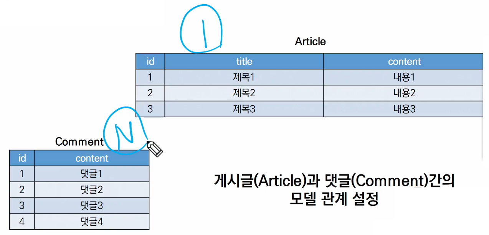
  * 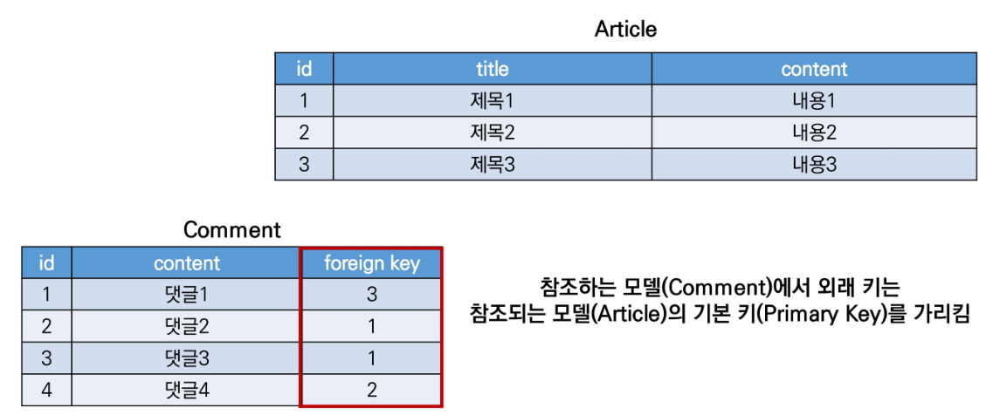
  * 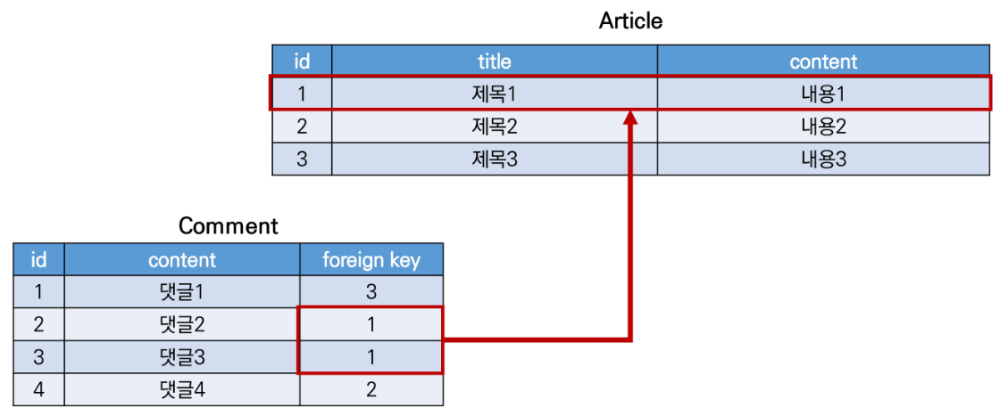

 

* **Foreign Key 특징**
  * 키를 사용하여 부모 테이블(참조되는 테이블)의 유일한 값을 참조 (참조 무결성)
  * 외래 키의 값이 반드시 부모 테이블의 기본 키(pk)일 필요는 없지만 유일한 값이어야 함
  * [참고] 참조 무결성
    * 데이터베이스 관계 모델에서 관련된 2개의 테이블 간의 일관성을 말함
    * 외래 키가 선언된 테이블의 외래 키 속성(열)의 값은 그 테이블의 부모가 되는 테이블의 기본 키 값으로 존재해야 함

 

* **ForeignKey field**
  * A many-to-one relationship
  * 2개의 위치 인자가 반드시 필요
    1. 참조하는 model class
    2. on_delete 옵션
  * migrate 작업 시 필드 이름에 _id를 추가하여 데이터베이스 열 이름을 만듦
  * [참고] 재귀 관계 (자신과 1:N)
    * 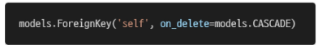
  * comment 모델 정의하기
    * 

 

* **ForeignKey arguments - 'on_delete'**
  * 외래 키가 참조하는 객체가 사라졌을 때 외래 키를 가진 객체를 어떻게 처리할 지를 정의
    * 글에 같이 작성된 댓글들은 글이 삭제 되었을 때 어떻게 할 것인가?
  * Database Integrity(데이터 무결성)을 위해서 매우 중요한 설정
  * on_delete 옵션에 사용 가능한 값들
    * CASCADE : 부모 객체(참조 된 객체)가 삭제 됐을 때 이를 참조하는 객체도 삭제
    * PROTECT / SET_NULL / SET_DEFAULT / SET() / DO_NOTHING / RESTRICT
    * CASCADE : 참조데이터 삭제되면 나도 삭제 / 외래키를 포함하는 행도 함께 삭제
    * PROTECT : 내가 있으면 참조데이터 삭제 불가 / 관련된 데이터 모두 삭제 후 삭제해야함
    * SET_NULL : 부모 데이터 지우면  외래키 값을 NULL로 대체 / null=True 옵션이 있어야 사용 가능
    * SET_DEFAULT:  부모 데이터 지우면 외래키 값을 default 값으로 대체 / default=True 옵션이 있어야 사용가능
    * SET : 대체할 값이나 함수를 지정해서 실행
    * RESTRICT : CASCADE와 PROTECT의 중간 느낌
      * ex. 대댓글이 달리면 댓글 삭제는 안되지만, 글 삭제하면 댓글과 대댓글 삭제됨
    * DO_NOTHING : 아무것도 안함 / db에서 오류가 발생할 수 있음

 

* **[참고] 데이터 무결성**
  * 데이터의 정확성과 일관성을 유지하고 보증하는 것을 가리키며, 데이터베이스나 RDBMS 시스템의 중요한 기능임
  * 무결성 제한의 유형
    1. 개체 무결성(Entity integrity)
       * PK의 개념과 관련
       * 모든 테이블이 PK를 가져야 하며 PK로 선택된 열은 고유한 값이어야 하고 빈 값은 허용치 않음을 규정
    2. 참조 무결성(Referential integrity)
       * FK(외래 키) 개념과 관련
       * FK 값이 데이터베이스의 특정 테이블의 PK 값을 참조하는 것
    3. 범위(도메인) 무결성(Domain integrity)
       * 정의된 형식(범위)에서 관계형 데이터베이스의 모든 컬럼이 선언되도록 규정

 

* **Migration** : 설계도를 작성하고(makemigrations) DB에 반영(migrate)
  1. migrations 생성
  2. migration 파일 확인
  3. migrate
  4. articles_comment 테이블의 외래 키 컬럼 확인 (필드 이름에 **💥_id**가 추가됨)
     * 자동으로 추가되므로 article_id로 생성 할 필요 없음(article_id_id로 생성됨)

 

* 소문자 단수형으로 모델을 만든 이유 
  1. 누구를 참조하는지 model명을 알 수 있음
  2. 다른 모델관계와 헷갈리지 않을 수 있음(M:N에서는 복수형을 사용)

 

* **데이터베이스의 ForeignKey 표현**
  * 만약 ForeignKey 인스턴스를 abcd로 생성 했다면 abce_id로 만들어짐
  * 하지만 명시적인 모델 관계 파악을 위해 참조하는 클래스 이름의 소문자 (단수형)로 작성하는 것이 바람직함(1:N)
    * 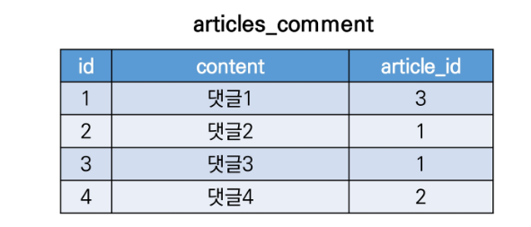

 

* **댓글 생성 연습하기**
  * shell_plus 실행
  * 댓글 생성 시도
  * 에러 확인
    * articels_comment 테이블의 ForeignKeyField, article_id 값이 누락 되었기 때문
  * 게시글 생성 후 댓글 생성 재시도(댓글이 저장되면서 pk가 부여됨)
    * comment.article_id = article.pk
    * comment.article = article (장고는 이 방식을 권장)
  * 댓글 속성 값 확인
    * 실제로 작성된 외래 키 컬럼명은 article_id이기 때문에 article_pk로는 값에 접근
    * 외대키를 가지고 있으므로 참조하는 대상 바로 return 가능(객체를 넣어서) / 외래키를 가지고 있으면 참조는 간단함
  * comment 인스턴스를 통한 article 값 접근
  * 두번째 댓글 작성 해보기

 

* admin site에 작성된 댓글 확인

 

* **1:N 관계 related manager**
  * 역참조('comment_set')  => ex. 이 게시글에 달린 모든 댓글 / 무슨 내용이 포함된 댓글
    * Article(1) → Comment(N)
    * article.comment 형태로는 사용할 수 없고, article.**✨comment_set** manager가 생성됨
    * 게시글에 몇 개의 댓글이 작성 되었는지 Django ORM이 보장할 수 없기 때문
      * article은 comment가 있을 수도 있고, 없을 수도 있음
      * 💥실제로 Article 클래스에는 Comment 와의 어떠한 관계도 작성되어 있지 않음
  * 참조('article')
    * Comment(N) → Article(1)
    * 댓글의 경우 어떠한 댓글이든 반드시 자신이 참조하고 있는 게시글이 있으므로, comment.article과 같이 접근할 수 있음
    * 실제 ForeignKey 또한 Comment 클래스에서 작성됨

 

* **1:N related manager 연습하기**
  * dir() 함수를 통해 article 인스턴스가 사용할 수 있는 모든 속성, 메서드를 직접 확인하기
  * article의 입장에서 모든 댓글 조회하기 (역참조, 1→N)
  * 조회한 모든 댓글 출력하기
  * comment의 입장에서 참조하는 게시글 조회하기 (참조, N→1)

 

* **ForeignKey arguments - 'related_name'**
  * 역참조 시 사용할 이름('model_set' manager)을 변경할 수 있는 옵션
    * 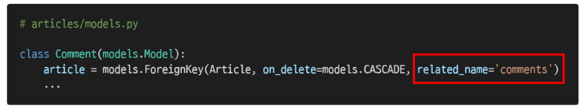
  * 위와 같이 변경하면 article.comment_set은 더 이상 사용할 수 없고, **✨article.comments**로 대체됨
  * [주의] 역참조 시 사용할 이름 수정 후, migration 과정 필요
  * 1:N에서는 권장하지 않음 / M:N 에서 바꿔야하므로 / 바꿀 경우 comment_set을 못 씀

 

---

 

### 1.  Comment CREATE

 

* **CommentForm 작성**

 

* **detail 페이지에서 CommentForm 출력**
  * ForeignKeyField를 작성자가 직접 입력하는 상황이 발생
  * CommentForm에서 외래 키 필드 출력 제외

 

* **댓글 작성 로직**
  * 댓글 단독페이지를 만드는게 아니므로 else문 필요 없음 / get 요청을 안 받음
  * 하지만 외래 키를 지정해줘야 함(위에서 사용자로부터 안 보이게 했다고 입력을 안해야되는 것은 아님)

 

* **The 'save()' method**
  * save(commit=False)
    * Create, but don't save the new instance
    * 아직 ✨**데이터베이스에 저장되지 않은 인스턴스를 반환** => 누락된 값을 채워주기 위해서
    * 저장하기 전에 **✨객체에 대한 사용자 지정 처리를 수행할 때** 유용하게 사용

 

---

 

### 2. Comment READ

 

* **댓글 출력**
  * 특정 article에 있는 모든 댓글을 가져온 후 context에 추가
  * detail 페이지에서 댓글 출력

 

---

 

### 3. Comment DELETE

 

* 댓글 삭제 후 detail page에서 댓글 삭제 확인 / 인증된 사용자의 경우만 댓글 작성 및 삭제
  * 45-4 : url 통일성을 위해 2번째 방법 사용
  * 45-6 : variable routing이 2개 들어감

 

---

 

### Comment 추가사항

 

* **댓글 출력**
  * 특정 article에 있는 모든 댓글을 가져온 후 context에 추가
  * detail 페이지에서 댓글 출력

 

---

 

# Customizing authentication in Django

 

---

 

### 1. Substituting a custom User model

 

* **User 모델 대체하기**
  * 일부 프로젝트에서는 Django의 **✨내장 User 모델이 제공하는 인증 요구사항이 적절하지 않을 수 있음**
    * ex. username 대신 email을 식별 토큰으로 사용하는 것이 더 적합한 사이트
  * Django는 User를 참조하는데 사용하는 AUTH_USER_MODEL 값을 제공하여, default user model을 ✨**재정의(override)** 할 수 있도록 함
  * Django는 새 프로젝트를 시작하는 경우 기본 사용자 모델이 충분하더라도, **💥커스텀 유저 모델을 설정하는 것을 강력하게 권장 (highly recommended)** => 나중에 수정 필요성이 생겼을때는 늦음
    * 단, 프로젝트의 모든 migrations 혹은 첫 migrate를 실행하기 전에 이 작업을 마쳐야 함

 

* **AUTH_USER_MODEL**
  * User를 나타내는데 사용하는 모델
  * 프로젝트가 **✨진행되는 동안 변경할 수 없음**
  * 프로젝트 시작 시 설정하기 위한 것이며, 참조하는 모델은 첫번째 마이그레이션에서 사용할 수 있어야 함
  * 기본 값 : 'auth.User' (auth 앱의 User 모델)
  * [참고] 프로젝트 중간(mid-project)에 AUTH_USER_MODEL 변경하기
    * 모델 관계에 영향을 미치기 때문에 훨씬 더 어려운 작업이 필요
    * 즉, 중간 변경은 권장하지 않으므로 초기에 설정하는 것을 권장

 

* **Custom User 모델 정의하기**
  * 관리자 권한과 함께 완전한 기능을 갖춘 User 모델을 구현하는 기본 클래스인 AbstractUser를 상속받아 새로운 User 모델 작성
    * 
  * 기존에 Django가 사용하는 User 모델이었던 auth 앱의 User 모델을 accounts 앱의 User 모델을 사용하도록 변경
    * 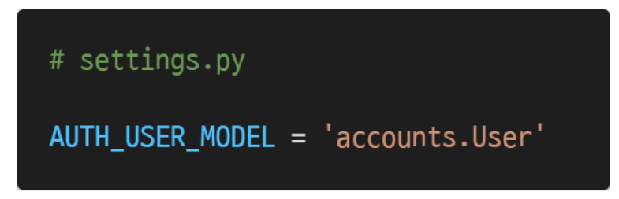
  * admin site에 Custom User 모델 등록
    * 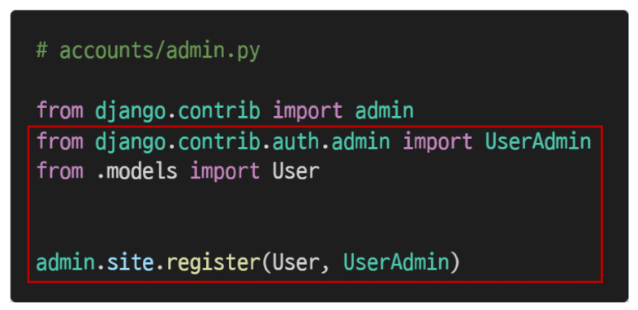
  * 프로젝트 중간에 진행했기 때문에 데이터베이스를 초기화 한 후 마이그레이션 진행
  * 초기화 방법
    1. db.sqlite3 파일 삭제
    2. migrations 파일 모두 삭제 (파일명에 숫자가 붙은 파일만 삭제)

 

---

 

### 2. Custom user & Built-in auth forms

 

* **회원가입 시도 후 아래와 같은 에러 발생**
  * 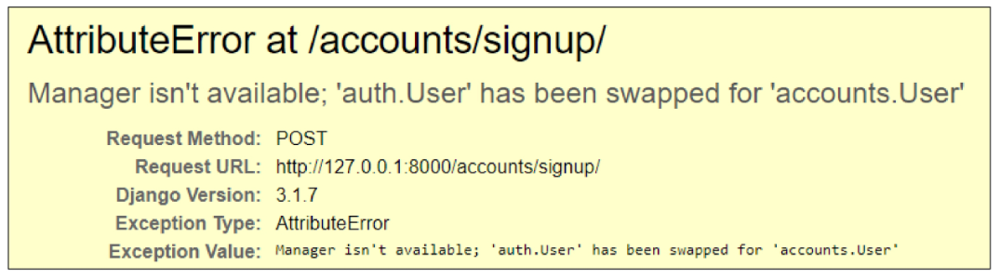
  * UserCreationForm과 UserChangeForm은 기존 내장 User 모델을 사용한 ModelForm이기 때문에 커스텀 User 모델로 대체해야 함
    * 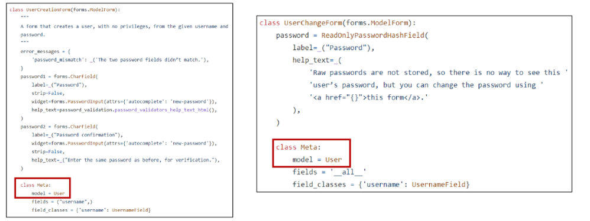

 

* **Custom Built-in Auth Forms**
  * 기존 User 모델을 사용하기 때문에 커스텀 User 모델로 다시 작성하거나 확장해야 하는 forms
    * UserCreationForm
    * UserChangeForm
  * get_user_model: 현재 장고에서 활성화된 유저 객체를 return
  * 이처럼 커스텀 User 모델이 AbstractUser의 하위 클래스인 경우 다음과 같은 방식으로 form을 확장
    * 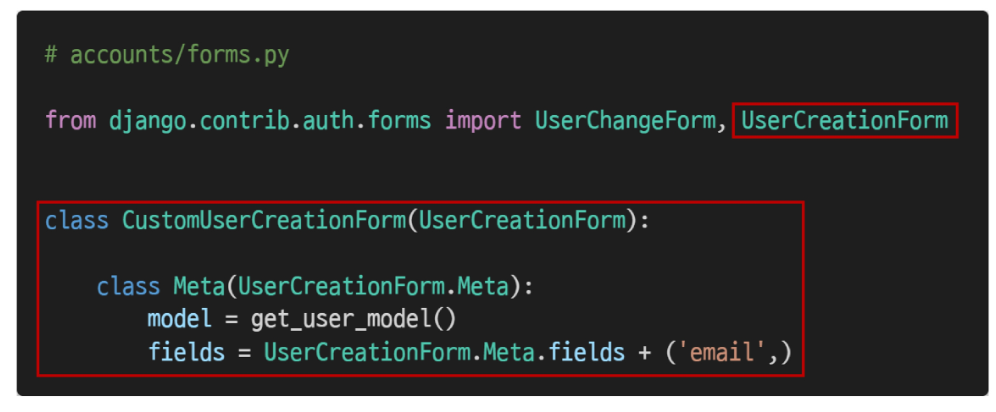

 

* **signup view 함수 코드 수정**
  * 수정 후 회원가입 재시도

 

* **get_user_model()**
  * 현재 프로젝트에서 활성화된 사용자 모델(active user model)을 반환
    * User 모델을 커스터마이징한 상황에서는 Custom User 모델을 반환
  * 이 때문에 Django는 User 클래스를 직접 참조하는 대신 django.contrib.auth.get_user_model()을 사용하여 참조해야 한다고 강조

 

# 1:N 관계 설정

 

### 1. User - Article (1:N)

 

* 💥**User 모델 참조하기**(models.py로 구분)
  1. settings.AUTH_USER_MODEL => str
     * User 모델에 대한 외래 키 또는 다대다 관계를 정의 할 때 사용해야 함
     * models.py에서 User 모델을 참조할 때 사용
  2. get_user_model() => object
     * 현재 활성화(active)된 User 모델을 반환
       * 커스터마이징한 User 모델이 있을 경우는 Custom User 모델, 그렇지 않으면 User를 반환
       * User를 직접 참조하지 않는 이유
     * models.py가 아닌 다른 모든 곳에서 유저 모델을 참조할 때 사용
* 현재 프로젝트에서는 app 등록 순서를 accounts를 먼저 하면 해결은 되나 장고가 권장하는 방식은 아님
* 💥모델은 프로젝트 구현하기 전에 잘 구상하자

 

* **User와 Article 간 모델 관계 정의 후 migration**
  * 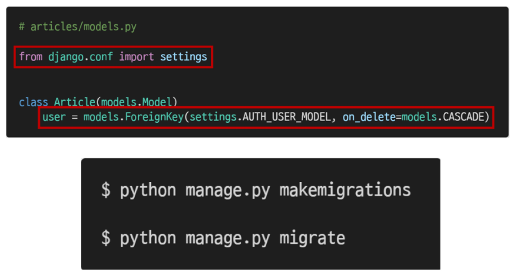
  * null 값이 허용되지 않는 user_id 필드가 별도의 값 없이 article에 추가되려 하기 때문
  * 1을 입력 후 enter
    * '현재 화면에서 기본 값을 설정하겠다'라는 의미
  * 1을 입력 후 enter
    * '기존 테이블에 추가되는 user_id 필드의 값을 1로 설정하겠다'라는 의미
    * ✨admin 이나 user가 하나도 없다면 에러 발생
  * 
  * migrate 과정 마무리

 

* **게시글 출력 필드 수정**
  * 게시글 작성 페이지에서 불필요한 필드가 출력되는 것을 확인
  * ArticleForm의 출력 필드 수정 후 게시글 작성 재시도
  * 게시글 작성 시 NOT NULL constraint failed: articles_article.user_id 에러 발생
  * 게시글 작성 시 작성자 정보(article.user)가 누락되었기 때문

 

* **CREATE**
  * 게시글 작성 시 작성자 정보(article.user) 추가 후 게시글 작성 재시도

 

* **DELETE**
  * 자신이 작성한 게시글만 삭제 가능하도록 설정

 

* **UPDATE**
  * 자신이 작성한 게시글만 수정 가능하다록 설정

 

* **READ**
  * 게시글 작성 user가 누구인지 index.html에서 출력하기
  * 해당 게시글의 작성자가 아니라면, 수정/삭제 버튼을 출력하지 않도록 처리

 

---

 

### 2. User - Comment (1:N)

 

* **User와 Comment 간 모델 관계 정의 후 migration** (Foreign Key 2개가 됨)
  * 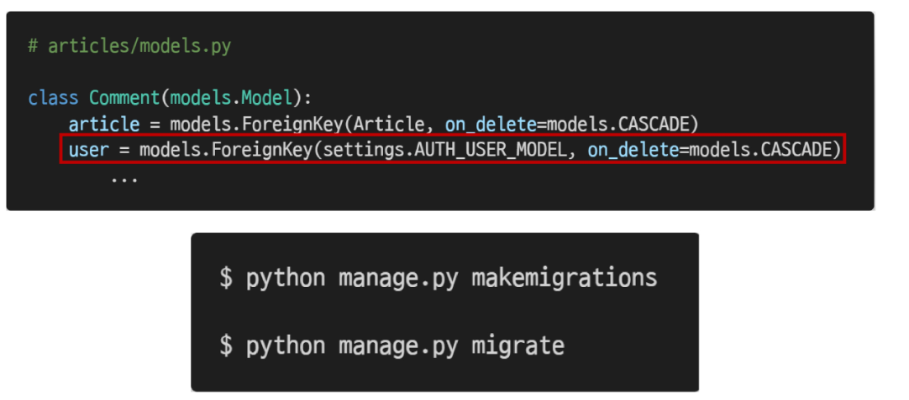
  * null 값이 허용되지 않는 user_id 필드가 별도의 값 없이 comment에 추가되려 하기 때문
  * 1을 입력 후 enter
    * '현재 화면에서 기본 값을 설정하겠다'라는 의미
  * 1을 입력 후 enter
    * '기존 테이블에 추가되는 user_id 필드의 값을 1로 설정하겠다'라는 의미 (기존 댓글의 작성자가 모두 1번 user가 됨)
  * 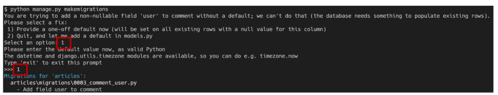
  * migrate 과정 마무리

 

* **댓글 출력 필드 수정**
  * 게시글 작성 페이지에서 불필요한 필드가 출력되는 것을 확인
  * 댓글 작성 시 user ForeignKey를 출력하지 않도록 설정
  * 댓글 작성 시 NOT NULL constraint failed: articels_comment.user_id 에러 발생
  * 댓글 작성 시 작성자 정보(comment.user)가 누락되었기 때문

 

* **CREATE**
  * 댓글 작성 시 작성자 정보(request.user) 추가 후 댓글 작성 재시도

 

* **READ**
  * 비로그인 유저에게는 댓글 form 출력 숨기기
  * 댓글 작성자 출력하기

 

* **DELETE**
  * 자신이 작성한 댓글만 삭제 버튼을 볼 수 있도록 수정

    
