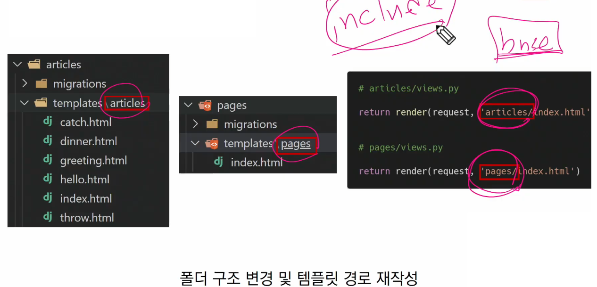
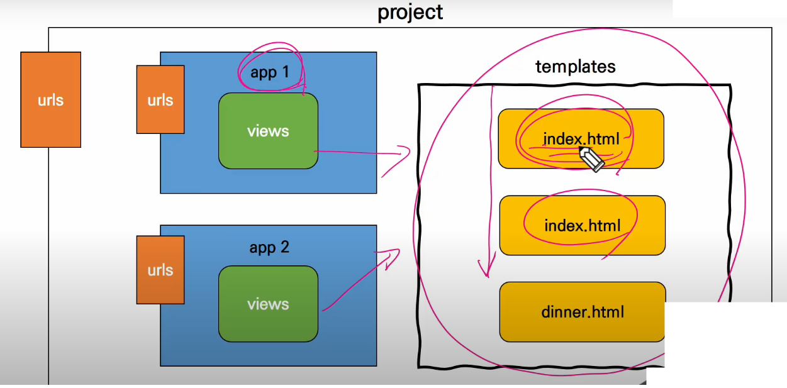
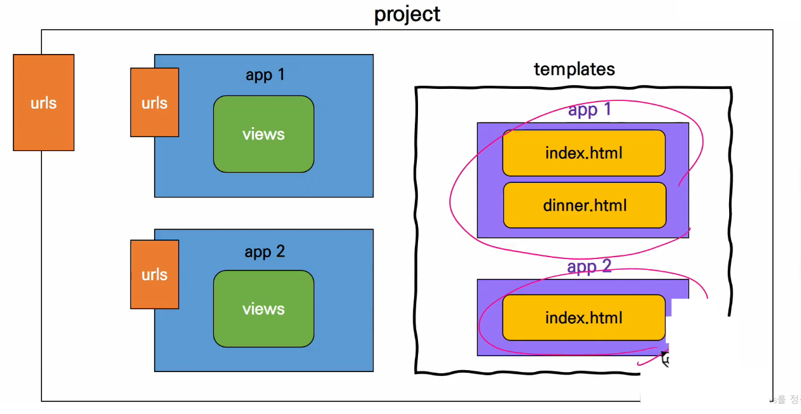
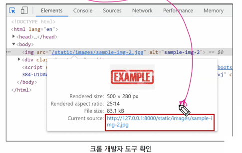

## 

## Django The Web Framework

### 1.  Namespace

* **namespace (이름공간)**
  * 이름공간 또는 네임스페이스 (Namespace)는 객체를 구분할 수 있는 범위를 나타내는 말로 일반적으로 하나의 이름 공간에서는 하나의 이름이 단 하나의 객체만을 가리키게 됨
  * 프로그래밍을 하다 보면 모든 변수명과 함수명 등 이들 모두를 겹치지 않게 정의하는 것은 매우 어려운 일 (✨겹친다면 INSTALLED_APPS의 등록 순서대로 보여줌)
  * 그래서 django에서는
    1. 서로 다른 app의 같은 이름을 가진 url name은 이름공간을 설정해서 구분
    2. template, static 등 django는 정해진 경로 하나로 모아서 보기 때문에 중간에 폴더를 임의로 만들어 줌으로써 이름공간을 설정 (✨물리적으로 공간을 끼워넣어 구분)
  * 💥view.py에서 app_name/templates/은 이미 약속되어 있는 경로이므로 이 다음의 주소만 적음 (ex. dinner.html) → 그래서 이름만 적어주는 것 처럼 보임
* **URL namespace**
  * URL namespace를 사용하면 서로 다른 앱에서 동일한 URL 이름을 사용하는 경우에도 이름이 지정된 URL을 고유하게 사용 할 수 있음
  * urls.py에 **💥"app_name"** attribute 값 작성
  * 참조
    * `:` 연산자를 사용하여 지정
* **Template namespace**
  * Django는 기본적으로 **💥app_name/templates/** 경로에 있는 template 파일들만 찾을 수 있으며, INSTALLED_APPS에 작성한 app 순서로 tamplate을 검색 후 렌더링 함
  * 그래서 임의로 templates의 폴더 구조를 **💥app_name/templates/app_name**** 형태로 변경해 임의로 이름 공간을 생성 후 변경된 추가 경로로 수정
    * 

* **Template namespace 적용**

  * 

  * 

  * 

    

---

### 2. Static files

* **Static file**
  * 정적 파일
  * 응답할 때 별도의 처리 없이 파일 내용을 그대로 보여주면 되는 파일
    * 사용자의 요청에 따라 내용이 바뀌는 것이 아니라 요청한 것을 그대로 보여주는 파일
  * 예를 들어, 웹 서버는 일반적으로 이밎, 자바 스크립트 또는 CSS와 같은 미리 준비된 추가 파일 (움직이지 않는)을 제공해야 함
  * 파일 자체가 고정되어 있고, 서비스 중에도 추가되거나 변경되지 않고 고정되어 있음
  * Django에서는 이러한 파일들을 "Static file"이라 함
    * Django는 staticfiles 앱을 통해 정적 파일과 관련된 기능을 제공
* **Static files 구성**
  1. `django.contrib.staticfiles`가 INSTALLED_APPS에 포함되어 있는지 확인
  2. settings.py에서 STATIC_URL을 정의
  3. 템플릿에서 static템플릿 태그를 사용하여 지정된 상대경로에 대한 URL을 빌드
     * 
  4. 앱의 static 디렉토리에 정적 파일을 저장
     * ex. my_app/static/my_app/example.jpg

 

* **The staticfiles app (1/3)**
  * 
  * STATICFILES_DIRS
    * 'app/static/' 디렉토리 경로 (기본 경로)를 사용하는 것 외에 추가적인 정적 파일 경로 목록을 정의하는 리스트
    * 추가 파일 디렉토리에 대한 전체 경로를 포함하는 문자열 목록으로 작성되어야 함
* **The staticfiles app (2/3)**
  * 
  * 
  * STATIC_URL
    * STATIC_ROOT에 있는 정적 파일을 참조 할 때 사용할 URL
      * 개발 단계에서는 실제 정적 파일들이 저장되어 있는 'app/static/' 경로(기본 경로) 및 STATICFILES_DIRS에 정의된 추가 경로들을 탐색함
    * 실제 파일이나 디렉토리가 아니며, URL로만 존재
    * 비어 있지 않은 값으로 설정 한다면 반드시 slash(/)로 끝나야 함
* **The staticfiles app (3/3)**
  * STATIC_ROOT
    * collectstatic이 배포를 위해 정적 파일을 수집하는 디렉토리의 절대 경로
    * django 프로젝트에서 사용하는 모든 정적 파일을 한 곳에 모아 넣는 경로
    * 개발 과정에서 settings.py의 DEBUG 값이 True로 설정되어 있으면 해당 값은 작용되지 않음
      * 직접 작성하지 않으면 django 프로젝트에서는 settings.py에 작성되어 있지 않음
    * 실 서비스 환경(배포 환경) django의 모든 정적 파일을 다른 웹 서버가 직접 제공하기 위함

 

* **Django template tag**

  * load

    * 사용자 정의 템플릿 태그 세트를 로드(load)
    * 로드하는 라이브러리, 패키지에 등록된 모든 태그와 필터를 불러옴

  * static

    * STATIC_ROOT에 저장된 정적 파일에 연결
    * 

    

 

* **정적 파일 사용하기 (1/3) - 기본 경로**

  * 
    * extends는 무조건 최상단에 위치해야함 (예외 없음)

* **정적 파일 사용하기 (2/3) - 추가 경로**

  * 

    

* **정적 파일 사용하기 (3/3) - STATIC_URL 확인**

  * 

    * /static/ : 이미지의 주소값을 만들어줌,  그러므로 엔드 슬래시(/) 필요
    
    

