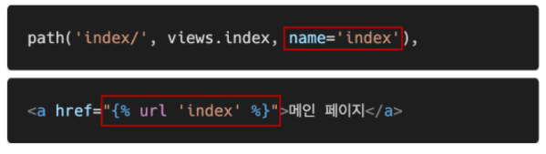

## 

## Django The Web Framework

### 1. Web Framework

* **Web Framework**

  * Django

    * Django is a high-level **Python Web framework** that encourages rapid development and clean, pragmatic design.
    * It takes care of much of the hassle of Web development, so **you can focus on writing your app without needing to reinvent the wheel.**

  * Web

    * World Wide Web
    * 인터넷에 연결된 컴퓨터를 통해 정보를 공유할 수 있는 전 세계적인 정보 공간
    * 클라이언트 (스마트폰, 컴퓨터 등등) --- 서버 (django-서버 구축)

  * Static web page (정적 웹 페이지)

    * 서버에 미리 저장된 파일이 사용자에게 그대로 전달되는 웹 페이지
    * 서버가 정적 웹 페이지에 대한 요청을 받은 경우 서버는 추가적인 처리 과정 없이 클라이언트에게 응답을 보냄
    * ✨모든 상황에서 몯느 사용자에게 동일한 정보를 표시
    * 일반적으로 HTML, CSS, JavaScript로 작성됨
    * flat page 라고도 함

  * Dynamic web page (동적 웹 페이지)

    * 웹 페이지에 대한 요청을 받은 경우 서버는 추가적인 처리 과정 이후 클라이언트에게 응답을 보냄
    * 동적 웹 페이지는 방문자와 상호작용하기 때문에 페이지 내용은 그때그때 다름
    * 서버 사이드 프로그래밍 언어 (Python, Java, C++ 등)가 사용되며, 파일을 처리하고, 데이터베이스와의 상호작용이 이루어짐

  * Framework

    * 프로그래밍에서 특정 운영 체제를 위한 응용 프로그램 표준 구조를 구현하는 클래스와 라이브러리 모임
    * 재사용할 수 있는 수많은 코드를 프레임워크로 통합함으로써 개발자가 새로운 애플리케이션을 위한 표준 코드를 다시 작성하지 않아도 같이 사용할 수 있도록 도움
    * Application framework 라고도 함

  * Web framework

    * 💥**웹페이지를 개발하는 과정에서 겪는 어려움을 줄이는 것이 주 목적**으로 데이터베이스 연동, 템플릿 형태의 표준, 세션 관리, 코드 재사용 등의 기능을 포함
    * 동적인 웹 페이지나, 웹 애플리케이션, 웹 서비스 개발 보조용으로 만들어지는 Application framework의 일종

  * Django를 사용해야 하는 이유

    * 검증된 Python 언어 기반 Web framework
    * 대규모 서비스에도 안정적이며 오랫동안 세계적인 기업들에 의해 사용됨
    * 

  * Framework Architecture

    * MVC Design Patten (model-view-controller)
    * 소프트웨어 공학에서 사용되는 디자인 패턴 중 하나
    * 사용자 인터페이스로부터 프로그램 로직을 분리하여 애플리케이션의 시각적 요소나 이면에서 실해오디는 부분을 서로 영향 없이 쉽게 고칠 수 있는 애플리케이션을 만들 수 있음
    * Django는 💥**MTV Pattern**이라고 함

  * MTV Pattern

    * Model
      * 응용프로그램의 데이터 구조를 정의하고 데이터베이스의 기록을 관리 (추가, 수정, 삭제)
    * Template (view)
      * 파일의 구조나 레이아웃을 정의
      * 실제 내용을 보여주는데 사용 (presentation)
    * 💥View (controller)
      * HTTP 요청을 수신하고 HTTP 응답을 반환
      * Model을 통해 요청을 충족시키는데 필요한 데이터에 접근
      * template에게 응답의 서식 설정을 맡김

  * 

  * 

    * 💥**렌더링 / 그림 & 흐름 이해 필요!!!**

    

    

---

### 2. Django Intro

* **Django Intro**

  * Django 시작하기 (1/4)
    * 💥Django 설치 전 가상환경 생성 및 활성화
    * Django 설치 (현재 3.2가 LTS)
    * LTS
      * Long Term Support (장기 지원 버전)
      * 일반적인 경우보다 장기간에 걸쳐 지원하도록 고안된 소프트웨어의 버전
      * 컴퓨터 소프트웨어의 제품 수명주기 관리 정책
      * 배포자는 LTS 확정을 통해 장기적이고 안정적인 지원을 보장함
    * 

  * Django 시작하기 (2/4)

    * 프로젝트 생성

      * django-admin startproject <프로젝트명>

      * 

        

  * Django 시작하기 (3/4)
    * Django 서버 시작하기 (활성화)
      * 

  * Django 시작하기 (4/4)
    * 메인 페이지 로켓 확인
      * 

* **프로젝트 구조**
  
  * 
  * 
  * 
    * 자주 사용 / 전반적인 모든 설정 관리
  * 
    * 요청이 왔을 때 처음 만나는게 url 임 / url 기능을 관리
  * 
  * 

* **Application 생성**

  * 일반적으로 Application 명은 💥**복수형**으로 하는 것을 권장
    * 

* **Application 구조**(✨urls.py가 자동 생성되지는 않음)

  * 
  * 
  * 
  * 
  * 
    * template는 직접 생성

* **Project & Application**

  * Project
    * Project (이하 프로젝트)는 Application (이하 앱)의 집합 (collection of apps)
    * 프로젝트에는 여러 앱이 포함될 수 있음
  * 💥**Application** (개발자의 기준에 따라 기능을 분리)
    * 앱은 실제 요청을 처리하고 페이지를 보여주고 하는 등의 역할을 담당
    * 하나의 프로젝트는 여러 앱을 가짐
    * 일반적으로 앱은 하나의 역할 및 기능 단위로 작성함

* **앱 등록**

  * 

* **💥앱 생성 시 주의 사항**

  * "반드시 생성 후 등록!"

  * INSTALLED_APPS에 먼저 작성 (등록) 하고 생성하려면 앱이 생성되지 않음

  * 

    

---

### 3. 요청과 응답

*  **URLs**

  * 
    * `/`(엔드 슬래시) 잊지 말자 -> 기본주소 / path
    * 💥trailing comma 권장 : 이후 바로 작성 가능하도록 (생산성 올라감)

* **View**

  * 
    * request : view 함수가 ✨**무조건** 받아야 하는 인자 / 안하면 오류가 생김  / 요청 정보가 담겨야 하므로

* **Templates**

  * 

* 추가 설정 (1/2)

  * 

  * 

    

---

### 4. Template

* **Django Template**
  * "데이터 표현을 제어하는 도구이자 표현에 관련된 로직"
  * 사용하는 built-in system
    * Django template language
* **Django Template Language (DTL)**
  * Django template에서 사용하는 built-in template system
  * 조건, 반복, 변수 치환, 필터 등의 기능을 제공
  * 단순히 Python이 HTML에 포함 된 것이 아니며, 프로그래밍 적 로직이 아니라 **💥프레젠테이션을 표현하기 위한 것**
  * Python처럼 일부 프로그래밍 구조 (if, for 등)를 사용할 수 있지만, 이것은 해당 Python 코드로 실행되는 것이 아님
  * 
* **DTL Syntax**
  1. Variable
  2. Filters
  3. Tags
  4. Comments
* **DTL Syntax (1/4) Variable**
  * 
  * render()를 사용하여 views.py에서 정의한 변수를 template 파일로 넘겨 사용하는 것
  * 변수명은 영어, 숫자와 밑줄(_)의 조합으로 구성될 수 있으나 밑줄로는 시작 할 수 없음
    * 공백이나 구두점 문자 또한 사용할 수 없음
  * dot(.)를 사용하여 변수 속성에 접근할 수 있음
  * render()의 세번째 인자로, {'key': value}와 같이 딕셔너리 형태로 넘겨주며, 여기서 정의한 key에 해당하는 문자열이 template에서 사용 가능한 변수명이 됨 (✨딕셔너리 키 값을 가져옴)
* **DTL Syntax (2/4) Filters**
  * 
  * 표시할 변수를 수정할 때 사용
  * 예시)
    * name 변수를 모두 소문자로 출력
    * 
  * 60개의 built-in template filters를 제공
  * chained가 가능하며 일부 필터는 인자를 받기로 함
    * 
* **DTL Syntax (3/4) Tags**
  * 
  * 출력 텍스트를 만들거나, 반복 또는 논리를 수행하여 제어 흐름을 만드는 등 변수보다 복잡한 일들을 수행
  * 일부 태그는 시작과 종료 태그가 필요
    * 
  * 약 24개의 built-in template tags를 제공
* **DTL Syntax (4/4) Comments**
  * 
  * Django template에서 라인의 주석을 표현하기 위해 사용
  * 아래처럼 유효하지 않은 템플릿 코드가 포함될 수 있음
    * 
  * 한 줄 주석에만 사용할 수 있음 (줄 바꿈이 허용되지 않음)
  * 여러줄 주석은 와  사이에 입력
    * 
* **💥코드 작성 순서**
  * 데이터의 흐름에 맞추어 작성
    1. urls.py
    2. views.py
    3. templates

* **Template inheritance (템플릿 상속)**

  * 템플릿 상속은 기본적으로 코드의 재사용성에 초점을 맞춤
  * 템플릿 상속을 사용하면 사이트의 모든 공통 요소를 포함하고, 하위 템플릿이 재정의 (override) 할 수 있는 블록을 정의하는 기본 "skeleton" 템플릿을 만들 수 있음 (✨base.html)
  * 

* **Template interitance - "tags"**

  * 

  * 자식 (하위) 템플릿이 부모 템플릿을 확장한다는 것을 알림

  * 반드시 템플릿 최상단에 작성 되어야 함

  * 

  * 하위 템플리에서 재지정 (overridden)할 수 있는 블록을 정의

  * 즉, 하위 템플릿이 채울 수 있는 공간

  * 

  * **Template inheritance (1/3)**

    * 
    * python object oriented file system path
    * 모든 운영체제 구동을 위해 하드 코딩 X

  * **Template inheritance (2/3)**

    * 

      

  * **Template inheritance (3/3)**

    * 

* **Template Tag - "include"**

  * 
  * 템플릿을 로드하고 현재 페이지로 렌더링
  * 템플릿 내에 다른 템플릿을 "포함 (including)" 하는 방법

* **"include" tag (1/2)**

  * 

  * _ 가 있으면 include구나 인지 할 수 있음 

    

* **"include" tag (2/2)**

  * 

* **Django template system (feat. Djang 설계 철학)**

  * "표현과 로직 (view)을 분리"
    * 템플릿 시스템은 표현을 제어하는 도구이자 표현에 관련된 로직일 뿐이라고 생각함.
    * 즉, 템플릿 시스템은 이러한 기본 목표를 넘어서는 기능을 지원하지 말아야 함.
  * "중복을 배제" (상속)
    * 대다수의 동적 웹사이트는 공통 header, footer, navbar 같은 사이트 공통 디자인을 갖음.
    * Django 템플릿 시스템은 이러한 요소를 한 곳에 저장하기 쉽게 하여 중복 코드를 없애야 함.
    * 이것이 템플릿 상속의 기초가 되는 철학임.

---

### 5. HTML Form

* **HTML "form" element**

  * 웹에서 사용자 정보를 입력하는 여러 방식 (text, button, checkbox, file, hidden, image, password, radio, reset, submit)을 제공하고, 사용자로부터 입력받은 데이터(전달될 서버 주소)를 서버로 전송하는 역할을 담당
  * 핵심 속성 (attribute)
    * action : 입력 데이터가 전송될 URL 지정
    * method : 입력 데이터 전달 방식 지정

* **HTML "input" element**

  * 사용자로부터 데이터를 입력 받기 위해 사용
  * type 속성에 따라 동작 방식이 달라짐
  * 핵심 속성 (attribute)
    * name
    * 중복 가능, 양식을 제출했을 때 name이라는 이름에 설정된 값을 넘겨서 값을 가져올 수 있음
    * 주요 용도는 GET/POST 방식으로 서버에 전달하는 파라미터 (name은 key, value는 value)로 매핑하는 것
    * GET 방식에서는 URL에서 **💥?key=value&key=value** 형식으로 데이터를 전달함
    * ✨mdn input 검색

* **HTML "label" element (1/2)**

  * 사용자 인터페이스 항목에 대한 설명 (caption)을 나타냄

  * label을 input 요소와 연결하기

    1. input에 id 속성 부여
    2. label에는 input의 id와 동일한 값의 for 속성이 필요

    

* **HTML "label" element (2/2)**

  * label과 input 요소 연결의 주요 이점
    * 시각적인 기능 뿐만 아니라 화면 리더기에서 label을 읽어 사용자가 입력해야 하는 텍스트가 무엇인지 더 쉽게 이해할 수 있도록 돕는 프로그래밍적 이점도 있음
    * label을 클릭해서 input에 초점 (focus)를 맞추거나 활성화 (activate) 시킬 수 있음

* **HTML "for" attribute**
  * for 속성의 값과 일치하는 id를 가진 문서의 첫 번째 요소를 제어
    * 연결된 요소가 labelable elements인 경우 이 요소에 대한 labeled control이 됨
  * "labelable elements"
    * label 요소와 연결할 수 있는 요소
    * button, input (not hidden type), select, textarea ...
* **HTML "id" attribute**
  * 전체 문서에서 고유 (must be unique)해야 하는 식별자를 정의
  * 사용 목적
    * linking, scripting, styling 시 요소를 식별
* **HTML**
  * Hyper Text Transfer Protocol
  * 웹에서 이루어지는 모든 데이터 교환의 기초
  * 주어진 리소스가 수행할 원하는 작업을 나타내는 request methods를 정의
  * HTTP request method 종류
    * GET, POST, PUT, DELETE, PATCH ...
    * ✨mdn http method 검색
    * django는 기본적으로 GET과 POST만 지원
* **HTTP request method - "GET"**
  * 서버로부터 💥**정보를 조회**하는데 사용
  * ✨데이터를 가져올 때만 사용해야 함
  * 데이터를 서버로 전송할 때 body가 아닌 Query String Parameters (주소로 데이터가 전달되는 형태 ex. 주소 ?key=value&)를 통해 전송
  * 우리는 서버에 요청을 하면 HTML 문서 파일 한 장을 받는데, 이때 사용하는 요청의 방식이 GET
  * 데이터가 노출되므로 중요한 정보를 받거나 DB와 작업할 때는 POST로 사용

---

### 6. URL

* **Django URLs**
  * Dispatcher (발송자, 운항 관리자)로서의 URL
  * 웹 애플리케이션은 URL을 통한 클라이언트의 요청에서부터 시작 됨 (✨각 앱의 url은 각 앱에서 관리)
  * path가 늘어나면 유지보수 어려움
  * **Including other URLconfs (1/2)**
    * 
      * url분리
      * 앱마다 urls.py 만들어줌
  * 
  * 
  * 
* **Variable Routing**
  * URL 주소를 변수로 사용하는 것
  * **✨URL의 일부를 변수로 지정**하여 view 함수의 인자로 넘길 수 있음
  * 즉, 변수 값에 따라 하나의 path()에 여러 페이지를 연결 시킬 수 있음
    * 
  * urls에 변수를 만들었으면 views.py에서 인자로 받아줘야함
* **URL Path converters**
  * 
  * str
    * '/'를 제외하고 비어 있지 않은 모든 문자열과 매치
    * 작성하지 않은 경우 기본 값
  * int
    * 0 또는 양의 정수와 매치
  * slug
    * ASCII 문자 또는 숫자, 하이픈 및 밑줄 문자로 구성된 모든 슬러그 문자열과 매치
    * ex. 'building-your-1st-django-site'
    * uuid
    * path

* **App URL mapping**
  * app의 view 함수가 많아지면서 사용하는 path() 또한 많아지고, app 또한 더 많이 작성되기 때문에 프로젝트의 urls.py에서 모두 관리하는 것은 프로젝트 유지보수에 좋지 않음
  * 이제는 **✨각 app에 urls.py를 작성**하게 됨

* **Naming URL patterns**
  * 이제는 링크에 url을 직접 작성하는 것이 아니라 path() 함수의 name 인자를 정의해서 사용
  * Django Template Tag 중 하나인 url 태그를 사용해서 path() 함수에 작성한 name을 사용할 수 있음
  * url 설정에 정의된 특정한 경로들의 의존성을 제거할 수 있음
    * 
    * 
* **url template tag**
  * 
  * 주어진 URL 패턴 이름 및 선택적 매개 변수와 일치하는 절대 경로 주소를 반환
  * 템플릿에 URL을 하드 코딩하지 않고도 DRY 원칙을 위반하지 않으면서 링크를 출력하는 방법

---

### 7. 마무리

* **Framework의 성격 (1/2)**
  * Opinionated (독선적)  ← django (다소 독선적)
  * Unopinionated (관용적)

* 마무리
  * form
  * get : 조회 / query string parameter
  * variable routing : 일부주소 변수 /` <type:변수>` / views.py 에서 인자 적어주기 (안하면 에러)
  * App url mapping : path가 많아져서 길어지는 것을 방지 / 각각의 app에 기본 urls.py 사용 / include로 url 분리
  * url template tag : 이름 붙이기
  * python requests 사이트 보기
  * https://docs.djangoproject.com/en/3.1/howto/static-files/#managing-static-files-e-g-images-javascript-css
