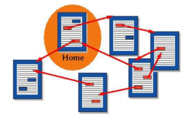
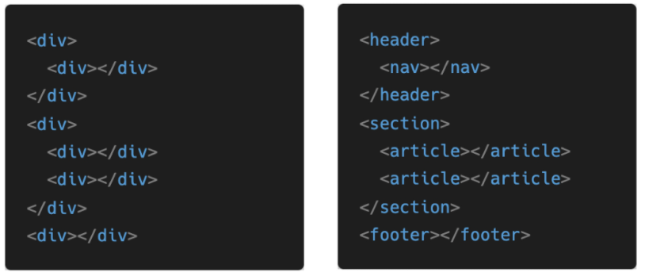

# HTML

### 1. HTML 기본구조

* **현재의 웹 표준**

  * W3C	HTML5
  * WHATWG   HTML Living Standard     Apple, Google, Microsoft, Mozilla
  * 2019년 WHATWG가 주도권 싸음웨서 승리하면서 표준이됨

* **Can I use?** -> strong, flex

  * 빨강 : 지원 X / 갈색 : 일부 지원 / 초록 : 지원 / 회색 : 잘 모름

* **HTML : Hyper Text Markup Language**

  * info.cern.ch : 최초의 웹 사이트
  * Hyper Text : 참조(하이퍼 링크)를 통해 사용자가 한 문서에서 다른 문서로 즉시 접근할 수 있는 텍스트
  * 
  * Markup Language : 태그 등을 이용하여 문서나 데이터의 구조를 명시하는 언어
    * HTML, Markdown
  * 웹 페이지를 작성(구조화)하기 위한 언어

* **HTML 기본 구조(Web의 뼈대를 만들기 위한 언어)**

  * html : 문서의 최상위(root) 요소, 쌍으로 존재('`<html></html>`)

  * head : 문서 메타데이터 요소

    * 문서 제목, 인코딩, 스타일, 외부 파일 로딩 등
    * 일반적으로 브라우저에 나타나지 않는 내용

  * body : 문서 본문 요소

    * 실제 화면 구성과 관련된 내용

  * 

  * head 예시

    * `<title>` : 브라우저 상단 타이틀
    * `<meta>` : 문서 레벨 메타데이터 요소, html 문서의 ✨**정보를 담당**
    * `<link>` : **✨외부** 리소스 연결 요소 (CSS 파일, favicon 등)
    * `<script>` : ✨**스크립트 요소** (JavaScript 파일/코드), body tag에 들어갈 수도 있음
    * `<style>` : CSS 직접 작성, ✨**html을 꾸며줌**
    * 
    * Open Graph Protocol : 메타 데이터를 표현하는 새로운 규약
      * HTML 문서의 메타 데이터를 통해 문서의 정보를 전달(미리보기, 프리뷰)
      * 메타정보에 해당하는 제목, 설명 등을 쓸 수 있도록 정의

  * DOM(Document Object Model) 트리

    * 텍스트 파일인 HTML 문서를 브라우저에서 렌더링 하기 위한 구조
      * HTML 문서에 대한 모델을 구성함
      * HTML 문서 내의 각 요소에 접근 / 수정에 필요한 프로퍼티와 메서드를 제공함
      * 
      * 
      * Markup Language여서 들여쓰기를 안해도 되지만 가독성을 좋게하여 유지보수가 쉬워짐

  * 요소(element) : 여는태그 / 닫는 태그 + 내용

  * 

    * HTML 요소는 시작 태그와 종료 태그 그리고 태그 사이에 위치한 내용으로 구성
      * 태그(Element, 요소)는 컨텐츠(내용)를 감싸는 것으로 그 정보의 성격과 의미를 정의
    * 내용이 없는 태그들
      * br, hr, img, input, link, meta
    * 요소는 중접(nested)될 수 있음
      * 요소의 중첩을 통해 하나의 문서를 구조화
      * 여는 태그와 닫는 태그의 쌍을 잘 확인 해야함
        * 오류를 반환하는 것이 아닌 그냥 레이아웃이 깨진 상태로 출력되어 디버깅이 힘들어 질 수 있음 (✨바로 바로 테스트해보는게 좋음 / 나중에 찾으려면 눈으로 직접해야함)

  * 속성(attribute)

    * 

    * 속성명 / 속성값 : key / value 느낌
    * 
    * 홑따옴표도 가능은 하지만 쌍따옴표 권장!
    * 속성을 통해 태그의 부가적인 정보를 설정할 수 있음
    * 요소는 속성을 가질 수 있으며, 경로나 크기와 같은 추가적인 정보를 제공
    * 요소의 시작 태그에 작성하며 보통 이름과 값이 하나의 쌍으로 존재
    * 태그와 상관없이 사용 가능한 속성(HTML Globla Attribute)들도 있음

  * HTML Global Attribute

    * 모든 HTML 요소가 공통으로 사용할 수 있는 대표적인 속성 (몇몇 요소에는 아무 효과가 없을 수 있음)
      * id : 문서 전체에서 유일한 고유 식별자 지정
      * class : 공백으로 구분된 해당 요소의 클래스의 목록 (CSS, JS에서 요소를 선택하거나 접근)
      * data-* : 페이지에 개인 사용자 정의 데이터를 저장하기 위해 사용
      * style : inline 스타일
      * title : 요소에 대한 추가 정보 지정
      * tabindex : 요소의 탭 순서
      * 
      * 

  * 시맨틱 태그

    * HTML5에서 의미론적 요소를 담은 태그의 등장
      * 기존 영역을 의미하는 div 태그를 대체하여 사용
    * 대표적인 태그 목록
      * header : 문서 전체나 섹션의 헤더(머리말 부분)
      * nav : 내비게이션
      * aside : 사이드에 위치한 공간, 메인 콘텐츠와 관련성이 적은 콘텐츠
      * section :  문서의 일반적인 구분, 컨텐츠의 그룹을 표현
      * article : 문서, 페이지, 사이트 안에서 독립적으로 구분되는 영역
      * footer : 문서 전체나 섹션의 푸터(마지막 부분)
      * 
      * Non semantic 요소는 div, span 등이 있으며, h1, table 태그들도 시맨틱 태그로 볼  수 있음
      * 개발자 및 사용자 뿐만 아니라 검색엔진 등에 의미 있는 정보의 그룹을 태그로 표현
      * 단순히 구역을 나누는 것 뿐만 아니라 '의미'를 가지는 태그들을 활용하기 위한 노력
      * 요소의 의미가 명확해지기 때문에(구조화/ 명시적 표현 가능) 코드의 가독성을 높이고 유지보수를 쉽게 함
      * 검색엔진최적화(SEO)를 위해서 메타태그, 시맨틱 태그 등을 통한 마크업을 효과적으로 활용 해야함

* **인라인 / 블록 요소**

  * 

---

### 2. HTML 문서 구조화

