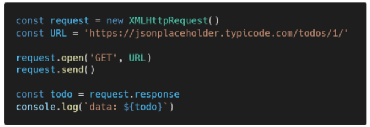
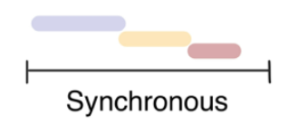
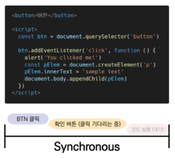
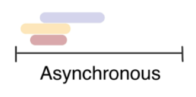
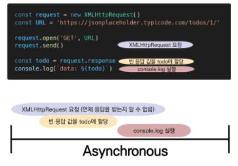
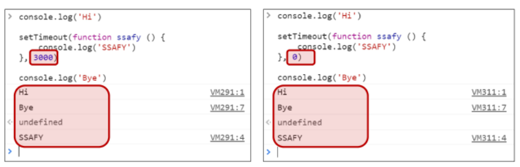

## 

 

## AJAX & Asynchronous JavaScript

 

---

 

### 0. 지난 시간

 

* **ECMAScript**
  * 변수와 식별자
  * 타입과 연산자
  * 조건 & 반복
  * 함수
  * 자료 구조
    * Array
    * Object

 

* **History of Browser & JavaScript**
  * JavaScript의 역사
    * 브라우저 전쟁
    * 파편화와 표준화
  * JavaScript로 할 수 있는 일
    * JavaScript Core(프로그래밍 언어)
    * DOM(Document Object Model)
    * BOM(Browser Object Model)

 

* **DOM(Document Object Model)**
  * DOM
    * DOM Tree
    * 객체(object)는 속성과 메서드를 통해 조작 가능
  * DOM 조작(Manipulation)
    * Selection, Manipulation
    * 속성, 메서드
    * 선택 -> 변경 / 생성 -> 추가

 

* **Event**
  * Event
    * 브라우저(HTML 문서) 안에서 일어나는 일
    * click, input, mouseover, submit, change...
  * Event Handler
    * EventTarget.addEventListener(type, listener)
    * "특정 이벤트가 발생하면, 할 일을 등록하자"

 

---

 

### 1. AJAX

 

* **AJAX란**
  * Asynchronous JavaScript And XML(비동기식 JavaScript와 XML)
  * 서버와 통신하기 위해 **💥XMLHttpRequest** 객체를 활용
  * JSON, XML, HTML 그리고 일반 텍스트 형식 등을 포함한 다양한 포맷을 주고 받을 수 있음
    * [참고] AJAX의 X가 XML을 의미하긴 하지만, 요즘은 더 가벼운 용량과 JavaScript의 일부라는 장점 때문에 JSON을 더 많이 사용함(✨JSON이 데이터 양도 더 적음)

 

* **AJAX 특징**
  * 페이지 전체를 reload(새로 고침)를 하지 않고서도 수행되는 "**✨비동기성**"
    * 서버의 응답에 따라 전체 페이지가 아닌 일부분만을 업데이트 할 수 있음
  * AJAX의 주요 두가지 특징은 아래의 작업을 할 수 있게 해줌
    1. 페이지 새로 고침 없이 서버에 요청
    2. 서버로부터 데이터를 받고 작업을 수행

 

* **[참고] AJAX 배경**
  * 2005년 Google Maps & Gmail 등에 활용되는 기술을 설명하기 위해 AJAX라는 용어를 최초로 사용
  * AJAX는 특정 기술이 아닌 기존의 여러 기술을 사용하는 새로운 접근법을 설명하는 용어
    * 기존 기술을 잘 활용할 수 있는 방식으로 구성 및 재조합한 새로운 접근법
  * Google 사용 예시
    * Gmail
      * 메일 전송 요청이 모두 처리 되기 전 다른 페이지로 넘어가더라도 메일은 전송 됨
    * Google Maps
      * 스크롤 행위 하나하나가 모두 요청이지만 페이지는 갱신되지 않음

 

* **XMLHttpRequest 객체**
  * 서버와 상호작용하기 위해 사용되며 전체 페이지의 새로 고침 없이 데이터를 받아올 수 있음
  * 사용자의 작업을 방해하지 않으면서 페이지 일부를 업데이트 할 수 있음
  * 주로 AJAX 프로그래밍에 사용
  * 이름과 달리 XML뿐만 아니라 모든 종류의 데이터를 받아올 수 있음
  * 생성자
    * XMLHttpRequest()

 

* **XMLHttpRequest 예시**
  * console에 todo 데이터가 출력되지 않음
  * 데이터 응답을 기다리지 않고 console.log()를 먼저 실행했기 때문
    * 

 

---

 

### 2. Asynchronous JavaScript

 

* **동기식**
  * 순차적, 직렬적 Task 수행
  * 요청을 보낸 후 응답을 받아야만 다음 동작이 이루어짐(blocking)
  * 
  * 버튼 클릭 후 alert 메시지의 확인 버튼을 누를 때까지 문장이 만들어지지 않음
  * 즉, alert 이후의 코드는 alert의 처리가 끝날 때까지 실행되지 않음
  * 왜 이런 현상이 발생할까?
    * "JavaScript는 single threaded"
  * 

 

* **비동기식**
  * 병렬적 Task 수행
  * 요청을 보낸 후 응답을 기다리지 않고 다음 동작이 이루어짐(non-blocking)
  * 
  * 요청을 보내고 응답을 기다리지 않고 다음 코드가 실행됨
  * 결과적으로 변수 todo에는 응답 데이터가 할당되지 않고 빈 문자열이 출력
  * 그렇다면 JS는 왜 기다려주지 않는 방식으로 동작하는가?
    * "JavaScript는 single threaded"
  * 

 

* **왜 비동기(Asynchronous)를 사용하는가?**
  * "사용자 경험"(💥**UX**)
    * 매우 큰 데이터를 동반하는 앱이 있다고 가정
    * 동기식 코드라면 데이터를 모두 불러온 뒤 앱이 실행됨
      * 즉, 데이터를 모두 불러올 때 까지는 앱이 모두 멈춘 것처럼 보임
      * 코드 실행을 차단하여 화면이 멈추고 응답하지 않는 것 같은 사용자 경험을 제공
    * 비동기식 코드라면 데이터를 요청하고 응답 받는 동안, 앱 실행을 함께 진행함
      * 데이터를 불러오는 동안 지속적으로 응답하는 화면을 보여줌으로써 더욱 쾌적한 사용자 경험을 제공
    * 때문에 많은 웹 API 기능은 현재 비동기 코드를 사용하여 실행됨

 

* **[참고] Threads**
  * 프로그램이 작업을 완료하기 위해 사용할 수 있는 단일 프로세스
  * 각 thread(스레드)는 한 번에 하나의 작업만 수행할 수 있음
  * 예시) Task A -> Task B -> Task C
    * 다음 작업을 시작하려면 반드시 앞의 작업이 완료되어야 함
    * 컴퓨터 CPU는 여러 코어를 가지고 있기 때문에 한 번에 여러 가지 일을 처리할 수 있음

 

* **Blocking vs. Non-Blocking**
  * python은 blocking 하다가 다 끝나면 실행
  * JS은 non-blocking -> 코드가 안 끝나도 실행

 

* **"JavaScript는 single threaded 이다."**
  * 컴퓨터가 여러 개의 CPU를 가지고 있어도 main thread라 불리는 단일 스레드에서만 작업 수행
  * 즉, 이벤트를 처리하는 **✨Call Stack**이 하나인 언어라는 의미
  * 이 문제를 해결하기 위해 JavaScript는
    1. 즉시 처리하지 못하는 이벤트들을 다른 곳(✨**Web API**)으로 보내서 처리하도록 하고,
    2. 처리된 이벤트들을 처리된 순서대로 대기실(✨**Task queue**)에 줄을 세워 놓고
    3. Call Stack이 비면 담당자(**✨Event Loop)**가 대기 줄에서 가장 오래된(제일 앞의) 이벤트를 Call Stack으로 보냄

 

* **Concurrency model**
  * Event loop를 기반으로 하는 동시성 모델(Concurrency model)
    1. Call Stack
    2. Web API(Browser API)
    3. Task Queue(Event Queue, Message Queue)
    4. Event Loop
  * Call Stack
    * 요청이 들어올 때마다 해당 요청을 순차적으로 처리하는 Stack(LIFO) 형태의 자료 구조
  * Wep API(Browser API)
    * JavaScript 엔진이 아닌 브라우저 영역에서 제공하는 API
    * **✨setTimeout(), DOM events 그리고 AJAX로 데이터를 가져오는 시간이 소요되는 일들을 처리**
  * Task Queue(Event Queue, Message Queue)
    * 비동기 처리된 callback 함수가 대기하는 Queue(FIFO)형태의 자료 구조
    * main thread가 끝난 후 실행되어 후속 JavaScript 코드가 차단되는 것을 방지
  * Event Loop
    * Call Stack이 비어 있는지 확인
    * 비어 있는 경우 Task Queue에서 실행 대기 중인 callback 함수가 있는지 확인
    * Task Queue에 대기 중인 callback 함수가 있다면 가장 앞에 있는 callback 함수를 Call Stack으로 push

 

* **Runtime**

 

* **Zero delays**
  * 
    * 우선 순위가 밀림
  * 실제로 0ms 후에 callback 함수가 시작된다는 의미가 아님
  * 실행은 Task Queue에 대기 중인 작업 수에 따라 다르며 해당 예시에서는 callback 함수의 메시지가 처리되기 전에 'Hi'와 'Bye'가 먼저 출력됨
  * 왜냐하면 delay(지연)는 JavaScript가 요청을 처리하는데 필요한 최소 시간이기 때문(보장된 시간이 아님)
  * 기본적으로 setTimeout 함수에 특정 시간제한을 설정했더라도 대기 중인 메시지의 모든 코드가 완료될 때까지 대기해야 함

 

* **순차적인 비동기 처리하기**
  * Web API로 들어오는 순서는 중요하지 않고, 어떤 이벤트가 **✨먼저** 처리되느냐가 중요(즉, 실행 순서 불명확)
  * 이를 해결하기 위해 순차적인 비동기 처리를 위한 2가지 작성 방식
    1. Async callbacks
       * 백그라운드에서 실행을 시작할 함수를 호출할 때 인자로 지정된 함수
       * 예시) addEventListener()의 두번째 인자
    2. promise-style
       * Modern Web APIs에서의 새로운 코드 스타일
       * XMLHttpRequest 객체를 사용하는 구조보다 조금 더 현대적인 버전ㅋ

 

---

 

### 3. Callback Function

     
