## 

 

## Java Script Basic

 

### 1. Intro

 

* **동작 방식**
  * 

 

* **브라우저(browser)**
  * URL로 웹(WWW)을 탐색하며 서버와 통신하고, HTML 문서나 파일을 출력하는 GUI 기반의 소프트웨어
  * 인터넷의 컨텐츠를 검색  및 열람하도록 함
  * "웹 브라우저"라고도 함
  * 주요 브라우저
    * Google Chrome, Mozilla Firefox, Microsoft Edge, Opera, Safan

 

* **JavaScript의 필요성**
  * 브라우저 화면을 '동적'으로 만들기 위함
  * 브라우저를 조작할 수 있는 **💥유일한 언어**
    * 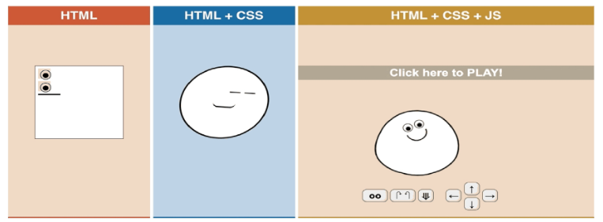
    * SQL : DB를 조작할 수 있는 유일한 언어(ORM으로 번역해서 쓰기는 하지만)

 

* **Most Populat Programming Language in 2021 survey**
  * 
    * Jetbrain : 파이참을 만든 회사

 

---

 

### 2. Browser

 

* **브라우저에서 할 수 있는 일**
  * DOM(Document Object Model) 조작
    * 문서(HTML) 조작
  * BOM(Brower Object Model) 조작
    * navigator, screen, location, frames, history, XHR
  * JavaScript Core(ECMAScript)
    * Data Structure(Object, Array), Conditional Expression, Iteration

 

* **DOM 이란?**
  * HTML, XML과 같은 문서를 다루기 위한 프로그래밍 인터페이스
  * 문서를 구조화하고, 구조화된 구성 요소를 하나의 객체로 취급하여 다루는 논리적 트리 모델
  * 문서가 객체(object)로 구조화되어 있으며 key로 접근 가능
  * 단순한 속성 접근, 메서드 활용뿐만 아니라 프로그래밍 언어적 특성을 활용한 조작 가능
  * 주요 객체
    * window : DOM을 표현하는 창(브라우저 탭), 최상위 객체(작성 시 생략 가능)
    * document : 페이지 컨텐츠의 Entry Point 역할을 하며, `<head>`, `<body>` 등과 같은 수많은 다른 요소들을 포함
    * navigator, location, history, screen
  * ✨한 줄 요약 : 문서(HTML)를 프로그램으로 조작할 수 있다.

 

* **DOM**
  * 
    * 구조화

 

* **DOM - 해석**
  * 파싱 (Parsing)
    * 구문 분석, 해석
    * 브라우저가 문자열을 해석하여 DOM Tree로 만드는 과정
    * 

 

* **DOM - 조작**
  * 

 

* **BOM 이란?**
  * Browser Object Model
  * 자바스크립트가 브라우저와 소통하기 위한 모델
  * 브라우저의 창이나 프레임을 추상화해서 프로그래밍적으로 제어할 수 있도록 제공하는 수단
    * 버튼, URL 입력창, 타이틀 바 등 브라우저 윈도우 및 웹 페이지 일부분을 제어 가능
  * window 객체는 모든 브라우저로부터 지원받으며 브라우저의 창(window)를 지칭
  * ✨브라우저에 대한 제어권도 프로그래밍 언어로 접근 가능

 

* **BOM 조작**
  * 

 

* **JavaScript Core**
  * 브라우저(BOM & DOM)을 조작하기 위한 명령어 약속(언어)
    * 

 

* **정리**
  * 
  * 브라우저(BOM)과 그 내부의 문서(DOM)를 조작하기 위해 ECMAScript(JS)를 학습

 

---

 

### 3. Introduction

 

* **ECMA**
  * ECMA(ECMA International)
    * 정보 통신에 대한 **✨표준을 제정하는 비영리 표준화 기구**
  * ECMAScript는 ECMA에서 ECMA-262 규격에 따라 정의한 언어
    * ECMA-262 : 범용적인 목적의 프로그래밍 언어에 대한 명세
  * ✨**ECMAScript6는 ECMA에서 제안하는 6번째 표준 명세를 말함**
    * (참고) ECMAScript6의 발표 연도에 따라 ECMAScript2015라고도 불림
  * JS와 ECMAScript가 혼용됨
    * ✨ECMAScript는 여러버전이 있고, 현재는 6(6이전과 이후의 차이가 큼)

 

- **세미콜론(semicolon)**
  - 자바스크립트는 ✨**세미콜론을 선택적으로 사용가능**
  - 세미콜론이 없으면 **✨ASI**에 의해 자동으로 세미콜론이 삽입됨
    - ASI : 자동 세미콜론 삽입 규칙(Automatic Semicolon Insertion)
  - 본 수업에서는 자바스크립의 문법 및 개념적 측면에 집중하기 위해 세미콜론을 사용하지 않고 진행
  - 세미콜론(semicolon) 예시
    - 

 

* **코딩 스타일 가이드**
  * 코딩 스타일의 핵심은 합의된 원칙과 일관성
    * 절대적인 하나의 정답은 없으며, 상황에 맞게 원칙을 정하고 일관성 있게 사용하는 것이 중요
  * 코딩 스타일은 코드의 품질에 직결되는 중요한 요소
    * 코드의 가독성, 유지보수 또는 팀원과의 커뮤니케이션 등 개발 과정 전체에 영향을 끼침
  * (참고) 다양한 자바스크립트 코딩 스타일 가이드
    * ✨Airbnb Javascript Style Guide
    * Google Javascript Style Guide
    * standardjs
  * 코딩 스타일 가이드 예시
    * 본 수업에서는 Airbnb Style Guide를 중심으로 진행할 예정
      * 단, 가이드의 일부 항목은 문법 및 개념적 측면에 집중하기 위해 변형해서 사용
      * 

 

---

 

### 4. 변수와 식별자

 

* **식별자 정의와 특징**
  * 식별자(identifier)는 변수를 구분할 수 있는 변수명을 말함
  * 식별자는 반드시 문자, **✨달러($) 또는 밑줄(_)로 시작**
  * 대소문자를 구분하며, 클래스명 외에는 모두 소문자로 시작
  * 예약어 사용 불가능
    * 예약어 예시 : for, if, function 등

 

* **식별자 작성 스타일**(✨JS에서는 주로 camelCase를 사용)
  * 카멜 케이스(camelCase, lower-camel-case)
    * 변수, 객체, 함수에 사용
  * 파스칼 케이스(PascalCase, upper-camel-case)
    * 클래스, 생성자에 사용
  * 대문자 스네이크 케이스(SNAKE_CASE)
    * 상수(constants)에 사용
      * 상수의 정의 : 개발자의 의도와 상관없이 변경될 가능성이 없는 값을 의미
  * 
  * 
  * 

 

* **변수 선언 키워드(let, const)**
  * 

 

* **(참고) 선언, 할당, 초기화**(✨파이썬은 불가능하지만, JS에서는 선언과 할당을 따로 할 수 있음)
  * 
  * 선언(Declaration)
    * **변수를 생성**하는 행위 또는 시점
  * 할당(Assignment)
    * **선언된 변수에 값을 저장**하는 행위 또는 시점
  * 초기화(Initialization)
    * **선언된 변수에 처음으로 값을 저장**하는 행위 또는 시점

 

* **변수 선언 키워드(let, const) 예시 - 재할당 / 재선언**
  * 
    * 재할당과 값을 바꿈은 같은게 아님
    * 다른 값을 넣는게 아니고, 기존에 가지고 있는 값에서 조작하는 것이 가능
  * 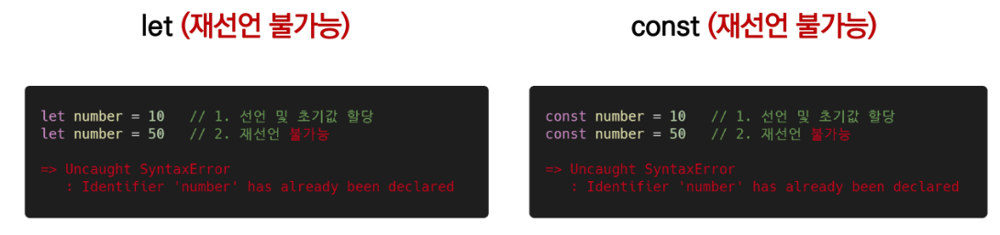

 

* **변수 선언 키워드(let, const)**
  * 블록 스코프(block scope)
    * if, for, 함수 등의 **✨중괄호 내부**를 가리킴
    * 블록 스코프를 가지는 변수는 **💥블록 바깥에서 접근 불가능**
    * 
  * 파이썬 스코프는 LEGB
    * 파이썬은 조건문 안에서 선언된 변수를 외부에서 사용가능
    * JS는 중괄호 기준으로 움직임

 

* **변수 선언 키워드 - var**
  * var(✨사용 지양)
    * var로 선언한 변수는 재선언 및 재할당 모두 가능
    * ES6 이전에 변수를 선언할 때 사용되는 키워드
    * 호이스팅되는 특성으로 인해 예기치 못한 문제 발생 가능
      * 따라서 ES6 이후부터는 var 대신 const와 let을 사용하는 것을 권장
    * 함수 스코프
  * 
  * 함수 스코프(function scope)
    * ✨**함수의 중괄호 내부**를 가리킴
    * 함수 스코프를 가지는 변수는 **💥함수 바깥에서 접근 불가능**
    * if, for 안에서 쓰면 밖에서 접근 가능(파이썬 같이)
    * 
  * 호이스팅(hoisting) - ✨var의 가장 큰 문제점 / 디버깅을 어렵게 함
    * 변수를 선언 이전에 참조할 수 있는 현상
    * 변수 선언 이전의 위치에서 접근시 undefined를 반환
    * 

 

* **let, const, var 비교**
  * 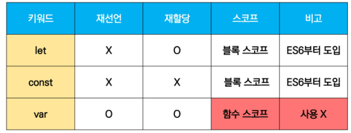
    * 블록 스코프 : {}

 

---

 

### 5. 데이터 타입

 

* **데이터 타입 종류**
  * 자바스크립트의 모든 값은 특정한 데이터 타입을 가짐
  * 크게 원시 타입(Primitive type)과 참조 타입(Reference type)으로 분류됨
    * 

 

* **(참고) 원시 타입과 참조 타입 비교**
  * 원시 타입(Primitive type)
    * 객체(object)가 아닌 기본 타입
    * 변수에 해당 타입의 값을 담김
    * 다른 변수에 복사할 때 실제 값이 복사됨
    * 
  * 참조 타입(Reference type)
    * 객체(object) 타입의 자료형
    * 변수에 해당 객체의 참조 값이 담김
    * 다른 변수에 복사할 때 참조 값이 복사됨
    * 

 

* **원시 타입(Primitive type)**
  * 숫자(Number) 타입
    * 정수, 실수 구분 없는 하나의 숫자 타입
    * 부동소수점 형식을 따름
    * (참고) NaN(Not-A-Number)
      * 계산 불가능한 경우 반환되는 값
        * ex. 'Angel' / 1004 => NaN(✨숫자가 아닌것을 나타내는 숫자형(?))
    * 
    * 파이썬은 float(INF)로 무한대를 나타냄
  * 문자열(String) 타입
    * 텍스트 데이터를 나타내는 타입
    * 16비트 유니코드 문자의 집합
    * 작은따옴표 또는 큰따옴표 모두 가능
    * 템플릿 리터럴(Template Literal)
      * ES6부터 지원
      * 따옴표 대신 backtick(``)으로 표현
      * ${expression} 형태로 표현식 삽입 가능
      * 
  * undefined
    * 변수의 값이 없음을 나타내는 데이터 타입
    * 변수 선언 이후 직접 값을 할당하지 않으면, 자동으로 undefined가 할당됨
    * 
  * null
    * 변수의 값이 없음을 의도적으로 표현할 때 사용하는 타입
    * (참고) null 타입과 typeof 연산자
      * typeof 연산자 : 자료형 평가를 위한 연산자
      * null 타입은 ECMA 명세의 원시 타입의 정의에 따라 원시 타입에 속하지만, typeof 연산자의 결과는 객체(object)로 표현됨
    * 

 

* **(참고) undefined 타입과 null 타입 비교** => 설계 미스(그래도 나누자면...)
  * undefined(✨개발자의 의도가 안 들어가 있음)
    * 빈 값을 표현하기 위한 데이터 타입
    * 변수 선언 시 아무 값도 할당하지 않으면, 자바스크립트가 자동으로 할당
    * typeof 연산자의 결과는 undefined
    * 
  * null(✨의도적으로 표현 해줘야함 / null을 안 써주면 null 안나옴)
    * 빈 값을 표현하기 위한 데이터 타입
    * 개발자가 의도적으로 필요한 경우 할당
    * typeof 연산자의 결과는 object
    * 

 

* **원시 타입(Primitive type)**
  * Boolean 타입
    * 논리적 참 또는 거짓을 나타내는 타입
    * true 또는 false로 표현(✨대문자가 아님)
    * 조건문 또는 반복문에서 유용하게 사용
      * (참고) 조건문 또는 반복문에서 boolean이 아닌 데이터 타입은 자동 형변환 규칙에 따라 true 또는 false로 변환됨
    * 

 

* **(참고) ToBoolean Conversions(자동 형변환) 정리**
  * 
  * if ([]) : 파이썬은 False / JS는 true

 

* **참조 타입(Reference type)**
  * 자세한 내용은 해당 타입의 챕터 참고
  * 타입 별 챕터 링크 목록
    * 함수(Functions)
    * 배열(Arrays)
    * 객체(Objects)

 

---

 

### 6. 연산자

 

* **할당 연산자**
  * 오른쪽에 있는 피연산자의 평가 결과를 왼쪽 피연산자에 할당하는 연산자
  * 다양한 연산에 대한 단축 연산자 지원
  * (참고) Increment 및 Decrement 연산자 (✨while문 등에서 n += 1과 같은 작업이 많아서 생김)
    * Increment(++) : 피연산자의 값을 1 증가시키는 연산자
    * Decrement(--) : 피연산자의 값을 1 감소시키는 연산자
    * Airbnb Style Guide에서는 '+=' 또는 '-='와 같이 더 분명한 표현으로 적을 것을 권장
    * 

 

* **비교 연산자**
  * 피연산자들(숫자, 문자, Boolean 등)을 비교하고 결과값을 boolean으로 반환하는 연산자
  * 문자열은 **✨유니코드 값을 사용(할당된 숫자로 비교)**하며 표준 사전 순서를 기반으로 비교
    * ex. 알파벳끼리 비교할 경우
      * 알파벳 순서상 후순위가 더 크다
      * 소문자가 대문자보다 더 크다
  * 

 

* **동등 비교 연산자(==)**
  * 두 피연산자가 같은 값으로 평가되는지 비교 후 boolean 값을 반환
  * 비교할 때 **✨암묵적 타입변환**을 통해 타입을 일치시킨 후 같은 값인지 비교
  * 두 피연산자가 모두 객체일 경우 메모리의 같은 객체를 바라보는지 판별
  * 💥**예상치 못한 결과가 발생할 수 있으므로 특별한 경우를 제외하고 사용하지 않음**
  * 

 

* **일치 비교 연산자(===)**
  * 두 피연산자가 같은 값으로 평가되는지 비교 후 boolean 값을 반환
  * **✨엄격한 비교**가 이뤄지며 암묵적 타입 변환이 발생하지 않음
    * 엄격한 비교 : 두 비교 대상의 타입과 값 모두 같은지 비교하는 방식
  * 두 피연산자가 모두 객체일 경우 메모리의 같은 객체를 바라보는지 판별
  * 

 

* **논리 연산자**
  * 세 가지 논리 연산자로 구성
    * and 연산은 '&&' 연산자를 이용
    * or 연산은 '||' 연산자를 이용
    * not 연산은 '!' 연산자를 이용
  * 단축 평가 지원
    * ex. false && ture => false
    * ex. true || false => true
  * 

 

* **삼항 연산자(Ternary Operator)**
  * 세 개의 피연산자를 사용하여 조건에 따라 값을 반환하는 연산자
  * 가장 왼쪽 조건식이 참이면 콜론(:) 앞의 값을 사용하고 그렇지 않으면 콜론(:) 뒤의 값을 사용
  * 삼항 연산자의 결과 **✨값(하나의 결과)**이기 때문에 변수에 할당 가능
  * (참고) 한 줄에 표기하는 것을 권장
  * 
  * 항이 3개 / 💥항이 몇개든 결국 평가되어 **하나의 값**이 됨

 

---

 

### 7. 조건문

 

* **조건문의 종류와 특징**
  * 'if' statement
    * 조건 표현식의 결과값을 Boolean 타입으로 변환 후 참/거짓을 판단
  * 'switch' statement
    * 조건 표현식의 결과값이 어느 값(case)에 해당하는지 판별
    * (참고) 주로 특정 변수의 값에 따라 조건을 분기할 때 활용
      * 조건이 많아질 경우 if문보다 가독성이 나을 수 있음

 

* **if statement**
  * if, else if, else
    * 조건은 소괄호(condition) 안에 작성
    * 실행할 코드는 중괄호{} 안에 작성
    * 블록 스코프 생성
    * 

 

* **if statement 예시**
  * 
    * elif 아님 => else if
    * ✨괄호 / 중괄호 뒤에 else if 와 else임 (주의 !!!)

 

* **switch statement**
  * switch
    * 표현식(expression)의 결과값을 이용한 조건문
    * 표현식의 결과값과 case문의 오른쪽 값을 비교
    * break 및 default문은 [선택적]으로 사용 가능
    * break문이 없는 경우 break문을 만나거나 default문을 실행할 때까지 다음 조건문 실행
    * 블록 스코프 생성
    * 

 

* **switch 예시**
  * break가 있는 경우
    * 
  * break가 없는 경우
    * 

 

* **if vs. switch**
  * 
    * 조건이 조금이라도 복합적이면 switch 못씀

 

---

 

### 8.  반복문

 

* **반복문의 종류와 특징**
  * while
  * for
  * for ... in
    * 주로 객체(object)의 속성들을 순회할 때 사용
    * 배열도 순회 가능하지만 인덱스 순으로 순회한다는 보장이 없으므로 권장하지 않음
  * for ... of
    * 반복 가능한(iterable) 객체를 순회하며 값을 꺼낼때 사용
      * 반복 가능한(iterable) 객체의 종류 : Array, Map, Set, String 등

 

* **while**
  * while
    * 조건문이 참(true)인 동안 반복 시행
    * 조건은 소괄호 안에 작성
    * 실행할 코드는 중괄호 안에 작성
    * 블록 스코프 생성
    * 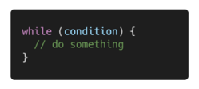

 

* **while 예시**
  * 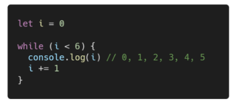

 

* **for**
  * for
    * 세미콜론(;)으로 구분되는 세 부분으로 구성
    * initialization
      * 최초 반복문 진입 시 1회만 실행되는 부분
    * condition
      * 매 반복 시행 전 평가되는 부분
    * expression
      * 매 반복 시행 이후 평가되는 부분
    * 블록 스코프 생성
    * 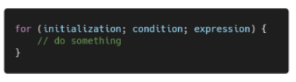

 

* **for 예시**
  * 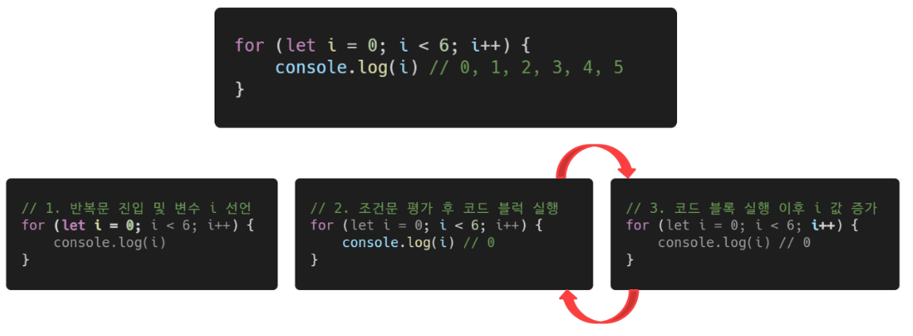

 

* **for...in**
  * for...in
    * 객체(object)의 속성(key)들을 순회할 때 사용
    * 배열도 순회 가능하지만 권장하지 않음
    * 실행할 코드는 중괄호 안에 작성
    * 블록 스코프 생성
    * 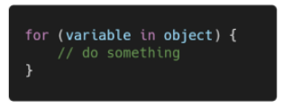
    * 💥JS에서의 객체는 class instance가 아님 dictionary를 의미함
    * 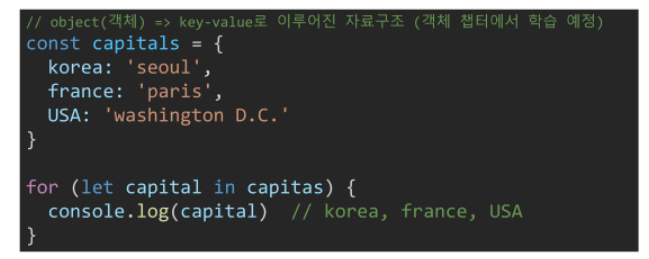

 

* **for...of**
  * for...of
    * 반복 가능한(iterable) 객체를 순회하며 값을 꺼낼 때 사용
    * 실행할 코드는 중괄호 안에 작성
    * 블록 스코프 생성
    * 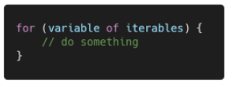
    * 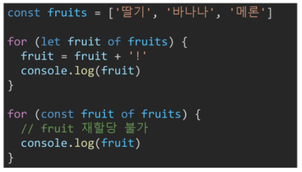

 

* **(참고) for...in vs. for...of**
  * 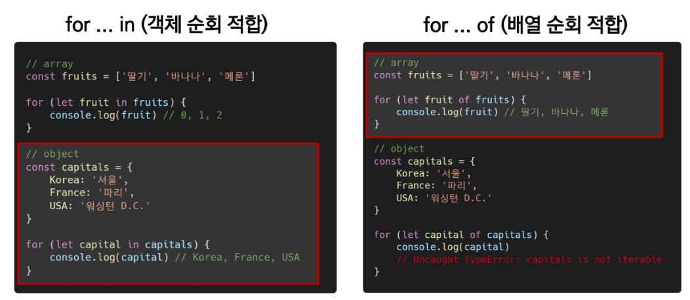
    * 객체의 키 값 => 문자열
    * 배열의 키 값 => 인덱스
    * for...of 에러 : iterable하지 않으므로

 

* **조건문과 반복문 정리**
  * 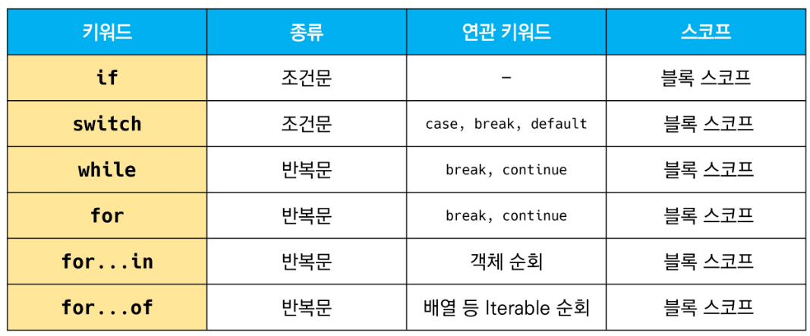

 

---

 

### 9. 함수

 

* **함수 in JavaScript**
  * 참조 타입 중 하나로써 function 타입에 속함
  * JaveScript에서 함수를 정의하는 방법은 주로 2가지로 구분
    * 함수 선언식(function declaration)
    * 함수 표현식(function expression)
  * (참고) JaveScript의 함수는 일급 객체(First-class citizen)에 해당
    * 일급 객체 : 다음의 조건들을 만족하는 객체를 의미함
      * 변수에 할당 가능
      * 함수의 매개변수로 전달 가능
      * 함수의 반환 값으로 사용 가능

 

* **함수 선언식(function statement, declaration)**
  * 함수의 이름과 함께 정의하는 방식
  * 3가지 부분으로 구성
    * 함수의 이름(name)
    * 매개변수(args)
    * 몸통(중괄호 내부)
  * 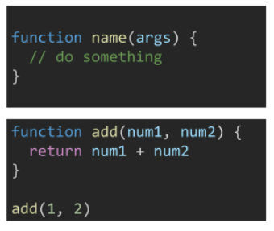

 

* **함수 표현식(function expression)**
  * 함수를 표현식 내에서 정의하는 방식
    * (참고) 표현식 : 어떤 하나의 값으로 결정되는 코드의 단위
  * 함수의 이름을 생략하고 익명 함수로 정의 가능
    * 익명 함수(anonymous function) : 이름이 없는 함수
    * 익명 함수는 함수 표현식에서만 가능
  * 3가지 부분으로 구성
    * 함수의 이름(생략 가능)
    * 매개변수(args)
    * 몸통(중괄호 내부)
  * 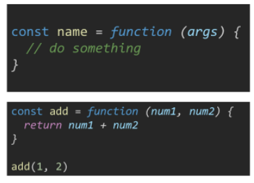

 

* **기본 인자(default arguments)**
  * 인자 작성 시 '=' 문자 뒤 기본 인자 선언 가능
    * 

 

* **매개변수와 인자의 개수 불일치 허용**
  * 매개변수보다 인자의 개수가 많을 경우(알아서 자름)
    * 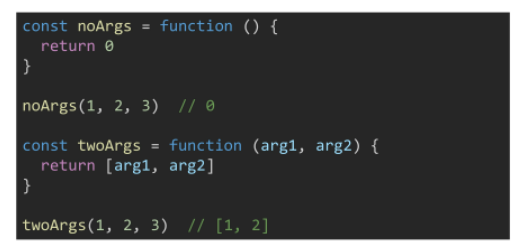
  * 매개변수보다 인자의 개수가 적을 경우
    * 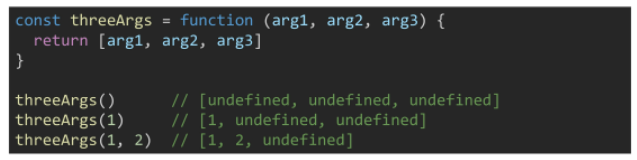

 

* **Rest Parameter**(파이썬의 가변인자 리스트(*)와 비슷)
  * rest operator(...)를 사용하면 함수가 정해지지 않은 수의 매개변수를 배열로 받음(python의 *args와 유사)
    * 만약 rest operator로 처리한 매개변수에 인자가 넘어오지 않을 경우네는, 빈 배열로 처리
    * 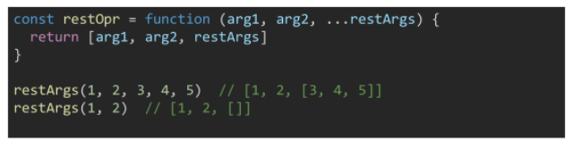

 

* **Spread operator**(파이썬의 언패킹(*)과 비슷)
  * spread operator(...)를 사용하면 배열 인자를 전개하여 전달 가능
    * 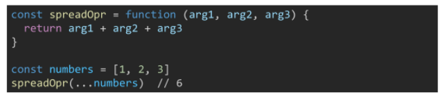

 

---

 

### 10. 선언식과 표현식

 

* **함수 선언식과 표현식 비교 정리**
  * 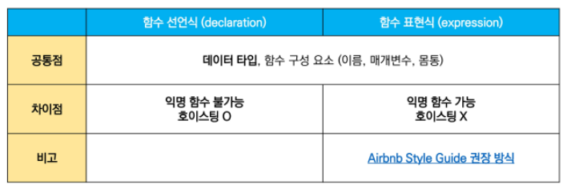
    * 표현식 권장

 

* **함수의 타입**
  * 선언식 함수와 표현식 함수 모두 타입은 function으로 동일
    * 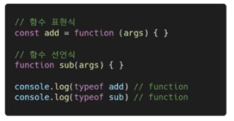

 

* **호이스팅(hoisting) - 함수 선언식**
  * 함수 선언식으로 선언한 함수는 var로 정의한 변수처럼 hoisting 발생
  * 함수 호출 이후에 선언 해도 동작
    * 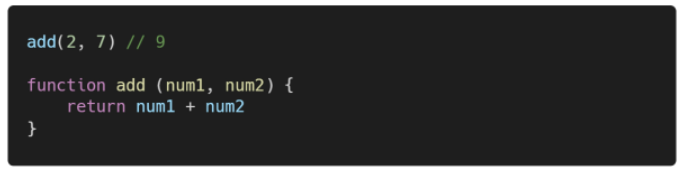

 

* **호이스팅(hoisting) - 함수 표현식**
  * 반면 함수 표현식으로 선언한 함수는 함수 정의 전에 호출 시 에러 발생
  * 함수 표현식으로 정의된 함수는 변수로 평가되어 변수의 scope 규칙을 따름
    * 

 

* **(참고) 호이스팅(hoisting) - 함수 표현식**
  * 함수 표현식을 var 키워드로 작성한 경우, 변수가 선언 전 undefined로 초기화 되어 다른 에러가 발생
    * 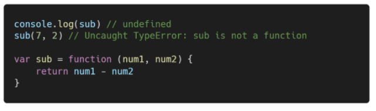

 

---

 

### 11. Arrow Function

 

* **화살표 함수(Arrow Function)**
  * 함수를 비교적 간결하게 정의할 수 있는 문법
    1.  fuction 키워드 생략 가능
    2. 함수의 매개변수가 단 하나 뿐이라면, '()'도 생략 가능
    3. 함수 몸통이 표현식 하나라면 '{}'과 return도 생략 가능
  * 기존 fuction 키워드 사용 방식과의 차이점은 후반부 **✨this** 키워드를 학습하고 다시 설명

 

* **Arrow Function**
  * 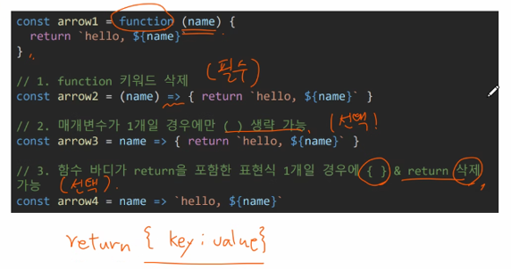

 

---

 

### 12. 문자열(String)

 

* **문자열 관련 주요 메서드 목록**
  * (참고) 추가적인 문자열 관련 메서드 정보는 아래 링크에서 참고
    * MDN, ECMA262
    * 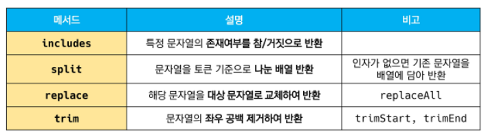

 

* **문자열 관련 주요 메서드 - includes**
  * string.includes(value)
    * 문자열에 value가 존재하는지 판별 후 참 또는 거짓 반환
    * 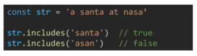

 

* **문자열 관련 주요 메서드 - split**
  * string.split(value)
    * value가 없을 경우, 기존 문자열을 배열에 담아 반환
    * value가 빈 문자열일 경우 각 문자로 나눈 배열을 반환
    * vlaue가 기타 문자열일 경우, 해당 문자열로 나눈 배열을 반환
    * 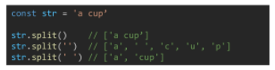

 

* **문자열 관련 주요 메서드 - replace**
  * string.replace(from, to)
    * 문자열에 from 값이 존재할 경우, 1개만 to 값으로 교체하여 반환
  * string.replaceAll(from, to)
    * 문자열에 from 값이 존재할 경우, 모두 to 값으로 교체하여 반환

 

* **문자열 관련 주요 메서드 - trim**
  * string.trim()
    * 문자열 시작과 끝의 모든 공백문자(스페이스, 탭, 엔터 등)를 제거한 문자열 반환
  * string.trimStart()
    * 문자열 시작의 공백문자(스페이스, 탭, 엔터 등)를 제거한 문자열 반환
  * string.trimEnd()
    * 문자열 끝의 공백문자(스페이서, 탭, 엔터 등)를 제거한 문자열 반환
  * 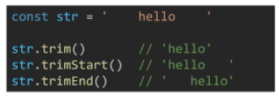

 

---

 

### 13. 배열(Arrays)

 

* **배열의 정의와 특징**
  * 키와 속성들을 담고 있는 참조 타입의 **객체(object)**
  * 순서를 보장하는 특징이 있음
  * 주로 대괄호를 이용하여 생성하고, 0을 포함한 양의 정수 인덱스로 특정 값에 접근 가능
  * 배열의 길이는 array.length 형태로 접근 가능
    * ✨(참고) 배열의 마지막 원소는 array.length - 1 로 접근
  * 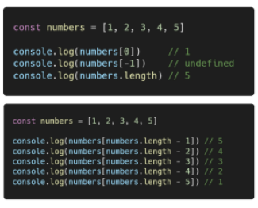

 

* **배열 관련 주요 메서드 목록 (1) - 기본편(기본 배열 조작) **
  * (참고) 추가적인 배열 관련 메서드 정보는 아래 링크에서 참고
    * MDN, ECMA262(#sec-properties-of-the-array-constructor)
    * 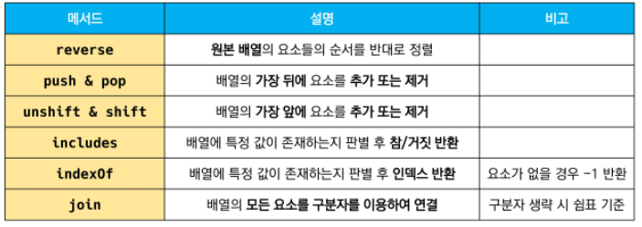

 

* **배열 관련 주요 메서드 - reverse**
  * array.reverse()
    * 원본 배열의 요소들의 순서를 반대로 정렬
  * 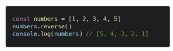

 

* **배열 관련 주요 메서드 - push & pop**
  * array.push()
    * 배열의 가장 뒤에 요소 추가
  * array.pop()
    * 배열의 마지막 요소 제거
  * 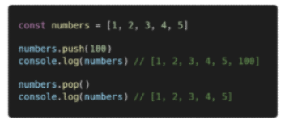

 

* **배열 관련 주요 메서드 - unshift & shift**
  * array.unshift()
    * 배열의 가장 앞에 요소 추가
  * array.shifh()
    * 배열의 첫번째 요소 제거
  * 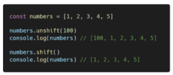

 

* **배열 관련 주요 메서드 - includes**
  * array.includes(value)
    * 배열에 특정 값이 존재하는지 판별 후 참 또는 거짓 반환
  * 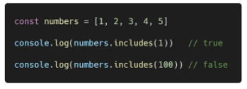

 

* **배열 관련 주요 메서드 - indexOf**
  * array.indexOf(value)
    * 배열에 특정 값이 존재하는지 확인 후 가장 첫 번째로 찾은 요소의 인덱스 반환
    * 만약 해당 값이 없을 경우 -1 반환
  * 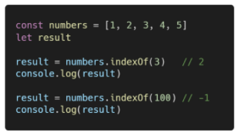

 

* **배열 관련 주요 메서드 - join**
  * array.join([separator])
    * 배열의 모든 요소를 연결하여 반환
    * separator(구분자)는 선택적으로 지정 가능하며, 생략 시 쉼표를 기본 값으로 사용
  * 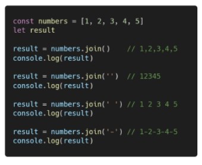
  * JS에서는 array의 메서드로 join 사용
  * python에서는 string의 메서드

 

* **Spread operator**
  * spread operator(...)를 사용하면 배열 내부에서 배열 전개 가능
  * ES5까지는 Array.concat() 메서드를 사용
  * 얕은 복사에 활용 가능
  * 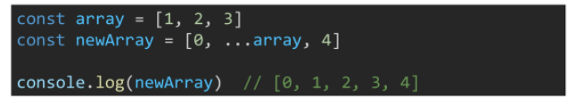

 

* **배열 관련 주요 메서드 목록 (2) - 심화편(Array Helper Methods)**
  * 배열을 순회하며 특정 로직을 수행하는 메서드
  * 메서드 호출 시 인자로 **💥callback 함수**를 받는 것이 특징
    * callback 함수 : 어떤 함수의 내부에서 실행될 목적으로 인자로 넘겨받는 함수를 말함
  * 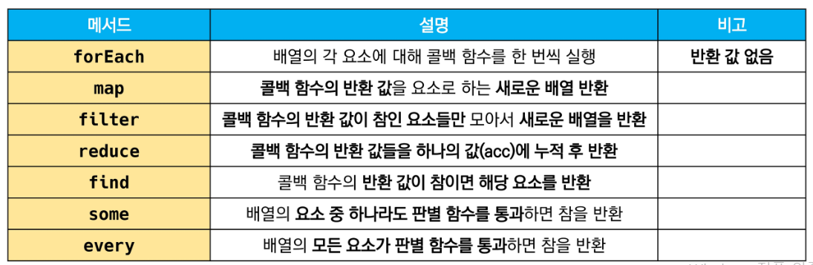

 

* **(참고) Django로 보는 callback 함수 예시**
  * 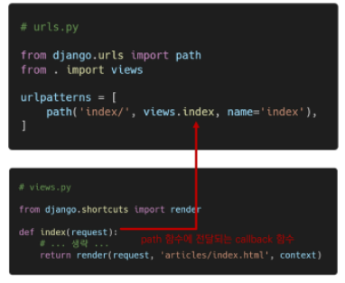

 

* **배열 관련 주요 메서드 - forEach**
  * array.forEach(callback(element[, index[,array]]))
    * 배열에 각 요소에 대해 콜백 함수를 한 번씩 실행
    * 콜백 함수는 3가지 매개변수로 구성
      * element : 배열의 요소
      * index : 배열 요소의 인덱스
      * array : 배열 자체
    * 💥**반환 값(return)이 없는 메서드**
  * 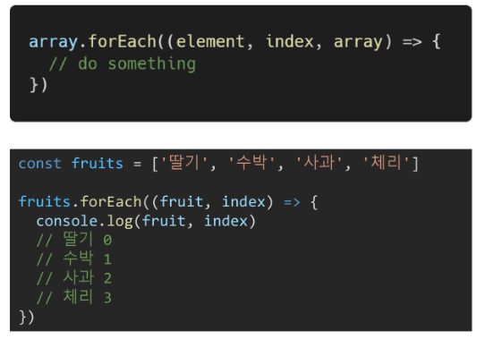

 

* **배열 관련 주요 메서드 - map**
  * array.map(callback(element[, index[, array]]))
    * 배열의 각 요소에 대해 콜백 함수를 한 번씩 실행
    * 콜백 **✨함수의 반환 값을 요소로 하는** 새로운 배열 반환
    * 기존 배열 전체를 다른 형태로 바꿀 때 유용
  * 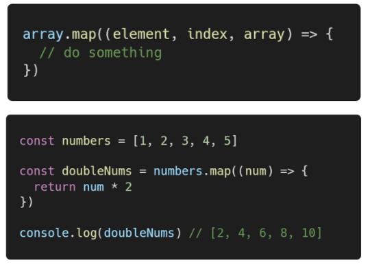

 

* **배열 관련 주요 메서드 - filter**(✨값을 판단함)
  * array.filter(callback(element[, index[, array]]))
    * 배열의 각 요소에 대해 콜백 함수를 한 번씩 실행
    * 콜백  **✨함수의 반환 값이 참인 요소들만** 모아서 새로운 배열을 반환
    * 기존 배열의 요소들을 필터링할 때 유용
  * 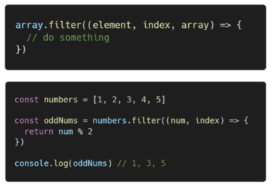

 

* **배열 관련 주요 메서드 - reduce**
  * array.reduce(callback(acc, element, [index[, array]])[, initialValue])
    * 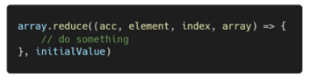
  * 배열의 각 요소에 대해 콜백 함수를 한 번씩 실행
  * 콜백 함수의 반환 값들을 **💥하나의 값(acc)에 누적 후 반환**
  * reduce 메서드의 주요 매개 변수
    * acc
      * 이전 callback 함수의 반환 값이 누적되는 변수
    * initialValue(optional)
      * 최초 callback 함술 호출 시 acc에 할당되는 값, default 값은 배열의 첫 번째 값
    * (참고) 빈 배열의 경우 initialValue를 제공하지 않으면 에러 발생
  * 예시
    * 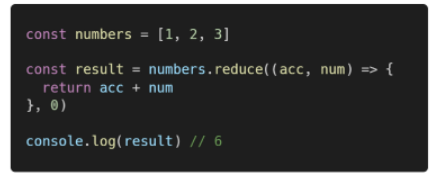

 

* **배열 관련 주요 메서드 - reduce 동작 방식**
  * 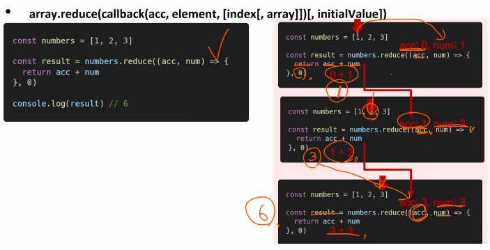

 

* **배열 관련 주요 메서드 - find**
  * array.find(callback(element[, index[, array]]))
    * 배열의 각 요소에 대해 콜백 함수를 한 번씩 실행
    * 콜백 함수의 **✨반환 값이 참이면, 조건을 만족하는 첫번째 요소를 반환**
    * 찾는 값이 배열에 없으면 undefined 반환
  * 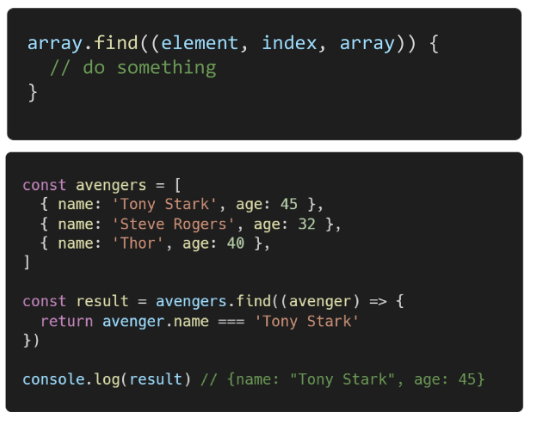

 

* **배열 관련 주요 메서드 - some**
  * array.some(callback(element[, index[, array]]))
    * 배열의 **✨요소 중 하나라도** 주어진 판별 함수를 통과하면 참을 반환
    * 모든 요소가 통과하지 못하면 거짓 반환
    * ✨(참고) 빈 배열은 항상 거짓 반환 => [].some  // false
  * 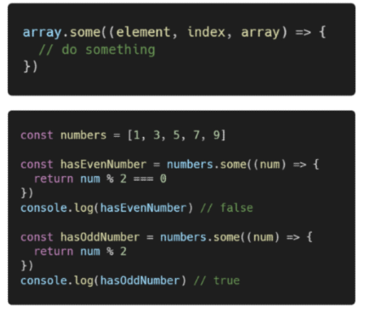

 

* **배열 관련 주요 메서드 - every**
  * array.every(callback(element[, index[, array]]))
    * 배열의 모든 요소가 주어진 판별 함수를 통과하면 참을 반환
    * 하나의 요소라도 통과하지 못하면 거짓 반환
    * (참고) 빈 배열은 항창 참 반환 => [].every  // true
  * 💥forEach 제외하고 모든 메서드에서 return을 반환

 

* **(참고) 배열 순회 방법 비교**
  * 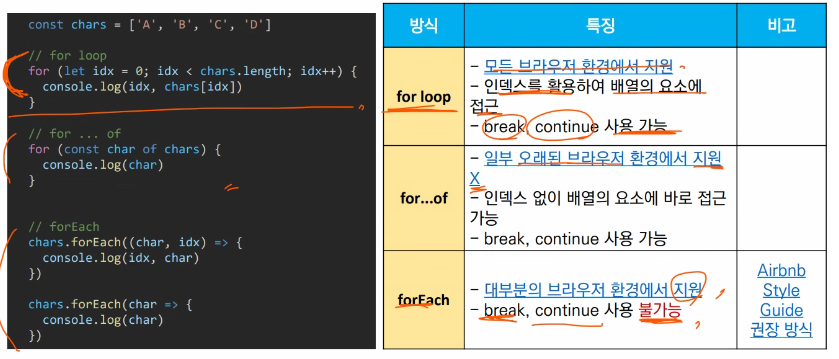
    * forEach : return이 없으므로 break, continue가 필요 없음

 

---

 

### 14. 객체(Objects)

 

* **객체의 정의와 특징**
  * 객체는 속

      

---

 

### 15.

      

