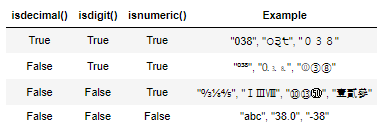
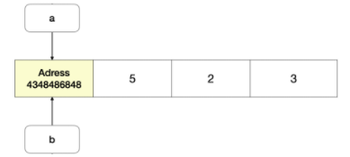

## 

# 데이터 구조(Data Structure)

**메서드: 주어.동사 처럼 생각, 특정데이터(ex. 문자열)에서만 사용가능한 내장 함수**

**ed 있는것 -> 내장함수 / ed 없는것 -> 메서드 -> 변형하여 반환**


### 1.  순서가 있는 데이터 구조

* **문자열(String) : 변경할 수 없고(immutable), 순서가 있고(ordered), 순회 가능한(iterable)**
  * 문자열 메서드 : https://docs.python.org/ko/3/library/stdtypes.html#string-methods
    * 조회  / 탐색	
      * .find(x) : x의 첫번째 위치를 반환, 리스트 내에 x가 없으면, -1을 반환 / 모든 위치를 찾으려면 반복문
      * .index(x) : x의 첫번째 위치를 반환, 리스트 내에 x가 없으면 오류 발생
      * .startswith(x) / .endswith(x)  : 파이썬에서 사용 권장
        * .startswith(x) : 문자열이 x로 시작하면 True 반환, 아니면 False
        * .endswith(x) : 문자열이 x로 끝나면 True 반환, 아니면 False

      * 기타 문자열 관련 검중 메서드 : is~로 시작하는 메서드는 어떠한 조건에 해당하는지 검증 하는 역할 / **is -> boolean, T/F 반환 예측**
        * .isalpha() : 문자열이 (숫자가 아닌)글자로 이루어져 있는가?, 한글도 가능
        * .isspace() : 문자열이 공백으로 이루어져 있는가?
        * .isupper() : 문자열이 대문자로 이루어져 있는가?
        * .istitle() : 문자열이 타이틀 형식으로 이루어져 있는가?, 공백기준 띄어쓰기 했을때 대문자 인가?
        * .islower() : 문자열이 소문자로 이루어져 있는가?
        * .isalpha(), .isspace():  가끔 씀 / .isupper(), islower(): 종종 사용 / istitle(): 거의 안씀
        
      * 숫자 판별 메서드
        * .isdecimal() : 문자열이 0~9까지의 수로 이루어져 있는가?
        * .isdigit() : 문자열이 숫자로 이루어져 있는가?
        * isnumeric() : 문자열을 수로 볼 수 있는가?
        * numeric이 가장 큰범위를 가짐
        * 💥.isdecimal()을 주로 씀(가장 작은범위), .isnumeric() (가장 큰 범위)
        * 
      
    * 문자열 변경 : immutable? -> 원본 문자열을 바꾸는게 아니라 변경된 문자열의 값을 반환
      * .replace(old, new[, count]) : 바꿀 대상 글자를 새로운 글자로 바꿔서 반환, count를 지정하면 해당 갯수만큼만 시행함
      * 메서드에서 [] 표기는 해당 parameter가 선택적임을 나타냄(✨**optional**)
      * .strip([chars]) : 특정 문자를 지정하면, 양쪽을 제거하거나(`strip`) 왼쪽을 제거하거나(`lstrip`), 오른쪽을 제거함(`rstrip`) / char 파라미터를 지정하지 않으면 공백을 제거함, 종종 사용
      * 💥.split([chars]) :  문자열을 특정한 단위로 나누어 **리스트**로 반환
      * 'separator'.join(iterable) : iterable의 문자열 들을 separator(구분자)로 이어 붙인 (join()) 문자열을 반환함
      * .capitalize(), .title(), .upper()
        * `.capitalize()` : 앞글자를 대문자로 만들어 반환합니다.
        * `.title()` : 어포스트로피(*'*)나 공백 이후를 대문자로 만들어 반환합니다.
        * `.upper()` : 모두 대문자로 만들어 반환합니다
    
      * .lower(), .swapcase()
        * `lower()` : 모두 소문자로 만들어 반환합니다.
        * `swapcase()` : 대 <-> 소문자로 변경하여 반환합니다.
    
  * 문자열 메서드 모두 확인하기
    * dir('string')


* **리스트(List) : 변경 가능하고(mutable), 순서가 있고(ordered), 순회 가능한(iterable)**
  * 값 추가 및 삭제
    * 💥.append(x) : **✨리스트**에 값을 추가 할 수 있음, a[len(a):] = [x]와 동일
    * .extend(iterable) : **✨리스트**에 iterable(list, range, tuple, string) 값을 붙일 수 가 있음, a[len(a):] = iterable 와 동일
    * .inser(i, x) : 정해진 위치 i에 값을 추가함, 음수도 가능
    * .remove(x) : 리스트에서 ✨**값**이 x인 첫번재 항목을 삭제함, 항목이 없으면 ValueError
    * .pop([i]) : 정해진 위치 i에 있는 값(✨**인덱스**)을 삭제하며, 그 항목을 반환함, i가 지정되지 않으면 마지막 항목을 삭제하고 되돌려줌
    * .clear() : 리스트의 모든 항목을 삭제함, []도 같음(새로운 통), 편한것으로 사용
    
  * 탐색 및 정렬
    * .index(x) : x값을 찾아 해당 index 값을 반환함
    
    * .count(x) : 원하는 값의 개수를 반환
    
    * ```python
      a = [1, 2, 1, 3, 4]
      target_value = 1
      for i in range(a.count(target_value)):
          a.remove(target_value)
      print(a) 
      ```
    
    * .sort() : 리스트를 정렬함, 내장함수 sorted()와는 다르게 **원본 list를 변형**시키고, None을 반환함, 파라미터로는 key와 reverse가 있음, False(오름차순, 기본값), True(내림차순)
    
    * .reverse() : 리스트의 element들을 반대로 뒤집음, 정렬하는 것이 아닌 원본 순서를 뒤집고 수정함, 내장함수 reversed()와 달리 원본 list를 변형시키고, None을 반환, sort와 마찬가지로, 파라미터 key와 reverse가 있음
    
  * 리스트 메서드 모두 확인하기
    * dir(list)


* **튜플(Tuple) : 변경할 수 없는 불변(Immutable) 자료형** : 값을 변경할 수 없기에 값에 영향을 미치지 않는 메서드만을 지원함
  * 탐색
    * .index(x[, start[, end]]) : 튜플에 있는 항목 중 값이 x와 같은 첫번째 인덱스를 돌려줌, 해당 값이 없으면 ValueError
    * .count(x) : 튜플에서 x가 등장하는 횟수를 돌려줌

---

### 2.  순서가 없는 데이터 구조

* **셋(Set) : 변경 가능하고(mutable), ✨순서가 없고(unordered), 순회 가능한(iterable)**
  
  * 추가 및 삭제
    * .add(elem) : elem을 셋(set)에 추가함
    * .update(*others) : 여러 값을 추가함, 반드시 iterable 데이터 구조를 전달해야함
    * .remove(elem) : elem을 셋(set)에서 삭제하고, 셋(set) 내에 elem이 존재하지 않으면 KeyError가 발생함
    * .discard(elem) : elem을 셋(set)에서 삭제함, remove와 다른 점은 elem이 셋(set) 내에 존재하지 않아도, ✨**에러가 발생하지 않음**
  * 셋(set) 메서드 모두 확인하기
    * dir(set)
  
* **딕셔너리(Dictionary) : 변경 가능하고(mutable), 순서가 없고(unordered), 순회 가능한(iterable), Key:Value 페어(pair)의 자료구조**
  * 조회
    * .get(key[, default]) : key를 통해 value를 가져옴, key가 존재하지 않으면 None을 반환, [key]는 KeyError 발생
    * .setdefault(key[, default]) : dict.get() 메서드와 비슷한 동작을 하는 메서드로, key가 딕셔너리에 있으면 value를 돌려줌, get과 다른 점은 key가 딕셔너리에 없을 경우, default 값을 갖는 key를 삽입한 후 default를 반환함, 만일 default가 주어지지 않으면 None을 반환함
  
  * 추가 및 삭제
    * .pop(key[, default]) : key가 딕셔너리에 있으면 제거하고 그 값을 돌려줌, 그렇지 않으면 default를 반환함, default가 없는 상태에서 해당 key가 딕셔너리에 없는 경구 KeyError
  
    * .update([other]) : other가 제공하는 key, value 쌍으로 딕셔너리를 덮어씀, other는 다른 딕셔너리나 key/value 쌍으로 되어있는 모든 iterable을 사용 가능함
      * keyword argument로 업데이트 하는 방법
        * 키워드 인자가 지정되면, 딕셔너리는 그 key/value 쌍으로 갱신됨
  
      * ```python
        my_dict = {'apple': '사과', 'banana': '바나나', 'melon': '멜론'}
        my_dict.update(apple='사과아')  # apple은 parameter이름이므로 안 감싸줌(키워드 인자로 넘겨줌)
        print(my_dict)
        ```
  
  * 딕셔너리 메서드 모두 확인하기
  
    * dir(dict)


### 정리

* string, list 둘다 .index(x) 있음
* .count(x) : 패턴 기억
* list : append, extend / set : add, update

---


### 3. 💥얕은 복사와 깊은 복사

* **데이터 분류**

  * 데이터 분류에 따라 복사가 달라짐, 크게 변경 가능한것(mutable)들과 변경 불가능한 것(immutable)으로 나뉘며, python은 각각을 다르게 다룸.
  * 변경 불가능한(immutable) 데이터
    * 리터럴(literal)
      * 숫자(Number)
      * 글자(String)
      * 참/거짓(Bool)
    * range()
    * tuple()
    * frozenset()
  * 변경 가능한(mutable) 데이터
    * list
    * dict
    * set
  * 복사 방법
    * 할당 (Assignment)
    * 얕은 복사 (Shallow copy)
    * 깊은 복사 (Deep copy)

* **할당**

  * 💥mutable한 데이터 값을 할당할 때 주의!!!
  * 변수만 복사하여 바라보는 객체가 동일함, 두 개중 하나만 변경되어도 나머지 하나도 동일하게 수정됨
  * 

  

* **얕은 복사(Shallow copy) : 내부까지 아니라 겉에만 copy**

  * slice 연산자 사용 [:] : 리스트를 슬라이싱 하여 할당 시, 새로운 id가 부여되며, 서로 영향을 받지 않음
  * list 함수 사용(b = list(a)) : 일부 상황에서만 서로 다른 얕은 복사임, 2차원 리스트와 같이  mutable 객체 안에 mutable 객체가 있으면 문제됨(id는 서로 다르지만 내부 값은 영향을 받음)


* **💥깊은 복사(Deep copy)**
  
  * 중첩된 상황에서 복사를 하고 싶다면, `깊은 복사(deep copy)`를 해야함
  
  * 깊은 복사는 새로운 객체를 만들고 원본 객체 내에 있는 객체에 대한 복사를 재귀적으로 삽입함
  
  * 즉, 내부에 있는 모든 객체까지 새롭게 값이 변경되게됨
  
  * ```python
    import copy
    
    a = [1, 2, [1, 2]]
    b = copy.deepcopy(a)
    
    b[2][0] = 3
    print(a)
    print(b)
    ```
  
    
