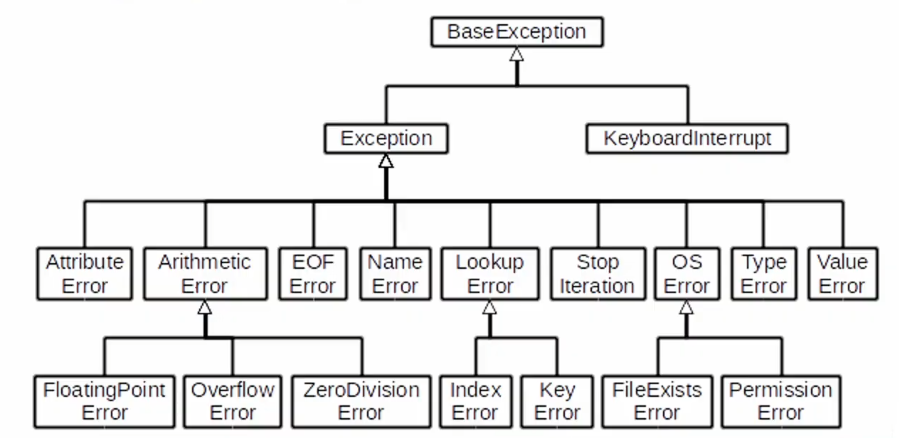

## 

# 에러 & 예외 처리


### 1. 에러(Error)	

* **문법 에러(Syntax Error)** : 문법을 어김
  * 에러 발생 시 `SyntaxError`라는 키워드와 함께, 에러의 상세 내용을 보여줌
  * `파일이름`과 `줄번호`, `^` 문자를 통해 파이썬이 코드를 읽어 들일 때(`parser`) 문제가 발생한 위치를 표현함
  * `parser` 는 줄에서 에러가 감지된 가장 앞의 위치를 가리키는 캐럿(caret)기호(`^`)를 표시함(정확하지는 않음)
  * invalid syntax 오류(콜론 누락), EOL 오류(따옴표 오류), EOF 에러(괄호 닫기 오류)

* **예외(Exception)**
  * 실행 도중 예상하지 못한 상황(exception)을 맞이하면, 프로그램 실행을 멈춤
  * 문법적으로는 옳지만, 실행 시 발생하는 에러임
  * 제시된 모든 에러는 `Exception`을 상속받아 이뤄짐
  * ZeroDivisionError : 어떤 수를 0으로 나누게 되면 에러가 발생함
  * NameError : 지역 혹은 전역 이름 공간 내에서 유효하지 않는 이름은 사용할 수 없음,
    즉, 어느 곳에서도 정의되지 않은 변수를 호출하였을 경우 에러가 발생함, 주로 오타
  * TypeError : 자료형이 올바르지 못한 경우, 함수 호출 과정에서 필수 매개변수가 누락된 경우,  함수 호출 과정에서 매개변수 개수가 초과해서 들어온 경우
  * ValueError:  자료형은 올바르나 값이 적절하지 않은 경우, 존재하지 않는 값을 찾고자 할 경우
  * IndexError : 존재하지 않는 index로 조회할 경우
  * KeyError : 존재하지 않는 Key로 접근한 경우
  * ModuleNotFoundError : 존재하지 않는 Module을 import 하는 경우
  * ImportError : Module은 찾았으나 존재하지 않는 클래스/함수를 가져오는 경우
  * keyboardInterrupt : 사용자가 임의로 실행을 중단한 경우,`ctrl`+`c`를 통해 종료하였을 때 발생함
  * IndentationError :  Indentation(들여 쓰기)이 적절하지 않은 경우

* **파이썬 내장 예외(Bulit-in-exceptions)**
* 

---


### 2. 예외 처리(Exception Handling) 

* **try & except**

  * `try`문과 `except`절을 사용하여 예외 처리를 할 수 있음(if else는오류나면 멈춤)

  * 알고리즘에서는 잘 안 쓰지만, 오픈소스나 실제 개발 환경에서 쓰임

  * 기초문법

  * ```python
    try:
        <코드 블록 1>
    except (예외):
        <코드 블록 2>
    # try 아래의 코드 블록(code block)이 실행됩니다.
    # 예외가 발생되지 않으면, except 없이 실행이 종료됩니다.
    # 예외가 발생하면, 남은 부분을 수행하지 않고, except가 실행됩니다.
    ```

  * 복수의 예외 처리 : 하나 이상의 예외를 모두 처리할 수 있음, 괄호가 있는 튜플로 여러 개의 예외를 지정할 수 있음

  * ```python
    try:
        <코드 블록 1>
    except (예외 1, 예외 2):
        <코드 블록 2>
    
    try:
        <코드 블록 1>
    except 예외 1:
        <코드 블록 2>
    except 예외 2:
        <코드 블록 3>
    ```

  * **✨에러가 순차적으로 수행됨**으로, 가장 작은 범주부터 시작해야 함

  * else : 에러가 발생하지 않는 경우 수행되는 문장은 `else`를 이용함, 모든 `except` 절 뒤에 와야함, `try` 절이 예외를 일으키지 않을 때 실행되어야만 하는 코드임

  * ```python
    try:
        <코드 블럭 1>
    except 예외:
        <코드 블럭 2>
    else:
        <코드 블럭 3>
    ```

  * finally : 반드시 수행해야 하는 문장은 `finally`를 활용함, 즉, 모든 상황에 실행되어야만 하는 코드를 정의하는데 활용함, 예외의 발생 여부와 관계없이 `try` 문을 떠날 때 항상 실행함

  * as : `as` 키워드를 활용하여 에러 메시지를 보여줄 수도 있습니다.

  * ```python
    try:
        <코드 블럭 1>
    except 예외 as err:
        <코드 블럭 2>
    ```

* **예외 발생 시키기(Exception Raising)** : 오픈 소스에서 발생시키기, 디버깅, 내부적으로

  * raise : `raise`를 통해 예외를 강제로 발생시킬 수 있음

  * ```python
    raise <에러>('메시지')
    ```

  * assert : assert 문은 예외를 발생시키는 다른 방법임, 보통 **상태를 검증하는데 사용**되며 무조건 AssertionError가 발생함, TDD(호불호가 갈리는 개발방식, 좋긴하나 시간 소요가 많이됨) 주도 개발 환경에서 많이 쓰임

    * assert True : 정상작동 / assert False : 에러
    * 상태 검증 / 테스트하면서 개발하고 싶을 때 사용

  * ```python
    assert Boolean expression, error message
    
    assert len([1, 2]) == 1, '길이가 1이 아닙니다.'
    ```

    
