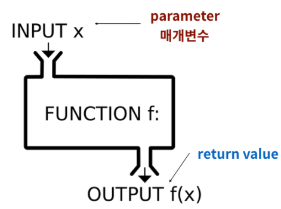

## 

# 함수(function)


### 1. 함수(function)

* 특정한 기능(function)을 하는 코드의 묶음

* 가독성, 재사용성, 유지보수

* **함수의 선언과 호출**

  * def 키워드 활용

  * ```python
    def <함수이름>(parameter1, parameter2):
        <코드 블럭>
        return value
    ```

  * 

---


### 2. 함수의 출력(Output)

* **함수의 return**
  * 오직 한 개의 객체만 반환
  * 값 반환 후 함수가 바로 종료
  * 함수가 return 되거나 종료되면, 함수를 호출한 곳으로 돌아감


---


### 3. 함수의 입력(Input)

* **매개변수(parameter) & 전달인자(argument)**

  * 매개변수(parameter)

    * ```python
      def func(x):
          return x + 2
      ```

    * x는 매개변수(parameter)

    * 입력을 받고 함수 내부에서 활용할 변수(함수를 정의하는 부분에서 확인)

  * 전달인자(argument)

    * 실제로 전달되는 값(함수를 호출하는 부분에서 확인)

* **함수의 인자**

  * 위치 인자(Positional Arguments)
    * 기본적으로 인자는 위치에 따라 함수 내에 전달
  * 기본 인자 값(Default Argument Values)
    * 함수를 정의할 때 기본 값을 지정하여 함수를 호출할 때 인자의 값을 설정하지 않도록하여, 정의된 것보다 더 적은 개수의 인자들로 호출 될 수 있음
    * 💥**기본 인자값을 가지는 인자 다음에 기본 값이 없는 인자를 사용할 수는 없음**
  * 키워드 인자(Keyword Arguments)
    * 함수를 호출할 때 키워드 인자를 활용하여 직접 변수의 이름으로 특정 인자를 전달 할 수 있음
    * 키워드 인자를 활용한 다음에 위치인자를 사용할 수 는 없음

* **정해지지 않은 여러 개의 인자 처리**
  * 가변(임의) 인자 리스트(Arbitrary Argument Lists)
    * 개수가 정해지지 않은 임의의 인자를 받기 위해 함수를 정의할 때 가변 인자 리스트 `*args`를 활용
    * `tuple` 형태로 처리되고, 매개변수에 `*`로 표현함
  * 가변(임의) 키워드 인자(Arbitrary Keyword Arguments)
    * 정해지지 않은 키워드 인자들은 함수를 정의할 때 키워드 인자 `**kwargs`를 활용
    * `dict` 형태로 처리가 되며, 매개변수는 `**`로 표현

---

### 4. 함수와 스코프(scope)

* **스코프(scope)**
  * 함수로 생성된 공간은 지역 스코프(local scope)라고 불리고, 그 외 공간은 전역 스코프(global scope)로 불림
    * 전역 스코프(global scope): 코드 어디에서든 참조할 수 있는 공간
    * 지역 스코프(local scope): 함수가 만든 스코프로 함수 내부에서만 참조할 수 있는 공간
    * 전역 변수(global variable): 전역 스코프에 정의된 변수
    * 지역 변수(loacl variable): 로컬 스코프에 정의된 변수
* **변수의 수명주기(liefcycle)**
  * 빌트인 스코프(built-in scope): 파이썬이 실행된 이후부터 영원히 유지
  * 전역 스코프(global scope): 모듈이 호출된 시점 이후 혹은 이름 선언된 이후부터 인터프리터가 끝날 때 까지 유지
  * 지역(함수) 스코프(local scope): 함수가 호출될 때 성성되고, 함수가 종료될 때까지 유지(함수 내에서 처리되지 않는 예외를 일으킬 때 삭제)

* **이름 검색(resolution) 규칙**
  * LEGB Rule
    * Locla scope: 함수
    * Enclosed scope: 특정 함수의 상위 함수
    * Global scope: 함수 밖의 변수 혹은 import된 모듈
    * Built-in scope: 파이썬 안에 내장되어 있는 함수 또는 속성


---


### 5. 재귀 함수(recursive function)

* 함수 내부에서 자기 자신을 호출하는 함수

* 알고리즘 설계 및 구현에서 유용하게 활용됨

* 팩토리얼

  * 반복문과 재귀함수
    * 재귀함수 작성시에는 반드시 `base case`가 존재 하여야함
    * 💥`base case`는 점점 범위가 줄어들어 반복되지 않는 최종 도달 지점을(수렴) 의미함
    * 재귀를 이용한 팩토리얼 계산에서의 `base case`는 n이 1일때, 함수가 아닌 정수 반환하는 것임
    * 자기 자신을 호출하는 재귀함수는 알고리즘 구현시 많이 사용됨
    * 코드가 직관적이고 이해하기 쉬운 경우가 있음
    * 하지만, 메모리 스택이 넘치거나 실행속도가 늘어지는 단점이 있음
    * 이를 방지하기위해 최대 재귀 깊이(1000번)을 넘어가면 함수를 호출하지 않고 종료됨

* 반복문과 재귀 함수의 차이

  * 알고리즘 자체가 재귀적인 표현이 자연스러운 경우 재귀함수를 사용

  * 재귀 호출은 변수 사용을 줄여줄 수 있음

    

---


### 6. 함수 응용

* **map(function, iterable)**
  * 순회가능한 데이터 구조(iterable)의 모든 요소에 function을 적용한 후 그 결과를 돌려줌
  * return은 map_object 형태임

* **filter(function, iterable)**
  * iterable에서 function의 반환된 결과가 True인 것들만 구성하여 반환함
  * firter object를 반환함
* **zip(*iterables)**
  * 복수의 iterable 객체를 모아(zip())줌
  * 결과는 튜플의 모음으로 구성된 zip object를 반환함

* **lambda 함수**

  * 표현식을 계산한 결과 값을 반환하는 함수로, 이름 없는 함수여서 익명함수라고도 불림

  * return문을 가질 수 없고, 간단한 조건문 외의 구성이 어려움

  * 함수를 정의하여 사용하는 것보다 간결하게 사용 가능함

  * ```python
    def triangle_area(b, h):
        return 0.5 * b * h
    
    lambda b, h: 0.5 * b * h
    		파라미터 정의 : return되는 값
    ```
