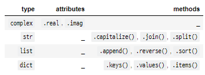

## 

# OOP(Object oriented programming)

### 1. 객체(Object)

* Python에서 **모든 것은 객체(object)**임
* 객체(object) = 속성(attribute)+ 조작법(method)
* 모든 객체는 **타입(type), 속성(attribute), 조작법(method)**을 가짐
* 객체(Object)의 특징
  - 타입(type): 어떤 연산자(operator)와 조작(method)이 가능한가?
  - 속성(attribute): 어떤 상태(데이터)를 가지는가?
  - 조작법(method): 어떤 행위(함수)를 할 수 있는가?

---


### 2. 객체지향프로그래밍(Object oriented programming)

* **<wikipedia - 객체지향 프로그래밍>**

  * 객체 지향 프로그래밍(영어: Object-Oriented Programming, OOP)은 컴퓨터 프로그래밍의 패러다임의 하나임
  * 객체 지향 프로그래밍은 컴퓨터 프로그램을 명령어의 목록으로 보는 시각에서 벗어나 여러 개의 독립된 단위, 즉 "객체"들의 모임으로 파악하고자 하는 것임

* **절차 중심 vs 객체중심**

  * 절차지향: 계속 func에 들어감 / 데이터가 계속 흘러다님 / 데이터가 직접적으로 뭔가를 할 수 없음
  * 객체지향: 본인 스스로 변환
  * 프로그래밍 패러다임: 어떻게 프로그램을 작성할 것인가

* **객체 중심의 장점**

  * 코드의 직관성
  * 활용의 용이성
  * 변경의 유연성

* **OOP 기초**

* ```python
  # 클래스 정의
  class MyClass:
      pass
  
  # 인스턴스 생성
  my_instance = MyClass()
  
  # 속성 접근
  my_instance.my_attribute
  
  # 메서드 호출
  my_instance.my_method()
  ```

* **클래스**

  * 클래스는 공통된 속성(attribute)과 조작법(method)을 가진 객체들의 분류임

* **인스턴스(Instance)**

  * 특정 클래스(class)의 실제 데이터 예시(instance)임

  * 파이썬에서 모든 것은 객체이고, **✨모든 객체는 특정 클래스의 인스턴스**임

  * ```python
    # Person 클래스
    class Person:
        pass
    
    # ssafykim은 Person 클래스의 인스턴스
    ssafykim = Person()
    ```

* **속성(attribute)과 메서드(method)**

  * 객체의 속성(상태, 데이터)과 조작법(함수)을 명확히 구분
  * 

  * 속성(attribute)

    * 속성(attribute)은 객체(object)의 상태/데이터를 뜻함

    * ```python
      # 활용법
      <객체>.<속성>
      
      # 예시
      person.name
      
      # Person 클래스의 객체들이 가지게 될 데이터를 활용해봅시다.
      ```

  * 메서드(method)

    * 특정 객체가 할 수 있는 행위를 뜻함

    * ```python
      # 활용법
      <객체>.<메서드>()
      
      # 예시
      person.talk()
      person.eat()
      
      # Person 클래스에 공통적으로 적용 가능한 함수인 메서드를 활용해봅시다.
      ```

* **클래스와 인스턴스**

  * 메서드(함수) 호출 : 인스턴스.메서드()
  * 속성(변수) : 인스턴스.속성명
  * 클래스 - 틀 / 인스턴스 -실제값(실체), 사용할 수 있는 값

---


### 3. 인스턴스(Instance)

* **인스턴스(Instance) 생성**

  * 정의된 클래스(class)에 속하는 객체를 해당 클래스의 인스턴스(instance)라고 함

  * Person 클래스의 인스턴스는 Person()을 호출함으로서 생성됨

  * type() 함수를 통해 생성된 객체의 클래스를 확인할 수 있음

  * ```python
    # 인스턴스 = 클래스()
    person1 = Person()
    
    # person1은 사용자가 정의한(user-defined) Person이라는 데이터 타입(data type)의 인스턴스입니다.
    ```

* **인스턴스 변수**

  * 인스턴스의 속성(attribute)

  * 각 인스턴스들의 고유한 데이터

  * 생성자 메서드에서 `self.변수명`로 정의

  * 인스턴스가 생성된 이후 💥`인스턴스.변수명`로 접근 및 할당

  * ```python
    class Person:
        pass
    
    p1 = Person()
    p1.name = 'jack'
    p1.age = 25
    ```

* **인스턴스 메서드**

  * 메서드 : 특정 데이터 타입(또는 클래스)의 객체에 공통적으로 적용 가능한 행위를 의미함

  * 인스턴스 메서드는 인스턴스가 사용할 메서드에 해당함

  * 클래스 내부에 정의되는 메서드는 기본적으로 인스턴스 메서드로 생성됨

  * 메서드 호출시, 첫번째 인자로 인스턴스 자기자신에 해당하는 `self`가 전달됨

  * ```python
    class MyClass:
        def instance_method(self, arg1, arg2, ...):
            ...
    
    my_instance = MyClass()
    # 인스턴스 생성 후 메서드를 호출하면 자동으로 첫 번째 인자로 인스턴스(my_instance)가 들어갑니다.
    my_instance.instance_method(.., ..)  
    ```

  * 메서드도 함수이기 때문에 추가적인 인자를 받을 수 있음

  * ```python
    class MyClass:
        def method1(self):
            print('Hi')
    
        def method2(self, arg):
            print(arg)
    ```

* **Self**

  * 인스턴스 자신(self)
  * Python에서 인스턴스 메서드는 호출 시 첫번째 인자로 **💥인스턴스 자신이 전달되게 설계 되어있음**
  * 보통 매개변수명으로 `self`를 첫번째 인자로 정의(다른 이름도 가능하나 지양)

* **생성자(constructor) 메서드**

  * 인스턴스 객체가 생성될 때 자동으로 호출되는 함수임

  * 반드시 `__init__`이라는 이름으로 정의함

  * ```python
    class MyClass:
        def __init__(self):
            print('생성될 때 자동으로 호출되는 메서드입니다.')
            
    # 생성자를 활용하면 인스턴스가 생성될 때 인스턴스의 속성을 정의할 수 있음
    ```

* **소멸자(destructor) 메서드**

  * 인스턴스 객체가 소멸(파괴)되기 직전에 자동으로 호출되는 함수임

  * 반드시 `__del__`이라는 이름으로 정의함

  * ```python
    # 소멸자 정의
    def __del__(self):
        print('소멸될 때 자동으로 호출되는 메서드입니다.')
    
    # 소멸자 활용
    del 인스턴스
    ```

* **속성(Attribute) 정의**

  * 특정 데이터 타임(또는 클래스)의 객체들이 가지게 될 상태/데이터를 의미함

  * `self.<속성명> = <값>` 혹은 `<인스턴스>.<속성명> = <값>` 으로 설정함

  * ```python
    class Person:
        def __init__(self, name):
            self.name = name
    
        def talk(self):
            print(f'안녕, 나는 {self.name}')
    ```

* **매직(스페셜) 메서드**

  * 더블 언더스코어(✨__)가 있는 메서드는 특별한 일을 하기 위해 만들어진 메서드이기 때문에 스페셜 메서드 혹은 매직 메서드라고 불림

  * 매직(스페셜) 메서드 형태 : `__someting__`

  * ```bash
    '__str__(self)',
    '__len__(self)',
    '__repr__(self)',
    '__lt__(self, other)',
    '__le__(self, other)',
    '__eq__(self, other)',
    '__ne__(self, other)',
    '__gt__(self, other)',
    '__ge__(self, other)',
    
    dir('')
    ```

  * ```python
    class Person:
        def __init__(self, name, age):
            self.name = name
            self.age = age
        def __str__(self):
            return self.name
            
        def __gt__(self, other):
            return self.age > other.age
            
        def __eq__(self,other):
            return self.age == other.age       
    
    p1 = Person('1', 1)
    p2 = Person('2', 2)
    p3 = Person('3', 1)
    
    print(p1 > p2)
    print(p1 == p3)
    print(p1 == p2)    
    ```


---


### 4. 클래스(Class)

* 객체들의 분류(class)를 정의할 때 쓰는 키워드

* **클래스(Class) 생성**

  * 클래스 생성은 class 키워드와 정의하고자 하는 <클래스의 이름>으로 가능함

  * <클래스의 이름>은 PascalCase로 정의함(함수인지 클래스인지 구분)

  * 클래스 내부에는 데이터와 함수를 정의할 수 있고, 이때 데이터는 ✨**속성(attribute)**, 정의된 함수는 **✨메서드(method)**로 부름

  * ```python
    class <클래스이름>:
        <statement>
    class ClassName:
        statement

- **클래스 변수**

  - 클래스의 속성(attribute), 모든 인스턴스가 공유, 클래스 선언 내부에서 정의, `클래스.변수명`으로 접근 및 할당

  - ```python
    class Circle:
        pi = 3.14
    
    print(Circle.pi)
    ```

- **클래스 메서드(class method)**

  - 클래스가 사용할 메서드에 해당함 / 클래스 조작

  - `@classmethod` 데코레이터를 사용하여 정의함

  - 메서드 호출시, 첫번째 인자로 클래스 cls가 전달됨

  - ```python
    class MyClass:
        @classmethod
        def class_method(cls, arg1, arg2, ...):
            ...
    
    # 자동으로 첫 번째 인자로 클래스(MyClass)가 들어갑니다.
    MyClass.class_method(.., ..)  
    ```

  - 인스턴스명.클래스변수명 = ~ : 해당 인스턴스에서는 인스턴스 변수로 동작함

  - 클래스명.변수명 = ~ :이런식으로 할당해야 클래스 변수가 변경됨

- **스태틱 메서드(static method)**

  - 클래스가 사용할 메서드에 해당함

  - 인스턴스와 클래스의 속성과 무관한 메서드임

  - `@staticmethod` 데코레이터를 사용하여 정의함

  - 호출시, ✨어떠한 인자도 전달되지 않음

  - 속성을 다루지 않고 단지 기능(행동)만을 하는 메서드를 정의할 때 사용함

  - ```python
    class MyClass:
        @staticmethod
        def static_method(arg1, arg2, ...):
            ...
    
    MyClass.static_method(.., ..)
    ```

- **인스턴스와 클래스 간의 이름 공간(namespace)**

  - 클래스를 정의하면 클래스와 해당하는 이름 공간이 생성됨(💥클래스 내부에서 정의)
  - 인스턴스를 만들면 인스턴스 객체가 생성되고 이름 공간이 생성됨
  - 인스턴스에서 특정 속성에 접근하면, 인스턴스-클래스 순으로 탐색함(변수를 호출하는 대상까지 고려)
  - 클래스 메서드, 스태틱 메서드에서 인스턴스 메서드로는 접근 X
  - 인스턴스 메서드에서 클래스, 스태틱 메서드로 접근은 가능하나 지양

* class의 타입이 type만 나오는 이유 : 어떠한 값이든 들어갈 수 있어서
* 데코레이터 없으면 -> 인스턴스 메서드로 인식

---


### 5. 비교 정리

* **인스턴스와 메서드**
  * 인스턴스는 3가지 메서드(인스턴스, 클래스, 정적 메서드) 모두에 접근할 수 있음
    * 인스턴스에서 클래스 메서드와 스태틱 메서드는 호출하지 않음
  * 인스턴스가 할 행동은 모두 인스턴스 메서드로 한정 지어서 설계함

* **클래스와 메서드**
  * 클래스는 3가지 메서드(인스턴스, 클래스, 정적 메서드) 모두에 접근할 수 있음
    * 클래스에서 인스턴스 메서드는 호출하지 않음
  * 클래스가 할 행동은 다음 원칙에 따라 설계함 (클래스 메서드와 정적 메서드)
    * 클래스 자체(`cls`)와 그 속성에 접근할 필요가 있다면 클래스 메서드로 정의함
    * 클래스와 클래스 속성에 접근할 필요가 없다면 정적 메서드로 정의함
      * 정적 메서드는 cls, slef 와 같이 묵시적인 첫번째 인자를 받지 않기 때문임

  

---


### 6. OOP의 핵심 개념

* **추상화(Abstraction), 상속(Inheritance), 다형성(Polymorphism), 캡슐화(Encapsulation)**
* **추상화(Abstraction)**
  * 객체 지향 프로그래밍에서의 추상화는 세부적인 내용은 감추고 필수적인 부분만 표현하는 것을 뜻함
  * 현실 세계를 프로그램 설계에 반영하기 위해 사용됨
  * 여러 클래스가 **✨공통적으로 사용할 속성 및 메서드를 추출**하여 기본 클래스로 작성하여 활용함

* **상속(Inheritance)**

  * 클래스에서 가장 큰 특징은 상속이 가능하다는 것임

  * 부모 클래스의 모든 속성이 자식 클래스에게 상속 되므로 코드 재사용성이 높아짐

  * ```python
    class ChildClass(ParentClass):
        <code block>
    ```

  * 공통된 속성이나 메서드를 부모 클래스에서 정의하고, 이를 상속받아 다양한 자식 클래스를 만들 수 있음

  * `issubclass(class, classinfo)` : class가 classinfo의 subclass인 경우 True를 반환함

  * `isinstance(object, classinfo)`: object가 classinfo의 인스턴스거나 subclass인 경우 True를 반환함

  * `super()`

    * 자식 클래스에 메서드를 추가로 구현 할 수 있음 

    * 부모 클래스의 내용을 사용하고자 할 때 super()를 사용할 수 있음 /재사용

    * ```python
      class ChildClass(ParentClass):
          def method(self, arg):
              super().method(arg) 
      ```

    * ```python
      class Person:
          def __init__(self, name, age, number, email):
              self.name = name
              self.age = age
              self.number = number
              self.email = email 
              
          def greeting(self):
              print(f'안녕, {self.name}')
            
          
      class Student(Person):
          def __init__(self, name, age, number, email, student_id):
              self.name = name
              self.age = age
              self.number = number
              self.email = email 
              self.student_id = student_id
              
      p1 = Person('홍교수', 200, '0101231234', 'hong@gildong')
      s1 = Student('학생', 20, '12312312', 'student@naver.com', '190000')
      p1.greeting()
      s1.greeting()
      ```

    * ```python
      class Person:
          def __init__(self, name, age, number, email):
              self.name = name
              self.age = age
              self.number = number
              self.email = email 
              
          def greeting(self):
              print(f'안녕, {self.name}')
              
              
      class Student(Person):
          def __init__(self, name, age, number, email, student_id):
              # Person 클래스
              super().__init__(name, age, number, email)
              self.student_id = student_id
              
              
      p1 = Person('홍교수', 200, '0101231234', 'hong@gildong')
      s1 = Student('학생', 20, '12312312', 'student@naver.com', '190000')
      
      p1.greeting()
      s1.greeting()
      ```

* **다형성(Polymorphism)**

  * 여러 모양을 뜻하는 그리스어로, 동일한 메서드가 클래스에 따라 다르게 행동할 수 있음을 뜻함
  * 즉, 서로 다른 클래스에 속해있는 객체들이 동일한 메시지에 대해 각기 다른 방식으로 응답될 수 있음
  * 메서드 오버라이딩 : 자식 클래스에서 부모 클래스의 메서드를 재정의 하는 것
    * 상속 받은 메서드를 재정의 할 수도 있음
    * 상속 받은 클래스에서 같은 이름의 메서드로 덮어씀
    * `__init__`, `__str__`의 메서드를 정의하는 것 역시, 메서드 오버라이딩임
  * 오버라이딩과 오버로딩
    * 오버라이딩 : 함수 재정의
    * 오버로딩 : 같은 함수명 인자에 다라 다르게 동작 -> python에서는 지원X

* **캡슐화(Encapsulation)**

  * 객체의 일부 구현 내용에 대해 외부로부터의 직접적인 액세스를 차단하는 것을 말함
    * ex. 주민등록번호
  * 다른 언어와 달리 파이썬에서 캡슐화는 암묵적으로는 존재하지만, 언어적으로는 존재하지 않음
  * Public Member
    * 언더바 없이 시작하는 메서드나 속성들이 이에 해당됨
    * 어디서나 호출 가능함
    * 하위 클래스에서 메서드 오버라이딩을 허용함
    * 일반적으로 작성되는 메서드와 속성의 대다수를 차지함
  * Protected Member
    * 언더바 1개로 시작하는 메서드나 속성들이 이에 해당함
    * 암묵적 규칙에 의해 부모 클래스 내부와 자식 클래스에서만 호출 가능함
    * 하위 클래스에서 메서드 오버라이딩을 허용함
  * Private Member
    * 언더바 2개로 시작하는 메서드나 속성들이 이에 해당함
    * 본 클래스 내부에서만 사용이 가능함
    * 하위 클래스 상속 및 호출이 불가능함
    * 외부 호출이 불가능함
  * getter 메서드와 setter 메서드
    * 변수에 접근할 수 잇는 메서드를 별도로 생성할 수 있음
    * getter 메서드 : 변수의 값을 읽는 메서드임
      * `@property` 데코레이터를 사용함
    * setter 메서드 : 변수의 값을 설정하는 성격의 메서드임
      * `@변수.setter`를 사용함

  * 다중상속

    * 두개 이상의 클래스를 상속받는 경우, 다중 상속이 됨
      * 상속 받은 모든 클래스의 요소를 활용 가능
      * 중복된 속성이나 메서드가 있는 경우 상속 순서에 의해 결정

  * 상속관계에서의 이름 공간과 MRO(Method Resolution Order)

    * 기존의 인스턴스 -> 클래스 순으로 이름 공간을 탐색해나가는 과정에서 상속관계에 있으면 아래와 같이 확장됨

      * 인스턴스 -> 자식 클래스 -> 부모클래스

    * MRO는 해당 인스턴스의 클래스가 어떤 부모 클래스를 가지는지 확인하는 속성 또는 메서드임

    * ```python
      ClassName.__mro__
      
      # 또는
      ClassName.mro()
      ```

      
