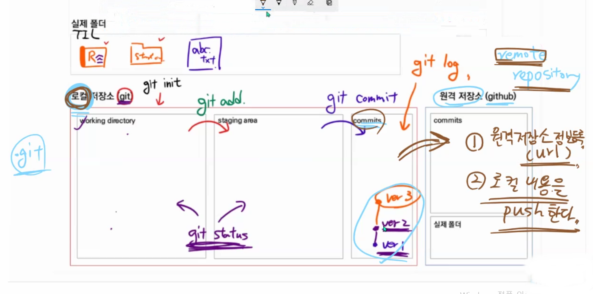

# Git 기초


## 1.**Git을 이용한 버전 관리**

* 버전 관리 방식


* 이유는 버전 관리 프로그램이 관리를 못하는 영역임, 사용자가 직접 작성해줘야함.


* 분산 버전 관리일 때 자원을 안정적으로 관리 가능.


---


## 2.**Git의 기본적인 구조**

* Git의 기본적인 구조



* **간편요약**(git staus와 git log로 중간중간 상태확인 꼭 하자! $4000 내기 싫으면!)

``` bash
git add . -> git commit -m '제목' -> git push 
```


* **처음 설정할 때**

``` bash
- 1 project 1 repo -> 여러 project 넣으면 꼬일 수 있음.

- Typora 새 파일 만들고 바로 위치 지정하고 저장하자
	-> 경로가 명확해야 asset에 저장되고 오류가 없음.

- 명령어
ls -a :list 확인
cd :command directory, 폴더로 이동, .(현재 폴더), ..(상위 폴더)
mkdir : make directory, 폴더 만들기
touch : 파일 만들기
pwd : pin working directory, 내가 현재 있는 경로

git init
git commit 창 내에서: i(-insert- 생김) -> 내용 넣기 -> esc(-insert- 사라짐) -> :wq(탈출)
git remote add remote별명 remote주소
git remote -v ->현재 remote된 정보 확인
git remote remove origin -> origin을 잘못 설정 했을 때 삭제
git push -u origin master ->upstream으로 한번 설정하면 그다음 git push만 해도 됨.
```

