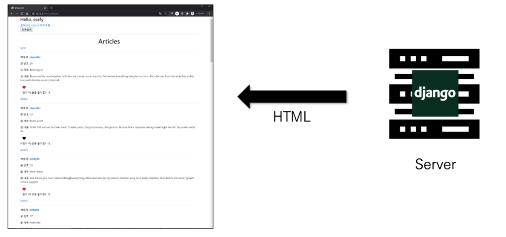
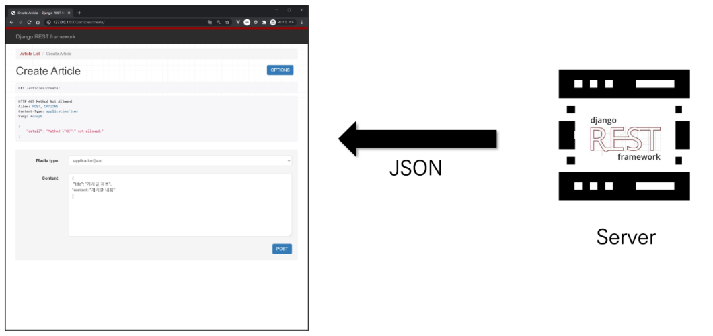
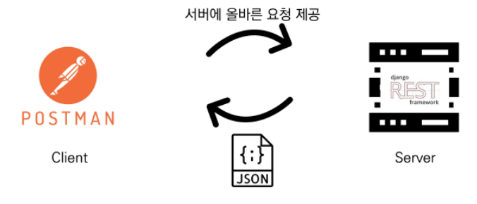
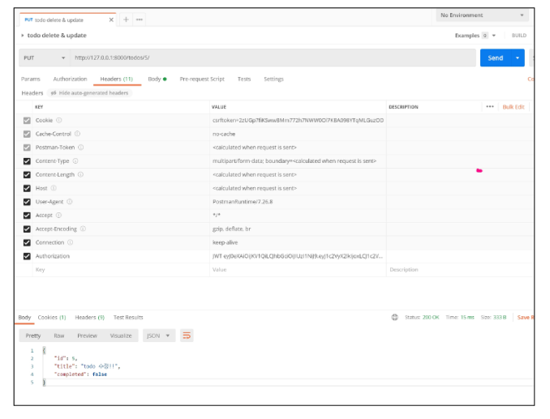
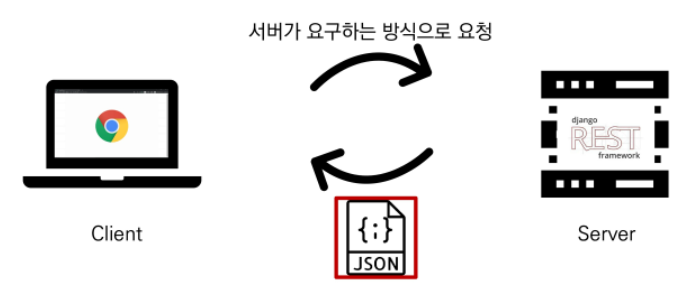
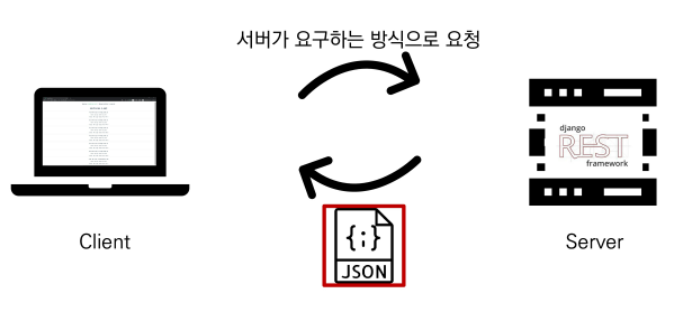

## 

 

## Vue & API Server

 

### 1. Server  & Client

 

* **Server**
  * 클라이언트에게 '정보', '서비스'를 제공하는 컴퓨터 시스템
  * 정보 & 서비스
    * Django를 통해 응답한 template
    * DRF를 통해 응답한 JSON

 

* **Server - 정보 & 서비스 제공**
  * 
  * 

 

* **Client**
  * 서버에게 그 서버가 맡는(서버가 제공하는) **✨서비스를 요청(request)**하고, 서비스 요청을 위해 필요한 인자를 ✨**서버가 요구하는 방식에 맞게 제공**하며, 서버로부터 반환되는 응답을 ✨**사용자에게 적절한 방식으로 표현(response)**하는 기능을 가진 시스템
    * 💥**request - > response**

 

* **Client - 서버에 올바른 요청**
  * 
    * ✨올바른 요청 == 형식에 맞는 요청(ex. urls.py,  / articles/ ...)
  * 

 

* **Client - 사용자에게 적절하게 표현**
  * 
  * 

 

* **정리**
  * Server는 ✨**"정보 제공"**
    * DB와 통신하며 데이터를 CRUD
    * 요청을 보낸 Client에게 이러한 정보를 응답
  * Client는 ✨**"정보 요청 & 표현"**
    * Server에게 정보(데이터) 요청
    * 응답 받은 정보를 잘 가공하여 화면에 보여줌
  * ✨Data -> ERD -> Modeling
  * ✨어떤 데이터를 보낼지에 대한 합의

 

---

 

### 2. Start Project Model + Serializer

 

---

 

### 3. CORS

                               
