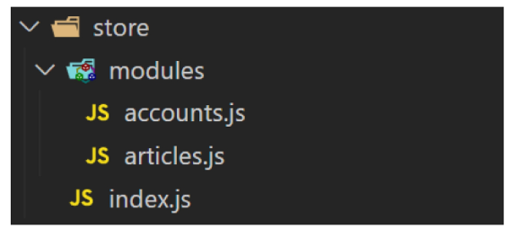

## 

 

## Vue Application

 

### 1. Vue Router

 

* 9: url을 계속 다 칠 수 는 없음 -> 미리 url을 만들어서 저장(drf.js)
* component -> 부품 / views -> url과 매핑

 

---

 

### 2. 404 page

 

* **404 Component** 
  * 

 

* **404 Not Found 시나리오**
  1. Vue Router에 등록되지 않은 routes일 경우
     * ex. /no-such-routes
  2. Vue Router에는 등록되어 있지만, 서버에서 해당 리소스를 찾을 수 없는 경우
     * ex. /articles/987654321

 

* **Vue Router에 등록되지 않은 routes**
  * vue router는 routes 배열에서 순차적으로 URL을 검색
  * 등록되지 않은 모든(*) URL은 /404로 redirection
  * 브라우저에서 NotFound404 컴포넌트 확인
  * 
    * 위치가 중요함 / 맨 위에 놓으면 모든 페이지가 404가 됨

 

* **서버에서 해당 리소스를 찾을 수 없는 경우**
  * 

 

---

 

### 3. Navigation Guard

 

* **전역 가드(Global Before Guards)** - ✨모든 url 이동 전에 검문

  1. URL을 이동할 때마다, 이동하기 전 모든 경우에 발생
  2. router 객체의 메서드로, 콜백 함수를 인자로 받고 해당 콜백 함수는 3개의 인자를 받음
     1.  to: 이동하려는 route의 정보를 담은 객체
     2.  from: 직전 route의 정보를 담은 객체
     3.  next: 실제 route의 이동을 조작하는 함수
  3. 반드시 마지막에 next()로 route 이동을 실행해야 함

  * 
  * 

 

---

 

### 4. Vuex Module

 

* **Module 분리**(✨파일이 너무 많아서 분리)
  * 
  * 1. 단일 파일(@/ store/index.js)에 모든 state, getters, mutations, actions를 작성할 경우, App이 커질수록 파일의 크기가 너무 커짐
    2. 기능에 따라 state, getters, mutations, actions를 모듈(파일)로 분리하여 사용
  * 
  * 

 

* **Module의 이름공간(module space)**
  * 
  * 1. 다른 module에 작성되어 있어도, 실제로는 global namespace에 등록됨
    2. 만약 확실하게 모듈별로 구분하고 싶다면, namespaced: true 옵션을 사용
  * 

 

---

 

### 5. Vu

                
