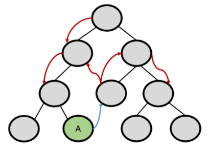
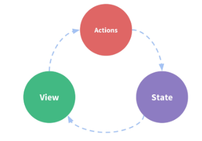
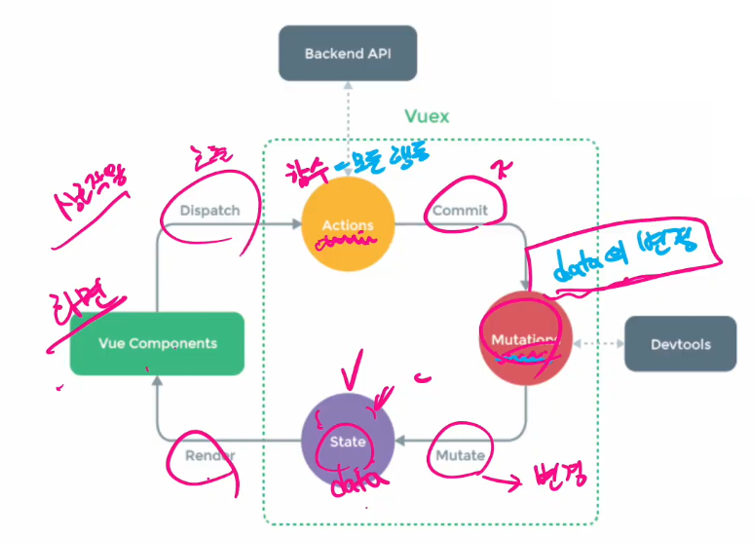
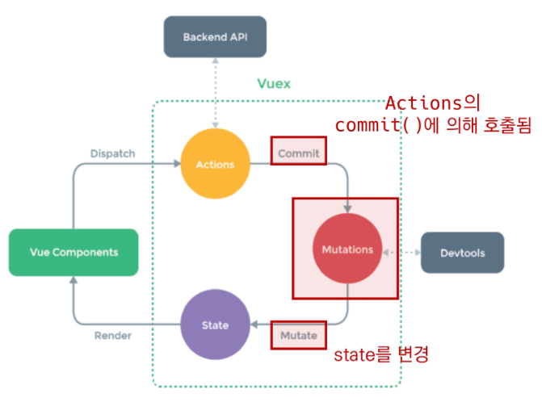
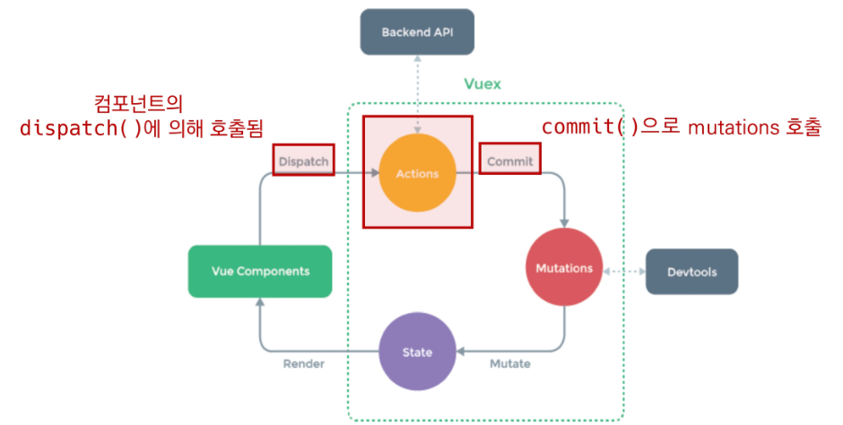
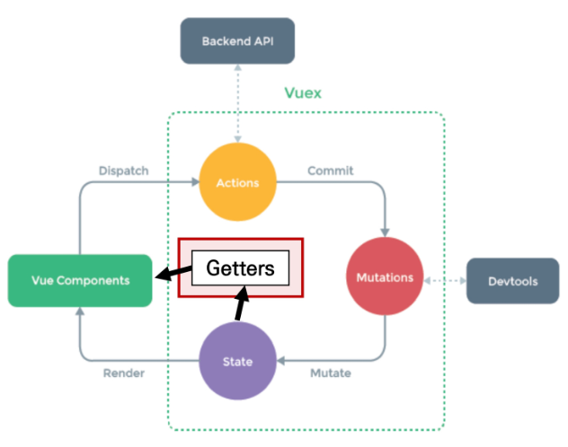
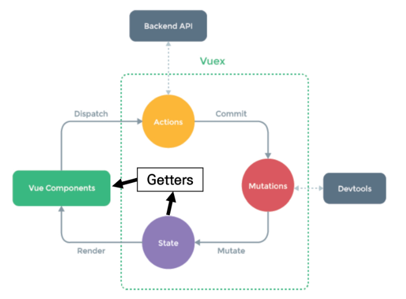
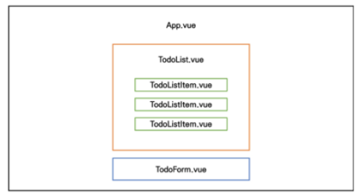
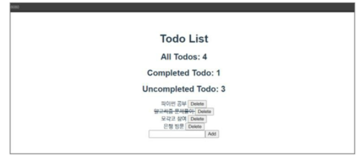
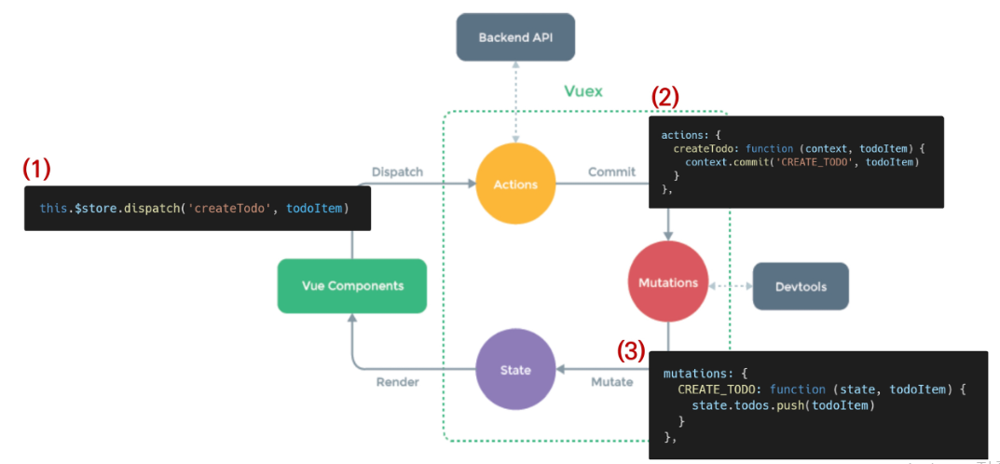

## 

 

## Vuex

 

### 1. Vuex Intro

 

* **Vuex**
  * "Statement management pattern + Library" for vue.j
    * 상태 관리 패턴 + 라이브러리
  * 상태(state)를 전역 저장소로 관리할 수 있도록 지원하는 라이브러리
    * 상태가 예측 가능한 방식으로만 변경될 수 있도록 보장하는 규칙 설정
    * 애플리케이션의 모든 컴포넌트에 대한 **💥중앙 집중식 저장소** 역할
  * Vue의 공식 devtools와 통합되어 기타 고급 기능을 제공

 

* **State**
  * state는 곧 **✨data**이며 해당 애플리케이션의 핵심이되는 요소
  * 중앙에서 관리하는 모든 상태 정보

 

* **상태 관리 패턴**
  * 컴포넌트의 공유된 상태를 추출하고 이를 전역에서 관리 하도록 함
  * 컴포넌트는 커다란 view가 되며 모든 컴포넌트는 트리에 상관없이 상태에 엑세스 하거나 동작을 트리거 할 수 있음
  * 상태 관리 및 특정 규칙 적용과 관련된 개념을 정의하고 분리함으로써 코드의 구조와 유지 관리 기능 향상
  * [참고] 트리거
    * 특정한 동작에 반응해 자동으로 필요한 동작을 실행하는 것

 

* **기존 Pass props & Emit event**
  * 각 컴포넌트는 독립적으로 데이터를 관리
  * 데이터는 단방향 흐름으로 부모 -> 자식 간의 전달만 가능하며 반대의 경우 이벤트를 트리거
  * 장점
    * 데이터의 흐름을 직관적으로 파악 가능
  * 단점
    * 컴포넌트 중첩이 깊어지는 경우 동위 관계의 컴포넌트로의 데이터 전달이 불편해짐
  * 
  * 공통의 상태를 공유하는 여러 컴포넌트가 있는 경우 데이터 전달 구조가 매우 복잡해짐
  * 예를 들면, 지나치게 중첩된 컴포넌트를 통과하는 prop
  * 단방향 데이터 흐름
    * state는 앱을 작동하는 원본 소스(data) - **✨data**
    * view는 state의 선언적 매핑 - **✨HTML 화면**
    * action은 view에서 사용자 입력에 대해 반응적으로 state를 바꾸는 방법(methods) - **✨methods**
    * 

 

* **Vuex management pattern**
  * 중앙 저장소(store)에 state를 모아놓고 관리
  * 규모가 큰(컴포넌트 중첩이 깊은) 프로젝트에서 매우 효율적
  * 각 컴포넌트에서는 중앙 집중 저장소의 state만 신경 쓰면 됨
    * 동일한 state를 공유하는 다른 컴포넌트들도 동기화 됨
  * 

 

* **단방향 흐름에 의존한 state(상태) 관리**
  1. 부모 자식 간의 컴포넌트 관계가 단순하거나 depth가 깊지 않은 경우에는 문제가 없음
     * 몇 단계만 거치면 데이터를 쉽게 이동 시킬 수 있으며 훨씬 직관적으로 데이터 흐름을 파악할 수 있음
  2. 하지만 규모가 커졌을 경우의 상태 관리가 어려워짐
     * 상태를 공유하는 컴포넌트의 상태 동기화 관리가 어려움
     * 상태를 전달할 때 상 -> 하로만 가능
  3. A 컴포넌트의 상태를 공유하는 다른 컴포넌트에 pass props & emit event를 통해 동기화해야 함

 

* **Vuex를 활용한 state(상태) 관리**
  1. 상태의 변화에 따른 여러 흐름을 모두 관리해야 하는 불편함을 해소 할 필요가 있음
     * 상태는 데이터를 주고 받는 컴포넌트 사이의 관계도 충분히 고려해야 하기 때문에 상태 흐름 관리가 매우 중요해짐
  2. 결국 이러한 상태를 '올바르게 관리하는 저장소'(✨data)의 필요성을 느끼게 됨
     * 상태를 한 곳(store)에 모두 모아 놓고 관리하자
     * 상태의 변화는 모든 컴포넌트에서 공유
     * 상태의 변화는 오로지 Vuex가 관리하여 해당 상태를 공유하고 있는 모든 컴포넌트는 변화에 **✨'반응'**
  3. A 컴포넌트와 같은 상태를 공유하는 다른 컴포넌트는 신경 쓰지 않고, 오로지 상태의 변화를 Vuex에 알림

 

---

 

### 2. Vuex Core Concepts

 

* **Vuex 핵심 컨셉**
  1. State
  2. Mutations
  3. Actions
  4. Getters
  5. 

 

1. **State**
   * "중앙에서 관리하는 모든 상태 정보(data)"
     * Vuex는 single state tree를 사용
     * 즉, 이 단일 객체는 모든 애플리케이션 상태를 포함하는 "원본 소스(single source of truth)"의 역할을 함
     * 이는 각 애플리케이션마다 하나의 저장소만 갖게 된다는 것을 의미함
   * 여러 컴포넌트 내부에 있는 특정 state를 중앙에서 관리하게 됨
     * 이전의 방식은 state를 찾기 위해 각 컴포넌트를 직접 확인해야 했음
     * Vuex를 활용하는 방식은 Vuex Store에서 각 컴포넌트에서 사용하는 state를 한 눈에 파악 가능
   * State가 변화하면 해당 state를 공유하는 여러 컴포넌트의 DOM은 **✨(알아서) 렌더링**
   * 각 컴포넌트는 이제 Vuex Store에서 state 정보를 가져와 사용

 

2. **Mutations**
   * "실제로 state를 변경하는 유일한 방법"
   * mutation의 handler(핸들러 함수)는 **✨반드시 동기적이어야 함**(data를 변경하므로)
     * 비동기적 로직(ex. 콜백함수)은 state가 변화하는 시점이 의도한 것과 달라질 수 있으며, 콜백이 실제로 호출 될 시기를 알 수 있는 방법이 없음(추적 할 수 없음)
   * 첫번째 인자는 항상 **💥state**를 받음
   * Actions에서 **💥commit()** 메서드에 의해 호출됨	
   * 

 

3. **Actions(✨state 변경 외의 모든 것을 함)**
   * Mutations와 유사하지만 다음과 같은 차이점이 있음
     1. state를 변경하는 대신 mutations를 **💥commit()** 메서드로 호출해서 실행
     2. mutations와 달리 ✨**비동기 작업이 포함될 수 있음** (Backend API와 통신하여 Data Fetching 등의 작업 수행)
   * **💥context** 객체 인자를 받음
     * context 객체를 통해 store/index.js 파일 내에 있는 모든 요소의 속성 접근 & 메서드 호출이 가능
     * 단, (가능하지만) state를 직접 변경하지 않음
   * 컴포넌트에서 **💥dispatch()** 메서드에 의해 호출됨
   * 

 

4. **Getters**
   * 
   * state를 변경하지 않고 활용하여 계산을 수행(computed 속성과 유사)
     * compute를 사용하는 것 처럼 getters는 저장소의 상태(state)를 기준으로 계산
     * 예를 들어, state에 todoList라는 해야 할 일의 목록의 경우 완료된 todo 목록만을 필터링해서 출력해야 하는 경우가 있음
   * computed 속성과 마찬가지로 getters의 결과는 state 종속성에 따라 캐시(cached)되고, 종속성이 변경된 경우에만 다시 재계산 됨
   * getters 자체가 state를 변경하지는 않음
     * state를 특정한 조건에 따라 구분(계산)만 함
     * 즉, 계산된 값을 가져옴

 

* **💥Vuex Core Concepts 정리**
  * State
    * 중앙에서 관리하는 모든 상태 정보(data)
    * Mutations에 의해 변경됨
  * Actions
    * Mutations를 commit()으로 호출
    * 비동기 로직 작성 가능
    * 항상 context 객체를 받기 때문에 모든 속성에 접근 할 수 있으나 state를 변경해서는 안됨
    * 컴포넌트에서 dispatch()에 의해 호출됨
  * Mutations
    * state를 변경하는 유일한 방법
    * 반드시 동기적 로직이어야 함
    * 첫번재 인자로 항상 state를 받고, Actions의 commit()에 의해 호출됨
  * Getters
    * store의 상태를 기반하는 계산 값
    * 실제 상태를 변경하지 않음
    * computed 속성과 유사
  * 

 

---

 

### 3. Vuex Todo App

 

* **Vuex Todo App 소개**
  * 컴포넌트 구성
    * 
  * 결과 예시
    * 

 

---

 

### 3-1. Set project & components

 

* **Init project**
  1. Create Project
  2. Add Vuex plugin in Vue CLI
  3. commit 여부(YES)

 

* **Vuex로 인한 변화**
  1. store 디렉토리 생성
  2. index.js 생성
     * Vuex core concepts가 작성되는 곳

 

* **컴포넌트 작성**
  * TodoListItem.vue
    * 개별 todo 컴포넌트
    * TodoList 컴포넌트의 자식 컴포넌트
  * TodoList.vue
    * todo 목록 컴포넌트
    * TodoListItem 컴포넌트의 부모 컴포넌트
  * TodoForm.vue
    * todo 데이터를 입력 받는 컴포넌트
  * App.vue
    * 최상위 컴포넌트
    * TodoList, TodoForm 컴포넌트의 부모 컴포넌트

 

---

 

### 3-2. Create Todo

 

* **State 작성**
  * state에 2개의 todo 작성
  * [주의]
    * Vuex를 사용한다고 해서 Vuex Store에 모든 상태를 넣어야 하는 것은 아님

 

* **TodoList 데이터 가져오기**
  * 컴포넌트에서 Vuex Stroe의 state에 접근
    * $store.state

 

* **Computed로 변경**
  * 현재 state의 todo는 값이 변화하는 것이 아님
  * store에 저장된 todo 목록을 가져오는 것이기 때문에 매번 새로 호출하는 것은 비효율적
  * 대신 todo가 추가 되는 등의 변경 사항이 있을 때만 새로 계산한 값을 반환하는 방향으로 변경(computed)
  * this(Vue Instance)로 접근

 

* **Pass Props(TodoList -> Todo)**

 

* **Actions & Mutations**(💥action에서도 state 변경이 가능하지만 데이터의 흐름을 파악하기 위해 mutations 분리)
  * createTodo 메서드를 통해 createTodo Action 함수 호출(dispatch())
  * Actions
    * createTodo 함수
    * CREATE_TODO mutation 함수 호출
  * Mutations
    * CREATE_TODO 함수
    * State의 todo 데이터 조작

 

* **Actions의 "context" 객체**
  * Vuex store의 전반적인 맥락 속성을 모두 포함하고 있음
  * 그래서 context.commit을 호출하여 mutation을 호출하거나, context.state와 context.getters를 통해 state와 getters에 접근 할 수 있음
    * dispatch()로 다른 actions도 호출 가능
  * 💥**"할 수 있지만 actions에서 state를 조작하지 말 것"**

 

* **Vuex 상태 관리 흐름**
  * 

 

* **Mutations handler name**
  * Mutations 함수(핸들러 함수)의; 이름은 상수로 작성하는 것을 권장
    * linter와 같은 tool에서 디버깅하기에 유용하며, 전체 애플리케이션에서 어떤 것이 mutation인지 한눈에 파악할 수 있음

 

* **Javascript Destructuring assignment**
  * 배열의 값이나 객체의 속성을 고유한 변수로 압축 해제(unpack)할 수 있는 JavaScript 표현식
  * actions 변경

 

---

 

### 3-3. Delete Todo

 

* **TodoListItem 컴포넌트**
  * deleteTodo action 함수 호출

 

* **Actions & Mutations**

 

---

 

### 3-4. Update Todo

 

* **TodoListItem 컴포넌트**
  * updateTodoStatus action 함수 호출

 

* **Actions & Mutations**

 

* **Javascript Spread Syntax**
  * "전개 구문"
  * 배열이나 문자열과 같이 반복 가능한(iterable) 문자를 요소(배열 리터럴의 경우)로 확장하여, 0개 이상의 key-value의 쌍으로 된 객체로 확장 시킬 수 있음
  * '...'을 붙여서 요소 또는 키가 0개 이상의 iterable object를 하나의 object로 간단하게 표현하는법
  * ECMAScript2015에서 추가 됨
  * Spread Syntax의 대상은 반드시 iterable 객체여야 함
  * 주 사용처
    1. 함수 호출
       * 배열의 목록을 함수의 인수로 활용 시
    2. 배열
       * 배열 연걸
       * 배열 복사
    3. ✨객체
       * 객체 복사
  * 객체에서의 전개 구문
    * 객체 복사(shallow copy) - ✨전부 다 바뀜
  * Mutations 변경
  * 변경전
    * title: todoItem.title,
  * 변경 후
    * ...todo,

 

* **취소선 긋기**
  * v-bind를 사용한 class binding

 

---

 

### 3-5. Getters

 

* **Getters 정의 및 활용**
  * 완료된 todo 개수 계산
    * getters 사용
    * computed 반환 값으로 사용
  * 완료되지 않은 todo 개수 계산
    * getters 사용
    * computed 반환 값으로 사용
  * 전체 todo 개수 계산
    * getters 사용
    * computed 반환 값으로 사용
  * ✨70-5: data로 받으면 안됨
    * data가 바뀌면 안됨
    * getters는 data를 일방적으로 받기만 해야함
    * computed 사용

 

---

 

### 3-6. Component Binding Helper

                                                                                                                                                                                                                                                                                                                                                    

