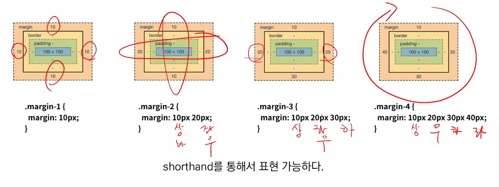

# CSS

### 1. CSS

* **Cascading Style Sheets**
* 스타일을 지정하기 위한 언어 / 선택하고, 스타일을 지정한다
* **CSS 구문** : 문법, 세미콜론은 매 줄이 끝나면 필수
  * 
* **CSS**
  * CSS 구문은 선택자를 통해 스타일을 지정할 HTML 요소를 선택
  * 중괄호 안에서는 속성과 값, 하나의 쌍으로 이루어진 선언을 진행
  * 각 쌍은 선택한 요소의 속성, 속성에 부여할 값을 의미
    * 속성 (Property) : 어떤 스타일 기능을 변경할지 결정
    * 값 (Value) : 어떻게 스타일 기능을 변경할지 결정
* **CSS 정의 방법**
  * 인라인(inline) : 해당 태그에 직접 style 속성을 활용(해당 태그에서만 테스트 할 때 사용)
  * 내부 참조(embedding) - `<style>` : `<head>` 태그 내에 `<style>`에 지정(테스트 용도)
  * ✨외부 참조(link file) - 분리된 CSS 파일 : 외부 CSS 파일을 `<head>` 내`<link>`를 통해 불러오기(재사용도 가능)
* **주로 활용하는 속성**
  * 
* **💥CSS with 개발자 도구**
  * styles : 해당 요소에 선언된 모든 CSS
  * computed : 해당 요소에 최종 계산된 CSS

---

### 2. CSS Selectors

* **💥선택자(Selector) 유형**
  * 기본 선택자
    * 전체 선택자, 요소 선택자
    * 클래스 선택자, 아이디 선택자, 속성 선택자
  * 결합자(Combinators)
    * 자손 결합자, 자식 결합자
    * 일반 형제 결합자, 인접 형제 결합자
  * 의사 클래스/요소(Pseudo Class)
    * 링크, 동적 의사 클래스
    * 구조적 의사 클래스, 기타 의사 클래스, 의사 엘리먼트, 속성 선택자
  * 
* **CSS 선택자 정리**
  * 전체선택자
    * *

  * 요소 선택자 
    * HTML 태그를 직접 선택
  * 클래스(class) 선택자
    * 마침표(.) 문자로 시작하며, 해당 클래스가 적용된 항목을 선택
  * 아이디(id) 선택자
    * `#` 문자로 시작하며, 해당 클래스가 적용된 항목을 선택
    * 일반적으로 하나의 문서에 1번만 사용. 여러번 사용해도 동작하지만, 단일 id를 사용하는 것을 권장

* 💥💥💥**CSS 적용 우선순위(cascading order)**
  * CSS 우선순위를 아래와 같이 그룹을 지어볼 수 있다.
    1. 중요도(Importance) - 사용시 주의
       * ! important(0순위)
    2. 우선 순위(Specifictiy)
       * 인라인(1순위) > id(2순위) > class(3순위), 속성, pseudo-class > 요소(4순위), pseudo-element > 전체(5순위)
    3. CSS 파일 로딩 순서(마지막)
  * 
* **CSS 상속**
  * CSS는 상속을 통해 부모 요소의 속성을 자식에게 상속한다.
    * 속성(프로퍼티) 중에는 상속이 되는 것과 되지 않는 것들이 있다.
    * 상속 되는 것 예시
      * ex. ✨Text 관련 요소(font, color, text-align), opacity, visibility 등
    * 상속 되지 않는 것 예시
      * ex. Box model 관련 요소(width, height, margin, padding, border, box-sizing, display), position 관련 요소(position, top/right/bottom/left, z-index) 등

---

### 3. CSS 기본 스타일

* **크기 단위**

  * px(픽셀)
    * 모니터 해상도의 한 화소인 '픽셀' 기준
    * 픽셀의 크기는 변하지 않기 때문에 고정적인 단위
  * %
    * 백분율 단위
    * 가변적인 레이아웃에서 자주 사용
  * em : 부모 요소에서 배수
    * (바로 위, 부모 요소에 대한) 상속의 영향을 받음
    * 배수 단위, 요소에 지정된 사이즈에 상대적인 사이즈를 가짐
  * rem : root 요소에서 배수
    * (바로 위, 부모 요소에 대한) 상속의 영향을 받지 않음
    * 최상위 요소(html)의 사이즈를 기준으로 배수 단위를 가짐
  * viewport
    * 웹 페이지를 방문한 유저에게 바로 보이게 되는 웹 컨텐츠의 영역(디바이스 화면)
    * 디바이스의 viewport를 기준으로 상대적인 사이즈가 결정됨
    * vw, vh, vmin, vmax

* **색상 단위**

  * 색상 키워드
    * 대소문자를 구분하지 않음
    * red, blue, black 과 같은 특정 색을 직접 글자로 나타냄
  * RGB 색상
    * 16진수 표기법 혹은 함수형 표기법을 사용해서 특정 색을 표현하는 방식
    * `'#'` + 16진수 표기법
    * rgb() 함수형 표기법
  * HSL 색상
    * 색상, 채도, 명도를 통해 특정 색을 표현하는 방식
  * a는 alpha(투명도)
  * 

* **CSS 문서 표현**

  * 텍스트

    * 서체, 서체 스타일
    * 자간, 단어 간격, 행간, 들여쓰기 등

  * 컬러(color),  배경(background-image, background-color)

  * 기타 HTML 태그별 스타일링

    * 목록(li),  표(table)

      

---

### 4. Selectors 심화

* **결합자(Combinators)**
  * 자손 결합자(✨띄워쓰기)
    * selectorA 하위의 모든 selectorB 요소
    * 
  * 자식 결합자(✨우측꺽쇠 >)
    * selectorA 바로 아래의 selectorB 요소
    * 
  * 일반 형제 결합자(✨~)
    * selectorA의 형제 요소 중 뒤에 위치하는 selectorB 요소를 모두 선택
    * 
  * 인접 형제 결합자(✨+)
    * selectorA의 형제 요소 중 바로 뒤에 위치하는 selectorB 요소를 선택
    * 

---

### 5. Box model

* **CSS 원칙 I**

  * 모든 요소는 네모(💥**박스모델**)이고, 위에서부터 아래로, 왼쪽에서 오른쪽으로 쌓인다.(💥**좌측 상단에 배치**) / Normal Flow
  * 

* **Box model**

  * 
  * 모든 HTML 요소는 box 형태로 되어있음
  * 하나의 박스는 네 부분(영역)으로 이루어짐
    * content
    * padding
    * border
    * margin
    * 

* **Box model 구성(margin)**

  * 

* **Box model 구성(padding)**

  * 

    

* **Box model 구성(border)**

  * 

    

* **Box model 구성(margin/padding)**

  * 

* **Box model 구성(border)**

  * 

* 💥**box-sizing** : padding과 border도 더해짐

  * 기본적으로 모든 요소의 box-sizing은 content-box

    * Padding을 제외한 순수 contents 영역만을 box로 지정

  * 다만, 우리가 일반적으로 영역을 볼 때는 border까지의 너비를 100px 보는 것을 원함

    * 그 경우 ✨box-sizing을 border-box으로 설정

  * 

    

---

### 6. Display

* **CSS 원칙 II**
  * 모든 요소는 네모(박스모델)이고, 좌측상단에 배치
  * 💥display에 따라 크기와 배치가 달라진다
* **💥대표적으로 활용되는 display**
  * display : block
    * 줄 바꿈이 일어나는 요소
    * 화면 크기 전체의 가로 폭을 차지한다
    * 블록 레벨 요소 안에 인라인 레벨 요소가 들어갈 수 있음
  * display : inline
    * 줄 바꿈이 일어나지 않는 행의 일부 요소
    * content 너비 만큼 가로 폭을 차지한다
    * width, height, margin-top, margin-bottom을 지정할 수 없음
    * 상하 여백은 line-height로 지정한다
* **💥블록 레벨 요소와 인라인 레벨 요소**
  * 블록 레벨 요소와 인라인 레벨 요소 구분(HTML 4.1까지)
  * 대표적인 블록 레벨 요소
    * div / ul, ol, li / p / hr/ form 등
  * 대표적인 인라인 레벨 요소(Text와 관련된 tag들)
    * span / a / img / input, label / b, em, i, strong 등
* **inline : inline의 기본 너비는 컨텐츠 영역만큼**(너비- 높이, margin-top/bottom)
  * 
* **속성에 따른 수평 정렬** : margin의 여백이 있어야 움직임!
  * 
* **display**
  * display : inline-block
    * block과 inline 레벨 요소의 특징을 모두 가짐
    * inline처럼 한 줄에 표시 가능하고, block처럼 width, height, margin 속성을 모두 지정할 수 있음
  * display : none
    * 해당 요소를 화면에 표시하지 않고, ✨공간조차 부여되지 않음
    * 이와 비슷한 visibility : hidden은 해당 요소가 ✨공간은 차지하나 화면에 표시만 하지 않음

---

### 7. Position

* **CSS position**
  * 문서 상에서 요소의 위치를 지정
  * static : 모든 태그의 기본 값(기준 위치)
    * 일반적인 요소의 배치 순서에 따름(좌측 상단), normal flow
    * 부모 요소 내에서 배치될 때는 부모 요소의 위치를 기준으로 배치 됨
  * 아래는 좌표 프로퍼티(top, bottom, left, right)를 사용하여 이동 가능
    * relative (normal flow)
    * absolute (out of flow)
    * fixed (out of flow)
  * 💥relative : 상대 위치 / ✨자신의 자리 유지하면서 이동
    * 자기 자신의 static 위치를 기준으로 이동(normal flow 유지)
    * 레이아웃에서 요소가 차지하는 공간은 static 일 때와 같음(normal position 대비 offset)
  * 💥absolute : 절대 위치 / ✨자신의 자리가 없이 이동
    * 요소를 일반적인 문서 흐름에서 제거 후 레이아웃에 공간을 차지하지 않음(normal flow에서 벗어남)
    * static이 아닌 가장 가까이 있는 부모/조상 요소를 기준으로 이동(없는 경우 body)
  * fixed : 고정 위치 / ✨자신의 자리 없음
    * 요소를 일반적인 문서 흐름에서 제거 후 레이아웃에 공간을 차지하지 않음(normal flow에서 벗어남)
    * 부모요소와 관계없이 viewport를 기준으로 이동
      * 스크롤 시에도 항상 같은 곳에 위치함
  * 💥sticky
    * normal flow 유지
    * 화면 밖으로 벗어나는 순간 fixed 처럼 움직임
* **CSS 원칙**
  * CSS 원칙 I, II : Normal flow
    * 모든 요소는 네모(박스모델), 좌측상단에 배치
    * display에 따라 크기와 배치가 달라짐
  * CSS 원칙 III :
    * 💥position으로 위치의 기준을 변경
      * relative : 본인의 원래 위치
      * absolute : 특정 부모의 위치
      * fixed : 화면의 위치

---

### 8. 개발자 도구

* **크롬 개발자 도구**
  * 웹 브라우저 크롬에서 제공하는 개발과 관련된 다양한 기능을 제공
  * 주요 기능
    * Elements - DOM 탐색 및 CSS 확인 및 변경
      * Style - 요소에 적용된  CSS 확인
      * Computed - 스타일이 계산된 최종 결과
      * Event Listeners - 해당 요소에 적용된 이벤트(JS)
    * Sources, Network, Performance, Application, Security, Audits 등
* **HTML - elements**
  * elements : 해당 요소의 HTML 태그
* **HTML DOM 조작하기**
  * Element에서 HTML 태그 구조를 탐색하며 추가, 삭제, 이동, 편집 등이 가능
* **CSS - styles, computed**
  * styles : 해당 요소에 선언된 모든 CSS
  * computed : 해당 요소에 최종 계산된 CSS
* **CSS 조작하기**
  * 우선순위, 파일 로딩 등에 의해 적용되고 있는 모든 CSS를 확인할 수 있음
  * 원하는 속성을 제거해보거나, 값을 변경하여 결과를 바로 확인할 수 있음(회색 :  상속X , 줄 그어짐 : 우선순위 밀려남)
  * 현재 요소에 지정된 박스모델, 스타일에 대한 정보를 쉽게 확인할 수 있음
  * 박스모델에 해당아흔 영역 값을 쉽게 변경할 수 있음
  * 해당 요소에 대한 스타일을 다양하게 추가해 볼수 있음

---

# 학습 가이드라인

- **MDN web docs**
  - https://developer.mozilla.org/ko/
- **개발자 도구 활용법**
  - https://developer.chrome.com/docs/devtools/css/
- **Emmet**
  - HTML & CSS를 작성할 때 보다 빠른 마크업을 위해서 사용되는 오픈소스
  - 단축키, 약어 등을 사용
  - 대부분의 텍스트 에디터에서 지원
  - https://emmet.io/
  - https://docs.emmet.io/cheat-sheet/

​	
