## 데이터

### 1. 파이썬 개발 환경(Python Environment)


* **파이썬의 특징** : Easy to learn, Expressive Language, Cross Platform Language, Interpreter Language, Object Oriented Programming

* **파이썬 개발환경 종류 :** 대화형 환경(파이썬 기본 Interpreter, Jupyter Notebook), 스크립트 실행(IDE, Text Editor) 


---


### 2. 기초 문법


* **코드 스타일 가이드 :** PEP8(강제성은 없지만 인지하고 사용하여야 함)
  1. https://www.python.org/dev/peps/pep-0008/
  2. https://wayhome25.github.io/python/2017/05/04/pep8/
     * ''와 "" 혼용하지 않기, 들여쓰기(Identation) 시 space 사용 권장


* **변수(Variable) :**  

  * 컴퓨터 메모리 어딘가에 저장되어 있는 객체를 참조하기 위해 사용되는 이름

    * 객체(object) : 숫자, 문자, 클래스 등 값을 가지고 있는 모든 것

      -> 파이썬은 객체지향 언어이며, 모든 것이 객체로 구현되어 있음

  * 동일 변수에 다른 객체를 언제든 할당할 수 있기 때문에, 즉, 참조하는 객체가 바뀔 수 있기 때문에 '변수' 라고 불림

  * 변수는 할당 연산자(=)를 통해 값을 할당(assignment)

  * type()

  * 

    * 변수에 할당된 값의 타입 -> 변수가 어떤 타입인지 중요!

* **변수 연산**

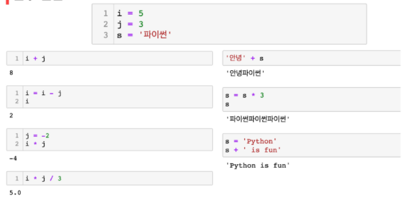

* **변수 할당**
  * 변수는 오른쪽에서 왼쪽으로 할당됨
  * 같은 값을 동시에 할당할 수 있음
  * 다른 값을 동시에 할당 할 수 있음(multiple assignment)
  * 임시 변수 활용 -> 값을 옮길 때


* **식별자(Identifiers)**
  * 변수(박스)의 이름을 어떻게 지을 수 있을까?
  * 파이썬 객체(변수, 함수, 모듈, 클래스 등)를 식별하는데 사용하는 이름(name)
  * 가독성이 중요함, snake-case 주로 사용
  * 규칙
    * 식별자의 이름은 영문, 알파벳, 언더스코어(_), 숫자로 구성
    * 첫 글자에 숫자가 올 수 없음
    * 길이제한이 없고, 대소문자를 구별
    * 다음의 키워드(keyword)는 예약어(reserved words)로 사용할 수 없음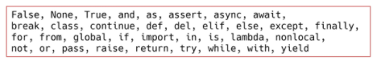
  * 키워드  / 예약어

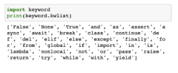

* 

  * 내장함수나 모듈 등의 이름으로도 만들면 안됨	
    * 기존의 이름에 다른 값을 할당하게 되므로 더 이상 동작하지 않음(ex. print, del)

  

* **사용자 입력**

  * input([prompt])
    * 사용자로부터 값을 즉시 입력 받을 수 있는 내장함수
    * 대괄호 부분에 문자열을 넣으면 입력 시, 해당 문자열을 출력할 수 있음
    * 반환값은 항상 문자열의 형태로 반환

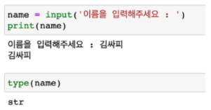

* **주석(Comment)**

  * 코드에 대한 설명

    * 중요한 점이나 다시 확인하여야 하는 부분을 표시
    * 컴퓨터는 주석을 인식하지 않음, 사용자만들 위한 것

  * 가장 중요한 습관

    * 개발자에게 주석을 다는 습관은 매우 중요
    * 쉬운 이해와 코드의 분석 및 수정이 용이
      * 주석은 코드 실행에 영향을 미치지 않을 뿐만 아니라
      * 프로그램의 속도를 느리게 하지 않으며, 용량을 늘리지 않음

  * 한 줄 주석

    * 주석으로 처리될 내용 앞에 '#'을 입력
      * 한 줄을 온전히 사용할 수도 있고, 그 불 코드 뒷부분에 작성 할 수 있음
    * 여러 줄의 주석
      * 한 줄씩 #을 사용하거나, """ 또는 '''으로 표현
        * """ 또는 '''으로 표현하는 방법은 docstring을 위해 사용
    * 특수한 형태의 주석 - docstring
      * 함수/클래스의 설명을 작성

    ​	

---


### 3. 파이썬 자료형 (Python Datatype)

* **자료형 분류** 

* 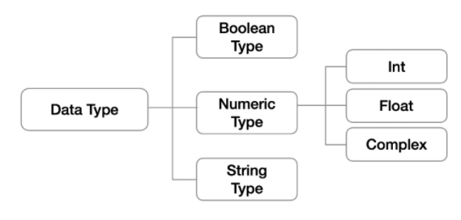

  * 불린형 (Boolean Type) or 부울형
  * 수치형 (Numeric Type)
    * int (정수, integer)
    * float (부동소수점, 실수, floating point number)
    * complex (복소수, complex number)
  * 문자열(String Type)
  * None
    * 값이 없음을 표현하기 위한 타입인 NoneType

* **불린(Boolean)**

  * True / False 값을 가진 타입은 bool
  * 비교 / 논리 연산을 수행함에 있어서 활용됨
  * 다음은 모두 False로 변환 ->비어있을때 False로 변환, 형식들이 중요함
    * 0, 0.0, (), [], {}, '', None  예외) 스페이스로 띄어쓰기는 스페이스 채워져있음!
  * bool() 함수
    * 특정 데이터가 True인지 False인지 검증
    * 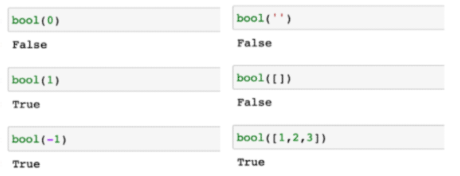

* **수치형 (Numeric Type)**

  * 정수(Int)

    * 모든 정수의 타입은 int

      * Python 3부터는 long 타입은 없고, 모두 int로 표기 됨
      * 여타 프로그래밍 언어, Python 2에서는 OS기준 32/64비트

    * 매우 큰 수를 나타낼 때 오버플로우가 발생하지 않음

      * 오버플로우(overflow) : 데이터 타입별로 사용할 수 있는 메모리의 크기를 넘어서는 상황

        -> ex. 강남스타일 유튜브

      * Arbitrary precision arithmetic(임의 정밀도 산술)을 통해 고정된 형태의 메모리가 아닌 가용 메모리들을 활용하여 모든 수 표현에 활용

    * 진수 표현

    * 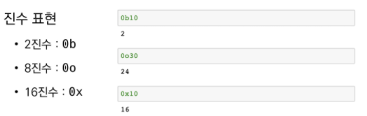

    * b(binary), o(octal), x(hexadecimal)

    * oxff : 165 -> 10이상의 진법 수는 알파벳으로 시작

  * 실수(Float)

    * 정수가 아닌 모든 실수는 float 타입
    * 부동소수점
      * 실수를 컴퓨터가 표현하는 방법 - 2진수(비트)로 숫자를 표현
      * 이 과정에서 floating point rounding error가 발생하여, 예상치 못한 결과가 발생
    * Floating point rounding error
      * 부동소수점에서 실수 연산 과정에서 발생 가능
        * 값 비교하는 과정에서 정수가 아닌 실수인 경우 주의할 것(모든 언어에서 나타남)
        * 매우 작은 수보다 작은지를 확인하거나 math 모듈 활용

  * 복소수(Complex)

    * 실수부와 허수부로 구성된 복소수는 모두 complex 타입

      * 허수부를 j로 표현

        

---


### 4. 문자열 (String Type)

* **문자열(String Type)**
  * 모든 문자는 str 타입
  * 문자열은 작은 따옴표(')나 큰 따옴표('')를 활용하여 표기
    * 문자열을 묶을 때 동일한 문장부호를 활용
    * PEP8에서는 소스코드 내에서 하나의 문장부호를 선택하여 유지하도록 함
  * Immutable : 값이 불변, 특정값 1개만 변경이 안됨, 아예 값을 다시 할당 해야됨
  * Iterable : 반복

* **중첩따옴표(Nested Quotes)**
  * 따옴표 안에 따옴표를 표현할 경우
    * 작은 따옴표가 들어 있는 경우는 큰 따옴표로 문자열 생성
    * 큰 따옴표가 들어 있는 경우는 작은 따옴표로 문자열 생성
* **삼중따옴표(Triple Quotes)**
  * 작은 따옴표나 큰 따옴표를 삼중으로 사용
    * 따옴표 안에 따옴표를 넣을 때,
    * 여러줄을 나눠 입력할 때 편리
* **Escape sequence**
  * 문자열 내에서 특정 문자나 조작을 위해서 역슬래시(\\)를 활용하여 구분
  * 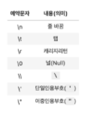
* **String Interpolation**
  * 문자열을 변수를 활용하여 만드는법
    * %-formatting
    * str.format()
    * f-strings : python 3.6+, f는 변수를 사용했다는 의마, 직관적인 이해가 쉬움
* **None**
  * 파이썬 자료형 중 하나
  * 파이썬에서는 값이 없음을 표현하기 위해 None 타입이 존재함
  * 일반적으로 반환 값이 없는 함수에서 사용하기도 함


---


### 5. 컨테이너 (Container)

* **컨테이너 (Container) 정의**
  * 컨테이너란?
  
    * 여러 개의 값을 담을 수 있는 것(객체)으로, 서로 다른 자료형을 저장할 수 있음
      * 예시: list, tuple
  
  * 컨테이너의 분류
  
    * 순서가 있는 데이터 (Ordered) vs 순서가 없는 데이터 (Unordered)
  
    * 순서가 있다 ! = 정렬되어 있다라는 뜻은 아님!
    * 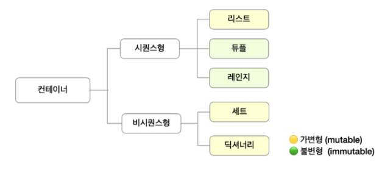

---


### 6. 시퀀스형 컨테이너 (Sequence Container)

* **리스트 (List) 정의**
  * 순서를 가지는 0개 이상의 객체를 참조하는 자료형
    * 생성된 이후 내용 변경이 가능 -> 가변자료형
    * 유연성 때문에 파이썬에서 가장 흔히 사용
  * 항상 대괄호 형태로 출력
    * [0, 1, 2 ]
* **생성과 접근**
  * 리스트는 대괄호 ([]) 혹은 list() 를 통해 생성
  * 순서가 있는 시퀀스로 인덱스를 통해 접근 가능
    * 값에 대한 접근은 list[i]
    * 
      * 0부터 시작, 마지막은 -1
    * 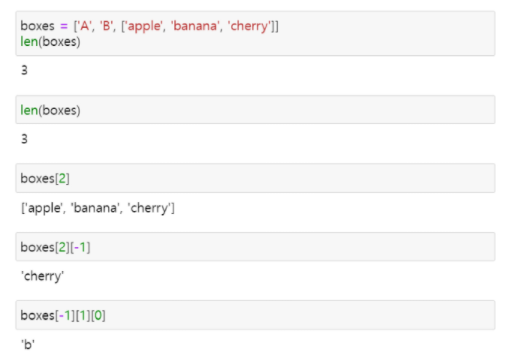
* **튜플 (Tuple) 정의**
  * 순서를 가지는 0개 이상의 객체를 참조하는 자료형
    * 생성 후, 담고있는 객체 변경이 불가 -> 불변자료형(immutable)
  * 항상 소괄호 형태로 출력
    * (0, 1, 2) 
* **생성과 접근**
  * 소괄호 (()) 혹은 tuple()을 통해 생성
  * 튜플은 수정 불가능한 (immutable) 시퀀스로 인덱스로 접근 가능
    * 값에 대한 접근은 my_tuple[i]  -> 할당과 접근은 다른 내용!		

* **튜플 ( Tuple) 생성 주의사항**
  * 단일 항목의 경우
    * 하나의 항목으로 구성된 튜플은 생성 시 값 뒤에 쉼표를 붙여야 함
  * 복수 항목의 경우
    * 마지막 항목에 붙은 쉼표는 불필요
    * 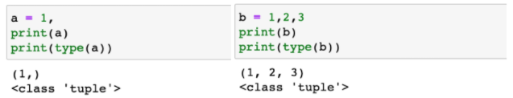
  * 튜플 대입이란?
    * 우변의 값을 좌변의 변수에 한번에 할당하는 과정
  * 튜플은 일반적으로 파이썬 내부에서 활용
    * 추후 함수에서 복수의 값을 반환하는 경우에도 활용
    * 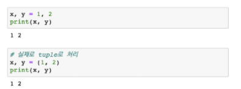
* **레인지 (Range)**
  * 숫자의 시퀀스를 나타내기 위해 사용
    * 기본형 : range(n)
      * 0부터 n-1까지의 숫자의 시퀀스 
    * 범위 지정 : range(n, m)
      * n부터 m-1까지의 숫자의 시퀀스
    * 범위 및 스텝 지정 : range(n, m, s)
      * n부터 m-1까지 s만큼 증가시키는 숫자의 시퀀스


---


### 7. 패킹/언패킹 (Packing/Unpacking)

* **패킹/언패킹 연산자 (Packing/Unpacking Operator)** 
  * 모든 시퀀스형(리스트, 튜플 등)은 패킹/언패킹 연산자 *를 사용하여 객체의 패킹 또는 언패킹이 가능
  * 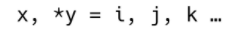
  * 패킹
    * 대입문의 좌변 변수에 위치
    * 우변의 객체 수가 좌변의 변수 수보다 많을 경우 객체를 순서대로 대입
    * 나머지 항목들은 모두 별 기호 표시된 변수에 리스트로 대입
    * 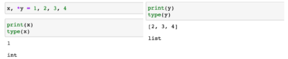
  * 언패킹
    * argument 이름이 *로 시작하는 경우, argument unpacking이라 함
      * *패킹의 경우, 리스트로 대입
      * *언패킹의 경우 튜플 형태로 대입
      * 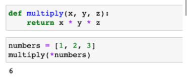
  * 별표(*) 연산자가 곱셈을 의미하는지 Packing/Unpacking 연산자인지 구분
    * Packing/Unpaking 연산자*
      * *가 대입식의 좌측에 위치하는 경우
      * *가 단항 연산자로 사용되는 경우
        * 단항 연산자 : 하나의 항을 대상으로 연산이 이루어지는 연산자
    * 산술 연산자로서의 *
      * *가 이항 연산자로 사용되는 경우
        * 이항 연산자 : 두 개의 항을 대상으로 연산이 이루어지는 연산자


---


### 8. 비시퀀스형 컨테이너 (Associative Container)

* **셋 (Set)**
  * 순서없이 0개 이상의 해시가능한 객체를 참조하는 자료형
    * 해시 가능한 객체 (immutable)만 담을 수 있음
    * 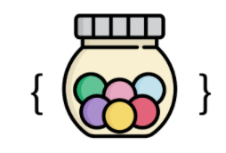
  * 담고있는 객체를 삽입, 변경, 삭제 가능 -> 가변자료형 (mutable)
  * 수학에서의 집합과 동일한 구조를 가짐
    * 집합 연산이 가능
    * 중복된 값이 존재하지 않음
* **셋 (Set) 생성 **
  * 중복없이 순서가 없는 자료구조 -> 순서 지정 X
    * 중괄호 ({}) 혹은 set()을 통해 생성
      * 빈 Set를 만들기 위해서는 set()을 반드시 활용해야 함
    * 순서가 없어 별도의 값에 접근할 수 없음
    * 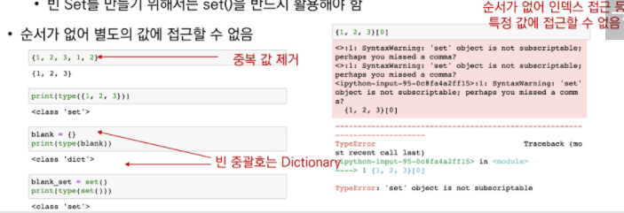
* **셋 (Set) 활용**
  * 셋을 활용하면 다른 컨테이너에서 중복된 값을 쉽게 제거할 수 있음
    * 단, 이후 순서가 무시되므로 순서가 중요한 경우 사용할 수 없음


* **딕셔녀리 (Dictionary)**
  * 순서 없이 키-값 (key-value) 쌍으로 이뤄진 객체를 참조하는 자료형
  * Dictionary의 키 (key)
    * 해시가능한 불변 자료형만 가능
  * 각 키의 값(values)
    * 어떠한 형태든 관계 없음
    * 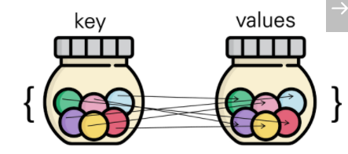
* **딕셔너리 (Dictionary) 생성**
  * key(list X)와 value(숫자,list,...등등 아무것이나 가능)가 쌍으로 이뤄진 자료구조
  * 중괄호 ({}) 혹은 dict()을 통해 생성
  * key를 통해 value에 접근(반대로는 안됨, key는 고유한값으로 중복 안됨, value는 중복 가능)
  * key는 변경 불가능한 데이터(immutable)만 활용가능
    * string, integer, float, boolean, tuple, range
  * value는 모든 값으로 설정 가능 (List, Dictionary 등)


---

### 9. 형 변환(Typecasting)

* **자료형 변환 (Typecasting)**
  * 파이썬에서 데이터 형태는 서로 변환할 수 있음
    * 암시적 형 변환 (Implicit)  : 더 많은 자료형을 나타낼 수 있는 형 변환
      * 사용자가 의도하지 않고, 파이썬 내부적으로 자료형을 변환 하는 경우
        * bool : 문법적으로 참 거짓이 필요한 경우 자동으로 bool로 형 변환 (ex. if문, elif, while)
        * Numeric type (int, float, complex)
    * 명시적 형 변환 (Explicit)
      * 사용자가 특정 함수를 활용하여 의도적으로 자료형을 변환 하는 경우
        * int (십진수 형태만 가능)
          * str*, float -> int    ex. '3.5' 안됨
        * float
          * str*, int -> float   ex. '3.5' + 3.5, 3/4 안됨
        * str (문자형은 따옴표만 붙이면 되서 가능)
          * int, float, list, tuple, dict -> str
        * 형식에 맞는 문자열만 변환 가능

* **컨테이너 형 변환 (Container Typecasting)**

  * 컨테이너 간의 형 변환은 아래와 같이 가능

  * 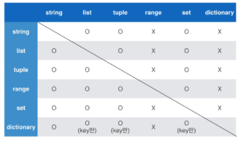

    * range와 dictionary로 변경은 안됨, 독특한 구조이기 때문에

    * dictionary의 경우는 key만 있으면 value로 접근 가능하기 때문에 다른 형 변환 가능

      

---


### 10. 연산자 (Operator)

* **연산자(Operator)의 종류** -> 연산자 : 데이터를 조작할 때 쓰는 것

  * 산술 연산자 (Arithmetic Operator)
  * 비교 연산자 (Comparison Operator)
  * 논리 연산자 (Logical Operator)
  * 복합 연산자 (In-place Operator)
  * 멤버십 연산자 (Membership Operator)
  * 식별 연산자 (Identity Operator)

  * 기타 연산자 (Indexing/Slicing)
* **산술 연산자 (Arithmetic Operator)**

  * 기본적인 사칙연산 및 수식 계산
  * 
  * % 나머지 : 홀/짝 구분에 자주 쓰임
* **비교 연산자 (Comparison Operator)**

  * 값을 비교하며, True / False 값을 리턴함
  * 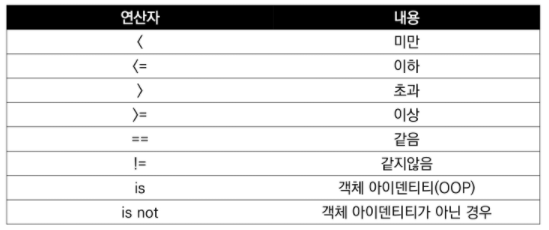
  * ==, != 익숙하지 않으니 주의!
* **논리 연산자 (Logical Operator)**

  * 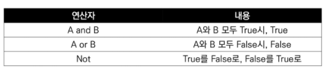
  * 일반적으로 비교 연산자와 함께 사용됨
  * 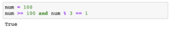
* **논리 연산자 (Logical Operator) 단축평가** : 암시적인 형변환되서 True와 False가 나타나고 출력은 값으로
  * 결과가 확실한 경우 두번째 값은 확인하지 않고 첫번째 값 반환
    * and 연산에서 첫번째 값이 False인 경우 무조건 False -> 첫번째 값 반환
    * and 연산에서 두 개의 값이 모두 True인 경우 두번째 값 반환
    * or 연산에서 첫번째 값이 True인 경우 무조건 True -> 첫번째 값 반환
    * or 연산에서 첫번째 값이 False인 경우  -> 두번째 값 반환(두 개의 값이 모두 False라도)
* **복합 연산자 (In-place Operator)**

  * 복합 연산자는 연산과 대입이 함께 이뤄짐
    * 예시) 반복문을 통해 갯수를 카운트 하는 경우
    * 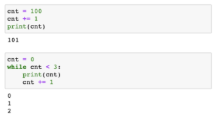
* **식별 연산자 (Identity Operator)**

  * is 연산자를 통해 동일한 객체(object)인지 확인 가능함
    * OOP에서 추가 학습	
    * none에서 is를 많이 씀
    * 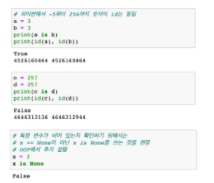
* **멤버십 연산자 (Membership Operator)**

  * 시퀀스 포함 여부 확인 : 멤버인지 아닌지 판단
    * in	
    * not in
    * 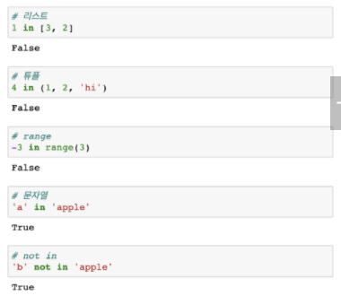
  * 멤버쉽 연산자 in을 통해 특정 요소가 속해 있는지 여부를 확인
  * 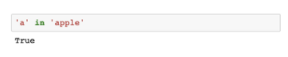
* **시퀀스형 연산자(Sequence Type Operator)**
  * 산술 연산자(+)
    * 시퀀스 간의 concatenation (연결/연쇄)
    * 
  * 반복 연산자 (*)
    * 시퀀스를 반복
    * 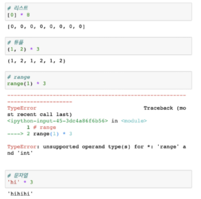
* **기타 : 인덱싱 (Indexing)**
  * 시퀀스의 특정 인덱스 값에 접근
    * 해당 인덱스가 없는 경우 IndexError -> 범위 지정이 잘못됨
    * 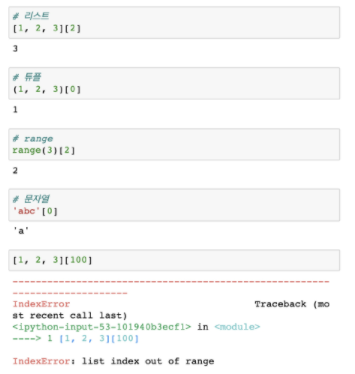
* **기타 : 슬라이싱 (Slicing)**
  * 시퀀스를 특정 단위로 슬라이싱
  * 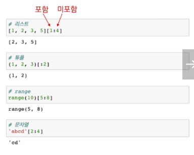
  * 시퀀스를 k간격으로 슬라이싱
  * 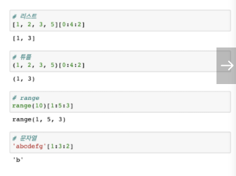
* **문자열 슬라이싱 (Slicing) 예제**
  * 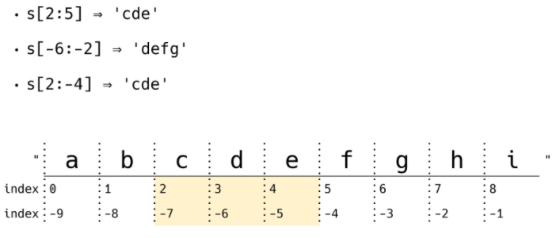
  * 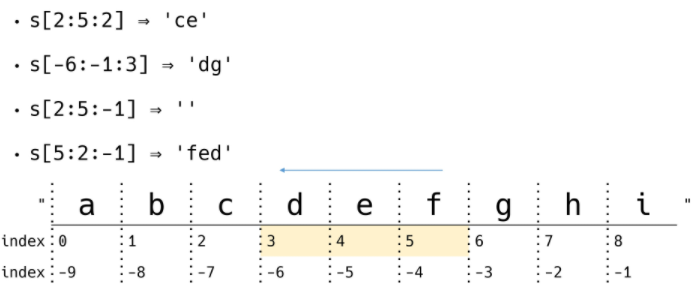
  * 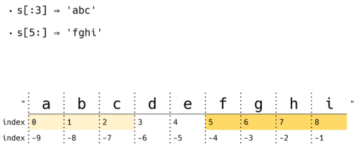
  * 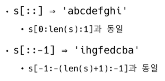
* **기타 : set 연산자**
  * | : 합집합
  * & : 교집합
  * `-` : 차집합
  * ^ : 대칭차
  * 
* **연산자 우선 순위**
  * 다음은 주요 연산자의 우선 순위이며, 작성시 유의할 것
    * ()
    * Slicing
    * Indexing
    * **
    * 단항 연산자(+, -) : 부호
    * 산술 연산자 (*, /, %)
    * 산술 연산자 (+, -)
    * 비교 연산자, in, is
    * not
    * and 
    * or
    * 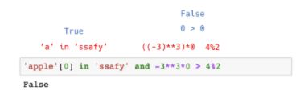

---


### 11. 컨테이너 (Container) 정리

* **자료형 퀴즈**
* 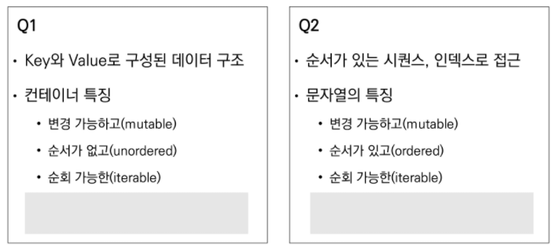
* 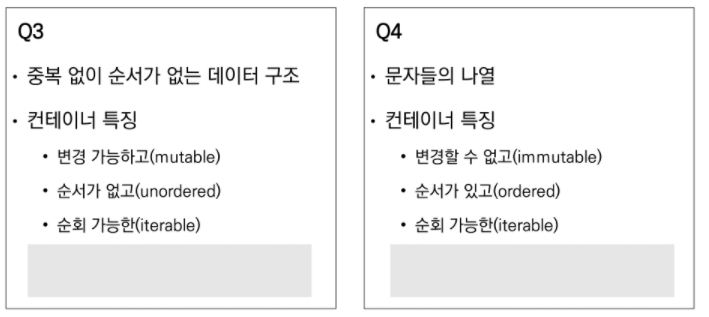
* Dictionary, List, Set, String


---


### 12. 파이썬 프로그램 구성 단위

* **프로그램 구성 단위**

  * 식별자 (Identifier) - 이름

    * 변수, 함수, 클래스 등 프로그램이 실행되는 동안 다양한 값을 가질 수 있는 이름
    * 예약어
      * 파이썬 키워드 (명령어)

  * 리터럴 (Literal) - 문자 그 자체

    * 읽혀지는 대로 쓰여있는 값 그 자체

    * ```bash
      # name은 식별자 , 즉 변수
      # '홍길동'은 리터럴
      name = '홍길동'
      ```

  * 표현식 (Expression)

    * 새로운 데이터 값을 생성하거나 계산하는 코드 조각

  * 문장 (Statement)

    * 특정한 작업을 수행하는 코드 전체
    * 파이썬이 실행 가능한 최소한의 코드 단위
    * 표현식은 값을 생성하는 일부분이고, 문장은 특정작업을 수행하는 코드 전체
    * 모든 표현식 (expression)은 문장 (statement)이다.

  * 함수 (Function)

    * 특정 명령을 수행하는 함수 묶음

  * 모듈 (Module)

    * 함수/클래스의 모음 또는 하나의 프로그램을 구성하는 단위

  * 패키지 (Package)

    * 프로그램과 모듈 묶음
      * 프로그램 : 실행하기 위한 것
      * 모듈 : 다른 프로그램에서 불러와 사용하기 위한 것

  * 라이브러리 (Library)

    * 패키지 모음

      

---


### 13. 정리

* **"How-to"**
* **어떻게 할당할것인가(할당방법), 이름 붙이는법, Type(변환, 특징, 연산)**
  * 숫자 / boolean / None
  * 'string' -> 문자열의 나열
  * [list] -> 요소들의 시퀀스
  * (tuple) -> 변경 불가능한 시퀀스
  * {set} -> 중복 불가능한 비시퀀스
  * {k : v} -> key, value

